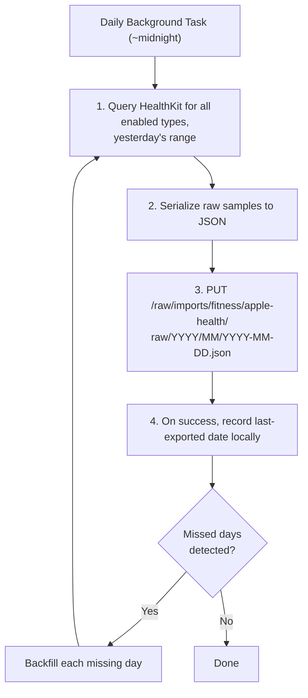

MyLifeDB collects personal data from Apple devices to help users understand their life patterns. This document catalogs all data sources — both currently available via Apple APIs and aspirational ones users may want in the future.

## Legend

| Symbol | Meaning |
|--------|---------|
| **Platform** | `iOS` = iPhone/iPad, `mac` = macOS, `watch` = Apple Watch, `all` = all platforms |
| **Source** | Apple framework or external source used to collect the data |
| **Status** | `available` = API exists and can be implemented, `limited` = partial API access or requires workarounds, `manual` = requires user input, `future` = no API yet / aspirational |

---

## 1. Health & Body

Data from HealthKit (requires user permission).

| Data Point | Description | Platform | Source | Status |
|-----------|-------------|----------|--------|--------|
| Steps | Daily step count | iOS, watch | HealthKit | available |
| Distance | Walking + running distance | iOS, watch | HealthKit | available |
| Flights Climbed | Floors ascended | iOS, watch | HealthKit | available |
| Active Energy | Calories burned through activity | iOS, watch | HealthKit | available |
| Resting Energy | Basal metabolic calories | iOS, watch | HealthKit | available |
| Exercise Minutes | Time spent in activity | iOS, watch | HealthKit | available |
| Stand Hours | Hours with standing activity | watch | HealthKit | available |
| Heart Rate | Current, resting, walking average | iOS, watch | HealthKit | available |
| Heart Rate Variability | HRV — best single stress/recovery metric | watch | HealthKit | available |
| Blood Oxygen (SpO2) | Blood oxygen saturation | watch | HealthKit | available |
| Respiratory Rate | Breaths per minute during sleep | watch | HealthKit | available |
| Body Temperature | Wrist temperature deviation | watch | HealthKit | available |
| VO2 Max | Cardio fitness level | watch | HealthKit | available |
| Body Weight | Weight measurements | iOS | HealthKit | available |
| Body Fat Percentage | Body composition | iOS | HealthKit | available |
| BMI | Body mass index | iOS | HealthKit | available |
| Walking Steadiness | Fall risk assessment | iOS | HealthKit | available |
| Walking Asymmetry | Left/right step balance | iOS | HealthKit | available |
| Double Support Time | Time both feet on ground while walking | iOS | HealthKit | available |

## 2. Sleep

| Data Point | Description | Platform | Source | Status |
|-----------|-------------|----------|--------|--------|
| Sleep Duration | Total time asleep | iOS, watch | HealthKit | available |
| Sleep Stages | REM, deep, core, awake breakdown | watch | HealthKit | available |
| Bedtime & Wake Time | When user goes to bed and wakes up | iOS, watch | HealthKit | available |
| Sleep Consistency | Schedule regularity score | iOS | HealthKit | available |
| Time in Bed | Total time in bed vs asleep | iOS, watch | HealthKit | available |

## 3. Fitness & Sports

| Data Point | Description | Platform | Source | Status |
|-----------|-------------|----------|--------|--------|
| Workouts | All workout types with duration, calories, HR | iOS, watch | HealthKit | available |
| Workout Routes | GPS tracks for outdoor workouts | iOS, watch | HealthKit | available |
| Running Pace | Speed, cadence, stride length | watch | HealthKit | available |
| Running Power | Watts during running | watch | HealthKit | available |
| Swimming | Laps, strokes, distance, SWOLF | watch | HealthKit | available |
| Cycling | Distance, speed, power (if sensor) | iOS, watch | HealthKit | available |
| Strength Training | Sets, reps, weight (if logged) | watch | HealthKit | limited |

## 4. Nutrition & Intake

| Data Point | Description | Platform | Source | Status |
|-----------|-------------|----------|--------|--------|
| Water Intake | Glasses/ml of water consumed | iOS | HealthKit | available |
| Caffeine | Coffee/tea consumption | iOS | HealthKit | available |
| Meals | What you ate, when, photos | all | manual | manual |
| Calories Consumed | Dietary energy intake | iOS | HealthKit | available |
| Macronutrients | Protein, carbs, fat | iOS | HealthKit | available |
| Alcohol | Drinks consumed | all | manual | manual |
| Supplements | Vitamins, medications taken | all | manual | manual |

## 5. Mindfulness & Mental Health

| Data Point | Description | Platform | Source | Status |
|-----------|-------------|----------|--------|--------|
| Mindful Minutes | Meditation session duration | iOS, watch | HealthKit | available |
| Mood | Emotional state logging | iOS | HealthKit (iOS 17+) | available |
| Mood Journal | Free-text mood entries | all | manual | manual |
| Stress Level | Subjective stress rating | all | manual | manual |
| Gratitude Log | Things you're grateful for | all | manual | manual |
| Journal Entries | Diary / free writing | all | manual | manual |
| Therapy Notes | Session notes and reflections | all | manual | manual |

## 6. Screen Time & Digital Life

| Data Point | Description | Platform | Source | Status |
|-----------|-------------|----------|--------|--------|
| Total Screen Time | Daily screen usage duration | iOS | DeviceActivity | available |
| Per-App Usage | Time spent in each app | iOS | DeviceActivity | available |
| App Category Usage | Time by category (social, productivity, etc.) | iOS | DeviceActivity | available |
| Phone Pickups | How often you pick up your phone | iOS | DeviceActivity | available |
| Notifications Received | Notification count and by app | iOS | DeviceActivity | available |
| Focus Mode | Active focus mode and schedule | iOS, mac | system | limited |
| First Pickup Time | When you first check your phone | iOS | DeviceActivity | available |

## 7. Productivity

| Data Point | Description | Platform | Source | Status |
|-----------|-------------|----------|--------|--------|
| Calendar Events | Meetings, appointments, time blocks | all | EventKit | available |
| Meeting Time | Hours spent in meetings per day/week | all | EventKit | available |
| Reminders Completed | Tasks checked off | all | EventKit | available |
| Active App Time | Time per application (macOS) | mac | Accessibility API | limited |
| Documents Created | Files created/modified | mac | Spotlight/FSEvents | limited |
| Typing Activity | Keyboard usage patterns | mac | Accessibility API | limited |
| Deep Work Sessions | Focused uninterrupted work blocks | all | manual / inferred | limited |
| Pomodoro Tracking | Work/break cycles | all | manual | manual |

## 8. Developer & Knowledge Work

| Data Point | Description | Platform | Source | Status |
|-----------|-------------|----------|--------|--------|
| .claude Sessions | Claude Code session history | mac | filesystem (~/.claude) | available |
| Git Commits | Commit frequency, repos, LOC changed | mac | git CLI | available |
| Git Activity | Branches, PRs, code review | mac | git + GitHub API | available |
| Terminal History | Shell commands executed | mac | shell history files | available |
| IDE Usage | Time in Xcode, VS Code, etc. | mac | Accessibility API | limited |
| Code Written | Lines of code by language | mac | git diff analysis | available |
| Build & Test Results | Build success/failure, test pass rate | mac | Xcode / CI logs | limited |
| Browser Tabs | Number of open tabs over time | mac | browser extension | future |

## 9. Communication

| Data Point | Description | Platform | Source | Status |
|-----------|-------------|----------|--------|--------|
| iMessage | Message count, conversations active | iOS, mac | ChatKit (private) | future |
| Phone Calls | Call frequency, duration, contacts | iOS | CallKit | limited |
| Email Volume | Emails sent/received per day | all | Mail.app / API | limited |
| Chat Logs | WhatsApp, Telegram, Discord, Slack | all | app exports / API | future |
| Social Media Posts | Posts, comments, likes | all | platform APIs | future |
| Video Calls | FaceTime, Zoom, Meet duration | all | Calendar / manual | limited |

## 10. Media & Culture

| Data Point | Description | Platform | Source | Status |
|-----------|-------------|----------|--------|--------|
| Music Listening | Songs, artists, genres, duration | all | MusicKit | available |
| Listening History | Recently played, most played | all | MusicKit | available |
| Podcasts | Episodes listened, duration, shows | iOS | Podcast API | limited |
| Books & Reading | Titles, reading time, progress | iOS | BookKit (limited) | limited |
| Movies & TV | What you watched, ratings | all | manual / TMDb API | manual |
| YouTube History | Videos watched, channels, time | all | YouTube Data API | future |
| Articles Read | Web articles, blog posts | all | browser extension | future |
| Photos Taken | Photo count per day, locations | iOS | PhotoKit | available |
| Screenshots | Screenshot frequency | iOS | PhotoKit | available |
| Videos Recorded | Video count, duration | iOS | PhotoKit | available |

## 11. Location & Travel

| Data Point | Description | Platform | Source | Status |
|-----------|-------------|----------|--------|--------|
| Significant Locations | Places visited with time spent | iOS | CoreLocation | available |
| Home / Work Time | Time at home vs office vs other | iOS | CoreLocation | available |
| Commute | Travel time and route to work | iOS | CoreLocation + MapKit | available |
| Trips & Travel | Multi-day trips, destinations | iOS | CoreLocation | available |
| Places Visited | Restaurants, shops, venues | iOS | CoreLocation + MapKit | available |
| Countries Visited | International travel log | iOS | CoreLocation | available |
| Driving | Driving time, distance | iOS | CoreMotion | available |
| Walking Routes | Regular walking paths | iOS | CoreLocation | available |

## 12. Environment

| Data Point | Description | Platform | Source | Status |
|-----------|-------------|----------|--------|--------|
| Weather | Temperature, conditions at your location | all | WeatherKit | available |
| Air Quality | AQI at your location | all | WeatherKit | available |
| UV Index | Sun exposure risk | all | WeatherKit | available |
| Ambient Noise | Environmental noise level (dB) | watch | HealthKit | available |
| Sunrise & Sunset | Daylight hours | all | WeatherKit | available |
| Humidity | Relative humidity | all | WeatherKit | available |
| Barometric Pressure | Atmospheric pressure | iOS | CMAltimeter | available |

## 13. Finance

| Data Point | Description | Platform | Source | Status |
|-----------|-------------|----------|--------|--------|
| Spending | Transactions and amounts | all | manual / bank API | future |
| Income | Earnings tracking | all | manual | manual |
| Subscriptions | Active subscriptions and costs | all | manual / App Store | limited |
| Investment Portfolio | Portfolio value over time | all | manual / brokerage API | future |
| Net Worth | Assets minus liabilities | all | manual | manual |
| Budget vs Actual | Spending against budget | all | manual | manual |

## 14. Social & Relationships

| Data Point | Description | Platform | Source | Status |
|-----------|-------------|----------|--------|--------|
| People Interactions | Who you spent time with | all | manual / Calendar | manual |
| Social Events | Gatherings, parties, dinners | all | Calendar / manual | manual |
| Contact Frequency | How often you reach each person | all | Contacts + comms | future |
| Birthdays | Upcoming and past birthdays | all | Contacts | available |
| Family Time | Time with family members | all | manual | manual |

## 15. Learning & Growth

| Data Point | Description | Platform | Source | Status |
|-----------|-------------|----------|--------|--------|
| Courses | Online courses taken, progress | all | manual / platform API | manual |
| Language Learning | Duolingo, etc. streaks and progress | all | manual / API | future |
| Flashcard Reviews | Anki/flashcard session stats | all | manual / API | future |
| Books Finished | Completed books list | all | manual | manual |
| Skills Practiced | Music, art, sports practice time | all | manual | manual |
| Certifications | Earned certificates and credentials | all | manual | manual |

## 16. Habits & Routines

| Data Point | Description | Platform | Source | Status |
|-----------|-------------|----------|--------|--------|
| Morning Routine | Wake up activities and timing | all | inferred / manual | manual |
| Evening Routine | Wind-down activities and timing | all | inferred / manual | manual |
| Habit Streaks | Consecutive days of habit completion | all | manual | manual |
| Custom Habits | User-defined habits to track | all | manual | manual |
| Smoking / Vaping | Tobacco/nicotine usage | all | manual | manual |

## 17. Creative Work

| Data Point | Description | Platform | Source | Status |
|-----------|-------------|----------|--------|--------|
| Writing | Word count, writing sessions | all | manual / app API | manual |
| Drawing & Art | Art created, time spent | all | manual | manual |
| Music Production | Songs produced, DAW time | mac | manual / app API | manual |
| Photography Projects | Curated photo projects | all | PhotoKit / manual | manual |
| Video Editing | Projects edited, export time | all | manual | manual |

## 18. Device & System

| Data Point | Description | Platform | Source | Status |
|-----------|-------------|----------|--------|--------|
| Battery Level | Battery percentage over time | iOS, mac | UIDevice / IOKit | available |
| Storage Usage | Disk space used/available | all | FileManager | available |
| Wi-Fi Network | Connected network name (location proxy) | all | NEHotspotNetwork | limited |
| Bluetooth Devices | Connected peripherals | all | CoreBluetooth | available |
| Device Unlocks | Frequency of device unlock | iOS | DeviceActivity | available |
| Charging Sessions | When and how long you charge | iOS | UIDevice | available |

---

## Collection Architecture

Data flows from device to MyLifeDB backend:


- Each data source has an independent toggle in Settings > Data Collect
- Collection runs on device, respects system permissions
- Data is sent to the configured MyLifeDB server
- No third-party services — your data stays on your server
- Background refresh keeps data current (iOS Background Tasks, macOS background agent)

---

## Raw Export & Storage Design

### Philosophy: Export Raw, Transform Later

The app exports **raw HealthKit samples as-is**. No aggregation, no summarization, no transformation at export time. Consumers (AI, dashboards, scripts) can aggregate however they need later.

This follows the life-db design principle: **"Imported data stays original."**

### HealthKit Sample Structure

Every HealthKit sample — regardless of type — shares the same core shape:

| Field | Type | Description |
|-------|------|-------------|
| `type` | string | HealthKit type identifier (e.g., `HKQuantityTypeIdentifierStepCount`) |
| `start` | ISO 8601 | Sample start time |
| `end` | ISO 8601 | Sample end time (same as start for point-in-time readings) |
| `value` | number/null | Numeric value (null for workouts, category types use integer enums) |
| `unit` | string/null | Unit of measurement (e.g., `count`, `count/min`, `kcal`, `m`) |
| `source` | string | Bundle ID of the source app/device |
| `device` | string/null | Device name (e.g., "iPhone 15 Pro", "Apple Watch Series 9") |
| `metadata` | object/null | Extra fields — varies by type (time zone, workout details, etc.) |

### Sample Types

**Quantity samples** (most common) — have a numeric `value` and `unit`:
```json
{
  "type": "HKQuantityTypeIdentifierStepCount",
  "start": "2025-01-15T10:00:12Z",
  "end": "2025-01-15T10:15:44Z",
  "value": 250,
  "unit": "count",
  "source": "com.apple.health.9A1B2C",
  "device": "iPhone 15 Pro"
}
```

**Category samples** (sleep, standing, etc.) — `value` is an integer enum:
```json
{
  "type": "HKCategoryTypeIdentifierSleepAnalysis",
  "start": "2025-01-15T00:08:00Z",
  "end": "2025-01-15T00:38:00Z",
  "value": 4,
  "unit": null,
  "source": "com.apple.health.9A1B2C",
  "device": "Apple Watch Series 9",
  "metadata": { "HKTimeZone": "Asia/Singapore" }
}
```

**Workout samples** — `value` is null, workout details in `metadata`:
```json
{
  "type": "HKWorkoutTypeIdentifier",
  "start": "2025-01-15T07:30:00Z",
  "end": "2025-01-15T08:05:00Z",
  "value": null,
  "unit": null,
  "source": "com.apple.health.9A1B2C",
  "device": "Apple Watch Series 9",
  "metadata": {
    "workoutActivityType": 37,
    "totalDistance": 5200,
    "totalDistanceUnit": "m",
    "totalEnergyBurned": 420,
    "totalEnergyBurnedUnit": "kcal"
  }
}
```

### Storage Layout

Files are organized by day under the life-db `imports/` folder:

```
imports/fitness/apple-health/
├── raw/
│   └── 2025/
│       ├── 01/
│       │   ├── 2025-01-15.json
│       │   ├── 2025-01-16.json
│       │   └── ...
│       └── 02/
│           ├── 2025-02-01.json
│           └── ...
├── types.json          # Reference: type IDs → human names, enum mappings
└── README.md           # Documents format
```

**One JSON file per day.** Each file contains all raw samples for that calendar day.

### Daily File Format

```json
{
  "date": "2025-01-15",
  "exported_at": "2025-01-16T00:05:00Z",
  "device_info": {
    "phone": "iPhone 15 Pro",
    "watch": "Apple Watch Series 9",
    "os_version": "iOS 18.2"
  },
  "samples": [
    { "type": "HKQuantityTypeIdentifierStepCount", "start": "...", "end": "...", "value": 250, "unit": "count", ... },
    { "type": "HKQuantityTypeIdentifierHeartRate", "start": "...", "end": "...", "value": 72, "unit": "count/min", ... },
    { "type": "HKCategoryTypeIdentifierSleepAnalysis", "start": "...", "end": "...", "value": 4, "unit": null, ... },
    ...
  ]
}
```

Samples are sorted by `start` time. All types are mixed together in a single chronological stream.

### Types Reference File

`types.json` is a static decoder ring — maps HealthKit identifiers and enums to human-readable names. It is **not** transformation, just documentation sitting next to the data.

```json
{
  "quantity_types": {
    "HKQuantityTypeIdentifierStepCount": { "name": "Steps", "unit": "count" },
    "HKQuantityTypeIdentifierHeartRate": { "name": "Heart Rate", "unit": "count/min" },
    "HKQuantityTypeIdentifierActiveEnergyBurned": { "name": "Active Calories", "unit": "kcal" },
    "HKQuantityTypeIdentifierDistanceWalkingRunning": { "name": "Walking + Running Distance", "unit": "m" },
    "HKQuantityTypeIdentifierFlightsClimbed": { "name": "Flights Climbed", "unit": "count" },
    "HKQuantityTypeIdentifierHeartRateVariabilitySDNN": { "name": "Heart Rate Variability", "unit": "ms" },
    "HKQuantityTypeIdentifierOxygenSaturation": { "name": "Blood Oxygen", "unit": "%" },
    "HKQuantityTypeIdentifierRespiratoryRate": { "name": "Respiratory Rate", "unit": "count/min" },
    "HKQuantityTypeIdentifierVO2Max": { "name": "VO2 Max", "unit": "ml/(kg*min)" },
    "HKQuantityTypeIdentifierBodyMass": { "name": "Body Weight", "unit": "kg" },
    "HKQuantityTypeIdentifierRestingHeartRate": { "name": "Resting Heart Rate", "unit": "count/min" },
    "HKQuantityTypeIdentifierWalkingHeartRateAverage": { "name": "Walking Heart Rate Avg", "unit": "count/min" },
    "HKQuantityTypeIdentifierAppleExerciseTime": { "name": "Exercise Minutes", "unit": "min" },
    "HKQuantityTypeIdentifierBasalEnergyBurned": { "name": "Resting Energy", "unit": "kcal" }
  },
  "category_types": {
    "HKCategoryTypeIdentifierSleepAnalysis": {
      "name": "Sleep Analysis",
      "values": {
        "0": "inBed",
        "1": "asleepUnspecified",
        "2": "awake",
        "3": "asleepCore",
        "4": "asleepDeep",
        "5": "asleepREM"
      }
    },
    "HKCategoryTypeIdentifierAppleStandHour": {
      "name": "Stand Hour",
      "values": { "0": "idle", "1": "stood" }
    },
    "HKCategoryTypeIdentifierMindfulSession": {
      "name": "Mindful Session",
      "values": {}
    }
  },
  "workout_activity_types": {
    "37": "running",
    "13": "cycling",
    "46": "swimming",
    "52": "walking",
    "20": "functionalStrengthTraining",
    "35": "yoga",
    "63": "highIntensityIntervalTraining",
    "3000": "other"
  }
}
```

### Size Estimates

| Data | Samples/Day | Per Day | Per Year |
|------|-------------|---------|----------|
| Heart Rate | 500–2000 | bulk of file | — |
| Steps | 100–200 intervals | small | — |
| Sleep | 20–50 segments | small | — |
| Workouts | 0–3 | small | — |
| Others | 50–100 | small | — |
| **Total** | **~700–2400** | **500KB–2MB** | **200–700MB** |

### Collection Schedule

The app collects data **daily** via iOS Background Tasks:



- **Delay**: ~1 day (yesterday's data exported after midnight)
- **Catch-up**: If the app missed a day (device off, no background time), it detects gaps and backfills
- **Idempotent**: Re-exporting the same day overwrites the file — safe to retry

### HealthKit Query Pattern

The app queries HealthKit **per type** — this is how Apple's API works (no "give me everything" call):

```swift
// Generic query — same pattern for every type
func rawSamples(type: HKSampleType, date: Date) async throws -> [RawSample] {
    let predicate = HKQuery.predicateForSamples(
        withStart: date.startOfDay,
        end: date.endOfDay
    )
    let descriptor = HKSampleQueryDescriptor(
        predicates: [.sample(type: type, predicate: predicate)],
        sortDescriptors: [SortDescriptor(\.startDate)]
    )
    let results = try await descriptor.result(for: healthStore)
    return results.map { RawSample(from: $0) }
}

// Called for each enabled type, results merged into one daily file
func exportDay(_ date: Date) async throws -> DailyExport {
    let allSamples = try await withThrowingTaskGroup(of: [RawSample].self) { group in
        for type in enabledTypes {
            group.addTask { try await self.rawSamples(type: type, date: date) }
        }
        return try await group.reduce(into: []) { $0 += $1 }
    }.sorted { $0.start < $1.start }

    return DailyExport(date: date, exportedAt: .now, samples: allSamples)
}
```

### Backend API (New)

The app uses the existing `PUT /raw/*path` endpoint to write daily JSON files directly to the life-db filesystem. No new backend API needed.

```
PUT /raw/imports/fitness/apple-health/raw/2025/01/2025-01-15.json
Content-Type: application/json

{ "date": "2025-01-15", "exported_at": "...", "samples": [...] }
```

## Privacy

- All collection requires explicit opt-in per category
- Apple system permissions (HealthKit, Location, etc.) are requested only when enabled
- Data is transmitted only to the user's own MyLifeDB server
- No analytics, no telemetry, no third-party sharing
