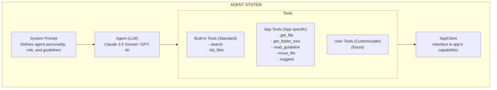
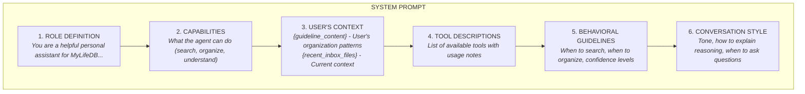
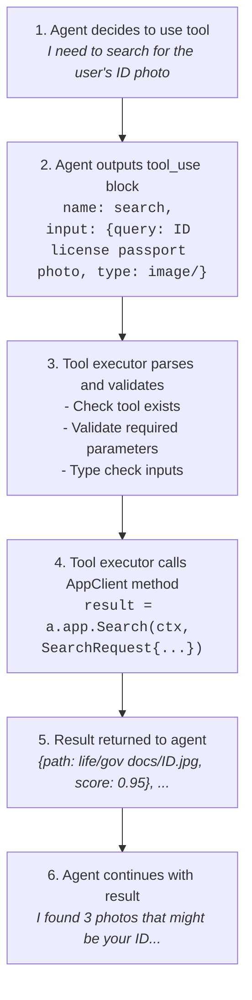

This document clearly defines all components of the inbox agent system: system prompts, built-in tools, user-defined tools, and how they work together.

---

## Overview

The agent system has these key components:



---

## 1. System Prompt

The system prompt is the **foundation** that defines who the agent is and how it behaves.

### Structure



### Full System Prompt Template

```markdown
You are a helpful personal assistant for MyLifeDB, a personal knowledge management system.

## Your Role

You help users:
1. **Find information** - Search through files, answer questions about their data
2. **Organize files** - Suggest moving files to appropriate folders based on their organization patterns
3. **Understand content** - Read and summarize file contents (OCR, transcriptions, digests)

## User's Organization Patterns

{guideline_content}

## Available Tools

You have access to these tools:
- search: Find files by content, name, or description
- get_file: Get detailed file content and metadata
- get_folder_tree: See the user's folder structure
- read_guideline: Read the user's organization guide
- list_recent_files: See recently added files
- create_suggestion: Suggest moving a file (requires user confirmation)

## Guidelines

### When searching:
- Use semantic understanding - "ID photo" should match "license", "passport", etc.
- If search returns too many results, ask clarifying questions
- Show relevant files to the user with context

### When organizing files:
1. **Always read guideline.md first** to understand the user's patterns
2. Check the folder tree to see available destinations
3. Examine the file content and metadata
4. Suggest the most appropriate folder with clear reasoning
5. Provide confidence score (0.0-1.0)
6. Offer alternatives if multiple folders could fit

**Important**: Never move files without calling create_suggestion first. The user must confirm.

### Confidence levels:
- High (>0.9): Strong match to existing patterns
- Medium (0.7-0.9): Good match but some uncertainty
- Low (<0.7): Ask user for guidance

## Conversation Style

- Be conversational and helpful
- Explain your reasoning clearly
- Ask questions when unclear
- Admit when you're not sure

## Context

Recent files in inbox:
{recent_inbox_files}
```

### Dynamic Parts

The system prompt has **dynamic sections** that are filled at runtime:

| Variable | Source | Example |
|----------|--------|---------|
| `{guideline_content}` | Read from `data/guideline.md` | User's folder structure and patterns |
| `{recent_inbox_files}` | Query database | Last 5 files added to inbox |

### Code Implementation

```go
// backend/agent/prompts.go

const systemPromptTemplate = `
You are a helpful personal assistant for MyLifeDB, a personal knowledge management system.

## Your Role
...

## User's Organization Patterns

%s

## Context

Recent files in inbox:
%s
`

func (a *Agent) buildSystemPrompt(ctx context.Context) string {
    // Read user's guideline
    guideline, err := a.app.ReadGuideline(ctx)
    if err != nil {
        guideline = "No guideline found. Ask user about their organization preferences."
    }

    // Get recent inbox files for context
    recentFiles, err := a.app.ListRecentFiles(ctx, 5, "")
    if err != nil {
        recentFiles = []FileSummary{}
    }

    recentFilesStr := formatRecentFiles(recentFiles)

    return fmt.Sprintf(systemPromptTemplate, guideline, recentFilesStr)
}

func formatRecentFiles(files []FileSummary) string {
    if len(files) == 0 {
        return "No recent files in inbox."
    }

    var sb strings.Builder
    for _, f := range files {
        sb.WriteString(fmt.Sprintf("- %s (%s, %s)\n",
            f.Name,
            f.MimeType,
            f.CreatedAt.Format("2006-01-02")))
    }
    return sb.String()
}
```

---

## 2. Built-in Tools (Standard)

These are **generic tools** that work with any LLM agent pattern. They're not specific to MyLifeDB.

### Tool: `search`

**Purpose**: Search for files by content, name, or description

**Category**: Information Retrieval

**Schema**:
```json
{
  "name": "search",
  "description": "Search for files by content, name, tags, or description. Returns matching files with context.",
  "input_schema": {
    "type": "object",
    "properties": {
      "query": {
        "type": "string",
        "description": "Search query - can be keywords or natural language"
      },
      "type": {
        "type": "string",
        "description": "Filter by mime type prefix (e.g., 'image/', 'application/pdf')"
      },
      "folder": {
        "type": "string",
        "description": "Limit search to specific folder"
      },
      "limit": {
        "type": "integer",
        "description": "Max results (default 10)"
      }
    },
    "required": ["query"]
  }
}
```

**Implementation**:
```go
case "search":
    var params struct {
        Query  string `json:"query"`
        Type   string `json:"type"`
        Folder string `json:"folder"`
        Limit  int    `json:"limit"`
    }
    json.Unmarshal(tool.Input, &params)

    if params.Limit == 0 {
        params.Limit = 10
    }

    return a.app.Search(ctx, SearchRequest{
        Query:  params.Query,
        Type:   params.Type,
        Folder: params.Folder,
        Limit:  params.Limit,
    })
```

**Example Usage**:
```
User: "find my ID photo"
Agent: calls search(query="ID license passport photo", type="image/")
Result: [ID.jpg, license.png, passport.jpg]
```

---

### Tool: `list_recent_files`

**Purpose**: List recently added files

**Category**: Information Retrieval

**Schema**:
```json
{
  "name": "list_recent_files",
  "description": "List recently added files for context",
  "input_schema": {
    "type": "object",
    "properties": {
      "limit": {
        "type": "integer",
        "description": "Number of files (default 10)"
      },
      "type": {
        "type": "string",
        "description": "Filter by mime type prefix"
      }
    }
  }
}
```

**Implementation**:
```go
case "list_recent_files":
    var params struct {
        Limit int    `json:"limit"`
        Type  string `json:"type"`
    }
    json.Unmarshal(tool.Input, &params)
    if params.Limit == 0 {
        params.Limit = 10
    }
    return a.app.ListRecentFiles(ctx, params.Limit, params.Type)
```

**Example Usage**:
```
User: "what have I added recently?"
Agent: calls list_recent_files(limit=20)
Result: [W2_2024.pdf, vacation.jpg, notes.md, ...]
```

---

## 3. App Tools (MyLifeDB-Specific)

These tools are **specific to MyLifeDB** and use the app's unique capabilities.

### Tool: `get_file`

**Purpose**: Get detailed information about a file including extracted content (OCR, transcriptions)

**Category**: Information Retrieval

**Schema**:
```json
{
  "name": "get_file",
  "description": "Get detailed information about a file including extracted content from digests (OCR, transcription, etc.)",
  "input_schema": {
    "type": "object",
    "properties": {
      "path": {
        "type": "string",
        "description": "File path"
      }
    },
    "required": ["path"]
  }
}
```

**Returns**:
```json
{
  "path": "inbox/receipt.jpg",
  "name": "receipt.jpg",
  "mime_type": "image/jpeg",
  "size": 1024000,
  "created_at": "2025-02-05T10:00:00Z",
  "digests": {
    "ocr": {
      "content": "WALMART\nSubtotal: $45.67\nTax: $3.21\nTotal: $48.88",
      "confidence": 0.95
    },
    "metadata": {
      "width": 1920,
      "height": 1080
    }
  }
}
```

**Implementation**:
```go
case "get_file":
    var params struct {
        Path string `json:"path"`
    }
    json.Unmarshal(tool.Input, &params)
    return a.app.GetFile(ctx, params.Path)
```

**Example Usage**:
```
User: "what's in that receipt?"
Agent: calls get_file("inbox/receipt.jpg")
Agent: reads OCR digest content
Agent: responds with extracted text
```

---

### Tool: `get_folder_tree`

**Purpose**: Get the library folder structure

**Category**: Organization

**Schema**:
```json
{
  "name": "get_folder_tree",
  "description": "Get the library folder structure to see available organization destinations",
  "input_schema": {
    "type": "object",
    "properties": {
      "depth": {
        "type": "integer",
        "description": "How deep to traverse (default 2)"
      }
    }
  }
}
```

**Returns**:
```json
{
  "name": "/",
  "path": "/",
  "children": [
    {
      "name": "life",
      "path": "life/",
      "children": [
        {"name": "projects", "path": "life/projects/"},
        {"name": "gov docs", "path": "life/gov docs/"},
        {"name": "retro", "path": "life/retro/"}
      ]
    },
    {
      "name": "work",
      "path": "work/",
      "children": [
        {"name": "hotstar", "path": "work/hotstar/"}
      ]
    }
  ]
}
```

**Implementation**:
```go
case "get_folder_tree":
    var params struct {
        Depth int `json:"depth"`
    }
    json.Unmarshal(tool.Input, &params)
    if params.Depth == 0 {
        params.Depth = 2
    }
    return a.app.GetFolderTree(ctx, params.Depth)
```

**Example Usage**:
```
User: "organize this file"
Agent: calls get_folder_tree(2)
Agent: sees available folders
Agent: suggests appropriate destination
```

---

### Tool: `read_guideline`

**Purpose**: Read the user's organization guideline

**Category**: Organization

**Schema**:
```json
{
  "name": "read_guideline",
  "description": "Read the user's guideline.md file to understand their organization patterns and folder structure",
  "input_schema": {
    "type": "object",
    "properties": {}
  }
}
```

**Returns**: Raw text content of `guideline.md`

**Implementation**:
```go
case "read_guideline":
    return a.app.ReadGuideline(ctx)
```

**Example Usage**:
```
User: "organize inbox/W2_2024.pdf"
Agent: calls read_guideline()
Agent: learns that work/hotstar/compensation/ is for salary docs
Agent: suggests moving W2 there
```

---

### Tool: `create_suggestion`

**Purpose**: Create a pending file organization suggestion

**Category**: Organization

**Schema**:
```json
{
  "name": "create_suggestion",
  "description": "Create a pending suggestion to move a file to a folder. This requires user confirmation before executing.",
  "input_schema": {
    "type": "object",
    "properties": {
      "file_path": {
        "type": "string",
        "description": "File to move"
      },
      "target_folder": {
        "type": "string",
        "description": "Destination folder"
      },
      "reasoning": {
        "type": "string",
        "description": "Brief explanation of why this is the right folder (1-2 sentences)"
      },
      "confidence": {
        "type": "number",
        "description": "Confidence score 0.0-1.0"
      }
    },
    "required": ["file_path", "target_folder", "reasoning", "confidence"]
  }
}
```

**Returns**:
```json
{
  "id": "sug-abc123",
  "status": "pending"
}
```

**Implementation**:
```go
case "create_suggestion":
    var params struct {
        FilePath     string  `json:"file_path"`
        TargetFolder string  `json:"target_folder"`
        Reasoning    string  `json:"reasoning"`
        Confidence   float64 `json:"confidence"`
    }
    json.Unmarshal(tool.Input, &params)

    return a.app.CreateSuggestion(ctx, &Suggestion{
        ConvID:       a.currentConvID,
        FilePath:     params.FilePath,
        TargetFolder: params.TargetFolder,
        Reasoning:    params.Reasoning,
        Confidence:   params.Confidence,
    })
```

**Example Usage**:
```
Agent: calls create_suggestion(
    file_path="inbox/W2_2024.pdf",
    target_folder="work/hotstar/compensation/",
    reasoning="W-2 is a tax form from your employer...",
    confidence=0.92
)
User sees: [Move] [Keep in Inbox] buttons
```

---

## 4. User-Defined Tools (Future)

These are **custom tools** that users can define for their specific workflows. Not implemented in v1, but designed for future extensibility.

### Concept

Users could define tools in a `tools.yaml` file:

```yaml
tools:
  - name: tag_file
    description: Add tags to a file
    endpoint: /api/files/:path/tags
    method: POST
    parameters:
      - name: path
        type: string
        required: true
      - name: tags
        type: array
        items: string
        required: true

  - name: extract_contacts
    description: Extract contact information from a file
    endpoint: /api/ai/extract-contacts
    method: POST
    parameters:
      - name: file_path
        type: string
        required: true
```

### Implementation (Future)

```go
// backend/agent/tools/custom.go

type CustomTool struct {
    Name        string
    Description string
    Endpoint    string
    Method      string
    Parameters  []Parameter
}

func (t *CustomTool) Execute(ctx context.Context, input map[string]any) (any, error) {
    // Make HTTP call to endpoint
    // Marshal parameters
    // Return result
}
```

---

## 5. Tool Categories

Tools are organized into logical categories:

### Information Retrieval
- `search` - Find files
- `get_file` - Get file details
- `list_recent_files` - List recent additions

### Organization
- `get_folder_tree` - See folder structure
- `read_guideline` - Understand user's patterns
- `create_suggestion` - Propose file move

### Future Categories
- **Content Manipulation**: tag_file, rename_file, delete_file
- **AI Analysis**: summarize_file, extract_entities, find_similar
- **Automation**: bulk_organize, auto_tag, schedule_task

---

## 6. Tool Execution Flow



---

## 7. Adding New Tools

### Step-by-step Process

1. **Define the tool schema**
   ```go
   // backend/agent/tools.go
   {
       Name:        "my_new_tool",
       Description: "What this tool does",
       InputSchema: map[string]any{
           "type": "object",
           "properties": map[string]any{
               "param1": map[string]any{
                   "type":        "string",
                   "description": "What param1 is for",
               },
           },
           "required": []string{"param1"},
       },
   }
   ```

2. **Implement in AppClient**
   ```go
   // backend/agent/appclient/client.go
   type AppClient interface {
       // ... existing methods ...
       MyNewTool(ctx context.Context, param1 string) (*Result, error)
   }
   ```

3. **Add to LocalAppClient**
   ```go
   // backend/agent/appclient/local.go
   func (c *LocalAppClient) MyNewTool(ctx context.Context, param1 string) (*Result, error) {
       // Implementation using existing services
       return c.someService.DoSomething(param1)
   }
   ```

4. **Add to tool executor**
   ```go
   // backend/agent/agent.go
   func (a *Agent) executeTool(ctx context.Context, tool ToolUse) (any, error) {
       switch tool.Name {
       // ... existing cases ...
       case "my_new_tool":
           var params struct {
               Param1 string `json:"param1"`
           }
           json.Unmarshal(tool.Input, &params)
           return a.app.MyNewTool(ctx, params.Param1)
       }
   }
   ```

5. **Update system prompt**
   ```markdown
   ## Available Tools

   - search: Find files by content
   - get_file: Get file details
   - my_new_tool: What it does and when to use it  ← Add here
   ```

---

## 8. Tool Design Principles

### Good Tool Design

**Single responsibility** - Each tool does one thing well
```
search() - Just search
get_file() - Just get file info
```

**Clear parameters** - Obvious what each parameter does
```json
{
  "query": "what to search for",
  "type": "filter by type",
  "limit": "how many results"
}
```

**Descriptive names** - Name clearly indicates purpose
```
read_guideline() - reads guideline.md
create_suggestion() - creates organization suggestion
```

**Appropriate granularity** - Not too broad, not too narrow
```
get_file() - Returns file + digests (good)
get_file_path() - Too narrow
get_everything() - Too broad
```

### Bad Tool Design

**Multiple responsibilities**
```
search_and_organize() - Does two things
```

**Unclear parameters**
```json
{
  "data": "..." // What is data?
  "flag": true  // What does flag do?
}
```

**Too granular**
```
get_file_name()
get_file_size()
get_file_type()
-> Should be one get_file() tool
```

**Too broad**
```
do_everything()
-> Agent can't decide when to use it
```

---

## 9. Error Handling

Tools should return structured errors:

```go
type ToolError struct {
    Code    string `json:"code"`
    Message string `json:"message"`
    Retryable bool `json:"retryable"`
}

// Example
return nil, ToolError{
    Code:    "file_not_found",
    Message: "File 'inbox/missing.pdf' does not exist",
    Retryable: false,
}
```

Agent sees error and can:
- Inform user gracefully
- Try alternative approach
- Ask for clarification

---

## 10. Testing Tools

Each tool should have tests:

```go
func TestSearchTool(t *testing.T) {
    // Create mock AppClient
    mockApp := &MockAppClient{
        SearchFunc: func(ctx context.Context, req SearchRequest) (*SearchResult, error) {
            return &SearchResult{
                Results: []FileResult{
                    {Path: "test.txt", Score: 0.9},
                },
            }, nil
        },
    }

    // Create agent with mock
    agent := NewAgent(mockApp, mockLLM, "claude-3-5-sonnet")

    // Execute tool
    result, err := agent.executeTool(ctx, ToolUse{
        Name: "search",
        Input: json.RawMessage(`{"query": "test", "limit": 10}`),
    })

    // Assert
    assert.NoError(t, err)
    assert.Len(t, result.Results, 1)
}
```

---

## 11. Summary Table

| Component | Purpose | Defined Where | Changed By |
|-----------|---------|---------------|------------|
| **System Prompt** | Defines agent behavior | `backend/agent/prompts.go` | Developers |
| **Built-in Tools** | Generic capabilities | `backend/agent/tools.go` | Developers |
| **App Tools** | MyLifeDB-specific | `backend/agent/appclient/` | Developers |
| **User Tools** | Custom workflows | `data/tools.yaml` (future) | Users |
| **Guideline** | Organization patterns | `data/guideline.md` | Users |

---

## 12. Quick Reference

### What goes in System Prompt?
- Agent's role and personality
- General behavioral guidelines
- Confidence levels, tone, style
- References to tools (but not detailed schemas)

### What goes in Tool Definitions?
- Exact parameter schemas
- Input/output types
- Required vs optional fields
- Detailed descriptions for each parameter

### What goes in guideline.md?
- User's folder structure
- Naming conventions
- Organization patterns
- Examples of where things go

### What's the difference between a tool and a function?
- **Tool**: What the agent sees and can call
- **Function**: The actual implementation in code
- One tool can map to multiple functions internally

---

*Last updated: 2025-02-05*
