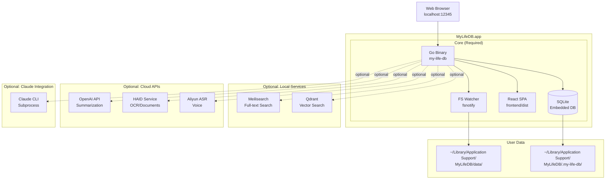
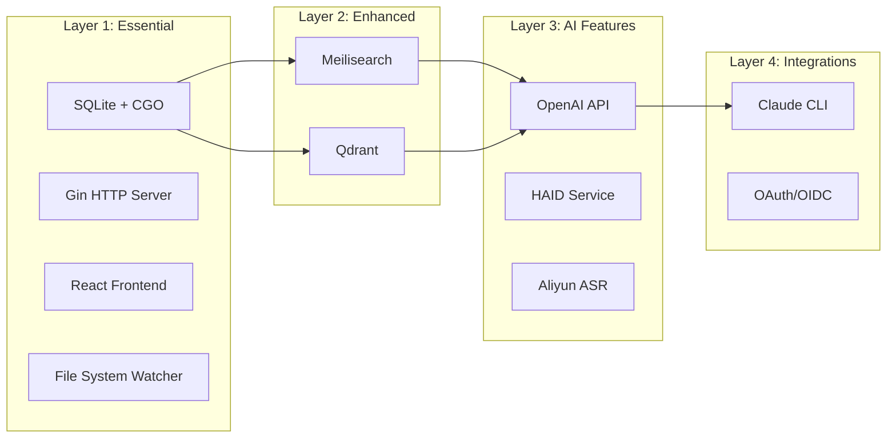
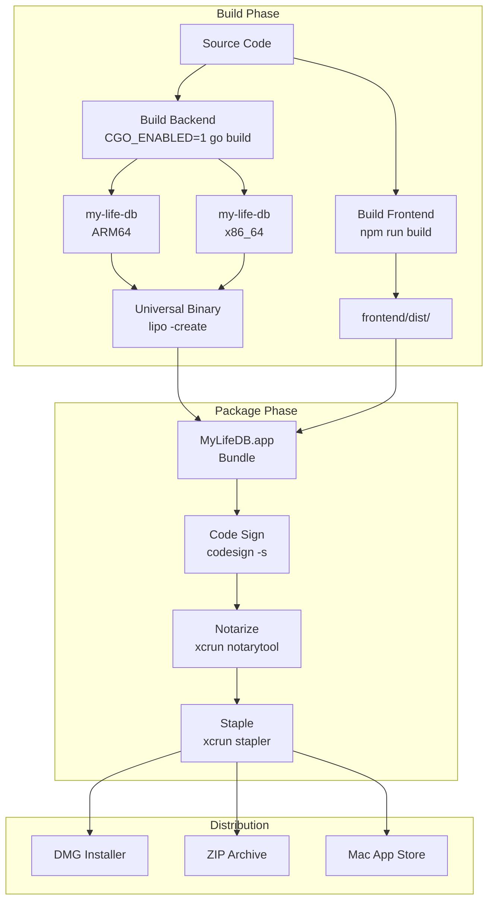
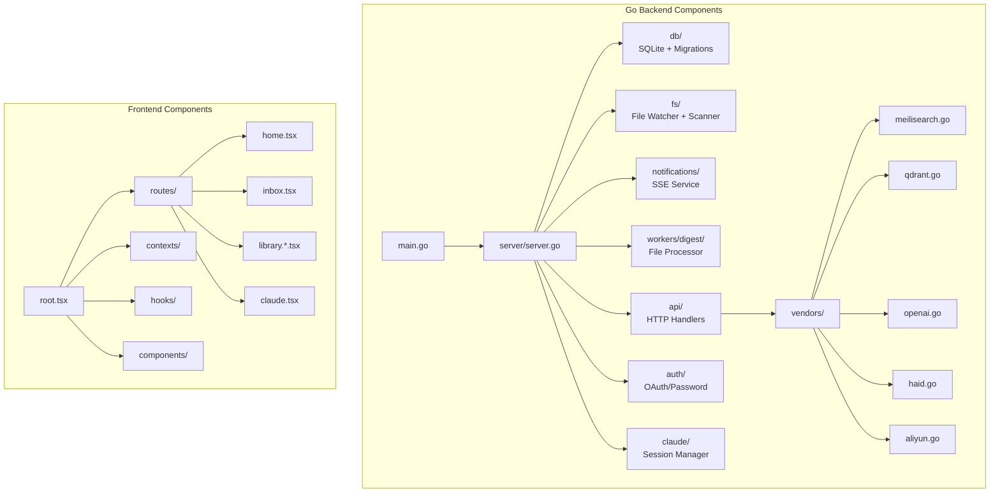
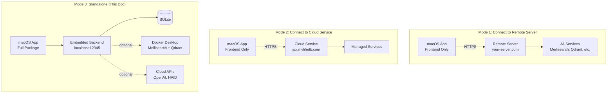
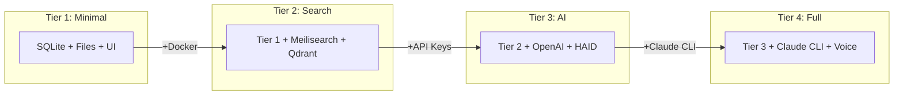
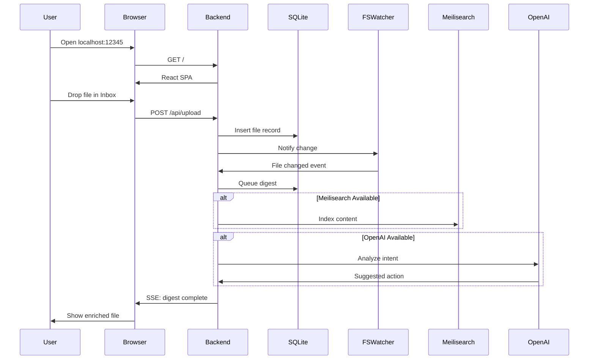
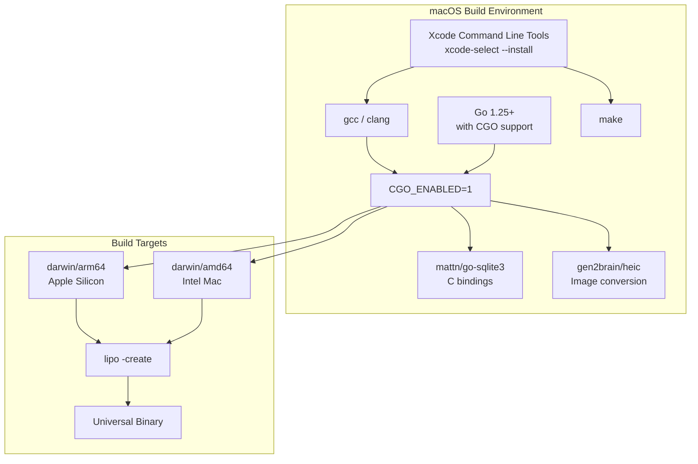

## System Overview



## Dependency Layers



## Build & Distribution Flow



## Component Details



## Three Operating Modes



## Deployment Tiers



## macOS App Bundle Structure

```
MyLifeDB.app/
├── Contents/
│   ├── Info.plist                    # App metadata
│   ├── MacOS/
│   │   └── my-life-db                # Universal binary (ARM64 + x86_64)
│   ├── Resources/
│   │   ├── AppIcon.icns              # App icon
│   │   ├── frontend/                 # Built React SPA
│   │   │   ├── index.html
│   │   │   └── assets/
│   │   └── defaults.env              # Default configuration
│   ├── Frameworks/                   # (Optional) Bundled dependencies
│   └── Entitlements.plist            # Sandbox permissions
└── (CodeSignature, etc.)
```

## Data Flow



## CGO Build Requirements



## Summary Table

| Component | Required | Bundled | External | Notes |
|-----------|----------|---------|----------|-------|
| Go Binary | ✅ | ✅ | - | CGO required for SQLite |
| React Frontend | ✅ | ✅ | - | Pre-built static files |
| SQLite | ✅ | ✅ | - | Embedded via CGO |
| Meilisearch | ❌ | ❌ | Docker/Standalone | ~50MB binary |
| Qdrant | ❌ | ❌ | Docker/Standalone | ~100MB binary |
| OpenAI API | ❌ | - | Cloud | User provides API key |
| HAID | ❌ | - | Cloud | Your hosted service |
| Claude CLI | ❌ | ❌ | User installs | npm i -g @anthropic/claude-code |
| Aliyun ASR | ❌ | - | Cloud | For voice features |
