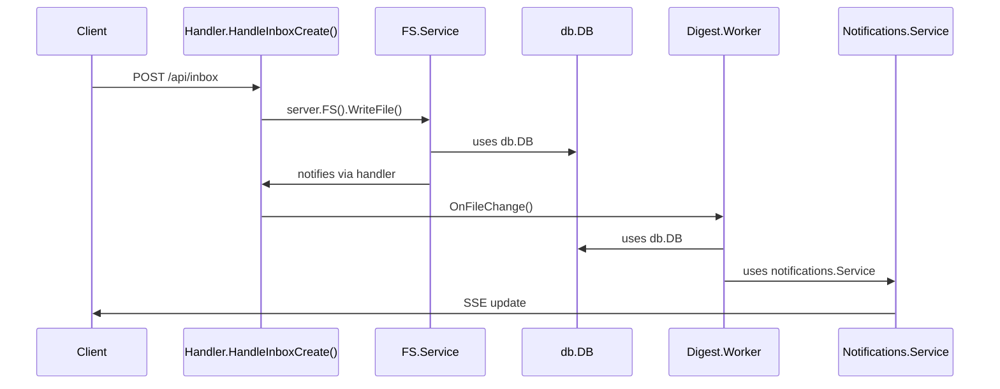
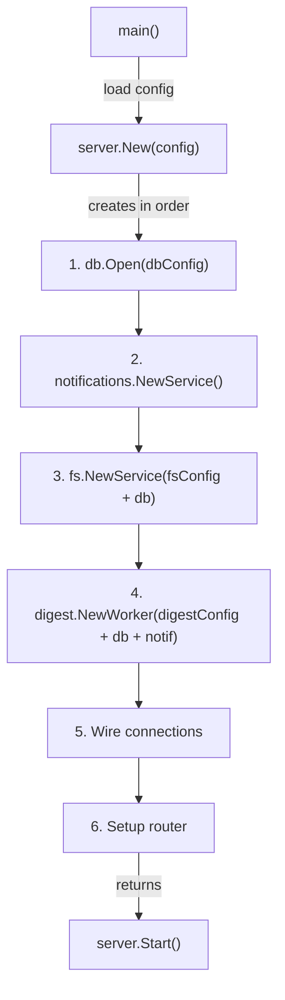

This document defines the clear interfaces and protocols between modules during the refactoring.

## Core Principles

1. **No global singletons** (except logging)
2. **Explicit dependencies** via Config structs
3. **Clear ownership**: Server owns all stateful components
4. **Clean interfaces**: Each module defines what it needs

## Module: Database (db)

### Interface

```go
// Config for database initialization
type Config struct {
    Path            string
    MaxOpenConns    int
    MaxIdleConns    int
    ConnMaxLifetime time.Duration
    LogQueries      bool
}

// DB is the database instance
type DB struct {
    // Private fields
}

// Constructor
func Open(cfg Config) (*DB, error)

// Lifecycle
func (d *DB) Close() error

// Access
func (d *DB) Conn() *sql.DB
func (d *DB) Transaction(fn func(*sql.Tx) error) error
```

### Dependencies
- **None** (leaf module)

### Notes
- All existing query functions (GetFileByPath, etc.) need to become methods on *DB
- OR: query functions accept *DB as first parameter
- Decision: **Make them methods on *DB** for cleaner API

### Migration Plan
1. Keep `db.GetDB()` that returns the global instance's conn
2. Gradually convert all query functions to methods
3. Update all callers to use instance methods
4. Remove global `GetDB()` last

---

## Module: Filesystem Service (fs)

### Interface

```go
// Config for FS service
type Config struct {
    DataRoot     string
    DB           *db.DB        // Direct reference to DB instance
    ScanInterval time.Duration
    WatchEnabled bool
}

// Service is the filesystem service instance
type Service struct {
    // Private fields
}

// Constructor
func NewService(cfg Config) *Service

// Lifecycle
func (s *Service) Start() error
func (s *Service) Stop() error

// Operations
func (s *Service) WriteFile(ctx context.Context, req WriteRequest) (*WriteResult, error)
func (s *Service) ReadFile(ctx context.Context, path string) (io.ReadCloser, error)
func (s *Service) DeleteFile(ctx context.Context, path string) error
func (s *Service) MoveFile(ctx context.Context, src, dst string) error
func (s *Service) GetFileInfo(ctx context.Context, path string) (*db.FileRecord, error)
func (s *Service) ProcessMetadata(ctx context.Context, path string) (*MetadataResult, error)

// Events
func (s *Service) SetFileChangeHandler(handler FileChangeHandler)
```

### Dependencies
- **db.DB**: For file metadata storage

### Notes
- Remove `Database` interface - use *db.DB directly
- Remove singleton pattern completely
- Server owns the single instance

---

## Module: Digest Worker (workers/digest)

### Interface

```go
// Config for digest worker
type Config struct {
    Workers   int
    QueueSize int

    // Service credentials
    OpenAIAPIKey     string
    OpenAIBaseURL    string
    OpenAIModel      string
    HAIDBaseURL      string
    HAIDAPIKey       string
    HAIDChromeCDPURL string
}

// Worker is the digest worker instance
type Worker struct {
    // Private fields
}

// Constructor
func NewWorker(cfg Config, database *db.DB, notifService *notifications.Service) *Worker

// Lifecycle
func (w *Worker) Start()
func (w *Worker) Stop()

// Events
func (w *Worker) OnFileChange(filePath string, isNew bool, contentChanged bool)
func (w *Worker) RequestDigest(filePath string)

// Management
func (w *Worker) EnsureDigestersForFile(filePath string) (added int, orphanedSkipped int)
```

### Dependencies
- **db.DB**: For digest storage and queries
- **notifications.Service**: For notifying UI of digest completion

### Notes
- Remove singleton pattern completely
- Accept db.DB and notifications in constructor
- All digesters get config from worker's config

---

## Module: Notifications (notifications)

### Interface

```go
// Service manages SSE subscriptions
type Service struct {
    // Private fields
}

// Constructor
func NewService() *Service

// Lifecycle
func (s *Service) Shutdown()

// Subscription
func (s *Service) Subscribe() (<-chan Event, func())

// Broadcasting
func (s *Service) Notify(event Event)
func (s *Service) NotifyInboxChanged()
func (s *Service) NotifyPinChanged()
func (s *Service) NotifyDigestUpdate(path string)
func (s *Service) NotifyPreviewUpdated(path string, previewType string)
```

### Dependencies
- **None** (leaf module)

### Notes
- Remove singleton pattern completely
- Simple, stateless notification hub

---

## Module: Server (server)

### Interface

```go
// Config for server
type Config struct {
    // Infrastructure
    Port int
    Host string
    Env  string

    // Paths
    DataDir      string
    DatabasePath string

    // FS settings
    FSScanInterval time.Duration
    FSWatchEnabled bool

    // Digest settings
    DigestWorkers   int
    DigestQueueSize int

    // External services
    OpenAIAPIKey  string
    OpenAIBaseURL string
    OpenAIModel   string
    // ... etc
}

// Server owns all components
type Server struct {
    // Private fields
}

// Constructor
func New(cfg *Config) (*Server, error)

// Lifecycle
func (s *Server) Start() error
func (s *Server) Shutdown(ctx context.Context) error

// Config management
func (s *Server) ReloadConfig() error

// Access to components (for API handlers)
func (s *Server) FS() *fs.Service
func (s *Server) DB() *db.DB
func (s *Server) Digest() *digest.Worker
func (s *Server) Notifications() *notifications.Service
```

### Dependencies
- **All modules**: Server creates and owns all components

### Notes
- Server is the ONLY place that creates module instances
- API handlers receive Server and access components via methods

---

## Module: API Handlers (api)

### Interface

```go
// Handlers hold references to server components
type Handlers struct {
    server *server.Server
}

// Constructor
func NewHandlers(srv *server.Server) *Handlers

// Setup routes with handlers
func SetupRoutes(router *gin.Engine, handlers *Handlers)

// Example handler
func (h *Handlers) HandleInboxCreate(c *gin.Context) {
    fs := h.server.FS()
    db := h.server.DB()
    // Use components...
}
```

### Dependencies
- **server.Server**: For accessing all components

### Notes
- All handlers become methods on *Handlers
- Handlers struct holds server reference
- Clean, testable design

---

## Data Flow Examples

### File Upload Flow



### Module Creation Flow



## Migration Checklist

### Phase 1: Database Module
- [ ] Create db.Config struct
- [ ] Add db.Open() function
- [ ] Convert all query functions to (*DB) methods
- [ ] Update all callers

### Phase 2: Notifications Module
- [ ] Remove singleton pattern
- [ ] Add NewService() constructor
- [ ] Update all callers

### Phase 3: FS Module
- [ ] Remove singleton pattern
- [ ] Remove Database interface, use *db.DB directly
- [ ] Update all internal references
- [ ] Update all callers

### Phase 4: Digest Module
- [ ] Remove singleton pattern
- [ ] Add NewWorker(cfg, db, notif) constructor
- [ ] Pass dependencies explicitly
- [ ] Update all digesters to get config from worker
- [ ] Update all callers

### Phase 5: Server Module
- [ ] Create server.Config
- [ ] Create server.Server struct
- [ ] Implement New() with proper initialization order
- [ ] Implement Start() and Shutdown()
- [ ] Add component accessor methods

### Phase 6: API Handlers
- [ ] Create api.Handlers struct
- [ ] Convert all handlers to methods
- [ ] Update SetupRoutes signature
- [ ] Update all handler implementations

### Phase 7: Main
- [ ] Simplify main() to just create and start server
- [ ] Remove all direct module creation
- [ ] Clean up

## Testing Strategy

Each module should be testable independently:

```go
// Test db module
func TestDB(t *testing.T) {
    cfg := db.Config{Path: ":memory:"}
    database, err := db.Open(cfg)
    defer database.Close()
    // Test methods
}

// Test fs module
func TestFS(t *testing.T) {
    database, _ := db.Open(db.Config{Path: ":memory:"})
    cfg := fs.Config{
        DataRoot: t.TempDir(),
        DB: database,
    }
    svc := fs.NewService(cfg)
    // Test methods
}

// Test server integration
func TestServer(t *testing.T) {
    cfg := &server.Config{
        Port: 0,
        DataDir: t.TempDir(),
        // ...
    }
    srv, err := server.New(cfg)
    // Test integration
}
```
