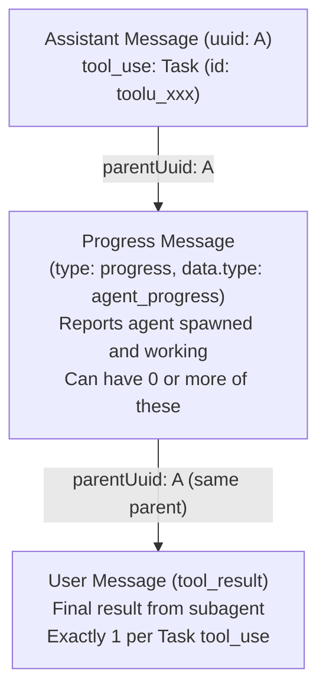
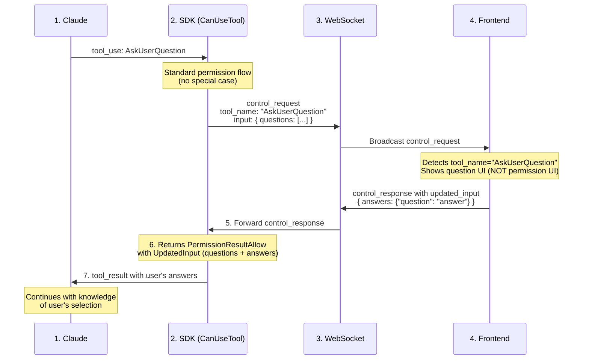

## Overview

Claude Code stores all session data, configuration, and cache files in `~/.claude/`. This document comprehensively describes every directory and file, with special focus on what's relevant for building a web UI.

**Related Documentation**:
- [websocket-protocol.md](./websocket-protocol) - Real-time WebSocket protocol for session updates

---

## Directory Structure

```
~/.claude/
├── cache/                    # Application cache
├── debug/                    # Debug logs per session
├── file-history/             # File version history per session
├── history.jsonl             # Global command history
├── ide/                      # IDE integration lock files
├── paste-cache/              # Cached pasted content
├── plans/                    # Agent execution plans
├── plugins/                  # Plugin system (marketplace + installed)
├── projects/                 # Per-project session storage ⭐ KEY
├── session-env/              # Per-session environment variables
├── settings.json             # User settings
├── settings.local.json       # Local permission overrides
├── shell-snapshots/          # Shell environment snapshots
├── stats-cache.json          # Usage statistics cache
├── statsig/                  # Feature flag & analytics cache
├── telemetry/                # Telemetry event queue
└── todos/                    # Per-session todo lists
```

---

## Detailed Documentation

### 1. projects/ ⭐⭐⭐ CRITICAL FOR WEB UI

**Purpose**: Primary storage for all conversation sessions, organized by project path.

**Structure**:
```
projects/
├── -Users-iloahz-projects-my-life-db/    # Project directory
│   ├── sessions-index.json               # Session metadata index
│   ├── {sessionId}.jsonl                 # Session conversation log
│   └── {sessionId}/                      # Optional subdirectory
│       └── subagents/
│           └── agent-{id}.jsonl          # Subagent logs
└── -Users-iloahz-Desktop-sharable/       # Another project
```

**Directory naming**: Project paths with slashes replaced by hyphens (`/Users/foo/bar` → `-Users-foo-bar`)

#### sessions-index.json

**Format**: JSON

**Content**:
```json
{
  "version": 1,
  "entries": [
    {
      "sessionId": "04361723-fde4-4be9-8e44-e2b0f9b524c4",
      "fullPath": "/Users/iloahz/.claude/projects/-Users-iloahz-projects-my-life-db/04361723-fde4-4be9-8e44-e2b0f9b524c4.jsonl",
      "fileMtime": 1768991158926,
      "firstPrompt": "<ide_opened_file>The user opened the file /Users/iloahz/projects/my-life-db/.env in the IDE...</ide_opened_file>",
      "summary": "Disable Semantic Search Frontend Temporarily",
      "customTitle": "My Custom Session Name",
      "tag": "feature",
      "agentName": "explore-agent",
      "agentColor": "#4CAF50",
      "messageCount": 11,
      "created": "2026-01-19T04:45:15.012Z",
      "modified": "2026-01-19T04:46:54.480Z",
      "gitBranch": "main",
      "projectPath": "/Users/iloahz/projects/my-life-db",
      "isSidechain": false
    }
  ]
}
```

**Fields**:

| Field | Type | Description |
|-------|------|-------------|
| `sessionId` | string | Unique UUID for session |
| `fullPath` | string | Absolute path to session JSONL file |
| `fileMtime` | number | Last modification time (Unix ms) |
| `firstPrompt` | string | First user message (may include IDE context tags) |
| `summary` | string? | **Claude-generated 5-10 word title** (auto-generated on session index rebuild) |
| `customTitle` | string? | User-set custom title (via `/title` command) |
| `tag` | string? | User-assigned session tag (via `/tag` command) |
| `agentName` | string? | Name for subagent sessions |
| `agentColor` | string? | Color hex code for subagent sessions |
| `messageCount` | number | Total messages in conversation |
| `created` | string | Session start timestamp (ISO 8601) |
| `modified` | string | Last activity timestamp (ISO 8601) |
| `gitBranch` | string | Git branch when session started |
| `projectPath` | string | Working directory for session |
| `isSidechain` | bool | Whether session is a branch/fork |

**Title Resolution Priority** (for display):
1. `agentName` - If set (for subagent sessions)
2. `customTitle` - If user set a custom title
3. `summary` - Claude-generated title (most common)
4. `firstPrompt` - Fallback to first message
5. `"Autonomous session"` - For sidechain sessions with no other title

**Summary Generation**:
- Claude CLI auto-generates summaries when rebuilding the session index
- Uses a prompt: "Summarize this coding conversation in under 50 characters. Capture the main task, key files, problems addressed, and current status."
- Stored in JSONL as `{"type":"summary","summary":"...","leafUuid":"..."}`

**Web UI Usage**:
- **List all sessions** for a project
- **Sort by recent activity** (`modified` field)
- **Display session title** (prefer `summary` over `firstPrompt`)
- **Filter by branch** (`gitBranch`)
- **Filter by tag** (`tag` field)
- **Show subagent sessions** with color indicator

#### {sessionId}.jsonl

**Format**: JSONL (JSON Lines - one JSON object per line, append-only)

**Content**: Complete conversation history with all messages, tool calls, and results.

#### Message Sources: JSONL vs Stdout ⭐⭐⭐ CRITICAL

Claude Code outputs messages in **two different contexts** with subtle differences:

| Source | When | Persistence | Notes |
|--------|------|-------------|-------|
| **JSONL files** | Historical sessions | Persisted to disk | What you read when viewing past sessions |
| **Stdout** (`--output-format stream-json`) | Live execution | Only persisted after turn completes | What WebSocket receives in real-time |

**Key differences:**
- `system:init` message: **stdout only** - never written to JSONL, **sent once per user input** (not once per session)
- `result` message: **stdout only** - summarizes the completed turn, not persisted
- `queue-operation`: **both** - appears in real-time and is persisted
- `progress` messages: **both** - persisted to JSONL for replay
- `user` messages (user input): **JSONL only** - Claude stdin does NOT echo user messages to stdout

#### Synthetic User Messages in UI Mode ⭐⭐⭐ CRITICAL

When the backend receives a user message via WebSocket and sends it to Claude's stdin, Claude does **NOT** echo the user message back in stdout. This creates an inconsistency:

| Mode | User Message Source | Behavior |
|------|---------------------|----------|
| **CLI mode (JSONL)** | Read from JSONL file | User messages included naturally |
| **UI mode (stdin/stdout)** | Written to stdin | Claude doesn't echo back |

**Problem:** In UI mode, the frontend shows an "optimistic" user message immediately. When the response arrives, this optimistic message should be replaced by the "real" message from the backend. But since Claude doesn't echo user messages, there's no real message to replace it with.

**Solution:** The backend **synthesizes a user message** immediately after successfully sending to Claude's stdin, and broadcasts it to all connected clients via WebSocket.

**Synthetic user message format:**
```json
{
  "type": "user",
  "uuid": "generated-uuid",
  "timestamp": "2026-01-23T10:30:00.000Z",
  "sessionId": "session-uuid",
  "message": {
    "role": "user",
    "content": [{"type": "text", "text": "user's message"}]
  }
}
```

**Benefits:**
1. **Unified client logic** - Frontend always receives user messages from backend
2. **Consistent behavior** - Session replay (JSONL) matches live interaction
3. **Proper optimistic update** - Optimistic message gets replaced correctly

**Note:** This synthetic message is broadcast to clients but NOT written to JSONL (Claude handles persistence). When reopening a session, the user message will come from JSONL as usual.

#### Field Naming Inconsistency ⚠️ IMPORTANT

Claude Code uses **different field naming conventions** between different output formats. This is a known inconsistency that we normalize in the frontend.

**Known Inconsistent Fields:**

| Semantic | camelCase | snake_case | Notes |
|----------|-----------|------------|-------|
| Tool use result | `toolUseResult` | `tool_use_result` | Rich metadata for tool results |
| Parent tool use ID | `parentToolUseID` | `parent_tool_use_id` | Links subagent messages to parent Task |

**When each format appears:**

| Source | Format | Example Fields |
|--------|--------|----------------|
| JSONL (historical sessions) | camelCase | `toolUseResult`, `parentToolUseID` |
| stdout (live WebSocket) | snake_case | `tool_use_result`, `parent_tool_use_id` |

**Example - same data, different field names:**

JSONL file:
```json
{"type": "user", "toolUseResult": {"stdout": "..."}, "parentToolUseID": "toolu_xxx"}
```

stdout (stream-json):
```json
{"type": "user", "tool_use_result": {"stdout": "..."}, "parent_tool_use_id": "toolu_xxx"}
```

**Frontend Normalization Strategy:**

We normalize **to camelCase** at parse time in the frontend. This is implemented in `session-message-utils.ts`:

```typescript
/**
 * Field aliases: snake_case → camelCase
 * Add new entries here when discovering new inconsistent fields.
 */
const FIELD_ALIASES: Record<string, string> = {
  'tool_use_result': 'toolUseResult',
  'parent_tool_use_id': 'parentToolUseID',
}

/**
 * Normalize a message by converting snake_case fields to camelCase.
 * This ensures consistent field access regardless of message source.
 */
export function normalizeMessage<T extends Record<string, unknown>>(msg: T): T {
  const normalized = { ...msg }
  for (const [snakeCase, camelCase] of Object.entries(FIELD_ALIASES)) {
    if (snakeCase in normalized && !(camelCase in normalized)) {
      normalized[camelCase] = normalized[snakeCase]
      delete normalized[snakeCase]
    }
  }
  return normalized as T
}
```

**Where normalization is applied:**

1. **WebSocket message handler** - Live session messages
2. **JSONL parser** - Historical session loading
3. **API response handler** - Session data from backend

**Benefits of this approach:**

- Single source of truth for field names (camelCase)
- Easy to add new aliases when discovered
- Rest of codebase uses consistent naming
- No need for dual-field accessors everywhere

**Legacy accessors (deprecated):**

For backwards compatibility, these accessors still exist but prefer using normalized fields:

```typescript
// Deprecated - use msg.toolUseResult directly after normalization
export function getToolUseResult(msg: SessionMessage): ToolUseResult | undefined {
  return msg.toolUseResult ?? msg.tool_use_result
}
```

**Adding new field aliases:**

When you discover a new inconsistent field:
1. Add it to `FIELD_ALIASES` in `session-message-utils.ts`
2. Document it in this table above
3. Update the `SessionMessage` interface to use camelCase only

#### Backend Raw JSON Passthrough ⭐⭐⭐ CRITICAL

The Go backend **always returns the full raw JSON** from Claude, regardless of whether the typed struct covers all fields. This is implemented via a raw JSON passthrough pattern:

**How it works:**

1. **RawJSON embedding**: Every message type embeds `RawJSON` which holds `json.RawMessage`:
   ```go
   type RawJSON struct {
       Raw json.RawMessage `json:"-"`
   }
   ```

2. **Raw preservation during parsing**: When reading JSONL, raw bytes are copied before unmarshaling:
   ```go
   rawCopy := make([]byte, len(line))
   copy(rawCopy, []byte(line))
   // ... unmarshal into typed struct ...
   msg.Raw = rawCopy
   ```

3. **Raw passthrough during serialization**: Every message type's `MarshalJSON` returns raw bytes first:
   ```go
   func (m SummarySessionMessage) MarshalJSON() ([]byte, error) {
       if len(m.Raw) > 0 {
           return m.Raw, nil  // Return original JSON as-is
       }
       // Fallback to struct fields only if Raw is empty
       type Alias SummarySessionMessage
       return json.Marshal(Alias(m))
   }
   ```

4. **Unknown types preserved**: Unknown message types use `UnknownSessionMessage` which also preserves raw JSON.

**Why this matters:**
- **Future-proof**: New fields added by Claude are automatically passed through
- **No data loss**: Backend never filters or transforms Claude's output
- **Debugging**: Raw JSON matches exactly what Claude produced
- **Frontend responsibility**: Handle any fields Claude outputs, not just what backend structs define

**Example**: A `summary` message from Claude:
```json
{"type": "summary", "summary": "Session Title", "leafUuid": "abc-123"}
```
This is returned **exactly as-is** from the API, even though the `SummarySessionMessage` struct only has `Summary` and `LeafUUID` fields. If Claude adds new fields, they pass through automatically.

---

**Message Types** (`type` field):

| Type | Has Subtype? | Description |
|------|-------------|-------------|
| `user` | ❌ | User input or tool results |
| `assistant` | ❌ | Claude's responses (text and/or tool calls) |
| `result` | ✅ `subtype` | **Turn complete** - sent when Claude finishes (stdout only) |
| `system` | ✅ `subtype` | System messages (init, errors, compaction) |
| `progress` | ✅ `data.type` | Progress updates (hooks, bash, agents, search) |
| `stream_event` | ✅ `event.type` | **Progressive streaming** - partial response updates (stdout only, requires `--include-partial-messages`) |
| `summary` | ❌ | Auto-generated session summary |
| `custom-title` | ❌ | User-set custom title |
| `tag` | ❌ | User-assigned session tag |
| `agent-name` | ❌ | Subagent name assignment |
| `queue-operation` | ❌ | Internal queue management |
| `file-history-snapshot` | ❌ | File version tracking |

**Subtype Reference:**

| Type | Subtypes |
|------|----------|
| `system` | `init`, `compact_boundary`, `microcompact_boundary`, `turn_duration`, `api_error`, `local_command`, `hook_started`, `status`, `task_notification` |
| `progress` | `hook_progress`, `bash_progress`, `agent_progress`, `query_update`, `search_results_received` |
| `result` | `success`, `error` |
| `stream_event` | `message_start`, `content_block_start`, `content_block_delta`, `content_block_stop`, `message_delta`, `message_stop` |

**Common Message Fields**:

| Field | Type | Description |
|-------|------|-------------|
| `uuid` | string | Unique message identifier |
| `parentUuid` | string? | Parent message UUID (for threading) |
| `timestamp` | string | ISO 8601 timestamp |
| `type` | string | Message type (see table above) |
| `sessionId` | string | Session UUID |
| `cwd` | string | Working directory |
| `version` | string | Claude Code version (e.g., "2.1.11") |
| `gitBranch` | string | Current git branch |
| `isSidechain` | bool | Whether in a branch/fork |
| `isMeta` | bool? | Whether this is a meta message (system-injected context). **UI should skip rendering.** |
| `userType` | string | User type ("external") |
| `agentId` | string? | Subagent ID (e.g., "a081313") |
| `slug` | string? | Human-readable session slug |
| `parent_tool_use_id` | string? | If set, this message belongs to a subagent spawned by the Task tool with this ID. **UI should filter from top-level and render inside parent Task.** See "Subagent Message Hierarchy" section. |

---

#### Message Type Details

**1. User Messages**
```json
{
  "parentUuid": null,
  "isSidechain": false,
  "userType": "external",
  "cwd": "/Users/iloahz/projects/my-life-db",
  "sessionId": "04361723-fde4-4be9-8e44-e2b0f9b524c4",
  "version": "2.1.11",
  "gitBranch": "main",
  "type": "user",
  "message": {
    "role": "user",
    "content": [
      {
        "type": "text",
        "text": "temp disable semantic for now, disable from frontend"
      }
    ]
  },
  "uuid": "c0a21d6f-3652-4f86-a36b-b98d75a15298",
  "timestamp": "2026-01-19T04:45:15.012Z"
}
```

**Additional User Message Fields** (may appear in some messages):

| Field | Type | Description |
|-------|------|-------------|
| `toolUseResult` / `tool_use_result` | object/string | Tool execution result (for tool result messages). ⚠️ **Naming varies**: JSONL uses `toolUseResult`, stdout uses `tool_use_result`. See "Field Naming Inconsistency" section. |
| `sourceToolAssistantUUID` | string | UUID of assistant message that triggered the tool |
| `sourceToolUseID` | string | ID of the tool_use block |
| `todos` | array | Current todo list state |
| `permissionMode` | string | Permission mode active during this message |
| `isVisibleInTranscriptOnly` | boolean | Whether message is only for transcript display |
| `isCompactSummary` | boolean | Whether this is a compaction summary |
| `thinkingMetadata` | object | Metadata about thinking blocks |
| `isMeta` | boolean | Whether this is a meta message (system-injected context like `<local-command-caveat>`). **UI should skip rendering these messages.** May have `sourceToolUseID` linking to a tool (e.g., Skill tool prompts). |

**Skipped XML Tags in User Messages:**

User messages may also be skipped if their `content` consists **entirely** of specific XML tags (with only whitespace between). See [ui.md Section 6.2](./ui#62-skipped-message-types) for the complete list and detection logic.

Example of skipped content:
```
<command-name>/clear</command-name>
<command-message>clear</command-message>
<command-args></command-args>
```

**2. Assistant Messages (Text)**
```json
{
  "parentUuid": "c0a21d6f-3652-4f86-a36b-b98d75a15298",
  "type": "assistant",
  "message": {
    "model": "claude-sonnet-4-5-20250929",
    "id": "msg_011ZDfTwZ6PbL4YwkoxGTyTE",
    "type": "message",
    "role": "assistant",
    "content": [
      {
        "type": "text",
        "text": "I'll help you temporarily disable semantic search from the frontend..."
      }
    ],
    "stop_reason": null,
    "stop_sequence": null,
    "usage": {
      "input_tokens": 3,
      "output_tokens": 1,
      "cache_creation_input_tokens": 7513,
      "cache_read_input_tokens": 17070,
      "cache_creation": {
        "ephemeral_5m_input_tokens": 7513,
        "ephemeral_1h_input_tokens": 0
      },
      "service_tier": "standard"
    }
  },
  "requestId": "req_011CXG8NGkcHf7UFyKrGqvEg",
  "uuid": "a953b709-f2f8-46e3-8c99-4f9b01f8e6d5",
  "timestamp": "2026-01-19T04:45:17.971Z"
}
```

**Assistant Message Fields**:

| Field | Type | Description |
|-------|------|-------------|
| `message.model` | string | Model used (e.g., "claude-opus-4-5-20251101") |
| `message.id` | string | Claude API message ID |
| `message.role` | string | Always "assistant" |
| `message.content` | array | Content blocks (text, tool_use, thinking) |
| `message.stop_reason` | string? | Why generation stopped |
| `message.usage` | object | Token usage statistics |
| `requestId` | string | API request ID |

**Additional Assistant Message Fields** (may appear in some messages):

| Field | Type | Description |
|-------|------|-------------|
| `isApiErrorMessage` | boolean | Whether this is a synthetic error message |
| `error` | string | Error type (e.g., "authentication_failed") |

**Usage Object Fields**:

| Field | Type | Description |
|-------|------|-------------|
| `input_tokens` | number | Input tokens used |
| `output_tokens` | number | Output tokens generated |
| `cache_creation_input_tokens` | number | Tokens used to create cache |
| `cache_read_input_tokens` | number | Tokens read from cache |
| `cache_creation.ephemeral_5m_input_tokens` | number | 5-minute cache tokens |
| `cache_creation.ephemeral_1h_input_tokens` | number | 1-hour cache tokens |
| `service_tier` | string | Service tier ("standard") |

**3. Assistant Messages (Tool Use)**
```json
{
  "type": "assistant",
  "uuid": "75819da3-58d5-4d30-a167-a1449fd87738",
  "parentUuid": "a953b709-f2f8-46e3-8c99-4f9b01f8e6d5",
  "timestamp": "2026-01-19T04:45:18.615Z",
  "message": {
    "role": "assistant",
    "content": [
      {
        "type": "tool_use",
        "id": "toolu_014EkHUXLk8xUUUqjocQNd8g",
        "name": "Bash",
        "input": {
          "command": "cd /path/to/dir && go build .",
          "description": "Build from backend directory"
        }
      }
    ],
    "model": "claude-opus-4-5-20251101",
    "id": "msg_01ML3PjZMxy3rDy3swDQt5JX",
    "type": "message",
    "stop_reason": null,
    "stop_sequence": null,
    "usage": {
      "input_tokens": 1,
      "output_tokens": 24,
      "cache_creation_input_tokens": 144,
      "cache_read_input_tokens": 86830,
      "cache_creation": {
        "ephemeral_5m_input_tokens": 144,
        "ephemeral_1h_input_tokens": 0
      },
      "service_tier": "standard"
    }
  },
  "isSidechain": false,
  "userType": "external",
  "cwd": "/Users/iloahz/projects/my-life-db",
  "sessionId": "8c6161b9-4c82-4689-880c-a3f662124b54",
  "version": "2.1.11",
  "gitBranch": "main",
  "requestId": "req_011CXLvVsj7Na55XGwXeScNm"
}
```

**Content Block Types**:

| Type | Description | Fields |
|------|-------------|--------|
| `text` | Text response | `text` |
| `tool_use` | Tool invocation | `id`, `name`, `input` |
| `thinking` | Extended thinking (Opus 4.5+) | `thinking`, `signature` |
| `tool_result` | Tool execution result | `tool_use_id`, `content`, `is_error` |

**4. Tool Results**

Tool results are stored as `type: "user"` messages with `tool_result` content blocks.

The `toolUseResult` field contains tool-specific metadata in **different formats per tool**:

**4a. Bash Tool Results**
```json
{
  "type": "user",
  "message": {
    "role": "user",
    "content": [{
      "tool_use_id": "toolu_...",
      "type": "tool_result",
      "content": "file1.txt\nfile2.txt",
      "is_error": false
    }]
  },
  "toolUseResult": {
    "stdout": "file1.txt\nfile2.txt",
    "stderr": "",
    "interrupted": false,
    "isImage": false
  },
  "sourceToolAssistantUUID": "..."
}
```

**4b. Bash Tool Results (Error)**
```json
{
  "type": "user",
  "message": {
    "role": "user",
    "content": [{
      "tool_use_id": "toolu_...",
      "type": "tool_result",
      "content": "Exit code 1\ngo: cannot find main module...",
      "is_error": true
    }]
  },
  "toolUseResult": "Error: Exit code 1\ngo: cannot find main module...",
  "sourceToolAssistantUUID": "..."
}
```

**4c. Read Tool Results**
```json
{
  "toolUseResult": {
    "type": "text",
    "file": {
      "filePath": "/path/to/file.ts",
      "content": "file contents..."
    }
  }
}
```

**4d. Edit Tool Results**
```json
{
  "toolUseResult": {
    "filePath": "/path/to/file.ts",
    "oldString": "original code",
    "newString": "modified code",
    "originalFile": "full original file",
    "replaceAll": false,
    "structuredPatch": "...",
    "userModified": false
  }
}
```

**4e. Grep/Glob Tool Results**
```json
{
  "toolUseResult": {
    "mode": "files_with_matches",
    "filenames": ["file1.ts", "file2.ts"]
  }
}
```

**4f. WebFetch Tool Results**
```json
{
  "toolUseResult": {
    "bytes": 304170,
    "code": 200,
    "codeText": "OK",
    "result": "# Page Title\n\nContent...",
    "durationMs": 7615,
    "url": "https://example.com/page"
  }
}
```

**4g. WebSearch Tool Results**

The WebSearch tool result has a unique structure where the `results` array is heterogeneous:
- First element: Object containing link results with `tool_use_id` and `content` array
- Second element: String with the formatted/summarized search results

```json
{
  "type": "user",
  "message": {
    "role": "user",
    "content": [{
      "tool_use_id": "toolu_01STsH54h9VBFEWh7dDj8kfn",
      "type": "tool_result",
      "content": "Web search results for query: \"gold price January 2026\"..."
    }]
  },
  "tool_use_result": {
    "query": "gold price daily January 2026 last 30 days historical data",
    "results": [
      {
        "tool_use_id": "srvtoolu_01MB1Jir75A1cofHFBnQZByp",
        "content": [
          {"title": "Today's Gold Prices: January 26, 2026 | Money", "url": "https://money.com/gold-prices-today-january-26-2026/"},
          {"title": "Current price of gold as of January 26, 2026", "url": "https://fortune.com/article/current-price-of-gold-01-26-2026/"},
          {"title": "Gold - Price - Chart - Historical Data - News", "url": "https://tradingeconomics.com/commodity/gold"}
        ]
      },
      "Based on the search results, here is the historical gold price data for January 2026:\n\n## Gold Price Historical Data - January 2026\n\nGold rose to $5,079.39 USD per troy ounce..."
    ],
    "durationSeconds": 17.877044415999997
  }
}
```

**WebSearch toolUseResult Fields:**

| Field | Type | Description |
|-------|------|-------------|
| `query` | string | The search query that was executed |
| `results` | array | Heterogeneous array: `[LinksContainer, FormattedString]` |
| `results[0].tool_use_id` | string | Server-side tool use ID for the search request |
| `results[0].content` | array | Array of link objects with `title` and `url` |
| `results[1]` | string | Formatted search results with summaries and data |
| `durationSeconds` | number | Search duration in seconds |

**Link Result Fields:**

| Field | Type | Description |
|-------|------|-------------|
| `title` | string | Page title from search result |
| `url` | string | URL of the search result |

**4h. Task Tool Lifecycle** ⭐ SPECIAL PATTERN

Unlike regular tools which have a simple 1:1 relationship (tool_use → tool_result), the **Task tool** spawns a subagent and can emit multiple progress messages before completing:



**Complete Task Tool Example:**

**Step 1: Assistant requests Task tool**
```json
{
  "parentUuid": "71cf0fa9-350c-4ddd-aeb2-ce58eb84671f",
  "type": "assistant",
  "uuid": "b75ba4d0-9184-4abc-b8a7-d92b54adbb3e",
  "message": {
    "model": "claude-opus-4-5-20251101",
    "role": "assistant",
    "content": [
      {
        "type": "tool_use",
        "id": "toolu_013cuVCL8EJKDmdHWL4p7yhi",
        "name": "Task",
        "input": {
          "description": "Explore frontend Claude integration",
          "prompt": "Explore the frontend Claude integration...",
          "subagent_type": "Explore"
        }
      }
    ]
  }
}
```

**Step 2: Progress message(s) (0 or more)**
```json
{
  "parentUuid": "b75ba4d0-9184-4abc-b8a7-d92b54adbb3e",
  "type": "progress",
  "uuid": "4788ffe3-ac9b-476a-9570-c660bfba06c8",
  "data": {
    "type": "agent_progress",
    "agentId": "aa6fc0e",
    "prompt": "Explore the current Claude Code integration...",
    "message": {
      "type": "user",
      "message": {
        "role": "user",
        "content": [{"type": "text", "text": "Explore the current..."}]
      },
      "uuid": "512c456c-246a-49d5-8278-d6c5d49b00c2"
    },
    "normalizedMessages": [...]
  },
  "toolUseID": "agent_msg_01JCTLgNf4AAaCD5Y7CnKhd2",
  "parentToolUseID": "toolu_013cuVCL8EJKDmdHWL4p7yhi"
}
```

**Step 3: Final tool result (exactly 1)**
```json
{
  "parentUuid": "b75ba4d0-9184-4abc-b8a7-d92b54adbb3e",
  "type": "user",
  "uuid": "c56557b3-fe3c-4710-8318-d46f9ecf1c07",
  "message": {
    "role": "user",
    "content": [
      {
        "tool_use_id": "toolu_013cuVCL8EJKDmdHWL4p7yhi",
        "type": "tool_result",
        "content": [{"type": "text", "text": "## Analysis Results\n..."}]
      }
    ]
  },
  "toolUseResult": {
    "status": "completed",
    "prompt": "Explore the frontend Claude integration...",
    "agentId": "aa3dc99",
    "content": [{"type": "text", "text": "## Analysis Results\n..."}],
    "totalDurationMs": 51400,
    "totalTokens": 67558,
    "totalToolUseCount": 24,
    "usage": {...}
  },
  "sourceToolAssistantUUID": "b75ba4d0-9184-4abc-b8a7-d92b54adbb3e"
}
```

**Key Relationships:**

| Field | In Message | Points To |
|-------|------------|-----------|
| `parentUuid` | progress, tool_result | Assistant message UUID containing Task tool_use |
| `parentToolUseID` | progress | The Task tool_use block ID |
| `toolUseID` | progress | Unique ID for this progress event |
| `tool_use_id` | tool_result content | The Task tool_use block ID |
| `sourceToolAssistantUUID` | tool_result | Assistant message UUID (same as parentUuid) |

**Task toolUseResult Fields:**

| Field | Type | Description |
|-------|------|-------------|
| `status` | string | `"completed"` or `"error"` |
| `prompt` | string | The prompt sent to the subagent |
| `agentId` | string | Unique identifier for the agent (7-char hex) |
| `content` | array | Content blocks from agent response |
| `totalDurationMs` | number | Total execution time in milliseconds |
| `totalTokens` | number | Total tokens used by subagent |
| `totalToolUseCount` | number | Number of tool calls made by subagent |
| `usage` | object | Detailed token usage breakdown |

**toolUseResult Schema Summary**:

| Tool | Format | Key Fields |
|------|--------|------------|
| Bash (success) | object | `stdout`, `stderr`, `interrupted`, `isImage` |
| Bash (error) | **string** | Error message directly |
| Read | object | `type`, `file.filePath`, `file.content` |
| Edit | object | `filePath`, `oldString`, `newString`, `structuredPatch` |
| Grep/Glob | object | `mode`, `filenames` |
| WebFetch | object | `bytes`, `code`, `result`, `durationMs`, `url` |
| WebSearch | object | `query`, `results`, `durationSeconds` |
| Task | object | `status`, `prompt` |
| AskUserQuestion | object | `answers` (user selections) |

**Important**: The `toolUseResult` field type varies:
- Usually an **object** with tool-specific fields
- For errors (especially Bash), can be a **string** containing the error message
```

#### Subagent Message Hierarchy ⭐⭐⭐ CRITICAL

The Task tool spawns a **subagent** - a separate Claude instance that runs its own conversation. The subagent's messages are linked to the parent Task via the `parent_tool_use_id` field.

**The `parent_tool_use_id` Field:**

This field appears on messages that belong to a subagent conversation. It points to the `tool_use.id` of the Task that spawned the subagent.

| Message | `parent_tool_use_id` | Interpretation |
|---------|---------------------|----------------|
| Top-level assistant with Task | `null` or absent | Parent session requesting a Task |
| User message (subagent prompt) | `"toolu_xxx"` | The prompt being sent TO the subagent |
| Assistant message (subagent tool) | `"toolu_xxx"` | Tool called BY the subagent |
| User message (subagent tool result) | `"toolu_xxx"` | Tool result for the subagent |

**Visual Hierarchy:**

```mermaid
flowchart TD
    subgraph TopLevel["TOP-LEVEL SESSION"]
        A1["assistant: 'I'll explore this for you'\ntool_use Task (id: toolu_ABC)"]

        subgraph Subagent["SUBAGENT SESSION\n(all messages have parent_tool_use_id: toolu_ABC)"]
            S1["user: 'Explore the file system...' (prompt)"]
            S2["assistant: tool_use Read (first tool call)"]
            S3["user: tool_result for Read"]
            S4["assistant: tool_use Grep (second tool call)"]
            S5["user: tool_result for Grep"]
            S6["assistant: 'Here's what I found...' (final response)"]
            S1 --> S2 --> S3 --> S4 --> S5 --> S6
        end

        A1 --> S1
        S6 --> R1["user: tool_result for Task\n(final result returned to parent)"]
    end
```



**Identifying Task Tools (Parent):**

```typescript
// A tool_use block is a Task if:
const isTaskTool = toolUseBlock.name === 'Task'

// Task tool input parameters:
interface TaskToolInput {
  description: string      // Short description (shown in header)
  prompt: string           // Full prompt sent to subagent
  subagent_type: string    // Agent type: "Explore", "Plan", "Bash", etc.
  model?: string           // Optional: model override (e.g., "haiku")
  run_in_background?: boolean
}
```

**Identifying Subagent Messages (Children):**

```typescript
// A message belongs to a subagent if it has a non-null parent_tool_use_id
const isSubagentMessage = (msg: SessionMessage): boolean => {
  return msg.parent_tool_use_id != null
}

// Group subagent messages by their parent Task
const buildSubagentMessagesMap = (messages: SessionMessage[]): Map<string, SessionMessage[]> => {
  const map = new Map<string, SessionMessage[]>()
  for (const msg of messages) {
    if (msg.parent_tool_use_id) {
      const existing = map.get(msg.parent_tool_use_id) || []
      existing.push(msg)
      map.set(msg.parent_tool_use_id, existing)
    }
  }
  return map
}
```

**Subagent Message Example:**

```json
{
  "type": "user",
  "uuid": "4c772532-8484-410e-8169-54c0db23b617",
  "parent_tool_use_id": "toolu_01QmtbYnyobtcV2wmkKSYGDp",
  "session_id": "336a2af6-b733-4731-8d6a-1e9b846277c9",
  "message": {
    "role": "user",
    "content": [
      {
        "type": "text",
        "text": "Explore the file system service architecture..."
      }
    ]
  }
}
```

```json
{
  "type": "assistant",
  "uuid": "251bf3d4-6215-414a-83c5-5002f5200bcf",
  "parent_tool_use_id": "toolu_01QmtbYnyobtcV2wmkKSYGDp",
  "session_id": "336a2af6-b733-4731-8d6a-1e9b846277c9",
  "message": {
    "model": "claude-haiku-4-5-20251001",
    "role": "assistant",
    "content": [
      {
        "type": "tool_use",
        "id": "toolu_01WxjzPB4Lh3J8nzGSQmuJU2",
        "name": "Read",
        "input": {"file_path": "/path/to/file"}
      }
    ]
  }
}
```

**Key Observations:**
- Subagent messages use the **same session_id** as the parent
- Subagent may use a **different model** (e.g., haiku for Explore agents)
- The `parent_tool_use_id` creates a **tree structure** (can be nested if subagent spawns another Task)
- No explicit "agent" message type - standard `user`/`assistant` messages with linking field

**Rendering Criteria:**

| Criteria | Action |
|----------|--------|
| `parent_tool_use_id` is null/absent | Render as top-level message |
| `parent_tool_use_id` is set | Filter from top-level; render inside parent Task tool |
| Task tool with matching child messages | Show collapsible "Sub-agent conversation (N messages)" |
| Task tool with no child messages | Show only the Task header and result |

**Relationship to Progress Messages:**

There are **two ways** to access subagent conversation data:

| Source | Field | When Available | Content |
|--------|-------|----------------|---------|
| Progress messages | `agent_progress.data.normalizedMessages` | Live streaming | Snapshot of conversation so far |
| Direct messages | `parent_tool_use_id` on user/assistant | Always (persisted) | Actual conversation messages |

For historical sessions (JSONL), use `parent_tool_use_id`. For live sessions, either source works.

**Backend Loading of Subagent Files:**

Claude Code stores subagent conversations in **separate JSONL files** at `{sessionId}/subagents/agent-{agentId}.jsonl`. These files do NOT contain `parentToolUseID` - the messages are linked via the file naming convention.

The backend's `ReadSessionWithSubagents()` function handles this:
1. Reads the main session JSONL
2. Extracts `agentId` → `parentToolUseID` mapping from `agent_progress` messages
3. Loads each `subagents/agent-{agentId}.jsonl` file
4. **Injects `parentToolUseID`** into each subagent message at load time
5. Returns all messages merged together

This allows the frontend to use the same `parent_tool_use_id` based logic for both live streaming and historical sessions.

**4i. AskUserQuestion Tool** ⭐ INTERACTIVE

The `AskUserQuestion` tool is used by Claude to ask the user questions during execution. Unlike other tools which execute automatically, this tool requires **user interaction** - the UI must display the question and collect the user's answer.

**Tool Use Example:**
```json
{
  "type": "assistant",
  "uuid": "a65a3545-2f96-48e1-8d26-f6582c2b8110",
  "message": {
    "role": "assistant",
    "content": [
      {
        "type": "tool_use",
        "id": "toolu_013Q2wWh5YoGbUSBQFdbFAg5",
        "name": "AskUserQuestion",
        "input": {
          "questions": [
            {
              "question": "Which database should we use for this project?",
              "header": "Database",
              "options": [
                {
                  "label": "PostgreSQL (Recommended)",
                  "description": "Full-featured relational database with excellent JSON support"
                },
                {
                  "label": "SQLite",
                  "description": "Lightweight, file-based database for simpler use cases"
                }
              ],
              "multiSelect": false
            }
          ]
        }
      }
    ],
    "stop_reason": null
  }
}
```

**AskUserQuestion Input Fields:**

| Field | Type | Description |
|-------|------|-------------|
| `questions` | array | Array of question objects (1-4 questions) |
| `questions[].question` | string | The question text to display |
| `questions[].header` | string | Short label/chip (max 12 chars, e.g., "Database", "Auth method") |
| `questions[].options` | array | 2-4 selectable options |
| `questions[].options[].label` | string | Option display text (1-5 words) |
| `questions[].options[].description` | string | Explanation of the option |
| `questions[].multiSelect` | boolean | If true, allow multiple selections; if false, single selection |

**Key Behavior:**
- `stop_reason: null` indicates Claude is waiting for the tool result
- UI should display question immediately and collect user input
- User can select from options OR provide custom "Other" text
- After user answers, frontend sends a `tool_result` message

**Tool Result (User Answer):**
```json
{
  "type": "user",
  "message": {
    "role": "user",
    "content": [
      {
        "tool_use_id": "toolu_013Q2wWh5YoGbUSBQFdbFAg5",
        "type": "tool_result",
        "content": "User selected: PostgreSQL (Recommended)"
      }
    ]
  },
  "toolUseResult": {
    "answers": {
      "q0": "PostgreSQL (Recommended)"
    }
  }
}
```

**UI Rendering:** See [ui.md Section 4.G "AskUserQuestion"](./ui#askuserquestion-integrated-into-chat-input) - renders integrated into the chat input card, similar to permission requests.

#### AskUserQuestion in UI Mode (SDK) ⭐⭐⭐ CRITICAL

When using the SDK/UI mode (as opposed to CLI mode with `--dangerously-skip-permissions`), AskUserQuestion requires special handling because it needs user interaction before Claude can continue.

**Key Principle: No Custom Message Types**

AskUserQuestion uses the **same `control_request`/`control_response` protocol** as all other tools. We do NOT invent custom message types. The frontend detects `tool_name === "AskUserQuestion"` and shows the question UI instead of the permission UI.

**Key Difference from Regular Tools:**
- Regular tools: CanUseTool callback returns Allow/Deny, tool executes, Claude gets result
- AskUserQuestion: CanUseTool callback broadcasts `control_request`, frontend shows question UI, user answers, frontend sends `control_response` with `updated_input` containing answers

**Flow:**



**control_request for AskUserQuestion:**

Uses the standard `control_request` format - same as all other tools:

```json
{
  "type": "control_request",
  "request_id": "sdk-perm-1738668123456789",
  "request": {
    "subtype": "can_use_tool",
    "tool_name": "AskUserQuestion",
    "input": {
      "questions": [
        {
          "question": "Which database should we use for this project?",
          "header": "Database",
          "options": [
            {"label": "PostgreSQL (Recommended)", "description": "..."},
            {"label": "SQLite", "description": "..."}
          ],
          "multiSelect": false
        }
      ]
    }
  }
}
```

**control_response with updated_input (for answers):**

```json
{
  "type": "control_response",
  "request_id": "sdk-perm-1738668123456789",
  "response": {
    "subtype": "success",
    "response": {
      "behavior": "allow",
      "updated_input": {
        "questions": [...],
        "answers": {
          "Which database should we use for this project?": "PostgreSQL (Recommended)"
        }
      }
    }
  }
}
```

**control_response for Skip (user declined to answer):**

```json
{
  "type": "control_response",
  "request_id": "sdk-perm-1738668123456789",
  "response": {
    "subtype": "success",
    "response": {
      "behavior": "deny",
      "message": "User skipped this question"
    }
  }
}
```

**Answer Format Requirements:**
- Keys must be the **full question text** (e.g., `"Which database should we use?"`)
- Values are the **label** of the selected option (e.g., `"PostgreSQL (Recommended)"`)
- For custom "Other" input, the value is the user's free-form text

**Why AskUserQuestion Uses the Permission Callback:**

AskUserQuestion is NOT in the `allowedTools` list intentionally. This ensures:
1. The SDK's CanUseTool callback is invoked for this tool
2. The standard `control_request` is broadcast to the frontend
3. Frontend detects `tool_name === "AskUserQuestion"` and shows question UI
4. The callback returns Allow with `UpdatedInput` containing both questions AND answers

This pattern is documented in the official Claude Agent SDK: tools requiring user interaction should be handled via the permission callback with `UpdatedInput` to inject user responses.

**5. System Messages**

System messages report internal events. The `subtype` field determines the specific event type.

**⚠️ IMPORTANT: System messages do NOT have a `message` field** - unlike `user` and `assistant` messages which have `message: { role, content }`, system messages have their data directly on the root object (`subtype`, `content`, `compactMetadata`, etc.).

**System Message Common Fields**:

| Field | Type | Description |
|-------|------|-------------|
| `type` | string | Always `"system"` |
| `subtype` | string | Event type (`init`, `compact_boundary`, `api_error`, etc.) |
| `uuid` | string | Unique message identifier |
| `parentUuid` | string? | Parent message UUID (usually `null` for system messages) |
| `timestamp` | string | ISO 8601 timestamp |
| `content` | string? | Human-readable message (not present on all subtypes) |
| `level` | string? | Log level (`"info"`, `"error"`) |
| `isMeta` | boolean? | Whether this is a meta message. **UI should skip rendering these.** |
| `logicalParentUuid` | string? | Logical parent for compaction (different from `parentUuid`) |

**System Subtypes**:

| subtype | Description | Persisted to JSONL? |
|---------|-------------|---------------------|
| `init` | Session initialization with tools, model, and configuration | ❌ No (stdout only) |
| `compact_boundary` | Conversation was compacted to reduce context | ✅ Yes |
| `microcompact_boundary` | Targeted tool outputs were compacted to reduce context | ✅ Yes |
| `turn_duration` | Duration metrics for a turn | ✅ Yes |
| `api_error` | API call failed, will retry | ✅ Yes |
| `local_command` | Local slash command executed (e.g., `/doctor`) | ✅ Yes |
| `hook_started` | Hook execution started | ✅ Yes |
| `hook_response` | Hook execution completed with output | ✅ Yes |
| `status` | Ephemeral session status indicator (e.g., "compacting") | ✅ Yes |
| `task_notification` | Background task completed/failed notification | ✅ Yes |

**5a. Init (Session Initialization)**

**Lifecycle**: The `init` message is output to stdout **once per user input** (per turn), NOT once per session. Each time you send a user message, Claude CLI outputs a fresh `init` message before processing. It is **NOT persisted to JSONL files**.

**Key Behavior (Verified by Testing)**:
- **1 init per user input**: If you send 2 user messages in the same session, you receive 2 init messages
- **NOT persisted**: Init messages are stream-only; JSONL files contain `queue-operation`, `file-history-snapshot`, `progress`, `user`, `assistant`, `result` - but NO init messages
- **Dynamic content**: Each init message reflects the current state (tools, MCP servers, model, etc.) which can change between turns

**Important for Web UI**:
- When viewing historical sessions (reading JSONL), there is no `init` message
- The `init` message only arrives when Claude CLI is actively running
- Do NOT cache init messages assuming 1 per session - you'll receive one for each turn

```json
{
  "type": "system",
  "subtype": "init",
  "cwd": "/Users/iloahz/projects/my-life-db/data",
  "session_id": "3e90710d-d94c-4f27-9118-7f96dfbc82ed",
  "tools": ["Task", "Bash", "Glob", "Grep", "Read", "Edit", "Write", "..."],
  "mcp_servers": [
    {
      "name": "context7",
      "status": "disabled"
    },
    {
      "name": "plugin:context7:context7",
      "status": "connected"
    }
  ],
  "model": "claude-opus-4-5-20251101",
  "permissionMode": "default",
  "slash_commands": ["compact", "context", "cost", "init", "..."],
  "apiKeySource": "none",
  "claude_code_version": "2.1.15",
  "output_style": "default",
  "agents": ["Bash", "general-purpose", "Explore", "Plan", "..."],
  "skills": ["frontend-design:frontend-design", "superpowers:brainstorming", "..."],
  "plugins": [
    {
      "name": "frontend-design",
      "path": "/Users/iloahz/.claude/plugins/cache/claude-plugins-official/frontend-design/e30768372b41"
    }
  ],
  "uuid": "757363a3-8dc8-45d7-870f-6d713298c9bd"
}
```

**Init Message Fields**:

| Field | Type | Description |
|-------|------|-------------|
| `cwd` | string | Current working directory for the session |
| `session_id` | string | Session UUID |
| `tools` | string[] | List of available tools (Bash, Read, Edit, etc.) |
| `mcp_servers` | object[] | MCP server status (name, status: "connected"/"disabled") |
| `model` | string | Model ID (e.g., "claude-opus-4-5-20251101") |
| `permissionMode` | string | Permission mode ("default", "plan", etc.) |
| `slash_commands` | string[] | Available slash commands |
| `apiKeySource` | string | API key source ("none", "env", etc.) |
| `claude_code_version` | string | Claude Code CLI version |
| `output_style` | string | Output style ("default", etc.) |
| `agents` | string[] | Available agent types |
| `skills` | string[] | Available skills (slash commands from plugins) |
| `plugins` | object[] | Loaded plugins (name, path) |

**5b. Compact Boundary**

Marks where the conversation was compacted to reduce context. The next message (a `user` message with `isCompactSummary: true`) contains the summary of the compacted conversation.

```json
{
  "parentUuid": null,
  "logicalParentUuid": "ad679bef-2e91-4ed9-a209-180f922e66bf",
  "type": "system",
  "subtype": "compact_boundary",
  "content": "Conversation compacted",
  "isMeta": false,
  "level": "info",
  "compactMetadata": {
    "trigger": "auto",
    "preTokens": 158933
  },
  "timestamp": "2026-01-12T08:57:09.474Z",
  "uuid": "4a85087f-5458-426b-8fce-84a4c4d3c46c"
}
```

**Compact Boundary Fields**:

| Field | Type | Description |
|-------|------|-------------|
| `subtype` | string | Always `"compact_boundary"` |
| `content` | string | Always `"Conversation compacted"` |
| `level` | string | Always `"info"` |
| `isMeta` | boolean | Always `false` |
| `logicalParentUuid` | string | UUID of the last message before compaction (for logical threading) |
| `compactMetadata.trigger` | string | What triggered compaction (`"auto"` or `"manual"`) |
| `compactMetadata.preTokens` | number | Token count before compaction |

**5b2. Microcompact Boundary**

> **Note**: This message type is not officially documented by Anthropic. The structure below is based on observed behavior and may change.

Marks where specific tool outputs were compacted to reduce context. Unlike `compact_boundary` which compacts the entire conversation, `microcompact_boundary` targets specific tool call outputs that are large and can be safely summarized.

```json
{
  "parentUuid": "2c2ac028-05a8-4d1c-9cc5-1b578655fa75",
  "isSidechain": false,
  "userType": "external",
  "cwd": "/Users/iloahz/projects/my-life-db/frontend",
  "sessionId": "2ddb63fa-7eec-48fc-a81c-fc1b74c17e01",
  "version": "2.1.20",
  "gitBranch": "main",
  "slug": "clever-growing-mist",
  "type": "system",
  "subtype": "microcompact_boundary",
  "content": "Context microcompacted",
  "isMeta": false,
  "timestamp": "2026-01-27T16:35:39.996Z",
  "uuid": "80ed17ac-16af-4a3d-b537-8461a4400e5d",
  "level": "info",
  "microcompactMetadata": {
    "trigger": "auto",
    "preTokens": 57986,
    "tokensSaved": 34199,
    "compactedToolIds": ["toolu_01KqNYvWahojZCtDEHuS7u3U", "toolu_0143Rc42dtysZbLEGMdV3XFN", "toolu_01PY3TzpuDEAvHb8A7wGk3na"],
    "clearedAttachmentUUIDs": []
  }
}
```

**Microcompact Boundary Fields**:

| Field | Type | Description |
|-------|------|-------------|
| `subtype` | string | Always `"microcompact_boundary"` |
| `content` | string | Always `"Context microcompacted"` |
| `level` | string | Always `"info"` |
| `isMeta` | boolean | Always `false` |
| `microcompactMetadata.trigger` | string | What triggered compaction (`"auto"` or `"manual"`) |
| `microcompactMetadata.preTokens` | number | Token count before microcompaction |
| `microcompactMetadata.tokensSaved` | number | Number of tokens saved by microcompaction |
| `microcompactMetadata.compactedToolIds` | string[] | Array of tool_use IDs whose outputs were compacted |
| `microcompactMetadata.clearedAttachmentUUIDs` | string[] | Array of attachment UUIDs that were cleared |

**5c. API Error (Retry)**
```json
{
  "parentUuid": "b92bd8a9-4789-4180-8702-53cfcedce96e",
  "type": "system",
  "subtype": "api_error",
  "level": "error",
  "error": {
    "status": 529,
    "headers": {},
    "requestID": "req_011CX7BcN34LYzwsmHbBHT5s",
    "error": {
      "type": "error",
      "error": {
        "type": "overloaded_error",
        "message": "Overloaded"
      }
    }
  },
  "retryInMs": 542.08,
  "retryAttempt": 1,
  "maxRetries": 10,
  "timestamp": "2026-01-14T11:22:29.146Z",
  "uuid": "abee88b6-8f4e-42fe-897a-fac8f4327e9a"
}
```

**API Error Fields**:

| Field | Type | Description |
|-------|------|-------------|
| `error` | object | Error details from API (status, type, message) |
| `retryInMs` | number | Milliseconds until retry |
| `retryAttempt` | number | Current retry attempt (1-indexed) |
| `maxRetries` | number | Maximum retries configured |

**5d. Local Command**
```json
{
  "parentUuid": null,
  "type": "system",
  "subtype": "local_command",
  "content": "<command-name>/doctor</command-name>\n<command-message>doctor</command-message>\n<command-args></command-args>",
  "level": "info",
  "isMeta": false,
  "timestamp": "2026-01-13T09:58:08.236Z",
  "uuid": "d882f0aa-b203-4986-8df6-a35fe66ac09f"
}
```

**Local Command Fields**:

| Field | Type | Description |
|-------|------|-------------|
| `content` | string | XML-formatted command details (name, message, args) |
| `level` | string | Log level ("info") |
| `isMeta` | boolean | Whether this is a meta command |

**5e. Hook Started**

Emitted when a hook begins execution. Hooks are user-defined scripts that run in response to Claude Code events (like session start, tool calls, etc.).

```json
{
  "type": "system",
  "subtype": "hook_started",
  "hook_id": "ce4cf132-6057-4e2f-b35f-eda9a822a284",
  "hook_name": "SessionStart:startup",
  "hook_event": "SessionStart",
  "uuid": "71019375-d366-4796-bc32-d665d0f66822",
  "session_id": "c00d1aed-53df-4f0d-8f5d-b989e200ec9d"
}
```

**Hook Started Fields**:

| Field | Type | Description |
|-------|------|-------------|
| `subtype` | string | Always `"hook_started"` |
| `hook_id` | string | Unique identifier for this hook execution instance |
| `hook_name` | string | Hook name in format `{Event}:{name}` (e.g., "SessionStart:startup") |
| `hook_event` | string | The event that triggered the hook (e.g., "SessionStart", "PreToolUse") |
| `session_id` | string | Session UUID where the hook is executing |

**Related Messages:**
- `hook_response` (system subtype) - Hook execution completed with output
- `hook_progress` (progress type) - Reports hook execution progress during long-running hooks

**5f. Hook Response**

Emitted when a hook completes execution. Contains the hook's output, exit code, and outcome.

```json
{
  "type": "system",
  "subtype": "hook_response",
  "hook_id": "ce4cf132-6057-4e2f-b35f-eda9a822a284",
  "hook_name": "SessionStart:startup",
  "hook_event": "SessionStart",
  "output": "{\"hookSpecificOutput\": {...}}",
  "stdout": "{\"hookSpecificOutput\": {...}}",
  "stderr": "",
  "exit_code": 0,
  "outcome": "success",
  "uuid": "00a45812-4f21-42d8-bd8f-ce1767e01bc4",
  "session_id": "c00d1aed-53df-4f0d-8f5d-b989e200ec9d"
}
```

**Hook Response Fields**:

| Field | Type | Description |
|-------|------|-------------|
| `subtype` | string | Always `"hook_response"` |
| `hook_id` | string | Unique identifier matching the corresponding `hook_started` message |
| `hook_name` | string | Hook name in format `{Event}:{name}` (e.g., "SessionStart:startup") |
| `hook_event` | string | The event that triggered the hook (e.g., "SessionStart", "PreToolUse") |
| `output` | string | Parsed JSON output from the hook (may be same as stdout) |
| `stdout` | string | Raw stdout from hook execution |
| `stderr` | string | Raw stderr from hook execution (empty on success) |
| `exit_code` | number | Exit code (0 = success) |
| `outcome` | string | Execution outcome: `"success"` or `"error"` |
| `session_id` | string | Session UUID where the hook executed |

**Lifecycle:**
```
hook_started (hook_id: X) → hook_response (hook_id: X)
```

The `hook_id` field links `hook_started` and `hook_response` messages as a pair.

**Rendering:** `hook_response` is NOT rendered as a standalone message. It is paired with `hook_started` via `hookResponseMap` and rendered together as a single entry (similar to how tool_use and tool_result are paired). The combined rendering shows:
- Running state (orange): When only `hook_started` exists
- Completed state (green): When `hook_response` with `outcome: "success"` is paired
- Failed state (red): When `hook_response` with `outcome: "error"` is paired
- Collapsible output: When `hook_response` contains stdout/output

**5g. Status (Ephemeral Session Status)**

Status messages are ephemeral indicators of session state, typically used to signal that an operation is in progress.

```json
{
  "type": "system",
  "subtype": "status",
  "session_id": "336a2af6-b733-4731-8d6a-1e9b846277c9",
  "status": "compacting",
  "uuid": "c8e4eb2c-b308-43b2-832a-1d6bd4072c76"
}
```

**Status Values**:
| status | Description |
|--------|-------------|
| `"compacting"` | Session compaction is in progress |
| `null` | Status cleared (operation complete) |

**Fields**:
| Field | Type | Description |
|-------|------|-------------|
| `subtype` | string | Always `"status"` |
| `session_id` | string | Session UUID where the operation is occurring |
| `status` | string \| null | Current status value, or `null` when cleared |

**Lifecycle**:
```
status (status: "compacting") → status (status: null) → compact_boundary
```

Status messages are transient indicators. The final state is communicated by other messages (e.g., `compact_boundary` shows "Session compacted" after compaction completes).

**Rendering:** Status messages are rendered as **transient indicators** at the end of the message list:
1. When `status: "compacting"` arrives → show "● Compacting..." with orange running indicator
2. When `status: null` arrives → indicator disappears (last status is null)
3. Then `compact_boundary` shows the permanent "● Session compacted"

In historical sessions, the last status is typically `null` (operation complete), so no transient indicator shows - only the `compact_boundary` is visible.

**5h. Task Notification (Background Task Completion)**

Task notification messages are sent when a background task (e.g., a background shell command launched via the Task tool with `run_in_background: true`) completes or fails. They provide a summary of the task outcome and a reference to the task output file.

```json
{
  "output_file": "/tmp/claude-1000/-home-xiaoyuanzhu-my-life-db-data/tasks/bb53ba9.output",
  "session_id": "d839de89-ea02-431a-ba44-67a6be1e80e1",
  "status": "completed",
  "subtype": "task_notification",
  "summary": "Background command \"Monthly message distribution\" completed (exit code 0)",
  "task_id": "bb53ba9",
  "type": "system",
  "uuid": "79feb111-74ea-4560-a7d6-6e48c3aae035"
}
```

**Fields**:
| Field | Type | Description |
|-------|------|-------------|
| `subtype` | string | Always `"task_notification"` |
| `task_id` | string | Background task identifier (e.g., `"bb53ba9"`) |
| `status` | string | Task outcome: `"completed"` or other status values |
| `summary` | string | Human-readable description of the task outcome |
| `output_file` | string | Path to the task's output file on disk |
| `session_id` | string | Session UUID that spawned the background task |

**Rendering:** Rendered as a single-line system message with a status-colored dot (green for completed, red for failed) and the `summary` text. Follows the same pattern as `turn_duration`.

**6. Progress Messages**

Progress messages report real-time updates during long-running operations. The `data.type` field determines the progress subtype.

**Progress Subtypes**:

| data.type | Description |
|-----------|-------------|
| `hook_progress` | Hook execution progress |
| `bash_progress` | Bash command execution progress |
| `agent_progress` | Subagent spawned and processing |
| `query_update` | Web search query being executed |
| `search_results_received` | Web search results received |

**6a. Hook Progress**
```json
{
  "type": "progress",
  "data": {
    "type": "hook_progress",
    "hookEvent": "SessionStart",
    "hookName": "SessionStart:startup",
    "command": "\"${CLAUDE_PLUGIN_ROOT}/hooks/run-hook.cmd\" session-start.sh"
  },
  "parentToolUseID": "33ffc13a-212e-4bdd-ba49-6580bac743e8",
  "toolUseID": "33ffc13a-212e-4bdd-ba49-6580bac743e8",
  "timestamp": "2026-01-20T07:56:11.367Z",
  "uuid": "d4298bf0-3c9f-4430-ac8e-416986f0858f"
}
```

**6b. Bash Progress**
```json
{
  "type": "progress",
  "data": {
    "type": "bash_progress",
    "output": "",
    "fullOutput": "",
    "elapsedTimeSeconds": 4,
    "totalLines": 0
  },
  "parentToolUseID": "toolu_013GUpFpp4BSLVRp8bAD4MFW",
  "toolUseID": "bash-progress-2",
  "timestamp": "2026-01-22T14:27:38.962Z",
  "uuid": "8717d304-0d87-4a10-8510-2ff041016c33"
}
```

**Bash Progress Fields**:

| Field | Type | Description |
|-------|------|-------------|
| `output` | string | Recent/incremental output from the command |
| `fullOutput` | string | Complete output accumulated so far |
| `elapsedTimeSeconds` | number | Seconds since command started |
| `totalLines` | number | Total lines of output produced |

**6c. Agent Progress**

> **Note**: This message type is not officially documented by Anthropic. The structure below is based on observed behavior and may change.

Sent when a subagent (Task tool) is spawned and begins processing. Unlike regular tool calls which have exactly 1 result, a Task can emit **0 or more** `agent_progress` messages before completing. See **Section 4h (Task Tool Lifecycle)** for the complete pattern.

```json
{
  "parentUuid": "b75ba4d0-9184-4abc-b8a7-d92b54adbb3e",
  "isSidechain": false,
  "userType": "external",
  "cwd": "/Users/iloahz/projects/my-life-db",
  "sessionId": "67448f5f-b92e-4239-a1c3-1bd281859d12",
  "version": "2.1.15",
  "gitBranch": "main",
  "slug": "splendid-cooking-gadget",
  "type": "progress",
  "data": {
    "message": {
      "type": "user",
      "message": {
        "role": "user",
        "content": [
          {
            "type": "text",
            "text": "Explore the current Claude Code integration in `backend/claude/`. I need to understand:\n1. How sessions are currently managed (manager.go, session.go)\n2. How messages are parsed and handled\n3. How WebSocket connections work\n4. The overall architecture and data flow\n\nFocus on understanding the current implementation so we can integrate the new SDK from `backend/claude/sdk/`."
          }
        ]
      },
      "uuid": "512c456c-246a-49d5-8278-d6c5d49b00c2",
      "timestamp": "2026-01-26T04:21:49.090Z"
    },
    "normalizedMessages": [
      {
        "type": "user",
        "message": {
          "role": "user",
          "content": [
            {
              "type": "text",
              "text": "Explore the current Claude Code integration..."
            }
          ]
        },
        "uuid": "512c456c-246a-49d5-8278-d6c5d49b00c2",
        "timestamp": "2026-01-26T04:21:49.090Z"
      }
    ],
    "type": "agent_progress",
    "prompt": "Explore the current Claude Code integration in `backend/claude/`...",
    "agentId": "aa6fc0e"
  },
  "toolUseID": "agent_msg_01JCTLgNf4AAaCD5Y7CnKhd2",
  "parentToolUseID": "toolu_01GaaK2vcqwEMe4c3s7BXNfX",
  "uuid": "4788ffe3-ac9b-476a-9570-c660bfba06c8",
  "timestamp": "2026-01-26T04:21:49.091Z"
}
```

**Agent Progress Fields**:

| Field | Type | Description |
|-------|------|-------------|
| `parentUuid` | string | UUID of the **assistant message** containing the Task tool_use |
| `data.type` | string | Always `"agent_progress"` |
| `data.prompt` | string | The prompt sent to the subagent |
| `data.agentId` | string | Unique identifier for the spawned agent (7-char hex) |
| `data.message` | object | The user message being processed by the agent |
| `data.normalizedMessages` | array | Normalized message history for the agent |
| `toolUseID` | string | Unique ID for this progress event (format: `agent_msg_{id}`) |
| `parentToolUseID` | string | ID of the Task tool_use block that spawned this agent |

**Comparison with Tool Results:**

| Aspect | Regular Tool (Bash, Read, etc.) | Task Tool |
|--------|--------------------------------|-----------|
| Progress messages | 0 or more (`bash_progress`, etc.) | 0 or more (`agent_progress`) |
| Result messages | Exactly 1 `tool_result` | Exactly 1 `tool_result` |
| `parentUuid` points to | Assistant message with tool_use | Assistant message with Task tool_use |
| Progress `parentToolUseID` | Points to tool_use block | Points to Task tool_use block |

**UI Rendering**: Should display the agent ID, a truncated prompt preview, and indicate the agent is working. Can be shown as a collapsible item that expands to show the full prompt.

**6d. Query Update (Web Search)**
```json
{
  "type": "progress",
  "data": {
    "type": "query_update",
    "query": "Claude Code CLI resume session by ID documentation 2026"
  },
  "toolUseID": "search-progress-1",
  "parentToolUseID": "toolu_013sLNePKoFVKwhYC9xPBupv",
  "uuid": "e281157a-f590-408c-8b13-badd953d801e",
  "timestamp": "2026-01-20T08:41:27.302Z"
}
```

**6e. Search Results Received**
```json
{
  "type": "progress",
  "data": {
    "type": "search_results_received",
    "resultCount": 10,
    "query": "Claude Code CLI resume session by ID documentation 2026"
  },
  "toolUseID": "srvtoolu_01T8DHkkSp6aDHzqgYWqgq9k",
  "parentToolUseID": "toolu_013sLNePKoFVKwhYC9xPBupv",
  "uuid": "237c791c-c077-4ff3-8ae9-cdcd88e13cb0",
  "timestamp": "2026-01-20T08:41:29.761Z"
}
```

**Search Progress Fields**:

| Field | Type | Description |
|-------|------|-------------|
| `data.query` | string | The search query being executed |
| `data.resultCount` | number | Number of results received (search_results_received only) |

**6f. Stream Events (Progressive Response Streaming)**

> **Requires**: `--include-partial-messages` CLI flag (or `IncludePartialMessages: true` in SDK options)

Stream events contain Anthropic API streaming events, enabling progressive text display as Claude generates responses. Unlike other message types, stream events are **stdout only** and **not persisted** to JSONL.

**Example: Text Delta**
```json
{
  "type": "stream_event",
  "event": {
    "type": "content_block_delta",
    "index": 0,
    "delta": {
      "type": "text_delta",
      "text": "Here is some "
    }
  }
}
```

**Event Types** (in `event.type`):

| Event Type | Description |
|------------|-------------|
| `message_start` | Response generation begins |
| `content_block_start` | A content block (text/thinking/tool_use) begins |
| `content_block_delta` | Incremental content update |
| `content_block_stop` | Content block complete |
| `message_delta` | Message metadata update (stop_reason, usage) |
| `message_stop` | Response generation complete |

**Delta Types** (in `event.delta.type`):

| Delta Type | Field | Description |
|------------|-------|-------------|
| `text_delta` | `delta.text` | Incremental text content |
| `thinking_delta` | `delta.thinking` | Incremental thinking content |
| `input_json_delta` | `delta.partial_json` | Incremental tool input JSON |

**UI Usage**:
- Accumulate `text_delta` content to show progressive response
- Clear accumulated text when `message_stop` or final `assistant` message arrives
- Typical timing: ~65ms average between deltas (range: 0.2ms to 240ms)

**7. Summary (Auto-generated title)**
```json
{
  "type": "summary",
  "summary": "Disable Semantic Search Frontend Temporarily",
  "leafUuid": "4d3be2fe-ce98-404b-ad87-6d18b18f0c82"
}
```

**8. Custom Title (User-set)**
```json
{
  "type": "custom-title",
  "customTitle": "My Feature Branch Work",
  "sessionId": "04361723-fde4-4be9-8e44-e2b0f9b524c4"
}
```

**9. Tag (User-assigned)**
```json
{
  "type": "tag",
  "tag": "feature",
  "sessionId": "04361723-fde4-4be9-8e44-e2b0f9b524c4"
}
```

**10. Internal Events**
```json
{"type":"queue-operation","operation":"dequeue","timestamp":"2026-01-19T04:45:15.003Z","sessionId":"..."}
{"type":"file-history-snapshot","messageId":"...","snapshot":{"trackedFileBackups":{},"timestamp":"..."},"isSnapshotUpdate":false}
{"type":"stream_event","event":{"type":"message_stop"},"parent_tool_use_id":null,"session_id":"...","uuid":"..."}
```

**Threading**: Messages form a tree structure using `uuid` and `parentUuid`:
```
User Message (uuid: A, parentUuid: null)
  ├─ Assistant Response (uuid: B, parentUuid: A)
  │   ├─ Tool Call (uuid: C, parentUuid: B)
  │   └─ Tool Result (uuid: D, parentUuid: C)
  └─ Assistant Final (uuid: E, parentUuid: D)
```

**Lifecycle**:
- Created when session starts
- Appended to after every message exchange
- Never deleted (permanent history)
- Can grow to several MB for long sessions

**Web UI Usage**:
- **Parse JSONL line-by-line** to build conversation thread
- **Build message tree** using `uuid`/`parentUuid` relationships
- **Display tool calls inline** with results
- **Show token usage** from `usage` field
- **Tail file for live updates** (watch for new lines)

---

### 2. todos/ ⭐⭐⭐ IMPORTANT FOR WEB UI

**Purpose**: Per-session todo lists for tracking multi-step task progress.

**Format**: JSON files named `{sessionId}-agent-{agentId}.json`

**Content**:
```json
[
  {
    "content": "Run tests",
    "status": "completed",
    "activeForm": "Running tests"
  },
  {
    "content": "Fix bug in auth",
    "status": "in_progress",
    "activeForm": "Fixing bug in auth"
  },
  {
    "content": "Update docs",
    "status": "pending",
    "activeForm": "Updating docs"
  }
]
```

**Fields**:
- `content` - Task description (imperative: "Run tests")
- `status` - `"pending"` | `"in_progress"` | `"completed"`
- `activeForm` - Present continuous (gerund: "Running tests")

**Lifecycle**:
- Created when Claude starts multi-step work
- Updated in real-time as tasks complete
- Persists after session ends

**Web UI Usage**:
- **Display progress indicator** showing N/M tasks completed
- **Show current task** in active form
- **Real-time updates** via file watching or polling
- **Task checklist UI** with completed items checked off

---

### 3. file-history/ ⭐⭐⭐ IMPORTANT FOR WEB UI

**Purpose**: Version history of files edited during sessions (for diff viewing and undo).

**Structure**:
```
file-history/
└── {sessionId}/
    └── {fileHash}@v{version}
```

**Example**:
- `file-history/04361723-fde4-4be9-8e44-e2b0f9b524c4/a3876286b49eefd6@v1`
- Contains full file contents at that version

**Lifecycle**:
- Created when Edit/Write tool modifies files
- New version saved for each edit
- Never cleaned up automatically

**Web UI Usage**:
- **Show diffs** between versions
- **"View changes" button** for each Edit tool use
- **Undo/redo functionality**
- **Track which files modified** in a session

---

### 4. history.jsonl ⭐⭐ IMPORTANT FOR WEB UI

**Purpose**: Global command history across all sessions and projects.

**Format**: JSONL (one JSON per line)

**Content**:
```json
{"display":"init","pastedContents":{},"timestamp":1760427512208,"project":"/Users/iloahz/projects/my-life-db"}
{"display":"commit it","pastedContents":{},"timestamp":1760427598099,"project":"/Users/iloahz/projects/my-life-db"}
{"display":"temp disable semantic","timestamp":1764303341137,"project":"/Users/iloahz/projects/my-life-db","sessionId":"61c1252c-8dea-46aa-ac30-1fecdaf76c4d"}
```

**Fields**:
- `display` - Command text as typed by user
- `pastedContents` - Map of pasted content IDs
- `timestamp` - Unix timestamp (milliseconds)
- `project` - Working directory
- `sessionId` - Session UUID (if in session)

**Lifecycle**:
- Appended every time user submits input
- Never cleared automatically
- Used for command autocomplete

**Web UI Usage**:
- **Global activity timeline** across projects
- **Command history search**
- **"Recent commands" widget**

---

### 5. stats-cache.json ⭐⭐⭐ IMPORTANT FOR WEB UI

**Purpose**: Pre-computed usage statistics for dashboards.

**Format**: JSON

**Content**:
```json
{
  "version": 1,
  "lastComputedDate": "2026-01-18",
  "dailyActivity": [
    {
      "date": "2025-11-14",
      "messageCount": 665,
      "sessionCount": 6,
      "toolCallCount": 237
    }
  ],
  "modelUsage": {
    "claude-opus-4-5-20251101": {
      "inputTokens": 669395,
      "outputTokens": 2487416,
      "cacheReadInputTokens": 861541932,
      "cacheCreationInputTokens": 68518882
    }
  },
  "totalSessions": 487,
  "totalMessages": 52034,
  "longestSession": {
    "sessionId": "...",
    "messageCount": 234,
    "created": "..."
  },
  "firstSessionDate": "2025-11-14T07:42:10.871Z",
  "hourCounts": {
    "0": 123,
    "1": 45,
    "9": 2341,
    "14": 1893
  }
}
```

**Lifecycle**:
- Updated daily or on-demand (`/stats` command)
- Aggregates data from all session JSONL files

**Web UI Usage**: ⭐⭐⭐ CRITICAL
- **Usage dashboard** with charts
- **Token consumption by model**
- **Activity heatmap** by hour
- **Session statistics**
- **Cost tracking** (multiply tokens by model rates)

---

### 6. paste-cache/ ⭐⭐ MODERATE FOR WEB UI

**Purpose**: Deduplicate large pasted content to save space in session logs.

**Format**: Text files named by content hash (e.g., `3d4b07345212e93b.txt`)

**Content**: Full pasted text
```
ROLE
You are a "Social Knowledge Design Agent"...
```

**Lifecycle**:
- Created when user pastes large content
- Referenced by hash in session JSONL
- Shared across sessions (same content = same file)

**Web UI Usage**:
- **Resolve paste references** when displaying messages
- **"View pasted content" expandable section**
- Message shows: `[Pasted text #1 +92 lines]` → click to expand

---

### 7. plans/ ⭐⭐ MODERATE FOR WEB UI

**Purpose**: Agent execution plans (when using plan mode or planning agents).

**Format**: Markdown files with generated names (e.g., `spicy-stargazing-sundae.md`)

**Content**: Structured plan documents
```markdown
# Plan: Add Structured Session History API for Web UI

## Problem
The web UI currently receives **raw terminal output**...

## Solution Overview
Add a new **structured history API**...

## Implementation Plan
### Phase 1: Backend - Session File Reader
...
```

**Lifecycle**:
- Created when agent enters plan mode
- Updated as plan evolves
- Persists after completion

**Web UI Usage**:
- **"View Plan" button** for sessions with plans
- **Plan progress indicator** alongside chat
- **Plan diff** showing what changed

---

### 8. settings.json ⭐⭐ MODERATE FOR WEB UI

**Purpose**: Global user settings for Claude Code.

**Format**: JSON

**Content**:
```json
{
  "$schema": "https://json.schemastore.org/claude-code-settings.json",
  "model": "opus",
  "feedbackSurveyState": {
    "lastShownTime": 1754037545093
  }
}
```

**Fields**:
- `model` - Default model (`"opus"`, `"sonnet"`, `"haiku"`)
- Other user preferences

**Web UI Usage**:
- **Display current model** selection
- **Model switcher** dropdown
- **Settings panel**

---

### 9. debug/ ⭐ LOW (for troubleshooting only)

**Purpose**: Debug logs for each session (verbose logging).

**Format**: Text files named `{sessionId}.txt`

**Content**: Timestamped debug logs
```
2026-01-14T09:22:56.605Z [DEBUG] Watching for changes in setting files...
2026-01-14T09:22:56.612Z [DEBUG] [LSP MANAGER] initializeLspServerManager() called
```

**Web UI Usage**:
- **"View Debug Logs" button** for troubleshooting
- Hidden by default

---

### 10. shell-snapshots/ ⭐ NONE (internal)

**Purpose**: Capture shell environment for reproducible Bash command execution.

**Format**: Shell script files

**Lifecycle**: Created at session start, reused for Bash tool

**Web UI Relevance**: Internal infrastructure, not displayed

---

### 11. session-env/ ⭐ NONE (internal)

**Purpose**: Per-session environment variable overrides.

**Web UI Relevance**: Internal, mostly empty directories

---

### 12. settings.local.json ⭐ LOW

**Purpose**: Local permission overrides (not synced).

**Content**:
```json
{
  "permissions": {
    "allow": ["WebFetch(domain:github.com)"],
    "deny": []
  }
}
```

**Web UI Usage**: Could display granted permissions (security/privacy)

---

### 13. cache/, ide/, plugins/, statsig/, telemetry/ ⭐ NONE

**Purpose**: Internal application cache and infrastructure

**Web UI Relevance**: Not relevant for UI display

---

## Summary: Web UI Priority

### Critical (⭐⭐⭐):
1. **projects/{project}/{sessionId}.jsonl** - Conversation history
2. **projects/{project}/sessions-index.json** - Session list
3. **todos/** - Task progress tracking
4. **file-history/** - File edit diffs
5. **stats-cache.json** - Usage analytics

### Important (⭐⭐):
6. **history.jsonl** - Global command history
7. **settings.json** - User preferences
8. **paste-cache/** - Pasted content resolution
9. **plans/** - Execution plans

### Optional (⭐):
10. **debug/** - Troubleshooting logs

---

## Key Insights for Web UI Development

### 1. Session JSONL Files
- **Append-only** - Tail them for real-time updates
- **Thread structure** - Use `uuid`/`parentUuid` to build conversation trees
- **Multiple message types** - Handle `user`, `assistant`, `tool_use`, `tool_result`
- **Rich content** - Parse nested `content` arrays

### 2. File Watching Strategy
For real-time updates, watch these files:
```
projects/{project}/{sessionId}.jsonl   → New messages
todos/{sessionId}-agent-*.json         → Task progress
file-history/{sessionId}/*             → File edits
```

### 3. Message Threading Algorithm
```typescript
function buildMessageTree(jsonlLines: string[]) {
  const messages = jsonlLines.map(line => JSON.parse(line))
  const byUuid = new Map()
  const roots = []

  for (const msg of messages) {
    byUuid.set(msg.uuid, msg)
    if (!msg.parentUuid) {
      roots.push(msg)
    }
  }

  for (const msg of messages) {
    if (msg.parentUuid) {
      const parent = byUuid.get(msg.parentUuid)
      if (parent) {
        parent.children = parent.children || []
        parent.children.push(msg)
      }
    }
  }

  return roots
}
```

### 4. Todo Progress Calculation
```typescript
function calculateProgress(todos: Todo[]) {
  const completed = todos.filter(t => t.status === 'completed').length
  const inProgress = todos.filter(t => t.status === 'in_progress').length
  const total = todos.length

  return {
    completed,
    inProgress,
    total,
    percentage: (completed / total) * 100
  }
}
```

### 5. Session List Query
```typescript
// Read sessions-index.json for project
const index = JSON.parse(fs.readFileSync('~/.claude/projects/-{project}/sessions-index.json'))

// Sort by most recent
const sessions = index.entries.sort((a, b) =>
  new Date(b.modified).getTime() - new Date(a.modified).getTime()
)

// Get display title (priority: agentName > customTitle > summary > firstPrompt)
function getSessionTitle(entry: SessionIndexEntry): string {
  return entry.agentName
    || entry.customTitle
    || entry.summary
    || entry.firstPrompt
    || (entry.isSidechain ? 'Autonomous session' : 'Untitled')
}

// Display: title, messageCount, modified, gitBranch
```

### 6. Real-time Updates

**Recommended: WebSocket Protocol** (production-ready)

See [websocket-protocol.md](./websocket-protocol) for complete documentation.

```typescript
// Connect to session WebSocket
const ws = new WebSocket(`ws://localhost:12345/api/claude/sessions/${sessionId}/subscribe`)

ws.onmessage = (event) => {
  const sessionMsg: SessionMessage = JSON.parse(event.data)
  appendMessage(sessionMsg)
}

// Send user message
ws.send(JSON.stringify({
  type: 'user_message',
  content: 'What files are here?'
}))
```

#### Two-Level Type System ⭐⭐⭐ CRITICAL

Claude's stream-json output has **two levels of types**:

| Level | Purpose | Types |
|-------|---------|-------|
| **Outer** (message envelope) | Message routing & lifecycle | `user`, `assistant`, `result`, `queue-operation`, `system` |
| **Inner** (content blocks) | Actual content within messages | `text`, `tool_use`, `tool_result` |

**Outer Types (envelope):**

| Type | Description | When Sent |
|------|-------------|-----------|
| `queue-operation` | Session queued for processing | At session start |
| `user` | User input OR tool results | User sends message, or tool completes |
| `assistant` | Claude's response (text and/or tool calls) | Claude responds |
| `system` | System messages (compaction, etc.) | Internal events |
| `result` | **Session turn complete** ⭐ TERMINATOR | End of Claude's turn |

**Inner Types (content blocks in `message.content[]`):**

| Type | Description | Parent |
|------|-------------|--------|
| `text` | Text response | `assistant` |
| `tool_use` | Tool invocation request | `assistant` |
| `tool_result` | Tool execution result | `user` (as tool response) |

**Example message with nested types:**
```json
{
  "type": "assistant",                    // ← OUTER type
  "uuid": "a7989bd7-...",
  "message": {
    "role": "assistant",
    "content": [
      {
        "type": "text",                   // ← INNER type
        "text": "Let me read that file."
      },
      {
        "type": "tool_use",               // ← INNER type
        "id": "toolu_01P3X1jpr9...",
        "name": "Read",
        "input": {"file_path": "/path/to/file.ts"}
      }
    ]
  }
}
```

#### The `result` Message (Session Terminator) ⭐⭐⭐

The `result` message marks the **end of Claude's turn**. Before receiving `result`, Claude is still working.

**Important:** This message is **stdout-only** - it is NOT persisted to JSONL files. Historical sessions won't have `result` messages. The UI **skips rendering** this message as a standalone chat entry; it's used for state derivation (`isWorking`) and statistics.

**Subtypes:**

| Subtype | Description |
|---------|-------------|
| `success` | Turn completed normally |
| `error` | Turn ended with an error |
| `error_during_execution` | Turn was interrupted by user (Esc or interrupt button) |

**Structure:**
```json
{
  "type": "result",
  "subtype": "success",           // or "error" or "error_during_execution"
  "is_error": false,
  "duration_ms": 43606,           // Total wall-clock time
  "duration_api_ms": 237870,      // API processing time
  "num_turns": 7,                 // Number of tool call rounds
  "result": "Here's what I found...",  // Final text summary
  "session_id": "c50700dd-...",
  "total_cost_usd": 1.128,        // Session cost
  "usage": {
    "input_tokens": 9,
    "cache_creation_input_tokens": 2864,
    "cache_read_input_tokens": 339309,
    "output_tokens": 2270,
    "service_tier": "standard"
  },
  "modelUsage": {
    "claude-opus-4-5-20251101": {
      "inputTokens": 32,
      "outputTokens": 11327,
      "costUSD": 1.09
    }
  },
  "permission_denials": []
}
```

**Result Message Fields:**

| Field | Type | Description |
|-------|------|-------------|
| `type` | string | Always `"result"` |
| `subtype` | string | `"success"`, `"error"`, or `"error_during_execution"` (see subtypes table above) |
| `is_error` | boolean | Whether the turn ended with an error |
| `duration_ms` | number | Total wall-clock time in milliseconds |
| `duration_api_ms` | number | API processing time in milliseconds |
| `num_turns` | number | Number of tool call rounds in this turn |
| `result` | string | Final text summary of the turn |
| `session_id` | string | Session UUID |
| `total_cost_usd` | number | Total cost for this turn in USD |
| `usage` | object | Aggregated token usage statistics |
| `usage.input_tokens` | number | Total input tokens |
| `usage.cache_creation_input_tokens` | number | Tokens used to create cache |
| `usage.cache_read_input_tokens` | number | Tokens read from cache |
| `usage.output_tokens` | number | Total output tokens |
| `usage.server_tool_use` | object? | Server-side tool usage (web_search_requests, web_fetch_requests) |
| `usage.service_tier` | string | Service tier ("standard") |
| `modelUsage` | object | Per-model token usage breakdown |
| `modelUsage.{model}.inputTokens` | number | Input tokens for this model |
| `modelUsage.{model}.outputTokens` | number | Output tokens for this model |
| `modelUsage.{model}.cacheReadInputTokens` | number | Cache read tokens for this model |
| `modelUsage.{model}.cacheCreationInputTokens` | number | Cache creation tokens for this model |
| `modelUsage.{model}.costUSD` | number | Cost for this model in USD |
| `modelUsage.{model}.contextWindow` | number | Context window size |
| `modelUsage.{model}.maxOutputTokens` | number | Maximum output tokens |
| `permission_denials` | array | List of permission denials during this turn |
| `errors` | array? | List of error messages (present when `subtype` is `"error"` or `"error_during_execution"`) |
| `uuid` | string | Unique message identifier |

**UI State Machine:**
```
[user sends message]
    ↓
isWorking = true
    ↓
[receive: assistant with tool_use] → show "Running Bash..."
[receive: user with tool_result]   → show tool output
[receive: assistant with text]     → show response text
    ↓ (repeat for multi-turn)
[receive: result]
    ↓
isWorking = false  ← TERMINATOR
```

#### Message Lifecycle (Complete Flow)

```
1. queue-operation     → Session queued
2. user                → User's initial message
3. assistant           → Claude calls tool (tool_use)
4. user                → Tool result (tool_result)
   ... repeat 3-4 for multiple tools ...
5. assistant           → Claude's text response
6. result              → Turn complete (TERMINATOR)
```

**Real example from WebSocket:**
```
← {"type":"queue-operation","uuid":"","timestamp":"..."}
← {"type":"user","message":{"content":"list files"},"uuid":"90aa59d3-..."}
← {"type":"assistant","message":{"content":[{"type":"tool_use","name":"Bash"}]},"uuid":"1686f76d-..."}
← {"type":"user","message":{"content":[{"type":"tool_result","content":"file1.txt\nfile2.txt"}]},"uuid":"37d6a88e-..."}
← {"type":"assistant","message":{"content":[{"type":"text","text":"Found 2 files..."}]},"uuid":"a7989bd7-..."}
← {"type":"result","subtype":"success","duration_ms":5230,"result":"Found 2 files..."}
```

#### Permission Handling (control_request / control_response) ⭐⭐⭐ CRITICAL

When Claude needs permission for a tool, it sends a `control_request` message. The UI must respond with a `control_response` via stdin to approve or deny.

**Flow:**
```
Claude CLI                          Web UI
    │                                  │
    │──── control_request ────────────▶│  (stdout)
    │     (permission needed)          │
    │                                  │  [Show permission modal]
    │                                  │  [User clicks Allow/Deny]
    │◀─── control_response ────────────│  (stdin)
    │     (allow/deny)                 │
    │                                  │
    │──── tool_result ────────────────▶│  (tool executes or fails)
```

**1. control_request (CLI → UI via stdout)**

Sent when Claude wants to use a tool that requires permission.

```json
{
  "type": "control_request",
  "request_id": "req_1_toolu_01CcgPn3gbKvK9faEzSmaqfR",
  "request": {
    "subtype": "can_use_tool",
    "tool_name": "WebSearch",
    "input": {
      "query": "today's news January 23 2026"
    }
  }
}
```

**control_request Fields:**

| Field | Type | Description |
|-------|------|-------------|
| `type` | string | Always `"control_request"` |
| `request_id` | string | Unique ID to correlate response (format: `req_{n}_{tool_use_id}`) |
| `request.subtype` | string | Request type - currently only `"can_use_tool"` |
| `request.tool_name` | string | Tool requesting permission (Bash, Write, Edit, WebSearch, etc.) |
| `request.input` | object | Tool parameters (same as `tool_use.input`) |

**2. control_response (UI → CLI via stdin)**

Send this JSON to Claude's stdin to respond to a permission request.

**Allow:**
```json
{
  "type": "control_response",
  "request_id": "req_1_toolu_01CcgPn3gbKvK9faEzSmaqfR",
  "response": {
    "subtype": "success",
    "response": {
      "behavior": "allow"
    }
  }
}
```

**Deny:**
```json
{
  "type": "control_response",
  "request_id": "req_1_toolu_01CcgPn3gbKvK9faEzSmaqfR",
  "response": {
    "subtype": "success",
    "response": {
      "behavior": "deny"
    }
  }
}
```

**control_response Fields:**

| Field | Type | Description |
|-------|------|-------------|
| `type` | string | Always `"control_response"` |
| `request_id` | string | Must match the `request_id` from control_request |
| `response.subtype` | string | Always `"success"` for permission responses |
| `response.response.behavior` | string | `"allow"` or `"deny"` |

**3. What Happens If Not Handled**

If no `control_response` is sent (or timeout), the tool fails with a permission error:

```json
{
  "type": "user",
  "message": {
    "content": [{
      "type": "tool_result",
      "content": "Claude requested permissions to write to /path/file.sh, but you haven't granted it yet.",
      "is_error": true,
      "tool_use_id": "toolu_01DwYwVK..."
    }]
  }
}
```

**Key fields for permission errors:**
- `is_error: true` in tool_result
- Error message describes what permission was needed
- Claude may retry with different approach or ask user

**4. Web UI Implementation**

```typescript
// In WebSocket message handler
ws.onmessage = (event) => {
  const data = JSON.parse(event.data)

  // Handle control_request - show permission modal
  if (data.type === 'control_request' && data.request?.subtype === 'can_use_tool') {
    setPendingPermission({
      requestId: data.request_id,
      toolName: data.request.tool_name,
      input: data.request.input,
    })
    return
  }
}

// When user clicks Allow/Deny
async function handlePermissionDecision(decision: 'allow' | 'deny') {
  await fetch(`/api/claude/sessions/${sessionId}/permission`, {
    method: 'POST',
    headers: { 'Content-Type': 'application/json' },
    body: JSON.stringify({
      request_id: pendingPermission.requestId,
      behavior: decision,
    }),
  })
  setPendingPermission(null)
}
```

#### Interrupt (control_request / control_response) ⭐⭐⭐ CRITICAL

To stop Claude mid-execution (equivalent to pressing Esc in CLI), send an **interrupt control request** via stdin. This is part of the same bidirectional control protocol used for permissions.

**Flow:**
```
Web UI                              Claude CLI
    │                                  │
    │──── control_request ────────────▶│  (stdin)
    │     subtype: "interrupt"         │
    │                                  │  [Claude stops current work]
    │◀─── control_response ────────────│  (stdout)
    │     request_id matches           │
    │                                  │
    │◀─── result ─────────────────────│  (turn ends)
```

**1. Interrupt Request (UI → CLI via stdin)**

Send this JSON to Claude's stdin to interrupt the current operation:

```json
{
  "type": "control_request",
  "request_id": "req_1_a1b2c3d4",
  "request": {
    "subtype": "interrupt"
  }
}
```

**Interrupt Request Fields:**

| Field | Type | Description |
|-------|------|-------------|
| `type` | string | Always `"control_request"` |
| `request_id` | string | Unique ID for correlation (format: `req_{counter}_{random_hex}`) |
| `request.subtype` | string | Must be `"interrupt"` |

**2. Interrupt Response (CLI → UI via stdout)**

Claude responds with a control_response confirming the interrupt:

```json
{
  "type": "control_response",
  "response": {
    "subtype": "success",
    "request_id": "req_1_a1b2c3d4",
    "response": {}
  }
}
```

**3. What Happens After Interrupt**

- Claude gracefully stops the current operation
- A user message is injected with content: `"[Request interrupted by user for tool use]"`
- A `result` message is sent with `subtype: "error_during_execution"` (not `"success"`)
- The session remains active and can continue with new prompts
- Any in-progress tool calls are cancelled

**4. Web UI Implementation**

```typescript
// Generate unique request ID
function generateRequestId(): string {
  const counter = requestCounter++;
  const randomHex = Math.random().toString(16).slice(2, 10);
  return `req_${counter}_${randomHex}`;
}

// Send interrupt via API
async function interruptSession(sessionId: string) {
  await fetch(`/api/claude/sessions/${sessionId}/interrupt`, {
    method: 'POST',
  });
}

// Keyboard shortcut (Esc key)
useEffect(() => {
  const handleKeyDown = (e: KeyboardEvent) => {
    if (e.key === 'Escape' && isWorking) {
      e.preventDefault();
      interruptSession(sessionId);
    }
  };
  window.addEventListener('keydown', handleKeyDown);
  return () => window.removeEventListener('keydown', handleKeyDown);
}, [isWorking, sessionId]);
```

**5. Available Control Request Subtypes**

The control protocol supports multiple subtypes beyond permissions:

| Subtype | Direction | Description |
|---------|-----------|-------------|
| `can_use_tool` | CLI → UI | Permission request for tool usage |
| `interrupt` | UI → CLI | Stop current operation |
| `initialize` | UI → CLI | Initialize streaming session with hooks |
| `set_permission_mode` | UI → CLI | Change permission mode mid-session |
| `set_model` | UI → CLI | Change AI model mid-session |
| `rewind_files` | UI → CLI | Revert files to checkpoint |
| `hook_callback` | CLI → UI | Hook callback invocation |

**6. Comparison with Unix Signals**

| Method | When to Use | Notes |
|--------|-------------|-------|
| `control_request` interrupt | **Recommended** | Graceful, protocol-based, works via stdin |
| `SIGINT` to process | Fallback only | Harsher, may not allow cleanup |
| `SIGTERM` / process kill | Last resort | Forces termination, loses state |

The control protocol is preferred because it:
- Allows Claude to finish cleanup operations
- Preserves session state properly
- Works consistently across platforms
- Integrates with the JSON streaming protocol

---

#### Progress Tracking

**No streaming deltas** - Claude sends complete messages, not character-by-character streaming.

For progress updates:
- ✅ Show each **tool call** as it arrives (each `assistant` with `tool_use`)
- ✅ Show **tool results** as they complete (each `user` with `tool_result`)
- ✅ Show **text responses** when assistant messages with `text` arrive
- ✅ Use `result.duration_ms` and `result.num_turns` for summary stats
- ❌ Cannot stream text character-by-character (not supported)

**Progress indicator logic:**
```typescript
ws.onmessage = (event) => {
  const msg = JSON.parse(event.data)

  switch (msg.type) {
    case 'queue-operation':
      setStatus('Queued...')
      break
    case 'assistant':
      const toolUse = msg.message.content.find(b => b.type === 'tool_use')
      if (toolUse) {
        setStatus(`Running ${toolUse.name}...`)
      }
      break
    case 'result':
      setStatus('Complete')
      setIsWorking(false)
      break
  }
}
```

**Alternative: File Polling** (simpler, higher latency)
```typescript
setInterval(() => {
  const newLines = readNewLines(sessionFilePath, lastPosition)
  lastPosition += newLines.length
  appendMessages(newLines)
}, 1000)
```

**Alternative: File Watching** (efficient, requires filesystem access)
```typescript
fs.watch(sessionFilePath, () => {
  const newLines = readNewLines(sessionFilePath, lastPosition)
  lastPosition += newLines.length
  appendMessages(newLines)
})
```

### 7. Cost Calculation
```typescript
const RATES = {
  'claude-opus-4-5': { input: 15, output: 75 },      // per 1M tokens
  'claude-sonnet-4-5': { input: 3, output: 15 },
  'claude-haiku-4': { input: 0.25, output: 1.25 }
}

function calculateCost(usage: TokenUsage, model: string) {
  const rate = RATES[model]
  const inputCost = (usage.input_tokens / 1000000) * rate.input
  const outputCost = (usage.output_tokens / 1000000) * rate.output
  const cacheRead = (usage.cache_read_input_tokens / 1000000) * (rate.input * 0.1)
  return inputCost + outputCost + cacheRead
}
```

---

## Example: Building a Session Viewer

```typescript
// 1. List sessions for project
const projectDir = '~/.claude/projects/-Users-iloahz-projects-my-life-db'
const index = JSON.parse(fs.readFileSync(`${projectDir}/sessions-index.json`))

// 2. Get display title for session
function getSessionTitle(entry: SessionIndexEntry): string {
  return entry.agentName
    || entry.customTitle
    || entry.summary
    || entry.firstPrompt?.slice(0, 50)
    || (entry.isSidechain ? 'Autonomous session' : 'Untitled')
}

// 3. Load session conversation
const sessionFile = `${projectDir}/${sessionId}.jsonl`
const lines = fs.readFileSync(sessionFile, 'utf-8').split('\n').filter(Boolean)
const messages = lines.map(line => JSON.parse(line))

// 4. Load todos for session
const todoFile = `~/.claude/todos/${sessionId}-agent-main.json`
const todos = fs.existsSync(todoFile) ? JSON.parse(fs.readFileSync(todoFile)) : []

// 5. Build UI
<SessionView>
  <SessionHeader
    session={index.entries.find(e => e.sessionId === sessionId)}
    title={getSessionTitle(session)}
  />
  <MessageList messages={messages} />
  <TodoPanel todos={todos} />
</SessionView>
```
