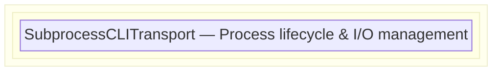
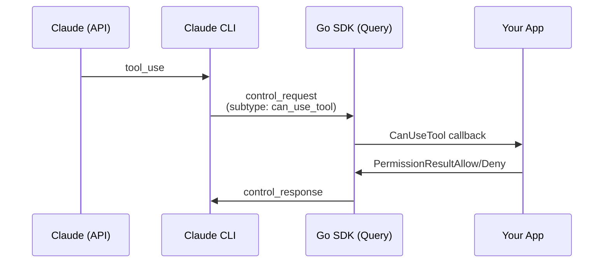

A Go SDK for interacting with Claude Code CLI, mirroring the architecture of the official [Python Claude Agent SDK](https://github.com/anthropics/claude-agent-sdk-python).

## Location

```
backend/claude/sdk/
```

## Architecture



### Layers

| Layer | File | Purpose |
|-------|------|---------|
| **Client** | `client.go` | High-level API: Connect, SendMessage, Interrupt, SetModel |
| **Query** | `query.go` | Control protocol: Initialize, permission callbacks, hooks |
| **Transport** | `transport/subprocess.go` | Subprocess management, stdin/stdout/stderr handling |

## Quick Start

### One-shot Query

```go
import "github.com/xiaoyuanzhu-com/my-life-db/claude/sdk"

messages, errors := sdk.QueryOnce(ctx, "What is 2+2?", sdk.ClaudeAgentOptions{})

for msg := range messages {
    if am, ok := msg.(sdk.AssistantMessage); ok {
        fmt.Println(sdk.GetTextContent(am))
    }
}
```

### Interactive Conversation

```go
client := sdk.NewClaudeSDKClient(sdk.ClaudeAgentOptions{
    AllowedTools: []string{"Read", "Glob", "Grep"},
    Cwd:          "/path/to/project",
})

if err := client.Connect(ctx, "What files are here?"); err != nil {
    log.Fatal(err)
}
defer client.Close()

// Option 1: Typed messages (parsed lazily at client level)
for msg := range client.Messages() {
    switch m := msg.(type) {
    case sdk.AssistantMessage:
        fmt.Println(sdk.GetTextContent(m))
    case sdk.ResultMessage:
        fmt.Printf("Cost: %s\n", sdk.FormatCost(m.TotalCostUSD))
        return
    }
}

// Option 2: Raw messages (for passthrough or custom parsing)
for msg := range client.RawMessages() {
    msgType, _ := msg["type"].(string)
    fmt.Printf("Raw message type: %s\n", msgType)
}
```

## Message Streaming

The SDK provides two levels of message access, aligned with the Python SDK architecture:

### Query Level (Raw)

```go
// Query.Messages() returns raw maps - like Python's dict[str, Any]
func (q *Query) Messages() <-chan map[string]any
```

This is the internal level used by Query. Messages are unmarshaled from JSON into `map[string]any` for efficient passthrough without forcing consumers to use specific types.

### Client Level (Typed + Raw)

```go
// Client.Messages() returns typed Message interface (lazily parsed)
func (c *ClaudeSDKClient) Messages() <-chan Message

// Client.RawMessages() returns raw maps (passthrough to Query)
func (c *ClaudeSDKClient) RawMessages() <-chan map[string]any
```

**When to use each:**

| Method | Returns | Use When |
|--------|---------|----------|
| `client.Messages()` | `<-chan Message` | You want typed access (`AssistantMessage`, `ResultMessage`, etc.) |
| `client.RawMessages()` | `<-chan map[string]any` | You need raw data for WebSocket passthrough or custom parsing |

### Design Rationale

This design mirrors the Python SDK:
- Python: `query.receive_messages() -> dict[str, Any]`, `client.receive_messages() -> Message`
- Go: `query.Messages() -> <-chan map[string]any`, `client.Messages() -> <-chan Message`

**Benefits:**
1. **Lazy parsing** - Types are parsed only when `client.Messages()` is consumed
2. **Efficient passthrough** - Raw messages can be re-marshaled for WebSocket broadcast without double-parsing
3. **App-agnostic SDK** - Applications can choose typed or raw access based on their needs

### Example: WebSocket Passthrough

```go
// In manager.go - forward raw messages to WebSocket clients
msgs := session.sdkClient.RawMessages()
for msg := range msgs {
    // Re-marshal to JSON for WebSocket broadcast
    data, err := json.Marshal(msg)
    if err != nil {
        continue
    }
    session.BroadcastUIMessage(data)
}
```

## Features

### Permission Handling

#### How Tool Permission Flow Works

When Claude wants to use a tool that's not in `AllowedTools`, a permission decision is required. The SDK supports this via the `CanUseTool` callback and the `--permission-prompt-tool` CLI flag.

**The Flow:**



**Key Mechanism: `--permission-prompt-tool stdio`**

When `CanUseTool` callback is provided, the SDK automatically adds `--permission-prompt-tool stdio` to the CLI arguments. This flag tells the CLI to:
1. Send `control_request` messages (type: `can_use_tool`) via stdout instead of prompting interactively
2. Wait for `control_response` messages via stdin with the permission decision

This enables programmatic permission handling in non-interactive environments (web UIs, automated systems, etc.).

#### Basic Permission Callback

```go
client := sdk.NewClaudeSDKClient(sdk.ClaudeAgentOptions{
    CanUseTool: func(tool string, input map[string]any, ctx sdk.ToolPermissionContext) (sdk.PermissionResult, error) {
        // Auto-approve read-only tools
        if tool == "Read" || tool == "Glob" {
            return sdk.PermissionResultAllow{Behavior: sdk.PermissionAllow}, nil
        }

        // Deny dangerous commands
        if tool == "Bash" {
            if cmd, _ := input["command"].(string); strings.Contains(cmd, "rm -rf") {
                return sdk.PermissionResultDeny{
                    Behavior: sdk.PermissionDeny,
                    Message:  "Dangerous command not allowed",
                }, nil
            }
        }

        return sdk.PermissionResultAllow{Behavior: sdk.PermissionAllow}, nil
    },
})
```

#### WebSocket-based Approval (Web UI)

For web applications that need user confirmation via UI, see the implementation in `backend/claude/session.go`:

```go
// CreatePermissionCallback bridges SDK's synchronous callback with async WebSocket flow
func (s *Session) CreatePermissionCallback() sdk.CanUseToolFunc {
    return func(toolName string, input map[string]any, ctx sdk.ToolPermissionContext) (sdk.PermissionResult, error) {
        // 1. Generate unique request ID for tracking
        requestID := fmt.Sprintf("sdk-perm-%d", time.Now().UnixNano())

        // 2. Create channel to receive WebSocket response
        responseChan := make(chan PermissionResponse, 1)
        s.pendingSDKPermissions[requestID] = responseChan

        // 3. Broadcast control_request to WebSocket clients (frontend shows modal)
        controlRequest := map[string]interface{}{
            "type":       "control_request",
            "request_id": requestID,
            "request": map[string]interface{}{
                "subtype":   "can_use_tool",
                "tool_name": toolName,
                "input":     input,
            },
        }
        s.BroadcastUIMessage(json.Marshal(controlRequest))

        // 4. Block until user responds via WebSocket or session closes
        select {
        case resp := <-responseChan:
            if resp.Behavior == "allow" {
                return sdk.PermissionResultAllow{Behavior: sdk.PermissionAllow}, nil
            }
            return sdk.PermissionResultDeny{Behavior: sdk.PermissionDeny, Message: resp.Message}, nil
        case <-s.sdkCtx.Done():
            return sdk.PermissionResultDeny{Message: "Session closed"}, nil
        }
    }
}
```

#### Control Request/Response Format

**Control Request (from CLI):**
```json
{
  "type": "control_request",
  "request_id": "44fea74b-d2ad-4c51-804d-5588b01af756",
  "request": {
    "subtype": "can_use_tool",
    "tool_name": "WebFetch",
    "input": {"url": "https://example.com", "prompt": "..."},
    "tool_use_id": "toolu_01VJkFn7jEpDrMc62HpaWMCh",
    "permission_suggestions": [...]
  }
}
```

**Control Response (to CLI):**
```json
{
  "type": "control_response",
  "response": {
    "request_id": "44fea74b-d2ad-4c51-804d-5588b01af756",
    "subtype": "success",
    "response": {
      "behavior": "allow",
      "updatedInput": {...}
    }
  }
}
```

#### Permission Result Types

| Type | Fields | Description |
|------|--------|-------------|
| `PermissionResultAllow` | `Behavior`, `UpdatedInput`, `UpdatedPermissions` | Allow tool execution, optionally modify input |
| `PermissionResultDeny` | `Behavior`, `Message`, `Interrupt` | Deny with reason, optionally interrupt session |

### Hook System

Intercept and modify tool usage:

```go
hooks := sdk.NewHookManager()

// Log all tool usage
hooks.Register(sdk.HookPreToolUse, "*", func(input sdk.HookInput, toolUseID *string, ctx sdk.HookContext) (sdk.HookOutput, error) {
    if hi, ok := input.(sdk.PreToolUseHookInput); ok {
        log.Printf("[AUDIT] Tool: %s", hi.ToolName)
    }
    return sdk.PreToolUseAllow(), nil
})

// Validate bash commands
hooks.Register(sdk.HookPreToolUse, "Bash", sdk.ValidationHook(func(tool string, input map[string]any) (bool, string) {
    cmd, _ := input["command"].(string)
    if strings.Contains(cmd, "sudo") {
        return false, "sudo not allowed"
    }
    return true, ""
}))

client := sdk.NewClaudeSDKClient(sdk.ClaudeAgentOptions{
    Hooks: hooks.ToOptionsMap(),
})
```

#### Pre-built Hook Helpers

| Helper | Purpose |
|--------|---------|
| `PreToolUseAllow()` | Allow tool execution |
| `PreToolUseDeny(reason)` | Deny with reason |
| `PreToolUseModify(input)` | Allow with modified input |
| `ValidationHook(fn)` | Create validation hook |
| `LoggingHook(fn)` | Create logging hook |
| `DenyToolsHook(tools...)` | Deny specific tools |
| `AllowToolsHook(tools...)` | Only allow specific tools |

### Control Protocol

Mid-session control:

```go
// Interrupt current operation
client.Interrupt()

// Change permission mode
client.SetPermissionMode(sdk.PermissionModeAcceptEdits)

// Switch model
client.SetModel("claude-opus-4-5")

// Rewind files (requires EnableFileCheckpointing)
client.RewindFiles(userMessageID)
```

## Message Types

| Type | Description |
|------|-------------|
| `UserMessage` | User input |
| `AssistantMessage` | Claude's response with content blocks |
| `SystemMessage` | Internal system events |
| `ResultMessage` | Final result with cost/usage |
| `StreamEvent` | Partial updates during streaming |

### Content Blocks

| Block | Description |
|-------|-------------|
| `TextBlock` | Plain text |
| `ThinkingBlock` | Claude's reasoning |
| `ToolUseBlock` | Tool invocation |
| `ToolResultBlock` | Tool execution result |

### Helper Functions

```go
// Extract text from assistant message
text := sdk.GetTextContent(assistantMsg)

// Get all tool uses
tools := sdk.GetToolUses(assistantMsg)

// Check if result
if sdk.IsResultMessage(msg) { ... }

// Format cost
cost := sdk.FormatCost(resultMsg.TotalCostUSD) // "$0.0234"

// Parse raw map to typed Message (used internally by client.Messages())
msg, err := sdk.ParseMessageFromMap(rawMap)

// Parse JSON bytes to typed Message
msg, err := sdk.ParseMessage(jsonBytes)
```

## Configuration Options

```go
sdk.ClaudeAgentOptions{
    // Tools
    Tools:           []string{"Read", "Write"},  // Specific tools
    AllowedTools:    []string{"Read"},           // Auto-approved
    DisallowedTools: []string{"Bash(rm:*)"},     // Blocked

    // Permissions
    PermissionMode: sdk.PermissionModeDefault,   // default, acceptEdits, bypassPermissions
    CanUseTool:     permissionCallback,          // Custom callback

    // Session
    Resume:               "session-id",          // Resume existing session
    ContinueConversation: true,                  // Continue last conversation

    // Model
    Model:         "claude-sonnet-4-5",
    FallbackModel: "claude-haiku-3-5",
    MaxTurns:      &maxTurns,

    // Paths
    Cwd:     "/working/directory",
    CliPath: "/custom/path/to/claude",
    AddDirs: []string{"/additional/dir"},

    // Advanced
    SystemPrompt:            "Custom system prompt",
    Hooks:                   hooks.ToOptionsMap(),
    EnableFileCheckpointing: true,
    IncludePartialMessages:  true,
    Env:                     map[string]string{"KEY": "value"},
    ExtraArgs:               map[string]*string{"flag": nil},
}
```

## Files

```
backend/claude/sdk/
├── client.go           # ClaudeSDKClient, QueryOnce, Messages(), RawMessages()
├── query.go            # Query (control protocol, Messages() -> map[string]any)
├── types.go            # All type definitions
├── errors.go           # Error types
├── message_parser.go   # ParseMessage(), ParseMessageFromMap()
├── hooks.go            # Hook system
├── doc.go              # Package documentation
├── example_test.go     # Usage examples
└── transport/
    ├── transport.go    # Transport interface
    ├── options.go      # TransportOptions
    └── subprocess.go   # SubprocessCLITransport
```

## Comparison with Python SDK

This Go SDK mirrors the Python SDK's design:

| Python | Go | Description |
|--------|-----|-------------|
| `ClaudeSDKClient` | `ClaudeSDKClient` | High-level client |
| `query()` | `QueryOnce()` | One-shot query function |
| `SubprocessCLITransport` | `SubprocessCLITransport` | Process management |
| `Query` | `Query` | Control protocol handler |
| `parse_message()` | `ParseMessage()` | JSON to typed Message |
| `HookMatcher` | `HookMatcher` | Hook pattern matching |
| `CanUseTool` callback | `CanUseToolFunc` | Permission callback |
| `query.receive_messages() -> dict[str, Any]` | `query.Messages() -> <-chan map[string]any` | Raw messages at query level |
| `client.receive_messages() -> Message` | `client.Messages() -> <-chan Message` | Typed messages at client level |
| N/A | `client.RawMessages() -> <-chan map[string]any` | Raw passthrough at client level |

## Integration Notes

This SDK is independent of the existing `backend/claude/` code (manager.go, session.go, etc.). It can be used alongside or as a replacement for the current implementation.

To integrate:
1. Import `"github.com/xiaoyuanzhu-com/my-life-db/claude/sdk"`
2. Use `sdk.NewClaudeSDKClient()` or `sdk.QueryOnce()`
3. Choose your message consumption pattern:
   - `client.Messages()` for typed access with auto-parsing
   - `client.RawMessages()` for raw `map[string]any` (useful for WebSocket passthrough)

### WebSocket Integration Pattern

For applications that forward messages to WebSocket clients (like this project's manager.go):

```go
// Use RawMessages() for efficient passthrough
msgs := session.sdkClient.RawMessages()
for msg := range msgs {
    data, _ := json.Marshal(msg)
    session.BroadcastUIMessage(data)
}
```

This avoids the overhead of parsing to typed `Message` and then back to JSON.

## AllowedTools vs CanUseTool

Understanding how these work together:

| Tool Status | What Happens |
|-------------|--------------|
| In `AllowedTools` | Auto-approved, no permission callback invoked |
| Not in `AllowedTools`, `CanUseTool` set | Permission callback invoked for approval |
| Not in `AllowedTools`, no callback | CLI's default behavior (may prompt or deny) |
| In `DisallowedTools` | Blocked entirely, tool not available to Claude |

**Example Configuration:**

```go
options := sdk.ClaudeAgentOptions{
    // These tools are auto-approved (no callback)
    AllowedTools: []string{"Read", "Glob", "Grep", "TodoWrite"},

    // These tools require user approval via callback
    // (WebFetch, Write, Edit, Bash, etc. will trigger CanUseTool)
    CanUseTool: myPermissionCallback,

    // These are completely blocked
    DisallowedTools: []string{"Bash(rm -rf:*)", "Bash(sudo:*)"},

    PermissionMode: sdk.PermissionModeDefault,
}
```

## Known Issues

### Duplicate tool_use IDs Error (Claude CLI 2.1.19)

When using `--output-format stream-json` with `--permission-prompt-tool stdio`, a bug in Claude CLI can cause:

```
API Error: 400 {"type":"error","error":{"type":"invalid_request_error",
"message":"messages.1.content.1: `tool_use` ids must be unique"}}
```

**Symptoms:**
- Tool executes successfully and returns results
- Error occurs when CLI tries to continue the conversation
- Happens with both client-side tools (WebFetch) and server-side tools (WebSearch)

**Root Cause:**
- Bug in Claude CLI's conversation state management in streaming JSON mode
- CLI creates duplicate tool_use IDs when constructing the next API request
- This is NOT a bug in this SDK - the SDK doesn't construct API messages

**Status:** Reported to Anthropic. Affects Claude CLI version 2.1.19.

**Workaround:** None currently. The permission approval flow works correctly; the error is downstream in the CLI.
