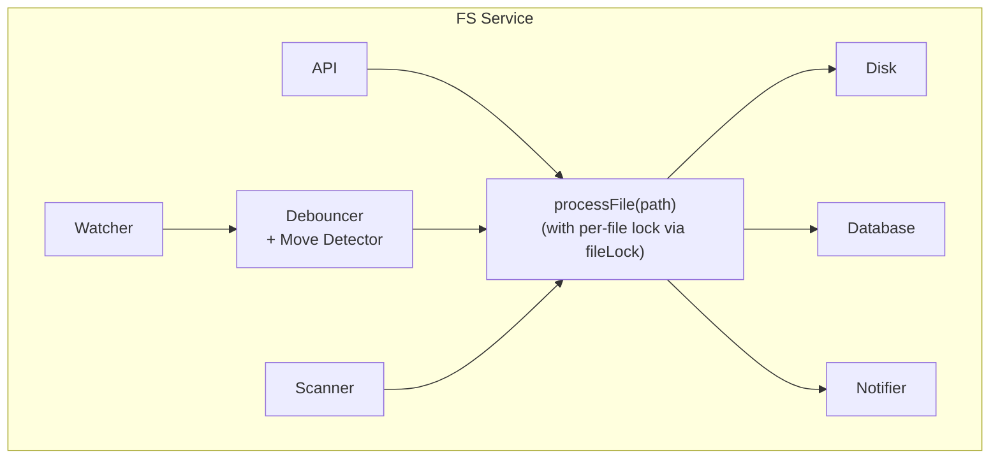

**Date:** 2026-01-31
**Status:** Implementation Complete (Phase 7 testing remaining)

---

## Problem Statement

The current FS service has bugs that cause:
1. **Race conditions**: Multiple goroutines processing the same file
2. **Orphaned records**: DB records for files that no longer exist (after moves)
3. **Stale data**: Scanner overwrites newer API data

These issues are more visible now with AI agents (Claude Code) rapidly creating/modifying/moving files.

---

## Goals

Keep it simple:

1. **No duplicate processing** - One file, one processor at a time
2. **No orphaned records** - Moves/renames clean up old paths
3. **Latest data wins** - Don't overwrite new data with old
4. **Full consistency** - DB always matches filesystem state

### Consistency Model

The system must reach consistency in **two scenarios**:

| Scenario | Mechanism | Goal |
|----------|-----------|------|
| **Runtime changes** | Watcher + debouncer | Immediate detection, no orphans |
| **Offline changes** | Scanner reconciliation | Sync on startup, remove orphans |

**Runtime** (server running): Files created/modified/deleted/moved while server is running are detected via fsnotify watcher, debounced, and processed. Move detection correlates RENAME+CREATE events.

**Offline** (server stopped, restarted): Files changed while server was stopped (user ran `mv`, `rm`, etc.) are detected by scanner on startup. Scanner compares DB to disk and:
- Upserts files found on disk (new or modified)
- **Deletes orphaned DB records** (files in DB but not on disk)

This ensures the DB is eventually consistent with the filesystem regardless of when changes occur.

Non-goals (keep current behavior):
- We don't need sub-100ms latency
- We don't need complex editor pattern detection
- We don't need metrics/observability (can add later)

---

## Implementation Status

**Good news**: Most of the v2 design is already implemented! Review of current codebase:

| Component | Status | Notes |
|-----------|--------|-------|
| `debouncer.go` | ✅ Implemented | 150ms delay, coalesces rapid events |
| `move_detector.go` | ✅ Implemented | Correlates RENAME+CREATE, handles same-name matching |
| `watcher.go` | ✅ Implemented | Uses debouncer, handles RENAME as delete, move detection |
| `db/files.go` UpsertFile | ✅ Implemented | Uses `COALESCE(NULLIF(excluded.hash, ''), files.hash)` |
| `db/files.go` MoveFileAtomic | ✅ Implemented | Transaction with files + digests + pins |
| `scanner.go` processFile | ✅ Implemented | Uses mutex (`acquireFileLock`) for coordination |
| `scanner.go` reconciliation | ✅ Implemented | Two-phase scan with orphan deletion |

### What's Missing: Scanner Reconciliation

The scanner currently only **upserts** files found on disk. It does NOT detect and remove files that exist in DB but not on disk (orphans from offline deletes/moves).

**Example of the gap**:
```
Before server shutdown:
  DB: inbox/doc.md, notes/readme.md
  Disk: inbox/doc.md, notes/readme.md

While server stopped:
  User runs: rm inbox/doc.md
  User runs: mv notes/readme.md archive/readme.md

On startup, current scanner:
  Walks disk: finds archive/readme.md
  Upserts: archive/readme.md ✅

  BUT: inbox/doc.md still in DB (orphan) ❌
  BUT: notes/readme.md still in DB (orphan) ❌
```

**Solution**: Add reconciliation phase to scanner (see Solution section below).

---

## Current Bugs (Historical)

### Bug 1: `unmarkProcessing` runs too early

```go
// WRONG - defer runs when handleCreate returns, not when goroutine finishes
func (w *watcher) handleCreate(path string) {
    if !w.service.fileLock.markProcessing(path) { return }
    defer w.service.fileLock.unmarkProcessing(path)  // ← runs immediately!

    go func() {
        w.processExternalFile(path)  // ← still running
    }()
}
```

**Fix**: Move `unmarkProcessing` inside the goroutine.

### Bug 2: RENAME events ignored

```go
// WRONG - only handles Remove, not Rename
if err != nil {
    if event.Op&fsnotify.Remove != 0 {
        w.handleDelete(relPath)
    }
    return  // ← Rename dropped silently
}
```

**Fix**: Handle RENAME as delete of old path.

### Bug 3: Scanner overwrites newer data

```sql
-- WRONG - always overwrites hash
ON CONFLICT(path) DO UPDATE SET hash = excluded.hash
```

**Fix**: Only update if hash is empty or we have newer data.

### Bug 4: No debouncing

Every fsnotify event triggers full processing. Rapid saves = duplicate work.

**Fix**: Simple debounce with 100-200ms delay.

---

## Scenarios We Must Handle

### Basic (already works, keep working)
- File created via API → DB record created
- File created externally → detected, DB record created
- File modified → hash updated
- File deleted → DB record removed

### Currently Broken (must fix)

#### Rapid writes to same file
```
T0:   Write V1
T50:  Write V2
T100: Write V3
```
**Current**: May process V1, V2, V3 separately (wasted work, possible races)
**Expected**: Process once with V3 content

#### Write then move
```
T0:   Create "inbox/doc.md"
T50:  Move to "notes/doc.md"
```
**Current**: "inbox/doc.md" orphaned in DB
**Expected**: Only "notes/doc.md" in DB

#### External move/rename
```
T0: mv inbox/doc.md notes/doc.md
```
**Current**: RENAME event ignored, old record stays
**Expected**: Old record deleted, new record created

#### Scanner vs API race
```
T0:   Scanner reads file (content V1)
T50:  API writes V2, updates DB with H2
T100: Scanner finishes, writes H1 to DB
```
**Current**: DB has stale H1
**Expected**: DB keeps H2 (newer)

---

## Solution

### 1. Fix the defer bug (simple)

```go
func (w *watcher) handleCreate(path string) {
    if !w.service.fileLock.markProcessing(path) { return }
    // NO defer here

    go func() {
        defer w.service.fileLock.unmarkProcessing(path)  // ← correct place
        w.processExternalFile(path)
    }()
}
```

### 2. Handle RENAME events (simple)

```go
func (w *watcher) handleEvent(event fsnotify.Event) {
    // ...
    if err != nil {
        // File doesn't exist at this path anymore
        if event.Op&(fsnotify.Remove|fsnotify.Rename) != 0 {
            w.handleDelete(relPath)
        }
        return
    }
    // ...
}
```

### 3. Add simple debouncing

Instead of processing immediately, queue events and wait for them to settle.

```go
type debouncer struct {
    pending   map[string]*pendingEvent
    mu        sync.Mutex
    delay     time.Duration  // 150ms default
}

type pendingEvent struct {
    path      string
    timer     *time.Timer
    eventType EventType  // CREATE, WRITE, DELETE
}

func (d *debouncer) Queue(path string, eventType EventType) {
    d.mu.Lock()
    defer d.mu.Unlock()

    if eventType == EventDelete {
        // Delete is immediate - cancel pending and process now
        if p, ok := d.pending[path]; ok {
            p.timer.Stop()
            delete(d.pending, path)
        }
        d.processNow(path, EventDelete)
        return
    }

    if p, ok := d.pending[path]; ok {
        // Already pending - reset timer
        p.timer.Reset(d.delay)
        return
    }

    // New pending event
    timer := time.AfterFunc(d.delay, func() {
        d.onTimer(path)
    })
    d.pending[path] = &pendingEvent{
        path:      path,
        timer:     timer,
        eventType: eventType,
    }
}

func (d *debouncer) onTimer(path string) {
    d.mu.Lock()
    p, ok := d.pending[path]
    if ok {
        delete(d.pending, path)
    }
    d.mu.Unlock()

    if ok {
        d.processNow(path, p.eventType)
    }
}
```

### 4. Detect moves (RENAME + CREATE pattern)

When we see RENAME for path A, remember it briefly. If CREATE for path B comes within 500ms with same filename, treat as move.

```go
type moveDetector struct {
    recentRenames map[string]time.Time  // path → when renamed
    mu            sync.Mutex
    ttl           time.Duration  // 500ms
}

func (m *moveDetector) TrackRename(oldPath string) {
    m.mu.Lock()
    defer m.mu.Unlock()
    m.recentRenames[oldPath] = time.Now()
}

func (m *moveDetector) CheckMove(newPath string) (oldPath string, isMove bool) {
    m.mu.Lock()
    defer m.mu.Unlock()

    newName := filepath.Base(newPath)
    now := time.Now()

    for old, ts := range m.recentRenames {
        if now.Sub(ts) > m.ttl {
            delete(m.recentRenames, old)
            continue
        }
        if filepath.Base(old) == newName {
            delete(m.recentRenames, old)
            return old, true
        }
    }
    return "", false
}
```

### 5. Smarter DB upsert

Don't overwrite hash if existing hash is non-empty and different (means someone else updated).

```go
func UpsertFile(f *FileRecord) (isNew bool, err error) {
    // Check existing
    var existingHash sql.NullString
    err = db.QueryRow("SELECT hash FROM files WHERE path = ?", f.Path).Scan(&existingHash)
    isNew = (err == sql.ErrNoRows)

    if !isNew && existingHash.Valid && existingHash.String != "" {
        // Existing record has hash - only update if we also have hash
        if f.Hash == nil || *f.Hash == "" {
            // We don't have hash, don't overwrite
            return false, nil
        }
    }

    // Proceed with upsert
    _, err = db.Exec(`
        INSERT INTO files (...) VALUES (...)
        ON CONFLICT(path) DO UPDATE SET
            hash = COALESCE(NULLIF(excluded.hash, ''), files.hash),
            text_preview = COALESCE(excluded.text_preview, files.text_preview),
            ...
    `, ...)

    return isNew, err
}
```

### 6. Process moves atomically

When move detected:
1. Compute metadata for new path
2. In single transaction: insert new record, delete old record, update related tables

```go
func (s *Service) processMove(oldPath, newPath string) error {
    // 1. Compute metadata for file at new location
    metadata, _ := s.processor.ComputeMetadata(ctx, newPath)

    // 2. Get file info
    info, err := os.Stat(filepath.Join(s.dataRoot, newPath))
    if err != nil {
        return err
    }

    // 3. Atomic DB update
    return s.db.MoveFile(oldPath, newPath, s.buildFileRecord(newPath, info, metadata))
}

// In db package
func MoveFile(oldPath, newPath string, newRecord *FileRecord) error {
    tx, _ := db.Begin()
    defer tx.Rollback()

    // Insert/update new path
    tx.Exec(`INSERT INTO files (...) VALUES (...) ON CONFLICT ...`, newRecord)

    // Delete old path
    tx.Exec(`DELETE FROM files WHERE path = ?`, oldPath)

    // Update related tables
    tx.Exec(`UPDATE digests SET file_path = ? WHERE file_path = ?`, newPath, oldPath)
    tx.Exec(`UPDATE pins SET path = ? WHERE path = ?`, newPath, oldPath)

    return tx.Commit()
}
```

**Status**: ✅ Already implemented in `db/files.go` as `MoveFileAtomic()`.

### 7. Scanner reconciliation (detect offline deletes)

The scanner must detect files that exist in DB but not on disk (orphans from offline operations).

**Two-phase scan**:

```go
func (s *scanner) scan() {
    // Phase 1: Walk filesystem, collect paths, upsert files
    seenPaths := make(map[string]bool)

    filepath.Walk(s.service.cfg.DataRoot, func(path string, info os.FileInfo, err error) error {
        if info.IsDir() || s.service.validator.IsExcluded(relPath) {
            return nil
        }

        seenPaths[relPath] = true

        // Existing logic: check if needs processing, upsert if so
        if needsProcessing, _ := s.checkNeedsProcessing(relPath, info); needsProcessing {
            s.processFile(...)
        }
        return nil
    })

    // Phase 2: Remove orphaned DB records
    s.reconcileOrphans(seenPaths)
}

func (s *scanner) reconcileOrphans(seenPaths map[string]bool) {
    // Query all file paths from DB
    rows, _ := s.service.cfg.DB.ListAllFilePaths()
    defer rows.Close()

    var orphans []string
    for rows.Next() {
        var dbPath string
        rows.Scan(&dbPath)

        if !seenPaths[dbPath] {
            orphans = append(orphans, dbPath)
        }
    }

    // Delete orphans
    for _, path := range orphans {
        log.Info().Str("path", path).Msg("removing orphaned DB record")
        s.service.cfg.DB.DeleteFile(path)
        // Note: DeleteFile should cascade to digests, pins via FK or manual cleanup
    }

    if len(orphans) > 0 {
        log.Info().Int("count", len(orphans)).Msg("reconciliation complete")
    }
}
```

**DB helper needed** (add to `db/files.go`):

```go
// ListAllFilePaths returns all file paths in the database (for reconciliation)
func ListAllFilePaths() (*sql.Rows, error) {
    return GetDB().Query("SELECT path FROM files WHERE is_folder = 0")
}
```

**Cascade cleanup**: When deleting a file, also clean up related records:

```go
func DeleteFileWithCascade(path string) error {
    tx, _ := GetDB().Begin()
    defer tx.Rollback()

    // Delete digests
    tx.Exec("DELETE FROM digests WHERE file_path = ?", path)

    // Delete pins
    tx.Exec("DELETE FROM pins WHERE path = ?", path)

    // Delete file record
    tx.Exec("DELETE FROM files WHERE path = ?", path)

    return tx.Commit()
}
```

**Status**: ✅ Implemented in `db/files.go` and `scanner.go`.

---

## Data Flow Analysis: File Operations → Search Indices

### The Problem: Multiple Code Paths

Currently, file operations are handled by **multiple independent code paths** that don't consistently update all related tables:

| Code Path | Location | When Used |
|-----------|----------|-----------|
| **API Write** | `fs/operations.go:writeFile()` | HTTP PUT /raw/* |
| **API Delete** | `api/files.go:DeleteLibraryFile()` | HTTP DELETE /api/library/file |
| **API Rename** | `api/files.go:RenameLibraryFile()` | HTTP POST /api/library/rename |
| **API Move** | `api/files.go:MoveLibraryFile()` | HTTP POST /api/library/move |
| **Watcher Create** | `fs/watcher.go:handleCreate()` | fsnotify CREATE event |
| **Watcher Delete** | `fs/watcher.go:handleDelete()` | fsnotify REMOVE/RENAME event |
| **Watcher Move** | `fs/watcher.go:processMove()` | Detected RENAME+CREATE |
| **Scanner Create** | `fs/scanner.go:processFile()` | New file found on disk |
| **Scanner Update** | `fs/scanner.go:processFile()` | Modified file found |
| **Scanner Reconcile** | `fs/scanner.go:reconcileOrphans()` | DB record, no file on disk |

### Complete Data Flow Matrix

This matrix shows exactly which tables are updated by each operation:

| Operation | files | digests | pins | meili_documents | qdrant_documents | Notes |
|-----------|:-----:|:-------:|:----:|:---------------:|:----------------:|-------|
| **CREATE (API)** | ✅ Upsert | - | - | - | - | Hash computed, notifies digest worker |
| **CREATE (Watcher)** | ✅ Upsert | - | - | - | - | Via `processExternalFile()` |
| **CREATE (Scanner)** | ✅ Upsert | - | - | - | - | Via `processFile()` |
| **UPDATE (API)** | ✅ Upsert | - | - | - | - | Notifies digest worker if hash changed |
| **UPDATE (Watcher)** | ✅ Upsert | - | - | - | - | Via `handleWrite()` |
| **UPDATE (Scanner)** | ✅ Upsert | - | - | - | - | If mtime changed |
| **DELETE (API)** | ✅ Delete | ✅ Delete | ✅ Delete | ✅ Delete | ✅ Delete | Uses `DeleteFileWithCascade` |
| **DELETE (Watcher)** | ✅ Delete | ✅ Delete | ✅ Delete | ✅ Delete | ✅ Delete | Uses `DeleteFileWithCascade` |
| **DELETE (Scanner)** | ✅ Delete | ✅ Delete | ✅ Delete | ✅ Delete | ✅ Delete | Uses `DeleteFileWithCascade` |
| **MOVE (Watcher)** | ✅ Atomic | ✅ Update | ✅ Update | ✅ Update | ✅ Update | Uses `MoveFileAtomic` |
| **RENAME (API)** | ✅ Update | ✅ Update | ✅ Update | ✅ Update | ✅ Update | Uses `RenameFilePath(s)` |
| **MOVE (API)** | ✅ Update | ✅ Update | ✅ Update | ✅ Update | ✅ Update | Uses `RenameFilePath(s)` |

**Note**: Search index documents (`meili_documents`, `qdrant_documents`) are only created by the digest worker when processing files. The cascade operations above ensure they're properly updated/deleted when files move or are deleted.

### Issues Identified (All Fixed)

#### ~~Issue 1: Search Indices Never Updated on Delete/Move~~ ✅ FIXED

~~When files are deleted or moved, `meili_documents` and `qdrant_documents` tables are NOT updated.~~

**Solution**: All cascade functions now update meili/qdrant:
- `DeleteFileWithCascade()` - deletes from all tables
- `MoveFileAtomic()` - updates file_path in all tables
- `RenameFilePath(s)` - updates file_path in all tables

#### ~~Issue 2: Watcher Delete Doesn't Cascade~~ ✅ FIXED

~~`watcher.go:handleDelete()` only calls `DeleteFile(path)`.~~

**Solution**: Updated to use `DeleteFileWithCascade(path)`.

#### Issue 3: Multiple Code Paths for Same Operation (Future Work)

Move/rename operations have different implementations:
1. **Watcher**: Uses `MoveFileAtomic()` (transaction-safe)
2. **API**: Uses `RenameFilePath()` / `RenameFilePaths()` (now also transaction-safe)

Both are now consistent in what tables they update, but centralized FileOps would reduce code duplication.

### Solution: Centralized File Operations via fs.Service

Instead of creating a separate `fileops` package, use the existing `fs.Service` as the central coordinator. It already:
- Is owned by `server.Server` (proper lifecycle management)
- Has DB access, file locks, notifications
- Coordinates watcher, scanner, and API
- Is stateful (tracks locks, goroutines)

**New methods on `fs.Service`:**

```go
// fs/service.go - extend existing Service

// DeleteFile removes a file from disk and ALL related DB records.
// This is the SINGLE entry point for file deletion.
// Called by: API handlers, watcher, scanner reconcile
func (s *Service) DeleteFile(ctx context.Context, path string) error {
    // 1. Acquire file lock
    mu := s.fileLock.acquireFileLock(path)
    mu.Lock()
    defer mu.Unlock()

    // 2. Delete from filesystem (if exists)
    fullPath := filepath.Join(s.cfg.DataRoot, path)
    if err := os.Remove(fullPath); err != nil && !os.IsNotExist(err) {
        return fmt.Errorf("failed to delete file: %w", err)
    }

    // 3. Cascade delete from DB (files, digests, pins, meili, qdrant)
    if err := s.cfg.DB.DeleteFileWithCascade(path); err != nil {
        return fmt.Errorf("failed to delete from database: %w", err)
    }

    // 4. Cleanup
    s.fileLock.releaseFileLock(path)
    return nil
}

// MoveFile moves a file and updates ALL related DB records atomically.
// This is the SINGLE entry point for file moves/renames.
// Called by: API handlers, watcher move detection
func (s *Service) MoveFile(ctx context.Context, oldPath, newPath string) error {
    // 1. Acquire locks for both paths (ordered to prevent deadlocks)
    locks := s.acquireMultipleLocks(oldPath, newPath)
    defer s.releaseMultipleLocks(locks)

    // 2. Move on filesystem
    oldFullPath := filepath.Join(s.cfg.DataRoot, oldPath)
    newFullPath := filepath.Join(s.cfg.DataRoot, newPath)

    if err := os.MkdirAll(filepath.Dir(newFullPath), 0755); err != nil {
        return fmt.Errorf("failed to create parent directory: %w", err)
    }

    if err := os.Rename(oldFullPath, newFullPath); err != nil {
        return fmt.Errorf("failed to move file: %w", err)
    }

    // 3. Get file info and compute metadata
    info, err := os.Stat(newFullPath)
    if err != nil {
        return fmt.Errorf("failed to stat moved file: %w", err)
    }

    metadata, _ := s.processor.ComputeMetadata(ctx, newPath)
    record := s.buildFileRecord(newPath, info, metadata)

    // 4. Atomic DB update (files, digests, pins, meili, qdrant)
    if err := s.cfg.DB.MoveFileAtomic(oldPath, newPath, record); err != nil {
        return fmt.Errorf("failed to update database: %w", err)
    }

    // 5. Notify (optional - for move, content didn't change)
    s.notifyFileChange(FileChangeEvent{
        FilePath:       newPath,
        IsNew:          false,
        ContentChanged: false,
        Trigger:        "move",
    })

    return nil
}
```

### Updated Code Paths (After Centralization)

All code paths use `fs.Service` methods:

| Code Path | Operation | Calls |
|-----------|-----------|-------|
| API DELETE /api/library/file | Delete | `fs.DeleteFile()` |
| API POST /api/library/rename | Move | `fs.MoveFile()` |
| API POST /api/library/move | Move | `fs.MoveFile()` |
| Watcher handleDelete() | Delete | `fs.DeleteFile()` |
| Watcher processMove() | Move | `fs.MoveFile()` |
| Scanner reconcileOrphans() | Delete | `fs.DeleteFile()` |

**Benefits:**
- Single entry point for each operation type
- Consistent locking across all callers
- Consistent cascade behavior
- Proper error handling and logging
- Easy to add metrics/observability later

### Migration Plan

**~~Phase 1: Fix Cascade Operations~~ ✅ DONE**
1. ~~Update `DeleteFileWithCascade()` to include meili/qdrant~~
2. ~~Update `MoveFileAtomic()` to include meili/qdrant~~
3. ~~Update `RenameFilePath(s)` to include meili/qdrant~~
4. ~~Update watcher delete to use cascade~~

**Phase 2: Centralize via fs.Service**
1. Add `DeleteFile()` method to `fs.Service`
2. Add `MoveFile()` method to `fs.Service`
3. Update API handlers to call `fs.Service` methods
4. Update watcher to call `fs.Service` methods
5. Update scanner reconcile to call `fs.Service` methods
6. Remove duplicate logic from callers

---

## Architecture

Keep it simple - minimal new abstractions:



Key points:
- **Debouncer** sits between watcher and processing (not API - API is synchronous)
- **Move detector** is part of debouncer
- **fileLock** remains the single source of truth for per-file locking
- **Scanner** goes through same `processFile()` path
- No new "coordinator" abstraction - just fix existing code

---

## Changes Summary

| Component | Change | Status |
|-----------|--------|--------|
| `watcher.go` | Fix defer placement | ✅ Done |
| `watcher.go` | Handle RENAME events | ✅ Done |
| `watcher.go` | Add debouncer | ✅ Done |
| `watcher.go` | Add move detection | ✅ Done |
| `watcher.go` | Use cascade delete | ✅ Done |
| `operations.go` | No changes needed | ✅ N/A |
| `scanner.go` | Use mutex for coordination | ✅ Done |
| `scanner.go` | Add reconciliation phase | ✅ Done |
| `db/files.go` | Smarter upsert (COALESCE) | ✅ Done |
| `db/files.go` | Add MoveFileAtomic | ✅ Done |
| `db/files.go` | Add ListAllFilePaths | ✅ Done |
| `db/files.go` | Add DeleteFileWithCascade | ✅ Done |
| `db/files.go` | Cascade to meili/qdrant | ✅ Done |
| `db/files.go` | MoveFileAtomic meili/qdrant | ✅ Done |
| `db/files.go` | RenameFilePath(s) meili/qdrant | ✅ Done |
| `api/files.go` | Use cascade delete | ✅ Done |

---

## Implementation Plan

### ~~Phase 1: Fix critical bugs~~ ✅ DONE
1. ~~Fix defer placement in handleCreate/handleWrite~~
2. ~~Handle RENAME events as delete~~
3. ~~Update DB upsert to use COALESCE~~

### ~~Phase 2: Add debouncing~~ ✅ DONE
1. ~~Add simple debouncer struct~~
2. ~~Wire watcher to use debouncer~~
3. ~~Test with rapid file changes~~

### ~~Phase 3: Add move detection~~ ✅ DONE
1. ~~Add move detector~~
2. ~~Wire into watcher~~
3. ~~Add MoveFileAtomic DB transaction~~

### ~~Phase 4: Scanner reconciliation~~ ✅ DONE
1. ~~Add `ListAllFilePaths()` to `db/files.go`~~
2. ~~Add `DeleteFileWithCascade()` to `db/files.go`~~
3. ~~Modify `scanner.scan()` to track seen paths~~
4. ~~Add `reconcileOrphans()` after walk completes~~
5. ~~Test with offline delete/move scenarios~~

### ~~Phase 5: Search Index Cascade~~ ✅ DONE
1. ~~Update `DeleteFileWithCascade()` to delete from meili_documents, qdrant_documents~~
2. ~~Update `MoveFileAtomic()` to update file_path in meili_documents, qdrant_documents~~
3. ~~Update `RenameFilePath()` / `RenameFilePaths()` similarly~~
4. ~~Update `watcher.go:handleDelete()` to use `DeleteFileWithCascade()`~~
5. ~~Update `api/files.go:DeleteLibraryFile()` to use `DeleteFileWithCascade()`~~

### ~~Phase 6: Centralize via fs.Service~~ ✅ DONE
1. ~~Add `DeleteFile()` method to `fs.Service`~~ (already exists as `deleteFile()` in operations.go)
2. ~~Add `MoveFile()` method to `fs.Service`~~ (already exists as `moveFile()` in operations.go)
3. ~~Update API handlers to call `fs.Service` methods~~ (`api/files.go:DeleteLibraryFile` now uses `fs.Service.DeleteFile()`)
4. ~~Update operations.go to use cascade operations~~ (`deleteFile` uses `DeleteFileWithCascade`, `moveFile` uses `MoveFileAtomic`)
5. ~~Watcher already calls fs.Service internal methods~~
6. ~~Scanner reconcile uses `DeleteFileWithCascade`~~

### Phase 7: Test & polish
1. Manual testing with offline scenarios
2. Verify search index cleanup on delete/move
3. Add automated tests for cascade operations

**Estimated time**: 0.5 day

**Total remaining**: ~0.5 day

---

## What We're NOT Doing

- ❌ Complex "coordinator" abstraction
- ❌ Version numbers / optimistic locking
- ❌ Worker pools
- ❌ Metrics / observability
- ❌ Feature flags for gradual rollout
- ❌ Editor-specific pattern detection (vim, vscode)
- ❌ Folder move handling (can add later if needed)

We can add these later if needed. For now, fix the bugs simply.

---

## Testing

### Manual tests to verify:

**Runtime scenarios** (server running):
1. **Rapid writes**: Create file, modify 5x rapidly → single hash in DB
2. **Move detection**: `mv inbox/a.md notes/a.md` → only notes/a.md in DB
3. **Scanner doesn't overwrite**: API write during scan → API hash preserved
4. **No duplicate processing**: Check logs for single "processing" per file

**Offline scenarios** (server stopped, changes made, server restarted):
5. **Offline delete**: Delete file while stopped → restart → orphan removed from DB
6. **Offline move**: Move file while stopped → restart → old path removed, new path added
7. **Offline create**: Create file while stopped → restart → new file in DB
8. **Mixed offline ops**: Multiple deletes + moves + creates → restart → DB matches disk

### Automated tests:

**Existing** (runtime):
- `TestDebouncer_CoalescesRapidWrites`
- `TestMoveDetector_SameFilename`
- `TestUpsert_PreservesNewerHash`
- `TestWatcher_RenameDeletesOldRecord`

**New** (reconciliation):
- `TestScanner_RemovesOrphanedRecords`
- `TestScanner_PreservesValidRecords`
- `TestScanner_HandlesOfflineMove`
- `TestDeleteFileWithCascade_RemovesDigestsAndPins`

---

## Appendix: Detailed Scenarios

### Scenario: Rapid Write → Write → Move

```
T0:    Agent creates "inbox/doc.md" (V1)
       └─ fsnotify CREATE
       └─ Debouncer: queue "inbox/doc.md", start 150ms timer

T30:   Agent modifies "inbox/doc.md" (V2)
       └─ fsnotify WRITE
       └─ Debouncer: reset timer to 150ms

T60:   Agent moves to "notes/doc.md"
       └─ fsnotify RENAME "inbox/doc.md"
       └─ Debouncer:
          ├─ Cancel pending for "inbox/doc.md"
          └─ moveDetector.TrackRename("inbox/doc.md")
       └─ fsnotify CREATE "notes/doc.md"
       └─ Debouncer:
          ├─ moveDetector.CheckMove("notes/doc.md") → "inbox/doc.md"
          └─ Process as MOVE immediately

T60+:  processMove("inbox/doc.md", "notes/doc.md"):
       ├─ ComputeMetadata("notes/doc.md") → hash of V2
       └─ DB transaction:
          ├─ INSERT "notes/doc.md" with hash
          └─ DELETE "inbox/doc.md"

Result: Only "notes/doc.md" in DB, no orphans
```

### Scenario: Scanner vs API Race

```
T0:    Scanner starts scan, finds "doc.md"
       └─ markProcessing("doc.md") → true
       └─ ComputeMetadata starts (slow, reading V1)

T50:   API WriteFile("doc.md", V2) called
       └─ Acquire fileLock
       └─ Write V2 to disk
       └─ ComputeMetadata → H2
       └─ UpsertFile with H2
       └─ Release fileLock

T100:  Scanner finishes ComputeMetadata → H1
       └─ UpsertFile with H1
       └─ DB has H2 already (non-empty)
       └─ COALESCE keeps H2 (doesn't overwrite with H1)

Result: DB has H2 (correct, newer)
```

### Scenario: Offline Delete (reconciliation)

```
Before shutdown:
  DB:   inbox/doc.md, notes/readme.md
  Disk: inbox/doc.md, notes/readme.md

While server stopped:
  User: rm inbox/doc.md

On startup scanner:
  Phase 1 (walk):
    └─ Found: notes/readme.md
    └─ seenPaths = {"notes/readme.md"}
    └─ Upsert notes/readme.md (no change needed)

  Phase 2 (reconcile):
    └─ DB paths: ["inbox/doc.md", "notes/readme.md"]
    └─ Check inbox/doc.md: NOT in seenPaths → orphan
    └─ Delete inbox/doc.md from DB (with cascade)

Result: DB has only notes/readme.md ✅
```

### Scenario: Offline Move (reconciliation)

```
Before shutdown:
  DB:   inbox/doc.md
  Disk: inbox/doc.md

While server stopped:
  User: mv inbox/doc.md notes/doc.md

On startup scanner:
  Phase 1 (walk):
    └─ Found: notes/doc.md (new to DB)
    └─ seenPaths = {"notes/doc.md"}
    └─ Upsert notes/doc.md (insert new record)

  Phase 2 (reconcile):
    └─ DB paths: ["inbox/doc.md", "notes/doc.md"]
    └─ Check inbox/doc.md: NOT in seenPaths → orphan
    └─ Delete inbox/doc.md from DB

Result: DB has only notes/doc.md ✅
```

Note: Unlike runtime move detection, offline moves are treated as separate delete + create operations. The file's history (digests, pins) at the old path is lost. This is acceptable for offline scenarios - if users want to preserve history, they should move files while the server is running.

Wait, this scenario still has a problem - scanner's `markProcessing` doesn't coordinate with API's `fileLock`. Let me think...

Actually, the current code has API using `fileLock.acquireFileLock().Lock()` (mutex) while scanner uses `fileLock.markProcessing()` (flag). They don't coordinate.

**Simpler fix**: Scanner should also acquire the mutex, not just the flag.

```go
// scanner.go
func (s *scanner) processFile(path string) {
    mu := s.service.fileLock.acquireFileLock(path)
    mu.Lock()
    defer mu.Unlock()

    // Now we're coordinated with API
    // ... compute metadata, upsert ...
}
```

This way:
- If API is writing, scanner waits
- If scanner is processing, API waits
- Whoever finishes last has the final say (which is correct - they read the current content)

---

## Final Implementation Summary

| Component | Change | Status | Complexity |
|-----------|--------|--------|------------|
| `debouncer.go` | Event coalescing (150ms) | ✅ Done | Medium |
| `move_detector.go` | RENAME+CREATE correlation | ✅ Done | Medium |
| `watcher.go` | Defer fix, RENAME handling, debouncer integration | ✅ Done | Medium |
| `watcher.go` | Use cascade delete | ✅ Done | Simple |
| `scanner.go` | Mutex coordination with API | ✅ Done | Simple |
| `scanner.go` | Reconciliation phase | ✅ Done | Simple |
| `db/files.go` | COALESCE in upsert | ✅ Done | Simple |
| `db/files.go` | MoveFileAtomic transaction | ✅ Done | Medium |
| `db/files.go` | ListAllFilePaths | ✅ Done | Simple |
| `db/files.go` | DeleteFileWithCascade (files/digests/pins) | ✅ Done | Simple |
| `db/files.go` | DeleteFileWithCascade (meili/qdrant) | ✅ Done | Simple |
| `db/files.go` | MoveFileAtomic (meili/qdrant) | ✅ Done | Simple |
| `db/files.go` | RenameFilePath(s) (meili/qdrant) | ✅ Done | Simple |
| `api/files.go` | Use DeleteFileWithCascade | ✅ Done | Simple |
| `api/files.go` | Use fs.Service.DeleteFile for files | ✅ Done | Simple |
| `fs/operations.go` | deleteFile uses DeleteFileWithCascade | ✅ Done | Simple |
| `fs/operations.go` | moveFile uses MoveFileAtomic | ✅ Done | Simple |

### Architecture Compliance

The v2 design adheres to the existing architecture with **no breaking changes**:

- ✅ No new "coordinator" abstraction - uses existing `fileLock`
- ✅ Same component structure: `Service` → `watcher`, `scanner`, `processor`
- ✅ Same notification pattern: `FileChangeHandler` callback
- ✅ Same DB layer: adds functions to existing `db/files.go`
- ✅ Scanner still runs on timer (10s initial delay, 1h interval)
- ✅ Watcher still uses fsnotify with recursive directory watching

The only new addition is the reconciliation phase in scanner, which:
1. Tracks paths seen during walk (in-memory map)
2. Queries all DB paths after walk
3. Deletes DB records not seen on disk

This is a **simple addition** to existing scan logic, not a restructuring.

---

## Appendix: fsnotify Official Documentation & Research

This section summarizes the official fsnotify documentation and research findings, cross-referenced with our test results.

**Sources**:
- [fsnotify GitHub](https://github.com/fsnotify/fsnotify)
- [fsnotify pkg.go.dev](https://pkg.go.dev/github.com/fsnotify/fsnotify)
- [Linux inotify(7) man page](https://man7.org/linux/man-pages/man7/inotify.7.html)

### Official Event Definitions (from source code)

```go
const (
    // A new pathname was created.
    Create Op = 1 << iota

    // The pathname was written to; this does *not* mean the write has finished,
    // and a write can be followed by more writes.
    Write

    // The path was removed; any watches on it will be removed. Some "remove"
    // operations may trigger a Rename if the file is actually moved.
    Remove

    // The path was renamed to something else; any watches on it will be removed.
    Rename

    // File attributes were changed. It's generally not recommended to take
    // action on this event, as it may get triggered very frequently.
    Chmod
)
```

### RENAME Event Behavior (Official Documentation)

From the [official docs](https://pkg.go.dev/github.com/fsnotify/fsnotify):

> "A rename is **always sent with the old path** as `Event.Name`, and a **Create event will be sent with the new name**. Renames are only sent for paths that are currently watched."

**Example**: `mv /tmp/file /tmp/rename` will emit:
- `Event{Op: Rename, Name: "/tmp/file"}`
- `Event{Op: Create, Name: "/tmp/rename", renamedFrom: "/tmp/file"}`

### Important Discovery: `renamedFrom` Field

The Event struct has an **unexported `renamedFrom` field** that tracks the source path for renames:

```go
type Event struct {
    Name        string  // Path to file/directory
    Op          Op      // Operation bitmask
    renamedFrom string  // (unexported) Old path if this is a rename
}
```

**Key findings from our tests**:
- The `renamedFrom` field IS populated on Linux
- It's visible in `event.String()` output: `CREATE "/new.txt" ← "/old.txt"`
- But it's **unexported** - cannot access directly via `event.RenamedFrom`
- Workaround: Parse `event.String()` if needed

This simplifies our move detection! We don't need to correlate RENAME+CREATE ourselves - fsnotify already does it.

### Multiple Events for Single Operations (Official)

From the [documentation](https://pkg.go.dev/github.com/fsnotify/fsnotify):

> "A single 'write action' initiated by the user may show up as one or multiple writes, depending on when the system syncs things to disk. For example when compiling a large Go program you may get hundreds of Write events."

**Cause**: `os.WriteFile()` uses `O_TRUNC` flag, which:
1. Truncates file (generates one WRITE)
2. Writes content (generates another WRITE)
3. Large files may need multiple syscalls (more WRITEs)

### Event Coalescing (Linux inotify)

From the [inotify man page](https://man7.org/linux/man-pages/man7/inotify.7.html):

> "If successive output inotify events produced on the inotify file descriptor are identical (same wd, mask, cookie, and name), then they are coalesced into a single event."

This means **identical** rapid events may be coalesced, but in practice we still see more events than operations.

### Official Best Practices

1. **Watch directories, not files**:
   > "Watching individual files (rather than directories) is generally not recommended as many programs (especially editors) update files atomically."

2. **Use `Event.Has()` for checking operations**:
   > "Op is a bitmask and some systems may send multiple operations at once. Use the `Event.Has()` method instead of comparing with `==`."

3. **Ignore Chmod events**:
   > "It's generally not recommended to take action on this event, as it may get triggered very frequently by some software."

4. **Debounce Write events**:
   > Official example in `cmd/fsnotify/dedup.go` shows waiting 100ms for events to settle.

### Linux-Specific Behaviors (inotify)

| Behavior | Description |
|----------|-------------|
| REMOVE timing | Won't fire until all file descriptors are closed |
| Delete sequence | Delete triggers CHMOD first, then REMOVE on fd close |
| Buffer overflow | Governed by `fs.inotify.max_queued_events` |
| Watch limits | Governed by `fs.inotify.max_user_watches` |

### Implications for Our Design

1. **Move detection is simpler than expected**: The `renamedFrom` field means CREATE events for renames already carry the source path. We can parse `event.String()` or use our RENAME+CREATE correlation as backup.

2. **Debouncing is essential**: Official recommendation is 100ms wait. Our 150ms is reasonable.

3. **Multiple WRITEs per operation is normal**: Don't treat each WRITE as meaningful - debounce.

4. **File may not exist when processing event**: Official docs confirm this is expected behavior.

---

## Appendix: fsnotify Behavior Test Results

This section documents the **verified** behavior of the fsnotify library on Linux (inotify backend). All behaviors below were tested and confirmed on 2026-01-31.

**Test file**: `backend/fs/fsnotify_test.go` - Run with `go test -v -run TestFsnotify ./fs/`

### Event Types

| Event | Description |
|-------|-------------|
| `CREATE` | New file/directory created |
| `WRITE` | File content modified |
| `REMOVE` | File/directory deleted |
| `RENAME` | File/directory renamed (old name) |
| `CHMOD` | File permissions changed |

### Basic Operations (Verified)

#### Simple File Create
```
os.WriteFile("test.txt", content, 0644)
```
**Verified Events**: `CREATE` → `WRITE`
```
50ms: test.txt  op=CREATE  [exists]
50ms: test.txt  op=WRITE   [exists]
```
- File exists when both events are received
- **Always get both CREATE and WRITE** for `os.WriteFile()`

#### Simple File Modify
```
os.WriteFile("existing.txt", newContent, 0644)
```
**Verified Events**: `WRITE` × 2
```
50ms: test.txt  op=WRITE  [exists]
50ms: test.txt  op=WRITE  [exists]
```
- May receive **multiple WRITE events** for single write operation

#### Simple File Delete
```
os.Remove("test.txt")
```
**Verified Events**: `REMOVE`
```
50ms: test.txt  op=REMOVE  [GONE]
```
- File does NOT exist when REMOVE event is received

#### File Rename (Same Directory)
```
os.Rename("old.txt", "new.txt")
```
**Verified Events**: `RENAME` → `CREATE`
```
50ms: old.txt  op=RENAME  [GONE]
50ms: new.txt  op=CREATE  [exists]
```
- Old path gets RENAME, new path gets CREATE
- Events arrive in order, same millisecond

#### File Move (Different Directory)
```
os.Rename("dir1/test.txt", "dir2/test.txt")
```
**Verified Events** (if both dirs watched): `RENAME` → `CREATE`
```
100ms: test.txt  op=RENAME  [GONE]
100ms: test.txt  op=CREATE  [exists]
```
- Same pattern as rename, just different directories
- **CRITICAL**: If destination directory is NOT watched, you only get RENAME

### Edge Cases (Verified)

#### Rapid Writes (10 writes, no delay)
```go
for i := 0; i < 10; i++ {
    os.WriteFile("test.txt", content[i], 0644)
}
```
**Verified Events**: 11 WRITE events for 10 writes
```
50ms: test.txt  op=WRITE  [exists]
50ms: test.txt  op=WRITE  [exists]
... (11 total)
```
- **MORE events than writes** (each WriteFile may generate multiple WRITEs)
- All arrive within ~1ms of each other

#### Rapid Writes (10 writes, 10ms apart)
**Verified Events**: 14 WRITE events for 10 writes
```
50ms:  test.txt  op=WRITE  [exists]
60ms:  test.txt  op=WRITE  [exists]
... (14 total over 143ms)
```
- Events spaced out, roughly following write timing
- Still more events than actual writes

**Implication**: MUST debounce - we get **more events than actual operations**.

#### Create Then Immediate Delete
```go
os.WriteFile("test.txt", content, 0644)
os.Remove("test.txt")
```
**Verified Events**: `CREATE` → `WRITE` → `REMOVE`
```
50ms: test.txt  op=CREATE  [GONE]
50ms: test.txt  op=WRITE   [GONE]
50ms: test.txt  op=REMOVE  [GONE]
```
- **File already GONE when processing CREATE!**
- All 3 events have `[GONE]` status when we check existence

**Implication**: Always check if file exists before processing CREATE/WRITE events.

#### Create Then Immediate Rename
```go
os.WriteFile("a.txt", content, 0644)
os.Rename("a.txt", "b.txt")
```
**Verified Events**: `CREATE` → `WRITE` → `RENAME` → `CREATE`
```
50ms: test1.txt  op=CREATE  [GONE]
50ms: test1.txt  op=WRITE   [GONE]
50ms: test1.txt  op=RENAME  [GONE]
50ms: test2.txt  op=CREATE  [exists]
```
- Original file CREATE shows `[GONE]` - already renamed by processing time

#### Write Then Immediate Rename
```go
os.WriteFile("a.txt", newContent, 0644)
os.Rename("a.txt", "b.txt")
```
**Verified Events**: `WRITE` × 2 → `RENAME` → `CREATE`
```
50ms: test1.txt  op=WRITE   [exists]
50ms: test1.txt  op=WRITE   [exists]
50ms: test1.txt  op=RENAME  [GONE]
50ms: test2.txt  op=CREATE  [exists]
```
- Interestingly, first two WRITE events show file `[exists]`
- Race condition: depends on timing of event processing vs rename

#### Multiple Rapid Renames (a→b→c→a)
```go
os.Rename("a.txt", "b.txt")
os.Rename("b.txt", "c.txt")
os.Rename("c.txt", "a.txt")
```
**Verified Events**: 6 events total
```
50ms: a.txt  op=RENAME  [exists]  // back to a!
50ms: b.txt  op=CREATE  [GONE]
50ms: b.txt  op=RENAME  [GONE]
50ms: c.txt  op=CREATE  [GONE]
50ms: c.txt  op=RENAME  [GONE]
50ms: a.txt  op=CREATE  [exists]
```
- Events in correct order: `[a:RENAME, b:CREATE, b:RENAME, c:CREATE, c:RENAME, a:CREATE]`
- Intermediate files b and c show `[GONE]` - already moved by processing time

**Implication**: Move detection must handle rapid chains.

#### Atomic Write Pattern (temp → rename)
```go
os.WriteFile(".target.tmp", content, 0644)
os.Rename(".target.tmp", "target.txt")
```
**Verified Events**: 4 events
```
50ms: .target.txt.tmp  op=CREATE  [GONE]
50ms: .target.txt.tmp  op=WRITE   [GONE]
50ms: .target.txt.tmp  op=RENAME  [GONE]
50ms: target.txt       op=CREATE  [exists]
```
- Temp file events show `[GONE]`
- Final target shows `[exists]`

**Implication**: Filter out temp files (`.tmp`, etc.) in path filter.

#### Vim-Style Save Pattern
```go
os.Rename("file.txt", "file.txt~")     // backup
os.WriteFile("file.txt", content, 0644) // new file
os.Remove("file.txt~")                  // cleanup
```
**Verified Events**: 5 events
```
50ms: file.txt   op=RENAME  [exists]
50ms: file.txt~  op=CREATE  [GONE]
50ms: file.txt   op=CREATE  [exists]
50ms: file.txt   op=WRITE   [exists]
50ms: file.txt~  op=REMOVE  [GONE]
```
- Event order: `[file.txt:RENAME, file.txt~:CREATE, file.txt:CREATE, file.txt:WRITE, file.txt~:REMOVE]`
- The RENAME for file.txt shows `[exists]` because new file.txt already created!

**Implication**:
- Our move detector might incorrectly link file.txt→file.txt~ (same base name)
- Filter out backup files (`~` suffix, `.bak`, etc.)

### Directory Watching (Verified)

#### Subdirectory NOT Automatically Watched
```
// Watching: /root (not subdir)
os.WriteFile("/root/subdir/test.txt", content, 0644)
```
**Verified Events**: NONE (0 events)

After adding subdir to watcher, subsequent writes detected:
```
200ms: test.txt  op=WRITE  [exists]
201ms: test.txt  op=WRITE  [exists]
```

**Implication**: Must recursively add watches for new subdirectories.

#### New Subdirectory Creation
```
os.MkdirAll("/root/newdir", 0755)
```
**Verified Events**: `CREATE`
```
50ms: subdir  op=CREATE  [exists]
```

**Implication**: When we see CREATE for a directory, add it to the watcher.

### Other Operations (Verified)

#### Chmod
```go
os.Chmod("test.txt", 0600)
```
**Verified Events**: `CHMOD`
```
50ms: test.txt  op=CHMOD  [exists]
```

#### Truncate
```go
os.Truncate("test.txt", 5)
```
**Verified Events**: `WRITE`
```
50ms: test.txt  op=WRITE  [exists]
```

#### Large File Write (10MB)
**Verified Events**: `CREATE` → `WRITE` (only 2 events)
```
56ms: large.bin  op=CREATE  [exists]
59ms: large.bin  op=WRITE   [exists]
```
- Large files don't generate extra events on Linux

### Event Ordering (Verified)

**Test**: Create 5 files in sequence, 20ms apart
**Result**: Events arrive in correct order
```
Create order: [file1.txt file2.txt file3.txt file4.txt file5.txt]
```
- Events are reliably ordered when there's delay between operations
- Timestamps reflect actual creation order

### Key Takeaways for Our Design (Verified)

1. **Always check file existence** - CREATE/WRITE events may arrive after file is already gone/renamed
2. **Debounce is essential** - we get MORE events than actual operations (11 events for 10 writes)
3. **RENAME = "file gone from this path"** - treat as delete for old path
4. **Move detection requires correlation** - RENAME(old) + CREATE(new) within time window
5. **Filter temp/backup files** - editors create `.tmp`, `~` files we don't need to track
6. **Subdirs need explicit watching** - must auto-add new directories to watcher
7. **Events may arrive "late"** - file state when processing differs from event time
8. **Events arrive same millisecond** - rapid operations all timestamp within 1ms
