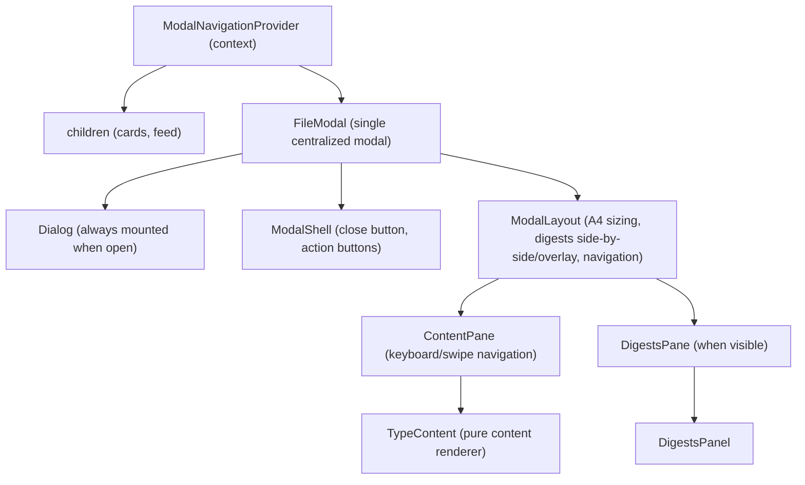
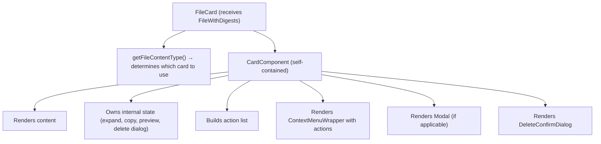

This document describes the architecture and design patterns for the FileCard component system in MyLifeDB.

## Overview

The FileCard system provides a modular, type-specific rendering architecture for displaying files in the application. Each card type is self-contained: it renders its own content, manages its own state, and owns its context menu.

## Directory Structure

```
app/components/FileCard/
├── index.ts                    # Public exports
├── types.ts                    # Shared types (BaseCardProps, FileContentType, etc.)
├── utils.ts                    # Content detection, file actions (download, share, etc.)
├── file-card.tsx               # Thin dispatcher (~50 lines)
├── file-modal.tsx              # Centralized modal (shell + content routing)
├── desktop-context-menu.tsx    # Desktop context menu wrapper (shadcn)
├── mobile-context-menu.tsx     # Mobile context menu implementation
├── ui/
│   ├── card-styles.ts          # Unified card styling constants
│   ├── match-context.tsx       # Search result match context display
│   ├── text-highlight.tsx      # Text highlighting utilities
│   ├── delete-confirm-dialog.tsx  # Shared delete confirmation dialog
│   ├── modal-close-button.tsx     # Floating close button for modals
│   ├── modal-action-buttons.tsx   # Floating action buttons for modals
│   ├── digests-panel.tsx          # Shared digests view panel for modals
│   ├── selection-wrapper.tsx      # Multi-select checkbox overlay
│   ├── modal-layout.tsx           # A4-ratio modal sizing + navigation support
│   └── use-modal-navigation.ts    # Keyboard/swipe navigation hooks
├── cards/
│   ├── index.ts                # Card registry: getCardComponent(type)
│   ├── image-card.tsx          # PNG, JPG, JPEG, GIF, WebP, SVG
│   ├── video-card.tsx          # MP4, MOV, WebM, etc.
│   ├── audio-card.tsx          # MP3, WAV, OGG, etc.
│   ├── text-card.tsx           # MD, TXT, and files with textPreview
│   ├── pdf-card.tsx            # PDF files (renders screenshot)
│   ├── doc-card.tsx            # Word documents (renders screenshot)
│   ├── ppt-card.tsx            # PowerPoint files (renders screenshot)
│   └── fallback-card.tsx       # Unknown file types (shows filename)
└── modal-contents/             # Pure content renderers (no Dialog wrapper)
    ├── audio-content.tsx       # Custom audio player (speed, progress, sync)
    ├── video-content.tsx       # Video player with autoplay
    ├── image-content.tsx       # Image viewer with bounding box overlay
    ├── text-content.tsx        # Monaco editor with save + unsaved dialog
    ├── pdf-content.tsx         # PDF viewer (react-pdf)
    ├── epub-content.tsx        # EPUB reader (epub.js)
    └── fallback-content.tsx    # File info display
```

## Type Detection

File types are determined using MIME type first, then file extension as fallback:

```typescript
// app/components/FileCard/utils.ts

export type FileContentType =
  | 'image'
  | 'video'
  | 'audio'
  | 'text'
  | 'pdf'
  | 'doc'
  | 'ppt'
  | 'fallback';

export function getFileContentType(file: FileWithDigests): FileContentType {
  const mimeType = file.mimeType || '';
  const ext = getExtension(file.name);

  // 1. Media types (by MIME)
  if (mimeType.startsWith('image/')) return 'image';
  if (mimeType.startsWith('video/')) return 'video';
  if (mimeType.startsWith('audio/')) return 'audio';

  // 2. Document types (by MIME or extension)
  if (mimeType === 'application/pdf' || ext === 'pdf') return 'pdf';
  if (isWordDocument(mimeType, ext)) return 'doc';
  if (isPowerPoint(mimeType, ext)) return 'ppt';

  // 3. Text content (has preview)
  if (file.textPreview) return 'text';

  // 4. Fallback
  return 'fallback';
}
```

## MIME Type / Extension Mapping

| Card Type | MIME Types | Extensions |
|-----------|------------|------------|
| `image-card` | `image/*` | - |
| `video-card` | `video/*` | - |
| `audio-card` | `audio/*` | - |
| `text-card` | Files with `textPreview` field | - |
| `pdf-card` | `application/pdf` | `.pdf` |
| `doc-card` | `application/msword`, `application/vnd.openxmlformats-officedocument.wordprocessingml.document` | `.doc`, `.docx` |
| `ppt-card` | `application/vnd.ms-powerpoint`, `application/vnd.openxmlformats-officedocument.presentationml.presentation` | `.ppt`, `.pptx` |
| `fallback-card` | Any file type not matching above | - |

## Component Architecture

### FileCard (Thin Dispatcher)

The main `file-card.tsx` is a thin dispatcher (~50 lines) that:

1. Detects the file content type using `getFileContentType()`
2. Renders the appropriate card from `cards/`
3. Passes through props (file, className, highlightTerms, matchContext, etc.)

```typescript
export function FileCard({ file, showTimestamp, ...props }: FileCardProps) {
  const contentType = getFileContentType(file);
  const CardComponent = getCardComponent(contentType);

  return (
    <div className="w-full flex flex-col items-end">
      {showTimestamp && <Timestamp date={file.createdAt} />}
      <CardComponent file={file} {...props} />
    </div>
  );
}
```

### Card Components (Self-Contained)

Each card component is **fully self-contained**:
- Renders its own content
- Manages its own internal state (e.g., TextCard owns `isExpanded`, `copyStatus`)
- Renders its own context menu (desktop + mobile)
- Handles its own actions using shared utilities from `utils.ts`

```typescript
// app/components/FileCard/types.ts

export interface BaseCardProps {
  file: FileWithDigests;
  className?: string;
  priority?: boolean;
  highlightTerms?: string[];
  matchContext?: SearchResultItem['matchContext'];
  onLocateInFeed?: () => void;  // Search results only
}
```

Example card structure:

```typescript
// cards/image-card.tsx
export function ImageCard({ file, className, priority, matchContext, onLocateInFeed }: BaseCardProps) {
  const [isPreviewOpen, setIsPreviewOpen] = useState(false);
  const [isDeleteDialogOpen, setIsDeleteDialogOpen] = useState(false);

  const actions = [
    { icon: ExternalLink, label: 'Open', onClick: handleOpen },
    { icon: MapPin, label: 'Locate', onClick: () => onLocateInFeed?.(), hidden: !onLocateInFeed },
    { icon: Pin, label: file.isPinned ? 'Unpin' : 'Pin', onClick: () => togglePin(file.path) },
    { icon: Download, label: 'Save', onClick: () => downloadFile(file.path, file.name) },
    { icon: Share2, label: 'Share', onClick: handleShare, hidden: !canShare() },
    { icon: Trash2, label: 'Delete', onClick: () => setIsDeleteDialogOpen(true), variant: 'destructive' },
  ];

  const cardContent = (
    <div className={cn("...", className)}>
      
      {matchContext && <MatchContext context={matchContext} />}
    </div>
  );

  return (
    <>
      <ContextMenuWrapper actions={actions}>
        {cardContent}
      </ContextMenuWrapper>
      <ImageModal open={isPreviewOpen} onOpenChange={setIsPreviewOpen} file={file} />
      <DeleteConfirmDialog open={isDeleteDialogOpen} onOpenChange={setIsDeleteDialogOpen} file={file} />
    </>
  );
}
```

The remaining content of this file covers shared UI components, context menus, modal architecture, modal sizing system, modal navigation, props flow, state management, file actions, extensibility guidelines, UX specifications by file type (image, video, audio, text, PDF, document, PowerPoint, EPUB, Excel, fallback), and screenshot-based cards. Due to the length of this document, please refer to the source for full details.

### Shared UI Components

The `ui/` folder contains reusable pieces shared across cards:

```typescript
// ui/match-context.tsx
export function MatchContext({ context }: { context: SearchMatchContext })

// ui/text-highlight.tsx
export function highlightMatches(text: string, terms: string[]): ReactNode
export function renderHighlightedSnippet(snippet: string): ReactNode

// ui/delete-confirm-dialog.tsx
export function DeleteConfirmDialog({ open, onOpenChange, file }: DeleteConfirmDialogProps)

// ui/digests-panel.tsx
export function DigestsPanel({ file, className }: { file: FileWithDigests; className?: string })
```

### DigestsPanel

Shared panel component for displaying AI-generated digests. Shows side-by-side with content when activated via modal action button.

**Features:**
- Lists all digests for the file with status indicators
- Shows digest content (text, JSON arrays as tags, structured JSON)
- Refresh button to trigger digest processing
- Error display for failed digests
- Color-coded status: success (green), failed (red), in-progress (blue), to-do/skipped (muted)

**Layout:**
- Header: Title + completion count + Refresh button
- Scrollable list of digest cards
- Footer: Warning message if any digests failed

**Integration:**
- Used by all modals via `activeView` state toggle
- Modal expands to full width when digests panel is shown
- Content and digests displayed side-by-side (50/50 split)

### Context Menu (Unified Wrapper)

Cards use a unified context menu wrapper that handles both desktop and mobile:

```typescript
// Detects touch capability and renders appropriate menu
export function ContextMenuWrapper({
  actions,
  children,
  selectTextOnOpen?: boolean  // For text cards
}: ContextMenuWrapperProps)
```

Each card builds its own action list and passes to the wrapper. Shared actions use utilities from `utils.ts`.

### Modal Architecture

The modal system uses a **centralized architecture** where navigation is transparent to content:



**Design Principles:**

1. **Navigation as container feature**: Content components have no knowledge of navigation.
   The `FileModal` consumes navigation context, `ModalLayout` handles keyboard/swipe.

2. **Content components are pure renderers**: Each `*-content.tsx` only renders content.
   - No Dialog wrapper
   - No action buttons
   - No layout concerns
   - Just the file content with type-specific features

3. **Communication via callbacks**: Content and Modal and DigestsPanel sync via props.

4. **Each modal is an A4 rounded content with bg**: Content fills the rounded container.

5. **Digests is another A4 div**: Shown side-by-side (wide screens) or as overlay (narrow).

### Modal Sizing System

The modal sizing system is designed around the A4 paper ratio (1:sqrt(2) approx 1:1.414) to provide consistent, aesthetically pleasing dimensions across all viewport sizes.

**Landscape Mode** (height-constrained):
```
Width:  64vh (capped at 100vw)
Height: 90vh
Ratio:  64:90 approx 1:1.406 (close to A4)
```

**Portrait Mode** (width-constrained):
```
Width:  100vw
Height: 141vw (capped at 95vh for safety margin)
Ratio:  100:141 approx 1:1.41 (A4 ratio)
```

### Modal Navigation

When viewing files in modal mode, users can navigate between files without closing the modal:

**Desktop:**
- Press left arrow to go to the previous file
- Press right arrow to go to the next file

**Mobile:**
- Swipe left to go to the next file
- Swipe right to go to the previous file
- Swipe threshold: 100px or velocity > 500

## Props Flow



## State Management

State is owned by individual cards:

| State | Purpose | Owner |
|-------|---------|-------|
| `isExpanded` | Text expand/collapse | TextCard |
| `fullContent` | Loaded full text | TextCard |
| `copyStatus` | Copy feedback | TextCard |
| `isPreviewOpen` | Modal visibility | Each card that supports preview |
| `isDeleteDialogOpen` | Delete confirmation | Each card |

The dispatcher (`FileCard`) has **no state** - it's purely a routing component.

## File Actions (utils.ts)

Shared utilities used by all cards:

```typescript
// Content detection
export function getFileContentType(file: FileWithDigests): FileContentType
export function getExtension(filename: string): string

// File operations (pure functions)
export function downloadFile(path: string, filename: string): void
export async function shareFile(path: string, name: string, mimeType?: string): Promise<void>
export async function shareText(title: string, text: string): Promise<void>
export function canShare(): boolean

// API calls
export async function togglePin(path: string): Promise<boolean>
export async function deleteFile(path: string): Promise<boolean>
export async function fetchFullContent(path: string): Promise<string | null>

// Device detection
export function isTouchDevice(): boolean
export function isIOS(): boolean  // Used to hide download actions on iOS
```

## Extensibility

To add a new file type:

1. Add type to `FileContentType` in `types.ts`
2. Create `cards/new-type-card.tsx` implementing `BaseCardProps`
3. Update `getFileContentType()` in `utils.ts` with detection logic
4. Register in `cards/index.ts` registry
5. Create `modal-contents/new-type-content.tsx` as pure content renderer
6. Add case to `ModalContentRenderer` switch in `file-modal.tsx`

## Size Reference

| Card Type | Width | Height | Notes |
|-----------|-------|--------|-------|
| Image | fit-content, max 448px | max 320px | Aspect ratio preserved |
| Video | max 448px | 16:9 aspect | Fixed aspect ratio |
| Audio | duration-based, max 50%-40px, min 100px | fixed 40px | Compact bar with rounded-lg |
| Text | fit-content | max 20 lines | Double-click for modal |
| PDF/Doc | fixed 226px | max 320px + footer | A4-ish ratio, filename + size footer |
| PPT/EPUB/XLS | fit-content, max 448px | max 320px | Screenshot or fallback |
| Fallback | fit-content | min 120px | Click for info modal |
