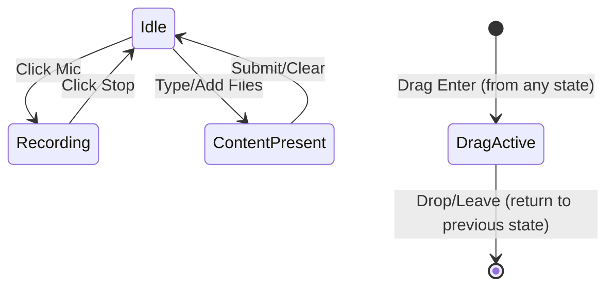
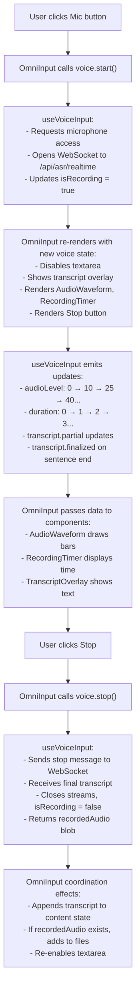
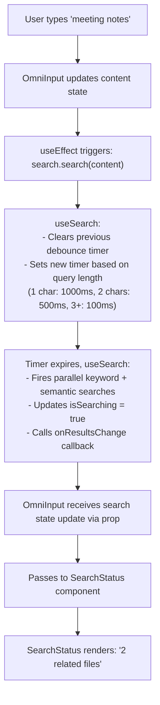

## Overview

OmniInput is the primary input component for MyLifeDB, supporting text entry, voice recording with real-time transcription, file attachments, and integrated search. This document describes its UX behavior and technical architecture.

## UX Design

### UI States

OmniInput has 4 distinct UI states with smooth transitions:

#### 1. Idle State (Default)
```
┌─────────────────────────────────────────┐
│ What's up?                              │ ← Textarea
├─────────────────────────────────────────┤
│ [+]           (empty)             [mic] │ ← Control bar
└─────────────────────────────────────────┘
```
- **Left**: Plus button (add files)
- **Middle**: Empty or search status
- **Right**: Mic button (start voice input)

#### 2. Recording State
```
┌─────────────────────────────────────────┐
│ (disabled, showing transcript overlay)  │ ← Textarea + overlay
├─────────────────────────────────────────┤
│ [+]     [bars] 00:15 Save    [Stop]    │ ← Control bar
└─────────────────────────────────────────┘
```
- **Left**: Plus button (still available)
- **Middle**: Waveform + timer + save audio checkbox
- **Right**: Stop button (with pulsing red dot)
- **Textarea**: Disabled but visible with transcript overlay showing:
  - Invisible existing content (maintains layout)
  - Visible finalized transcript (black text)
  - Visible partial transcript (gray text)

#### 3. Content/Files Present
```
┌─────────────────────────────────────────┐
│ Some text content here...               │ ← Textarea
│ ┌─────────────────────────────────────┐ │
│ │ document.pdf             1.2 MB [x] │ │ ← File chip
│ └─────────────────────────────────────┘ │
├─────────────────────────────────────────┤
│ [+]      2 related files          [Send]│ ← Control bar
└─────────────────────────────────────────┘
```
- **Left**: Plus button
- **Middle**: Search status (count of related files)
- **Right**: Send button
- **File chips**: Shown above control bar with remove buttons

#### 4. Drag-and-Drop Active
```
┌─────────────────────────────────────────┐
│           ╔═══════════════╗             │
│           ║               ║             │
│           ║ Drop files    ║             │ ← Overlay
│           ║     here      ║             │
│           ╚═══════════════╝             │
└─────────────────────────────────────────┘
```
- Full overlay with drop zone indicator
- Border highlight (primary color)

### State Transitions



### Voice Input Flow

1. **Start**: User clicks mic button
   - Textarea becomes disabled (grayed out)
   - Placeholder disappears
   - System requests microphone permission
   - WebSocket connects to ASR backend

2. **Recording**: User speaks
   - Audio waveform animates based on input level
   - Timer increments (mm:ss format)
   - Partial transcript appears in gray (live updates)
   - When sentence completes, it becomes finalized (black text)
   - User can toggle "Save Audio" checkbox

3. **Stop**: User clicks stop button
   - WebSocket sends stop message
   - Final transcript is received
   - Recording stops, media streams close
   - Finalized transcript is appended to content
   - If "Save Audio" was checked, audio file is added to attachments
   - Textarea becomes enabled, focus returns

## Technical Architecture

### Core Principle: **UI Ownership with Delegated Logic**

OmniInput owns ALL UI composition and layout decisions, while delegating business logic to specialized modules.

### Component Structure

```
omni-input/
├── index.tsx                      # Re-export
├── omni-input.tsx                 # UI owner + coordinator
│
├── ui/                            # Presentational components (no business logic)
│   ├── audio-waveform.tsx         # Canvas visualization
│   ├── file-chip.tsx              # Single file display
│   ├── file-attachments.tsx       # File list
│   ├── recording-timer.tsx        # mm:ss display
│   └── transcript-overlay.tsx     # Floating transcript text
│
└── modules/                       # Business logic (no UI)
    ├── use-voice-input.ts         # Voice recording + ASR logic
    ├── use-search.ts              # Search debouncing + API calls
    └── use-file-drag.ts           # Drag & drop handling
```

### Architectural Principles

1. **Separation of Concerns**
   - **Presentational components**: Pure UI, receive data via props, emit events via callbacks
   - **Business logic modules**: Manage state and side effects, return data + controls via hooks
   - **OmniInput**: Coordinates between modules and presentational components

2. **No Cross-Dependencies**
   - `AudioWaveform` doesn't know about `useVoiceInput`
   - `useVoiceInput` doesn't know about `AudioWaveform`
   - OmniInput connects them: `<AudioWaveform level={voice.audioLevel} />`

3. **Composability**
   - Presentational components can be reused anywhere
   - Business logic hooks can power different UIs
   - OmniInput controls the specific composition

### Component Interfaces

#### Presentational Components (Dumb)

```typescript
// ui/audio-waveform.tsx
interface AudioWaveformProps {
  level: number; // 0-100 audio level
  color?: string;
  className?: string;
}
// Just draws animated bars, doesn't know where data comes from

// ui/recording-timer.tsx
interface RecordingTimerProps {
  seconds: number;
  className?: string;
}
// Formats seconds as mm:ss display

// ui/transcript-overlay.tsx
interface TranscriptOverlayProps {
  existingContent: string;
  finalizedText: string;
  partialText: string;
  className?: string;
}
// Renders overlay with invisible content + visible transcripts

// ui/file-attachments.tsx
interface FileAttachmentsProps {
  files: File[];
  onRemove: (index: number) => void;
}
// Maps files to chips with remove buttons
```

#### Business Logic Modules (Smart)

```typescript
// modules/use-voice-input.ts
interface VoiceInputControls {
  // State
  isRecording: boolean;
  audioLevel: number;        // For waveform
  duration: number;          // For timer
  transcript: {
    finalized: string;       // For overlay (black text)
    partial: string;         // For overlay (gray text)
  };
  recordedAudio: Blob | null;

  // Actions
  start: () => Promise<void>;
  stop: () => void;
}

function useVoiceInput(options?: {
  onError?: (error: string) => void;
}): VoiceInputControls;

// modules/use-search.ts
interface SearchControls {
  // State
  results: SearchState;
  isSearching: boolean;
  error: string | null;

  // Actions
  search: (query: string) => void;
  clear: () => void;
}

function useSearch(options?: {
  debounceMs?: number;
  onResultsChange?: (results: SearchState) => void;
}): SearchControls;

// modules/use-file-drag.ts
interface FileDragControls {
  // State
  isDragging: boolean;
  files: File[];

  // Actions
  addFiles: (files: File[]) => void;
  removeFile: (index: number) => void;
  clear: () => void;

  // Event handlers (OmniInput wires these to DOM)
  handlers: {
    onDragEnter: (e: DragEvent) => void;
    onDragLeave: (e: DragEvent) => void;
    onDragOver: (e: DragEvent) => void;
    onDrop: (e: DragEvent) => void;
  };
}

function useFileDrag(): FileDragControls;
```

#### OmniInput (Coordinator)

```typescript
interface OmniInputProps {
  onEntryCreated?: () => void;
  onSearchResultsChange?: (state: SearchState) => void;
  searchStatus?: {
    isSearching: boolean;
    hasNoResults: boolean;
    hasError: boolean;
    resultCount?: number;
  };
  maxHeight?: number;
  clearSearchTrigger?: number;
}

function OmniInput(props: OmniInputProps): JSX.Element;
```

### Data Flow Examples

#### Example 1: Voice Recording



#### Example 2: Search Coordination



### Coordination Layer

OmniInput acts as the coordination layer between modules:

```typescript
// Example: When voice stops, append transcript to content
useEffect(() => {
  if (!voice.isRecording && voice.transcript.finalized) {
    setContent(prev =>
      prev ? `${prev} ${voice.transcript.finalized}` : voice.transcript.finalized
    );
  }
}, [voice.isRecording, voice.transcript.finalized]);

// Example: When content changes, trigger search
useEffect(() => {
  search.search(content);
}, [content]);

// Example: When voice recording completes with audio, add to files
useEffect(() => {
  if (voice.recordedAudio && saveAudio) {
    const audioFile = new File([voice.recordedAudio], `recording-${Date.now()}.webm`);
    files.addFiles([audioFile]);
  }
}, [voice.recordedAudio, saveAudio]);
```

## Implementation Benefits

### 1. Extensibility
- Add new input mode? Create `use-new-input.ts` hook, wire into OmniInput UI
- Add new visualization? Create presentational component, pass data from existing hooks

### 2. Testability
- **Unit test presentational components**: Mock props, verify rendering
- **Unit test business logic**: Mock WebSocket/fetch, verify state updates
- **Integration test OmniInput**: Mock hooks, verify coordination

### 3. Reusability
- `useVoiceInput` can power a full-screen voice note page
- `AudioWaveform` can be used in a music player
- `TranscriptOverlay` can be used in a notes app
- `useFileDrag` can be used in any file upload interface

### 4. Maintainability
- Voice logic changes? Only touch `use-voice-input.ts`
- Waveform design changes? Only touch `audio-waveform.tsx`
- Layout changes? Only touch `omni-input.tsx`
- Each file has a single, clear responsibility

### 5. Performance
- Presentational components can be memoized easily (pure props)
- Business logic hooks can optimize independently
- OmniInput only re-renders when coordinated state changes

## Migration Strategy

The refactor maintains 100% backward compatibility:
- Parent component (`home.tsx`) uses identical interface
- All callbacks and props work the same
- Only internal structure changes
- Can be done incrementally (extract one module at a time)

## Future Enhancements

Potential additions enabled by this architecture:

1. **Full-screen voice mode**: New `VoiceNotePage` using `useVoiceInput` with different UI
2. **Audio editing**: New presentational component for trimming recorded audio
3. **Multi-language ASR**: Extend `useVoiceInput` to support language selection
4. **Rich text editing**: Replace textarea with rich editor, keep same coordination
5. **Advanced search filters**: Extend `useSearch` with filter state, update SearchStatus UI
6. **Voice commands**: Add command recognition to `useVoiceInput` (e.g., "save", "cancel")

## Related Components

- **use-realtime-asr.ts**: Low-level hook for WebSocket ASR connection (wrapped by `useVoiceInput`)
- **InlineWaveform**: Current waveform implementation (will become `AudioWaveform`)
- **SearchStatus**: Current search indicator (already presentational)
- **use-send-queue.ts**: Local-first send queue (used by OmniInput submit handler)

## Design Decisions

### Why not full-screen voice mode?
- Keeps context visible (user sees existing content/files during recording)
- Less jarring transition
- Maintains current familiar UX
- Can be added later without changing architecture

### Why coordinate in OmniInput instead of in hooks?
- Coordination logic is UI-specific (transcript → textarea content)
- Keeps hooks reusable (don't assume specific use case)
- Makes data flow explicit and traceable
- Easier to customize for different UIs

### Why separate presentational and logical components?
- Presentational components are pure, easy to test, reusable
- Business logic is isolated, testable without DOM, reusable
- Clear separation of concerns
- Follows React best practices (container/presentational pattern)
