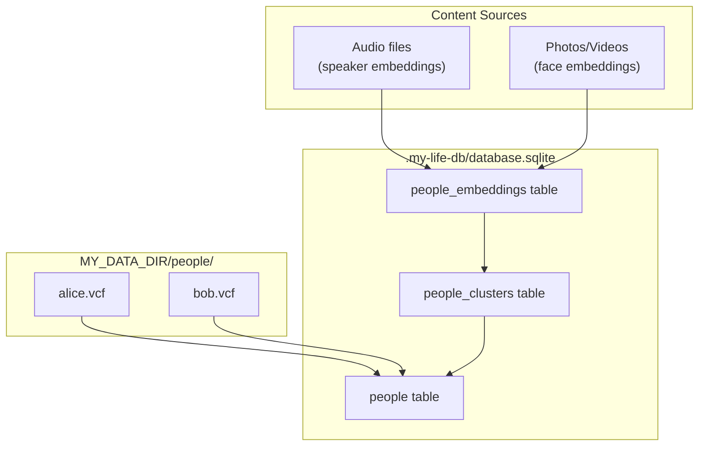
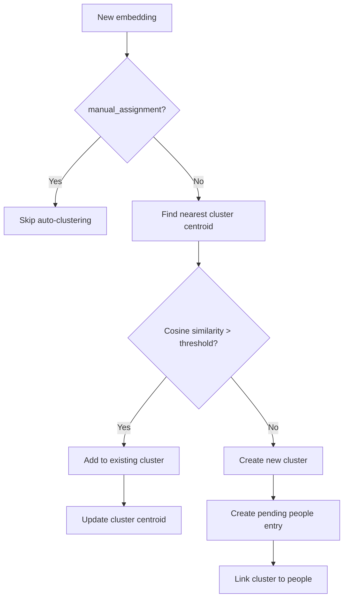
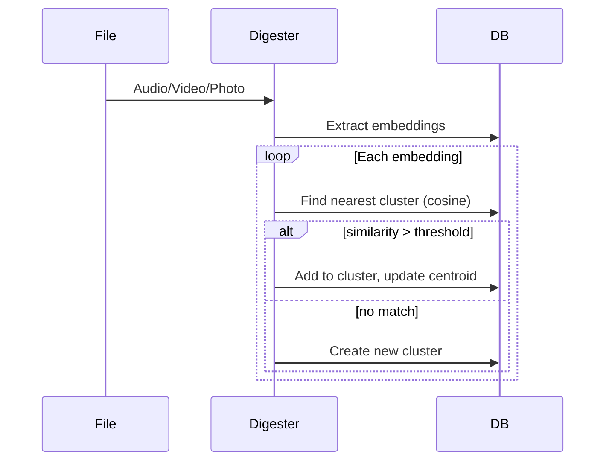
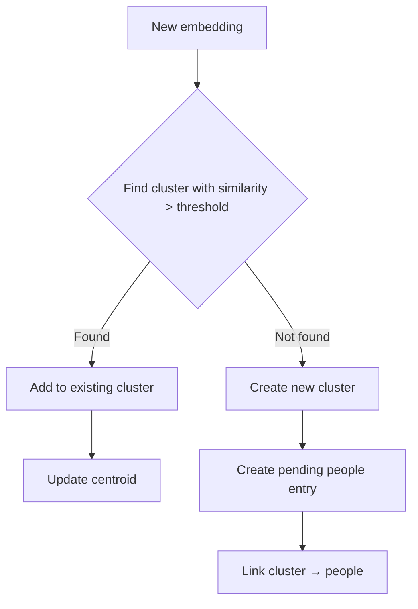
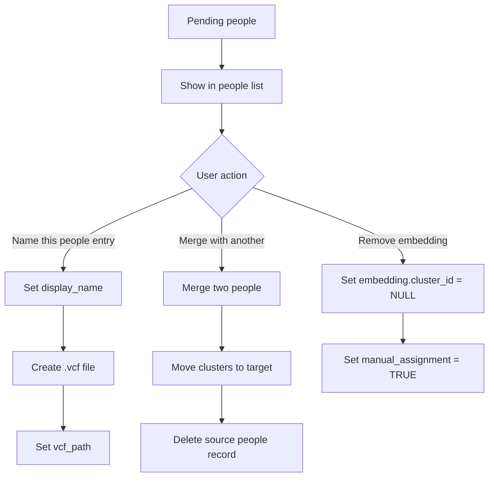

A unified system to manage identities across media: faces in photos/videos, voices in audio.

## Overview

**Goal**: Build a personal knowledge graph of people, linking biometric embeddings (voice, face) to canonical people records, enabling search/filter by people and surfacing interaction history.

**Principles**:
- **User data first**: People records stored as vCards (`.vcf`) in user data folder
- **App data is derived**: Embeddings and clusters stored in SQLite (rebuildable)
- **Progressive enrichment**: Manual labeling improves auto-matching over time

## Data Architecture



## Data Models

### People Entry (vCard + SQLite)

**User data** (`MY_DATA_DIR/people/{slug}.vcf`):
```
BEGIN:VCARD
VERSION:4.0
FN:Alice Chen
N:Chen;Alice;;;
NICKNAME:alicec
PHOTO;MEDIATYPE=image/jpeg:data:image/jpeg;base64,/9j/4AAQ...
X-VOICE-CLIP:data:audio/wav;base64,UklGRiQA...
NOTE:Met at 2024 conference
END:VCARD
```

**Media size limits** (stored as base64 in vCard):
- PHOTO: thumbnail only, max 100KB JPEG
- X-VOICE-CLIP: 5-10 second sample, max 200KB WAV

Full media remains in source files; vCard stores representative samples only.

**App data** (`people` table):
| Column | Type | Description |
|--------|------|-------------|
| id | TEXT PK | UUID |
| vcf_path | TEXT | Relative path to vCard (nullable for pending) |
| display_name | TEXT | Name (nullable for pending, UI shows "Add a name") |
| avatar | BLOB | Cached representative photo (thumbnail) |
| created_at | TEXT | ISO timestamp |
| updated_at | TEXT | ISO timestamp |

**Computed state**: `vcf_path IS NULL` → pending, otherwise identified.

vCard stores authoritative data for identified people. SQLite caches display_name + avatar for fast list rendering.

**vCard ownership**: vCards are app-managed files. Do not edit .vcf files outside the app - changes will not sync to SQLite cache.

### Cluster (SQLite)

Persistent grouping of embeddings. Each cluster always belongs to a people entry (pending or identified).

| Column | Type | Description |
|--------|------|-------------|
| id | TEXT PK | UUID |
| people_id | TEXT FK | Linked people entry (always set) |
| type | TEXT | `voice` or `face` |
| centroid | BLOB | Average embedding vector |
| sample_count | INT | Number of embeddings in cluster |
| created_at | TEXT | ISO timestamp |
| updated_at | TEXT | ISO timestamp |

### Embedding (SQLite)

Stores biometric vectors extracted from media files.

| Column | Type | Description |
|--------|------|-------------|
| id | TEXT PK | UUID |
| cluster_id | TEXT FK | Parent cluster (nullable) |
| type | TEXT | `voice` or `face` |
| vector | BLOB | Float32 array (512 for voice, 128 for face) |
| source_path | TEXT | File that produced this embedding |
| source_offset | TEXT | JSON (see format below) |
| quality | REAL | Duration (voice) or face size (face) for filtering |
| manual_assignment | BOOLEAN | If TRUE, skip in auto-clustering |
| created_at | TEXT | ISO timestamp |

**source_offset format**:
- Voice: `{ "segments": [{ "start": 0.5, "end": 5.2 }, { "start": 10.0, "end": 15.5 }] }` - all segments for this speaker
- Face: `{ "frame": 120, "bbox": [x, y, w, h] }` - frame number and bounding box

## Clustering

### Algorithm: Incremental Agglomerative Clustering

Industry research shows that [agglomerative hierarchical clustering (AHC)](https://google.github.io/speaker-id/publications/LstmDiarization/) and [spectral clustering](https://github.com/wenet-e2e/wespeaker) are standard for speaker diarization. For our incremental use case:



**Why not HDBSCAN?**
- HDBSCAN requires all points upfront, not suitable for incremental updates
- [WeSpeaker](https://github.com/wenet-e2e/wespeaker) uses UMAP + HDBSCAN for batch processing, but we need online clustering
- Simple centroid-based approach allows real-time assignment as new audio/photos arrive

**Centroid Update Formula**:
```
new_centroid = (old_centroid * n + new_embedding) / (n + 1)
```

### Similarity Threshold

| Type | Match Threshold |
|------|-----------------|
| Voice | > 0.85 cosine |
| Face | > 0.80 cosine |

**Assumptions**:
- All embeddings are L2-normalized before storage
- Voice: WhisperX speaker encoder (512-dim)
- Face: FaceNet/similar (128-dim)

Thresholds are tuned for these specific models. If embedding model changes, all embeddings should be re-extracted (thresholds may need adjustment).

Based on [FaceNet](https://arxiv.org/abs/1503.03832) research showing 128-dim embeddings achieve excellent clustering with simple thresholding. [Cosine similarity](https://medium.com/@sapkotabinit2002/speaker-identification-and-clustering-using-pyannote-dbscan-and-cosine-similarity-dfa08b5b2a24) is standard for normalized speaker embeddings.

### Cluster Operations

**Merge**: Combine two clusters into one
```
merged_centroid = (centroid_a * n_a + centroid_b * n_b) / (n_a + n_b)
```
- Update all embeddings in cluster B to point to cluster A
- Delete cluster B
- Recalculate centroid

**Remove embedding from cluster**:
1. Unlink embedding from cluster (set `cluster_id = NULL`, set `manual_assignment = TRUE`)
2. Check if cluster is now empty (n=1 before removal):
   - If empty → delete cluster, skip to step 4
   - If not empty → recalculate centroid: `new_centroid = (old_centroid * n - removed_embedding) / (n - 1)`
3. Update cluster's `sample_count`
4. Check if people has no clusters left:
   - Pending (no vcf_path) → delete people record
   - Identified (has vcf_path) → keep people record (just no voice/face data)

All steps should run in a transaction.

**Periodic re-clustering** (optional background task):
- Run full AHC on unassigned embeddings where `manual_assignment = FALSE`
- Helps correct drift from incremental centroid updates
- Embeddings with `manual_assignment = TRUE` are never auto-clustered

**Source file deletion**:
- When a source file is deleted, delete all embeddings referencing that file
- Cascade: empty clusters → deleted, empty pending people → deleted

## Digester Integration



### New Digesters

| Digester | Depends on | Input | Output |
|----------|------------|-------|--------|
| `speaker-embedding` | `speech-recognition` | ASR result with speakers | Embeddings for each speaker |
| `face-embedding` | - | Photo/video | Embeddings for detected faces |

### Embedding Extraction

**Voice**: From ASR result (already in `HaidSpeechRecognitionResponse`):
- 512-dim vector per speaker (1 embedding per speaker per audio file)
- Multiple segments from same speaker are already aggregated into one embedding
- Store all segment timestamps in `source_offset` for clip-level review UI
- Filter by `total_duration` (quality metric)

**Face**: From face detection API (future):
- 128-dim vector per face ([FaceNet standard](https://arxiv.org/abs/1503.03832))
- Store bounding box, frame number for videos

## Workflows

### 1. Auto-Clustering Flow

For each new embedding (where `manual_assignment = FALSE`):



**Multiple clusters per people**: A people entry can have multiple clusters (even of the same type). Matching checks all clusters linked to a people entry - this captures variation (e.g., voice at different ages, different lighting for faces).

### 2. Identifying Pending People



### 3. Manual Assignment

When user manually assigns/unassigns an embedding:
- **Assign to people**: set `manual_assignment = TRUE`, link to appropriate cluster (or create new one for that people entry)
- **Unassign from people**: set `cluster_id = NULL`, keep `manual_assignment = TRUE`
- Embeddings with `manual_assignment = TRUE` are never touched by auto-clustering

### 4. Representative Selection

When user wants to change the representative photo/voice:
1. Show all embeddings in clusters linked to people entry
2. User selects preferred one
3. Extract clip/crop from source file
4. Encode as base64 in vCard (PHOTO/X-VOICE-CLIP)
5. Generate thumbnail and cache in `people.avatar`

## API Endpoints

| Endpoint | Method | Description |
|----------|--------|-------------|
| `/api/people` | GET | List all people (uses cached avatar) |
| `/api/people` | POST | Create identified people with name |
| `/api/people/[id]` | GET | People details with linked clusters/embeddings |
| `/api/people/[id]` | PUT | Update name (creates vCard if pending) |
| `/api/people/[id]` | DELETE | Delete people, clusters, and .vcf file; orphan embeddings |
| `/api/people/[id]/representative` | PUT | Set representative photo/voice |
| `/api/people/[id]/merge` | POST | Merge source into target: move clusters, delete source .vcf |
| `/api/people/embeddings/[id]/assign` | POST | Manually assign embedding to people entry |
| `/api/people/embeddings/[id]/unassign` | POST | Unassign embedding from people entry |

## UX

### People Page (`/people`)

Single unified page showing all people (both identified and pending):

```
┌─────────────────────────────────────────────────────────┐
│ People                                                  │
├─────────────────────────────────────────────────────────┤
│ Identified                                              │
│ ┌────────┐ ┌────────┐ ┌────────┐                       │
│ │ [foto] │ │ [foto] │ │ [foto] │                       │
│ │ Alice  │ │ Bob    │ │ Carol  │                       │
│ └────────┘ └────────┘ └────────┘                       │
│                                                         │
│ Pending (12)                                            │
│ ┌────────┐ ┌────────┐ ┌────────┐ ┌────────┐           │
│ │ [face] │ │ [spkr] │ │ [face] │ │ [spkr] │           │
│ │Add name│ │Add name│ │Add name│ │Add name│           │
│ └────────┘ └────────┘ └────────┘ └────────┘           │
└─────────────────────────────────────────────────────────┘
```

- Identified people shown first
- Pending people shown with "Add a name" placeholder
- Avatar shows face crop or speaker icon
- Click any people → detail page

### People Detail (`/people/[id]`)

Same page for both identified and pending:

```
┌─────────────────────────────────────────────────────────┐
│ [Add a name]                                            │
│ ─────────────────────────────────────────────────────── │
│                                                         │
│ Voice clips:                                            │
│ ┌──────────────────────────────────────────────────┐   │
│ │ meeting.mp3                                       │   │
│ │   ▶ 0:12-0:45  ▶ 1:23-1:58  ▶ 3:02-3:15         │   │
│ │                                                   │   │
│ │ interview.mp3                                     │   │
│ │   ▶ 0:00-2:30  ▶ 5:12-5:45                       │   │
│ └──────────────────────────────────────────────────┘   │
│                                                         │
│ Faces:                                                  │
│ ┌──────┐ ┌──────┐ ┌──────┐                             │
│ │[face]│ │[face]│ │[face]│                             │
│ └──────┘ └──────┘ └──────┘                             │
│                                                         │
│ Actions: [Merge with...] [Delete]                       │
└─────────────────────────────────────────────────────────┘
```

- Voice: show clips grouped by source file, colored by embedding
- Face: show face crops
- Each clip/face can be unassigned individually
- Name field: inline editable, saving creates vCard if pending
- [Merge with...]: select another people entry, move all clusters to target

### Review UI Details

**Voice clips**:
- One embedding may have multiple segments (same speaker in one file)
- Show all segments as playable clips
- Color-code by embedding (different files = different colors)
- User reviews at clip level, but unassign affects whole embedding

**Faces**:
- One embedding = one face crop
- Show as thumbnail grid

### Search Integration

- Add people filter to search UI
- Show people tags on file cards when detected
- People carousel in file inspector for media with detected faces/voices

## File Structure

```
MY_DATA_DIR/
├── people/                    # vCard storage (user data)
│   ├── alice-chen.vcf
│   ├── bob-smith.vcf
│   └── ...
├── inbox/
├── notes/
└── app/
    └── my-life-db/
        └── database.sqlite    # people, clusters, embeddings tables
```

## Migration Path

1. **Phase 1**: Schema + speaker digester
   - Create tables: people, people_clusters, people_embeddings
   - Implement speaker-embedding digester with auto-clustering
   - Auto-create pending people entry for new clusters
   - API for CRUD on people

2. **Phase 2**: People UI
   - Unified people page (identified + pending)
   - People detail with clip/face review
   - Identify, merge, unassign actions
   - vCard read/write for identified people

3. **Phase 3**: Search integration
   - People filter in search
   - Person tags on cards
   - Timeline view

4. **Phase 4**: Face detection
   - Integrate face embedding API
   - Photo/video processing
   - Unified clustering across voice+face

## Implementation Notes

### Recommended Indexes

```sql
CREATE INDEX idx_people_clusters_people_id ON people_clusters(people_id);
CREATE INDEX idx_people_clusters_type ON people_clusters(type);
CREATE INDEX idx_people_embeddings_cluster_id ON people_embeddings(cluster_id);
CREATE INDEX idx_people_embeddings_source_path ON people_embeddings(source_path);
CREATE INDEX idx_people_embeddings_type ON people_embeddings(type);
```

### Constraints

- `people_clusters.people_id` → `people.id` (FK, CASCADE DELETE)
- `people_embeddings.cluster_id` → `people_clusters.id` (FK, SET NULL on delete)

## References

- [FaceNet: A Unified Embedding for Face Recognition and Clustering](https://arxiv.org/abs/1503.03832) - 128-dim face embeddings
- [Google Speaker Diarization with LSTM](https://google.github.io/speaker-id/publications/LstmDiarization/) - d-vector + clustering
- [WeSpeaker](https://github.com/wenet-e2e/wespeaker) - Production speaker verification toolkit
- [Speaker Clustering with DBSCAN](https://medium.com/@sapkotabinit2002/speaker-identification-and-clustering-using-pyannote-dbscan-and-cosine-similarity-dfa08b5b2a24) - Cosine similarity approach
