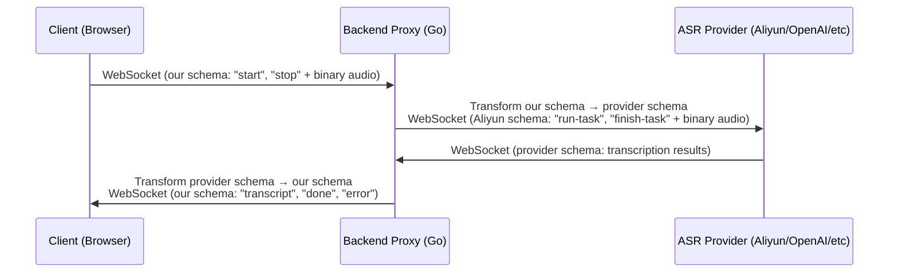
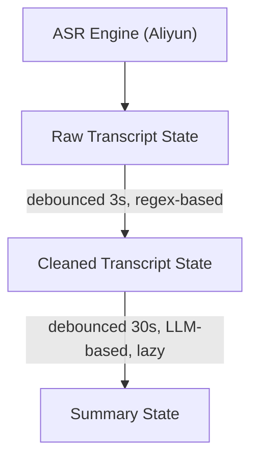

## Overview

MyLifeDB features a real-time voice input system inspired by Plaud Note, providing live transcription with visual feedback, multi-view transcript processing, and seamless integration into the inbox workflow.

## UX Design

### Recording Experience

#### Two-Pass ASR with Optional Audio Saving

**Pass 1: Real-time Transcription** (during recording):
- Uses `fun-asr-realtime` model for instant feedback during recording
- Streams partial transcripts with ~1-2 second latency
- Provides immediate visual feedback while speaking
- Client-side audio recording using MediaRecorder API (always enabled for refinement)

**Pass 2: Batch ASR Refinement** (after stopping):
- **Always runs** regardless of "Save Audio" setting
- Audio blob sent to `/api/asr` endpoint for higher-accuracy processing
- Uses `fun-asr` batch model (more accurate than realtime model)
- Refined transcript replaces the real-time transcript
- Temp audio file automatically cleaned up after processing

**Optional Audio Saving**:
- "Save Audio" toggle next to waveform (default: off)
- When enabled: Audio file automatically attached to inbox entry after stopping
- When disabled: Audio used only for refinement, then discarded
- User control over storage vs. privacy trade-off

**Benefits**:
- Instant feedback during recording (real-time ASR)
- Higher accuracy final transcript (batch ASR refinement)
- Privacy-friendly - audio only saved to inbox if explicitly enabled
- Simple architecture - client-side recording, automatic server-side refinement

#### Visual Feedback During Recording

**Waveform Visualizer**:
- Canvas-based 40-bar waveform animation
- Real-time audio level visualization (0-100 scale)
- Organic wave effect with age-based height variation
- Positioned between textarea and control bar

**Recording Timer**:
- MM:SS format, updates every second
- Displayed prominently with recording indicator
- Pulsing red dot animation using Tailwind's `animate-ping`

**Button States**:
1. **Idle**: Ghost mic button (h-8 w-8, larger touch target)
2. **Recording**: Destructive button with:
   - Pulsing white dot indicator
   - Mic icon
   - "Stop" text label
   - Enhanced visibility (h-8, px-3)

**Transcript Display**:
- Partial transcripts: Gray overlay (60% opacity) during recording
- Final transcripts: Append to content immediately
- Clear separation prevents accidental submission of partial text
- Post-recording refinement: Transcript automatically updated with refined version
- Refinement happens in background, user sees final transcript update seamlessly

### Three-Tab Review Modal (Phase 2)

#### Tab 1: Raw Transcript
**What**: Unmodified ASR output
- Real-time updates as transcription arrives
- Shows all filler words (um, uh, like, you know)
- Raw punctuation from ASR engine
- Speaker labels if available
- Fully editable

**Update frequency**: Every 1-2 seconds (ASR latency)

**Use cases**:
- Verify transcription accuracy
- Legal/medical contexts requiring exact words
- Debugging ASR quality issues

#### Tab 2: Cleaned Transcript
**What**: Polished version preserving original meaning
- Removes filler words automatically
- Fixes common ASR errors (homophones)
- Improves punctuation and capitalization
- Maintains original meaning and content
- Fully editable

**Update frequency**: Every 3-5 seconds (debounced)

**Processing**:
- Regex-based cleanup (fast, local, no API calls)
- Runs incrementally as new sentences arrive
- Shows "Cleaning..." indicator briefly

**Cleanup operations**:
```javascript
// Remove filler words
text.replace(/\b(um|uh|like|you know)\b/gi, '')

// Fix capitalization
sentences.map(s => s.charAt(0).toUpperCase() + s.slice(1))

// Common ASR fixes
replacements = {
  'your welcome': 'you\'re welcome',
  'should of': 'should have',
  'could of': 'could have',
  // ... more patterns
}
```

**Use cases**:
- Quick notes that need to be readable
- Sharing transcripts with others
- Most common use case (80% of usage)

#### Tab 3: AI Summary
**What**: Condensed/restructured intelligent summary
- Key points as bullet points
- Action items extracted
- Main topics identified
- Template-based formatting

**Update frequency**: Every 30 seconds (rate limited, >30s duration)

**Processing**:
- LLM API call (OpenAI/Claude)
- Progressive summarization (cumulative)
- Lazy generation (only when tab is viewed)
- Cached once generated

**Summary timeline**:
```
0-30s:   "Keep talking..." (no summary yet)
30s:     First summary appears (2-3 bullet points)
60s:     Summary updates with new content
2min+:   Full structured summary with sections
5min+:   Detailed summary with action items
```

**Summary formats**:
- **Default**: Bullet points with key topics
- **Meeting**: Attendees, decisions, action items, next steps
- **Interview**: Main themes, quotes, follow-up questions
- **Brainstorm**: Ideas, pros/cons, next actions

**Use cases**:
- Long recordings (meetings, interviews >5min)
- Quick reference later
- Sharing highlights with team

### Modal Actions

**Primary Actions**:
1. **Save to Inbox** (primary button)
   - Adds entry to inbox with selected transcript version
   - Can choose which tab's content to save
   - Includes metadata (duration, timestamp)

2. **Discard** (destructive button)
   - Deletes recording and transcripts
   - Confirms before deletion
   - Removes temp audio file

3. **Save as Draft** (secondary button)
   - Saves to recordings library for later review
   - Preserves all 3 transcript versions
   - Can be reopened and edited later

### Tab Switching During Recording

**Behavior**:
- All 3 tabs update in real-time during recording
- Switch freely between tabs while recording
- Auto-scroll keeps latest content visible
- Update indicators show freshness:
  - "Transcribing..." (Raw)
  - "Cleaning... (updated 2s ago)" (Cleaned)
  - "Next update in 18s..." (Summary)

**Performance**:
- Raw: Always active (free)
- Cleaned: Eager processing (cheap, <10ms)
- Summary: Lazy processing (expensive, only if tab viewed + >30s duration)

## Technical Architecture

### Frontend Components

#### Hook: `useRealtimeASR`
**File**: `frontend/app/hooks/use-realtime-asr.ts`

**State**:
```typescript
interface UseRealtimeASRReturn {
  isRecording: boolean;           // Recording active
  audioLevel: number;             // 0-100 scale for visualization
  recordingDuration: number;      // Elapsed seconds
  rawTranscript: string;          // Accumulated final sentences (updated with refined version after stop)
  partialSentence: string;        // Current partial sentence
  recordedAudio: Blob | null;     // Recorded audio blob (always recorded for refinement)
  isRefining: boolean;            // Whether ASR refinement is in progress
  startRecording: () => Promise<void>;
  stopRecording: () => void;
}

interface UseRealtimeASROptions {
  saveAudio?: boolean;            // Whether to attach audio to inbox entry (default: false)
  onTranscript?: (text: string, isFinal: boolean) => void;
  onError?: (error: string) => void;
  onRecordingComplete?: (audioBlob: Blob | null) => void; // Called with blob only if saveAudio is true
  onRefinedTranscript?: (text: string) => void; // Called when batch ASR refinement completes
  sampleRate?: number;            // Audio sample rate (default: 16000)
}
```

**Audio Processing**:
- `AudioContext` at 16kHz sample rate for real-time ASR
- `AnalyserNode` for amplitude extraction (FFT size: 256)
- `ScriptProcessorNode` for audio chunking (4096 samples)
- `MediaRecorder` for client-side audio capture (always enabled for refinement)
- WebSocket binary messages for audio streaming to real-time ASR provider
- Audio recorded as WebM format for browser compatibility
- POST multipart upload to `/api/asr` for batch refinement after recording stops

**Level Calculation**:
```javascript
// Extract frequency data
analyser.getByteFrequencyData(dataArray);

// Calculate average amplitude
const average = dataArray.reduce((sum, val) => sum + val, 0) / dataArray.length;

// Normalize to 0-100 with sensitivity boost
const level = Math.min(100, (average / 255) * 150);
```

**Timer Management**:
- `setInterval` updates duration every 1000ms
- `requestAnimationFrame` updates audio level (~60fps)
- Proper cleanup on stop/unmount

#### Component: `RecordingVisualizer`
**File**: `frontend/app/components/recording-visualizer.tsx`

**Props**:
```typescript
interface RecordingVisualizerProps {
  audioLevel: number;   // Current volume (0-100)
  duration: number;     // Elapsed seconds
  className?: string;
}
```

**Canvas Rendering**:
- 40 bars, responsive width
- Height: 48px
- Bar width: `containerWidth / 40`
- Bar height: `minHeight + (audioLevel * maxHeight * heightMultiplier * randomVariation)`

**Animation**:
- Age-based fade: Recent bars 100% height, older bars 30%
- Random variation: 0.7-1.0 multiplier for organic feel
- Color: `hsl(var(--destructive) / opacity)` with age-based opacity
- Updates on every `audioLevel` change (React effect)

**Timer Formatting**:
```javascript
const formatDuration = (seconds: number): string => {
  const mins = Math.floor(seconds / 60);
  const secs = seconds % 60;
  return `${mins.toString().padStart(2, '0')}:${secs.toString().padStart(2, '0')}`;
};
```

#### Integration: `OmniInput`
**File**: `frontend/app/components/omni-input.tsx`

**Layout**:
```
┌─────────────────────────────────────┐
│ Textarea                            │
│ (disabled during recording)         │
│                                     │
│ [Partial transcript overlay]        │
└─────────────────────────────────────┘
┌─────────────────────────────────────┐
│ RecordingVisualizer                 │ ← Only when isRecording
│ (waveform + timer + indicator)      │
└─────────────────────────────────────┘
┌─────────────────────────────────────┐
│ File chips (if any)                 │
└─────────────────────────────────────┘
┌─────────────────────────────────────┐
│ [+] [Search Status] [Mic/Stop/Send] │ ← Control bar
└─────────────────────────────────────┘
```

**State Management**:
```typescript
const [partialTranscript, setPartialTranscript] = useState('');
const {
  isRecording,
  audioLevel,
  recordingDuration,
  rawTranscript,
  cleanedTranscript,
  summary,
  startRecording,
  stopRecording
} = useRealtimeASR({
  onTranscript: (text, isFinal) => {
    if (isFinal) {
      setContent(prev => prev ? `${prev} ${text}` : text);
      setPartialTranscript('');
    } else {
      setPartialTranscript(text);
    }
  },
  onError: (errorMsg) => setError(`Voice input error: ${errorMsg}`)
});
```

### Backend Architecture

#### WebSocket Proxy: `RealtimeASR`
**File**: `backend/api/realtime_asr.go`

**Architecture**: Vendor-agnostic proxy with message transformation

**Flow**:


**Benefits of Abstraction**:
- Frontend decoupled from ASR provider implementation
- Can swap providers (Aliyun → OpenAI Whisper → Deepgram) without frontend changes
- Consistent API regardless of upstream provider quirks
- Backend handles provider-specific authentication and configuration

**Message Types**:

1. **Client → Backend**:
   - Text: `start`, `stop` (JSON control messages)
   - Binary: PCM audio chunks (int16, 16kHz)

2. **Backend → Client**:
   - Text: `ready`, `transcript`, `done`, `error` (JSON responses)

**Our Vendor-Agnostic Message Format**:

```json
// Client sends "start" to begin recording
{
  "type": "start",
  "payload": {}
}

// Backend responds "ready" when ASR is initialized
{
  "type": "ready",
  "payload": {}
}

// Backend sends "transcript" for each result (partial or final)
{
  "type": "transcript",
  "payload": {
    "text": "transcribed text",     // FULL text of current sentence
    "is_final": false,              // true if finalized, false if partial
    "begin_time": 520,              // Milliseconds from start (optional)
    "end_time": 5600,               // Milliseconds from start (optional)
    "speaker_id": "speaker_1"       // Speaker identifier (optional, if diarization enabled)
  }
}

// Client sends "stop" to end recording
{
  "type": "stop",
  "payload": {}
}

// Backend responds "done" when ASR has finished
{
  "type": "done",
  "payload": {}
}

// Backend sends "error" if something goes wrong
{
  "type": "error",
  "payload": {
    "message": "error description",
    "code": "error_code"
  }
}
```

**ASR Behavior** (Important):
- **Per-sentence updates**: Each `transcript` message contains the **complete text** of the **current sentence** only
- **Progressive refinement**: While you're speaking one sentence, the backend sends multiple updates with progressively refined **full sentence text** (not incremental words)
- **Sentence finalization**: When you pause, the backend sends a final `transcript` message with `is_final: true`
- **Multi-sentence session**: The frontend must **accumulate** final sentences to build the complete transcript (hook provides `rawTranscript` for this)
- **Silence markers**: Empty `transcript` messages with `is_final: true` and empty `text` indicate silence between speaking segments
- **Vendor abstraction**: The backend transforms provider-specific formats (Aliyun, OpenAI, etc.) into our unified schema
- **Temp audio path**: The `done` message includes `temp_audio_path` in the payload for refinement

**Example flow**:
```
Client → Backend:
{ "type": "start", "payload": {} }

Backend → Client:
{ "type": "ready", "payload": {} }

User speaks: "Hello, I want to test..."
Backend → Client:
{ "type": "transcript", "payload": { "text": "你好", "is_final": false } }
{ "type": "transcript", "payload": { "text": "你好想测试", "is_final": false } }
{ "type": "transcript", "payload": { "text": "你好，我想测试中英文的混合输入。", "is_final": true, "end_time": 5600 } }

User pauses (silence):
Backend → Client:
{ "type": "transcript", "payload": { "text": "", "is_final": true, "end_time": 11000 } }

User continues: "Let me try..."
Backend → Client:
{ "type": "transcript", "payload": { "text": "来试试", "is_final": false } }
{ "type": "transcript", "payload": { "text": "来试试看效果", "is_final": true, "end_time": 15200 } }

Client → Backend:
{ "type": "stop", "payload": {} }

Backend → Client:
{ "type": "done", "payload": {} }
```

**Client-Side Recording & Refinement**:
- Audio recording handled by browser MediaRecorder API (always enabled)
- Audio blob sent to `/api/asr` endpoint for batch refinement after stopping (always, regardless of saveAudio)
- Refined transcript automatically updates the `rawTranscript` state
- Temp audio file on server automatically cleaned up after refinement
- Audio blob only attached to inbox entry when "Save Audio" toggle is enabled

**Goroutine Architecture** (Real-time ASR WebSocket Proxy):
```go
// Goroutine 1: Client → Aliyun
for {
  msg := clientConn.ReadMessage()
  aliyunConn.WriteMessage(msg)  // Forward (transform schema, stream audio)
}

// Goroutine 2: Aliyun → Client
for {
  msg := aliyunConn.ReadMessage()
  clientConn.WriteMessage(msg)  // Forward (transform schema, send transcripts)
}

// Main: Wait for either goroutine to finish
wg.Wait()
```

**Batch ASR Refinement** (after recording stops):
```go
// Client sends multipart upload to /api/asr
// 1. Save uploaded WebM file to temp directory (APP_DATA_DIR/recordings/temp/)
// 2. Call Aliyun Fun-ASR batch endpoint with file path
// 3. Return full ASR response with higher-accuracy transcript
// 4. Automatically clean up temp file
```

**Error Handling**:
- Graceful WebSocket closes (normal, going away)
- Unexpected close detection
- User-friendly error messages
- Cleanup on error (intervals, connections, files)

### Transcript Processing Pipeline

#### Phase 2 Architecture (To Implement)

**Processing Chain**:


**Debouncing Strategy**:
```typescript
// Cleaned: Fast, cheap, eager
const cleanupDebounced = useDebouncedCallback((raw: string) => {
  setCleanedTranscript(cleanupText(raw));
}, 3000);

// Summary: Slow, expensive, lazy
const summaryDebounced = useDebouncedCallback(async (raw: string) => {
  if (recordingDuration < 30) return; // Don't summarize short recordings
  if (!summaryTabVisible) return;     // Only if user is viewing tab

  const summary = await generateSummary(raw);
  setSummary(summary);
}, 30000);
```

**Cleanup Function** (Regex-based):
```typescript
function cleanupText(text: string): string {
  let cleaned = text;

  // Remove filler words
  cleaned = cleaned.replace(/\b(um|uh|like|you know|i mean)\b/gi, '');

  // Remove repeated words
  cleaned = cleaned.replace(/\b(\w+)\s+\1\b/gi, '$1');

  // Fix spacing around punctuation
  cleaned = cleaned.replace(/\s+([,.])/g, '$1');
  cleaned = cleaned.replace(/([,.])\s*/g, '$1 ');

  // Capitalize sentences
  cleaned = cleaned.replace(/(^|[.!?]\s+)([a-z])/g, (m, p1, p2) =>
    p1 + p2.toUpperCase()
  );

  // Normalize whitespace
  cleaned = cleaned.replace(/\s+/g, ' ').trim();

  return cleaned;
}
```

**Summary Generation** (LLM-based):
```typescript
async function generateSummary(text: string): Promise<string> {
  const prompt = `Summarize the following transcript into key bullet points.
Focus on main topics, decisions, and action items:

${text}

Summary:`;

  const response = await fetch('/api/ai/summarize', {
    method: 'POST',
    headers: { 'Content-Type': 'application/json' },
    body: JSON.stringify({
      prompt,
      max_tokens: 300,
      temperature: 0.3
    })
  });

  return response.json();
}
```

### Data Storage (Phase 3)

#### Database Schema

**Table: `recordings`**:
```sql
CREATE TABLE recordings (
  id TEXT PRIMARY KEY,                    -- UUID
  created_at INTEGER NOT NULL,            -- Unix timestamp
  duration INTEGER NOT NULL,              -- Seconds
  file_path TEXT NOT NULL,                -- Path to audio file (SQLAR)
  raw_transcript TEXT NOT NULL,           -- Unmodified ASR output
  cleaned_transcript TEXT,                -- Processed version (nullable)
  summary TEXT,                           -- AI summary (nullable)
  metadata TEXT,                          -- JSON: {speakers: [], tags: []}
  UNIQUE(file_path)
);

CREATE INDEX idx_recordings_created ON recordings(created_at DESC);
```

**Audio Storage**:
- Format: PCM int16, 16kHz mono
- Location: SQLAR archive (existing infrastructure)
- Path pattern: `recordings/[YYYYMMDD]/[timestamp]_[id].pcm`
- Temp files: `APP_DATA_DIR/recordings/temp/[timestamp].pcm`

#### API Endpoints

**Realtime ASR**:
```
GET  /api/asr/realtime         - WebSocket endpoint for real-time ASR
POST /api/asr                  - Non-realtime ASR processing
```

**Non-realtime ASR Request** (accepts either JSON or multipart):

*JSON Request*:
```json
{
  "file_path": "path/to/audio.webm",        // Absolute path to audio file
  "file_url": "https://...",                // Alternative: presigned URL (not yet implemented)
  "diarization": false                      // Optional: enable speaker diarization
}
```

*Multipart Request* (used by refinement):
```
Content-Type: multipart/form-data

audio: [WebM blob]
diarization: false (optional)
```

**Non-realtime ASR Response** (full ASRResponse):
```json
{
  "request_id": "task_20060102150405",
  "processing_time_ms": 0,
  "text": "Complete transcript text with better accuracy",
  "language": "zh",
  "model": "fun-asr",
  "segments": [
    {
      "start": 0.0,
      "end": 2.5,
      "text": "First sentence",
      "speaker": "SPEAKER_1"  // If diarization enabled
    }
  ],
  "speakers": []  // If diarization enabled
}
```

**Notes**:
- `file_path` should be an absolute path to the audio file
- Client records audio in WebM format using MediaRecorder API
- Multipart upload automatically saves file to temp directory and processes it
- Temp files are automatically cleaned up after ASR processing
- Future: Support `file_url` for processing remote audio files

**Phase 3 - Recordings Library**:
```
GET  /api/recordings           - List all recordings
GET  /api/recordings/:id       - Get recording details + transcripts
POST /api/recordings           - Create recording from temp file
PUT  /api/recordings/:id       - Update transcript/summary
DELETE /api/recordings/:id     - Delete recording
POST /api/recordings/:id/inbox - Move recording to inbox
```

## Configuration

### Environment Variables

```bash
# No additional env vars needed for basic ASR
# Aliyun credentials stored in user settings via UI

# For AI summary (Phase 2)
OPENAI_API_KEY=sk-...           # OpenAI API key
OPENAI_BASE_URL=...             # Optional: Custom endpoint
OPENAI_MODEL=gpt-4o-mini        # Model for summarization
```

### User Settings

**File**: Database `settings` table

```json
{
  "vendors": {
    "aliyun": {
      "apiKey": "sk-...",
      "region": "beijing" | "singapore"
    }
  },
  "voice": {
    "autoCleanup": true,              // Auto-generate cleaned transcript
    "autoSummary": false,             // Auto-generate summary (expensive)
    "summaryInterval": 30,            // Seconds between summary updates
    "defaultSummaryTemplate": "meeting" | "interview" | "brainstorm"
  }
}
```

## Implementation Phases

### Phase 1: Visual Recording Experience (Completed)
- Audio level visualization with waveform
- Recording timer with duration tracking
- Enhanced button states with pulse animation
- Real-time partial transcript overlay
- Client-side audio recording with MediaRecorder API (always enabled)
- Two-pass ASR: real-time during recording + batch refinement after stopping
- "Save Audio" toggle for optional audio attachment to inbox
- Audio automatically attached to inbox entry when "Save Audio" enabled
- Automatic transcript refinement using batch ASR (always, regardless of save audio setting)
- Temp files automatically cleaned up after refinement

### Phase 2: Three-Tab Review Modal (Next)
1. Create modal component with tab navigation
2. Implement cleaned transcript processing (regex)
3. Implement AI summary generation (LLM)
4. Add real-time updates during recording
5. Wire up save/discard/draft actions

### Phase 3: Recordings Library
1. Database schema and migrations
2. API endpoints for CRUD operations
3. List view with recordings (sort/filter)
4. Detail view with playback + transcript
5. Export functionality (TXT, JSON, SRT)

### Phase 4: Multimodal Context
1. Text notes during recording
2. Image attachments (camera/gallery)
3. Timestamp highlights/bookmarks
4. Context display in review modal

### Phase 5: Advanced Features
1. Speaker diarization UI
2. Template-based summaries
3. Mind map visualization
4. Action item extraction
5. Integration with calendar/tasks

## Performance Considerations

### Frontend Optimization
- **Audio Analysis**: ~60fps using `requestAnimationFrame`
- **Canvas Rendering**: Only redraw on `audioLevel` change
- **WebSocket**: Binary protocol for audio (efficient)
- **Cleanup**: Debounced (3s) to avoid excessive processing
- **Summary**: Rate-limited (30s) + lazy (only when viewed)

### Backend Optimization
- **Zero Processing**: Transparent proxy, no transformation
- **Goroutines**: Concurrent bidirectional forwarding
- **Auto-save**: Async write, non-blocking
- **Memory**: Stream audio chunks, no buffering

### Cost Optimization
- **ASR**: Aliyun charges per audio minute (~$0.0008/min)
- **Cleanup**: Free (regex-based, local)
- **Summary**: OpenAI GPT-4o-mini (~$0.0001 per request)
- **Storage**: PCM audio ~1.9MB per minute

## Security Considerations

### Client-Side
- Microphone permission required
- User-triggered recording only (no auto-start)
- Clear visual feedback when recording
- Partial transcripts not submitted accidentally

### Server-Side
- WebSocket CORS: Currently allows all origins (TODO: restrict in production)
- API key from user settings, not hardcoded
- Temp file cleanup on successful completion
- No audio storage without user action

### Privacy
- Audio processed by Aliyun (external service)
- Transcripts stored locally in SQLite
- No telemetry or analytics on transcripts
- User owns all data (GDPR compliant)

## Browser Compatibility

### Required APIs
- `navigator.mediaDevices.getUserMedia()` - Microphone access
- `AudioContext` / `webkitAudioContext` - Audio processing
- `WebSocket` - Real-time communication
- `Canvas` - Waveform visualization

### Supported Browsers
- Chrome/Edge 88+
- Firefox 94+
- Safari 14.1+
- Mobile Safari (iOS 14.5+)
- Chrome Android

### Known Limitations
- Safari: Requires HTTPS for `getUserMedia()`
- Firefox: May have higher audio latency
- Mobile: Background recording not supported (OS limitation)

## Troubleshooting

### Common Issues

**"Microphone permission denied"**:
- Check browser settings: Site permissions
- Ensure HTTPS connection (HTTP blocked in most browsers)
- Try incognito mode to rule out extension conflicts

**"No microphone found"**:
- Check system settings: Input device enabled
- Ensure microphone physically connected
- Try different USB port or Bluetooth pairing

**"Microphone already in use"**:
- Close other apps using microphone (Zoom, Discord, etc.)
- Restart browser to release stuck connections

**"Connection error"**:
- Check network connectivity
- Verify Aliyun API key in settings
- Check browser console for WebSocket errors

**Waveform not animating**:
- Audio level might be too low (speak louder)
- Check microphone input level in system settings
- Verify AudioContext is running (not suspended)

**Summary not generating**:
- Recording must be >30 seconds
- Must view Summary tab to trigger generation
- Check OpenAI API key in settings
- Check browser console for API errors

## Future Enhancements

### Short-term (Phase 2-3)
- [ ] Keyboard shortcuts (Space to start/stop, Tab to switch tabs)
- [ ] Waveform scrubbing for playback positioning
- [ ] Export transcripts in multiple formats (SRT, VTT, JSON)
- [ ] Search within transcript
- [ ] Highlight key phrases automatically

### Medium-term (Phase 4-5)
- [ ] Speaker diarization with avatar assignment
- [ ] Multi-language support (112 languages via Aliyun)
- [ ] Custom vocabulary for domain-specific terms
- [ ] Integration with note-taking templates
- [ ] Voice commands during recording (e.g., "save", "cancel")

### Long-term
- [ ] Offline mode with local Whisper model
- [ ] Real-time collaboration (shared recordings)
- [ ] Meeting calendar integration
- [ ] Automatic action item detection
- [ ] Integration with task management systems
- [ ] Voice-activated semantic search

## References

### Inspiration
- [Plaud Note](https://www.plaud.ai/products/plaud-note-ai-voice-recorder) - UX inspiration
- [Typeless](https://typeless.app/) - Cleaned transcript approach
- [Otter.ai](https://otter.ai/) - Real-time collaboration

### Technical Documentation
- [Aliyun Fun-ASR Realtime API](https://help.aliyun.com/document_detail/464499.html)
- [Web Audio API](https://developer.mozilla.org/en-US/docs/Web/API/Web_Audio_API)
- [WebSocket Protocol](https://datatracker.ietf.org/doc/html/rfc6455)
- [MediaStream Recording API](https://developer.mozilla.org/en-US/docs/Web/API/MediaStream_Recording_API)

### Related Code
- `frontend/app/hooks/use-realtime-asr.ts` - ASR hook implementation
- `frontend/app/components/recording-visualizer.tsx` - Waveform component
- `frontend/app/components/omni-input.tsx` - Integration point
- `backend/api/realtime_asr.go` - WebSocket proxy
- `backend/api/routes.go` - API routing
