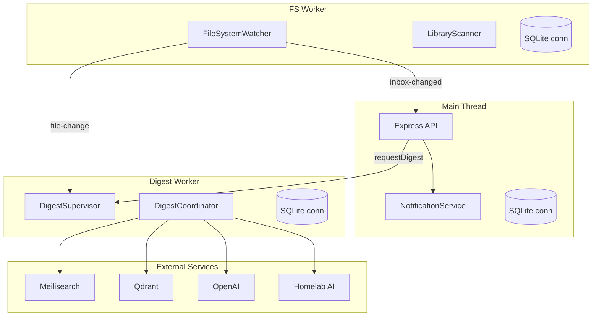
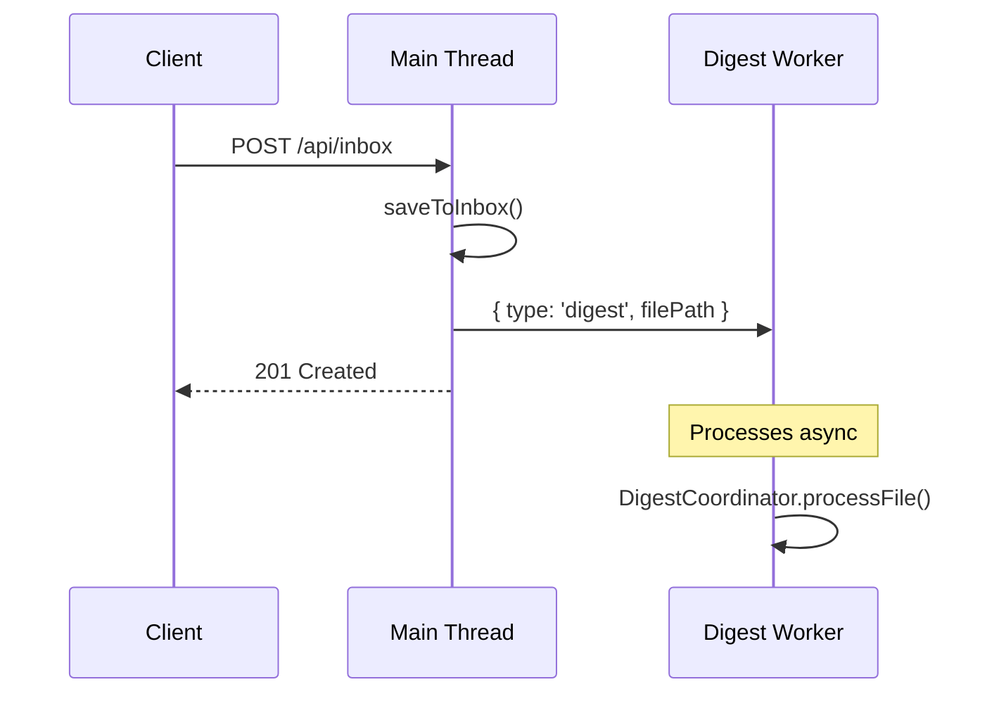
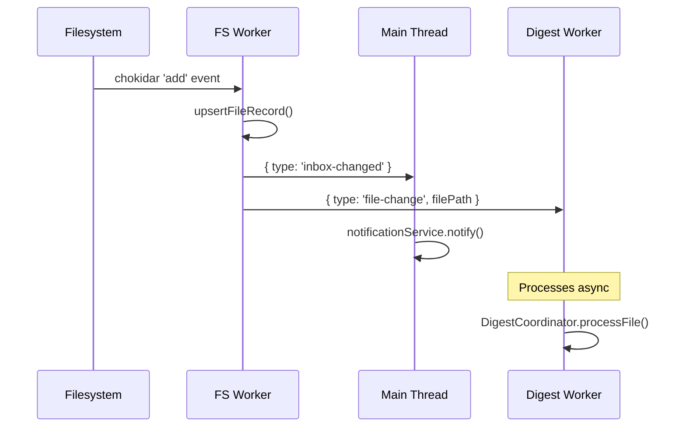
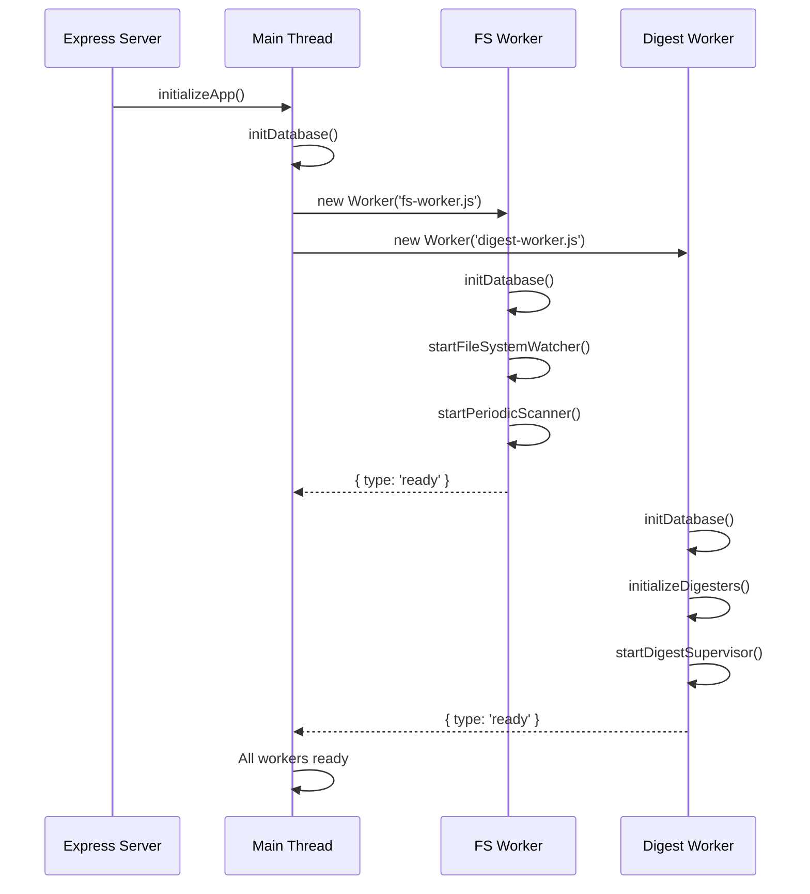

## Overview

The application uses worker threads to isolate background processing from the API server:



## Workers

### FS Worker
**Purpose:** File system monitoring and scanning

**Components:**
- FileSystemWatcher - realtime file change detection (chokidar)
- LibraryScanner - periodic full filesystem scan (hourly)

**Messages received:**
| Type | Payload | Description |
|------|---------|-------------|
| `shutdown` | - | Graceful shutdown |

**Messages sent:**
| Type | Payload | Description |
|------|---------|-------------|
| `ready` | - | Worker initialized |
| `inbox-changed` | `{ timestamp }` | File added/removed in inbox |
| `file-change` | `{ filePath, isNew, contentChanged }` | File changed (forwarded to digest worker) |
| `shutdown-complete` | - | Shutdown done |

---

### Digest Worker
**Purpose:** All digest processing

**Components:**
- DigestSupervisor - orchestrates processing loop
- DigestCoordinator - processes files through digesters

**Digesters:**
1. `doc-to-screenshot` - Render document to image
2. `doc-to-markdown` - Convert doc to markdown
3. `image-captioning` - AI caption (Homelab)
4. `image-objects` - Object detection (Homelab)
5. `image-ocr` - OCR text extraction
6. `speech-recognition` - Whisper transcription
7. `speaker-embedding` - Speaker diarization
8. `speech-recognition-cleanup` - Transcript cleanup (OpenAI)
9. `speech-recognition-summary` - Summary (OpenAI)
10. `url-crawler` - Fetch and parse URLs
11. `url-crawl-summary` - Summarize crawled content (OpenAI)
12. `tags` - Generate tags (OpenAI)
13. `search-keyword` - Index to Meilisearch
14. `search-semantic` - Embed to Qdrant

**Messages received:**
| Type | Payload | Description |
|------|---------|-------------|
| `digest` | `{ filePath, reset? }` | Process file through digesters |
| `file-change` | `{ filePath, isNew, contentChanged }` | From FS worker |
| `shutdown` | - | Graceful shutdown |

**Messages sent:**
| Type | Payload | Description |
|------|---------|-------------|
| `ready` | - | Worker initialized |
| `digest-started` | `{ filePath }` | Processing started |
| `digest-complete` | `{ filePath, success }` | Processing finished |
| `shutdown-complete` | - | Shutdown done |

---

## SQLite Strategy

Each worker creates its own database connection. The `app/.server/db/` module provides all typed functions - only the connection initialization differs per worker.

```typescript
// Each worker calls once at startup
import { initDatabase } from '~/.server/db/client';
initDatabase();

// Then uses existing functions normally
import { getFileByPath, upsertFileRecord } from '~/.server/db/files';
```

**SQLite configuration for concurrent access:**
```sql
PRAGMA journal_mode = WAL;      -- Write-ahead logging
PRAGMA busy_timeout = 5000;     -- Wait up to 5s for locks
PRAGMA synchronous = NORMAL;    -- Balance durability/speed
```

---

## Message Flow

### File Upload


### File Detected by Watcher


---

## Startup Sequence



---

## File Structure

```
app/.server/
├── workers/
│   ├── fs-worker.ts        # FS worker entry point
│   ├── fs-client.ts        # Main thread client for FS worker
│   ├── digest-worker.ts    # Digest worker entry point
│   ├── digest-client.ts    # Main thread client for digest worker
│   └── types.ts            # Shared message types
├── db/
│   └── client.ts           # Updated for multi-connection
└── init.ts                 # Updated to start workers
```
