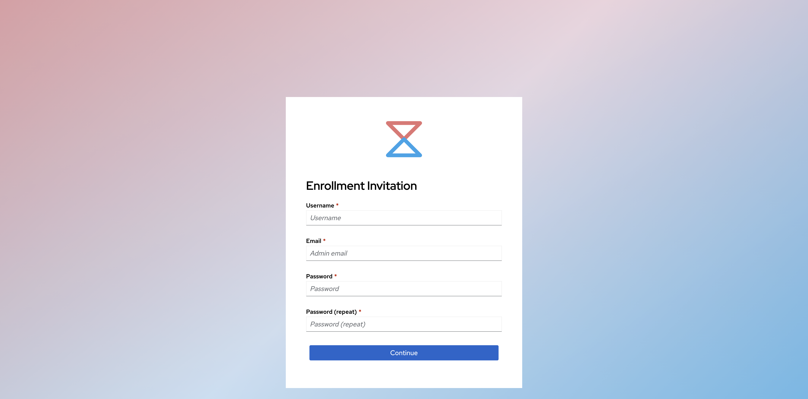
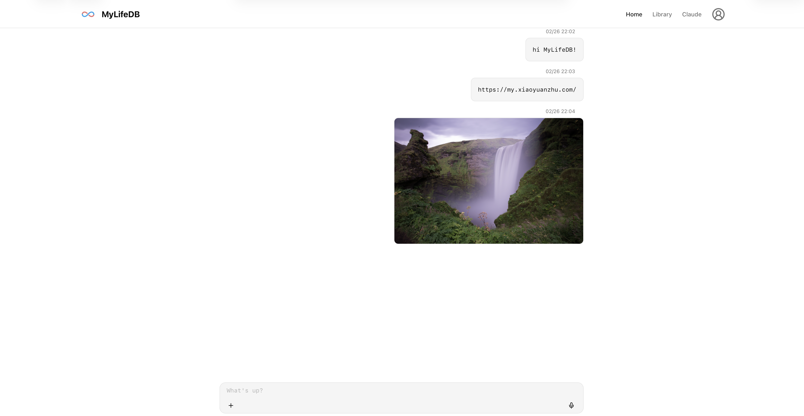

> Want to run MyLifeDB on your own server? See [Selfhosted](./selfhosted).

## 1. Create your account

MyLifeDB hosted service is currently under beta testing and invitation-only. Please follow us on [小红书](https://www.xiaohongshu.com/user/profile/6868961e000000001d017125) or join our [Discord](https://discord.gg/89pWBuxPw).

## 2. Access the web app

Visit https://my.xiaoyuanzhu.com/.

## 3. Install the app

| Platform | Link |
|----------|------|
| iOS | [Join TestFlight](https://testflight.apple.com/join/Rh1S5aKq) |
| macOS | [Download](https://github.com/xiaoyuanzhu-com/my-life-db-apple/releases) |
| Android | TBD |
| Windows | TBD |
| Linux | TBD |
