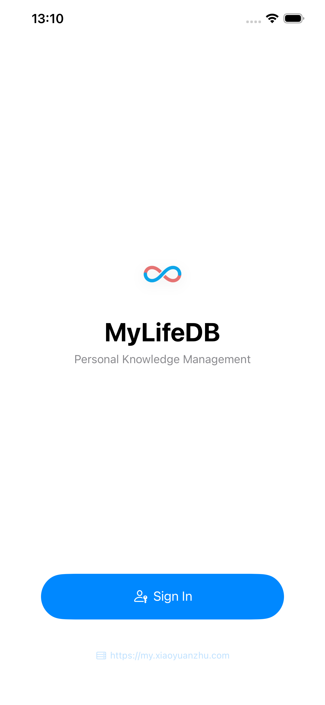
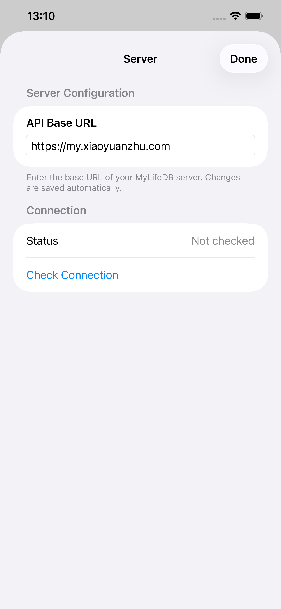

Run MyLifeDB on your own hardware with Docker.

## Server Setup

1. Create a directory for MyLifeDB and set up the data folders:

```bash
my-life-db/
├── docker-compose.yml
├── .env                     # (required, for environment variables)
├── data/                    # (required, user data dir)
├── .my-life-db/             # (required, app data dir)
├── .claude/                 # (optional, if you use the Claude Code integration and want to persist its data)
├── .claude.json
├── .claude.json.backup
├── .ssh/                    # (optional, if you want to use Git integration with SSH keys)
└── .config/                 # (optional, for Git config)
    └── git/
```

you will need:

```bash
mkdir -p data .my-life-db .claude .ssh .config/git
touch .claude.json .claude.json.backup
```

2. Create a `docker-compose.yml` file:

```yaml
services:
  my-life-db:
    image: ghcr.io/xiaoyuanzhu-com/my-life-db:latest
    container_name: my-life-db
    ports:
      - "${MLD_PORT:-12345}:12345"
    volumes:
      - ./data:/home/xiaoyuanzhu/my-life-db/data
      - ./.my-life-db:/home/xiaoyuanzhu/my-life-db/.my-life-db
      - ./.claude:/home/xiaoyuanzhu/.claude
      - ./.claude.json:/home/xiaoyuanzhu/.claude.json
      - ./.claude.json.backup:/home/xiaoyuanzhu/.claude.json.backup
      - ./.ssh:/home/xiaoyuanzhu/.ssh
      - ./.config:/home/xiaoyuanzhu/.config
    env_file: .env
    restart: unless-stopped
```

3. Update environment variables

```bash
# ===== Container paths (match docker-compose volume mounts) =====
XDG_CONFIG_HOME=/home/xiaoyuanzhu/.config
USER_DATA_DIR=/home/xiaoyuanzhu/my-life-db/data
APP_DATA_DIR=/home/xiaoyuanzhu/my-life-db/.my-life-db

# ===== Port =====
MLD_PORT=12345

# ===== Auth =====
# Options: none, password, oauth
MLD_AUTH_MODE=none

# ===== OAuth (only if MLD_AUTH_MODE=oauth) =====
# MLD_OAUTH_CLIENT_ID=your-client-id
# MLD_OAUTH_CLIENT_SECRET=your-client-secret
# MLD_OAUTH_ISSUER_URL=https://your-oidc-provider/.well-known/openid-configuration
# MLD_OAUTH_REDIRECT_URI=https://your-domain/api/system/oauth/callback
# MLD_EXPECTED_USERNAME=your-username

# ===== AI (optional) =====
# OPENAI_API_KEY=sk-...
# OPENAI_BASE_URL=https://api.openai.com/v1
# OPENAI_MODEL=gpt-4o-mini
```

4. Visit [http://localhost:12345](http://localhost:12345).

## Client Setup

Web app with PWA support is already available, visit http://localhost:12345.

To use with native apps, tap the server URL at the bottom of the login screen and change it to your self-hosted instance.

<div style="display: flex; gap: 1rem;">





</div>

## Reverse Proxy

You can put MyLifeDB behind a reverse proxy like Caddy or Nginx for HTTPS.

### Caddy

```
mylifedb.example.com {
    reverse_proxy localhost:12345
}
```

After setting up the reverse proxy, you can use the https URL in the client apps.
