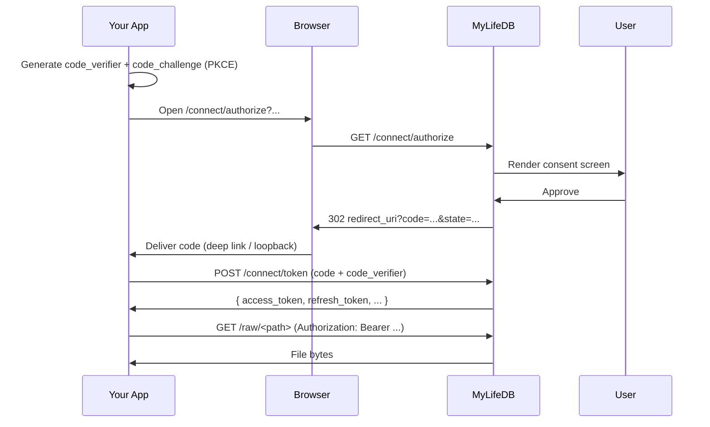

> Last edit: 2026-05-04

**MyLifeDB Connect** is an OAuth 2.1 authorization server that lets your app request scoped access to a user's MyLifeDB instance. This page is the protocol reference — everything you need to build a working integration.

If you're new to Connect as a concept, read the [user-facing overview](/docs/features/connect/) first.

## At a glance

- **Spec:** OAuth 2.1, Authorization Code grant with **PKCE** (RFC 7636) — `S256` only, no `plain`.
- **Client type:** Public clients only. There is no client secret. **PKCE is mandatory.**
- **No registration.** Your app self-declares its `client_id`, name, icon, and redirect URI on the first authorize call. The user's consent is the trust gate.
- **Scopes are path-keyed:** `files.read:<path>` and `files.write:<path>` over the user's filesystem.
- **Bearer tokens** are presented to `/raw/*` (byte I/O) and the entire `/api/data/*` subtree (JSON file metadata, search, folders, uploads, SSE events) — anywhere a `files.read` or `files.write` scope check applies.

## Base URL

Every endpoint below is relative to the user's MyLifeDB instance:

```
https://<user-instance>
```

The user gives you the URL. **Do not hardcode** — every user runs their own instance.

## End-to-end flow



## 1. Discovery

```http
GET /.well-known/oauth-authorization-server
```

Returns the [RFC 8414](https://www.rfc-editor.org/rfc/rfc8414) authorization-server metadata document. Use this to discover endpoint URLs at runtime instead of hardcoding paths.

**Example response:**

```json
{
  "issuer": "https://my.example.com",
  "authorization_endpoint": "https://my.example.com/connect/authorize",
  "token_endpoint": "https://my.example.com/connect/token",
  "revocation_endpoint": "https://my.example.com/connect/revoke",
  "response_types_supported": ["code"],
  "grant_types_supported": ["authorization_code", "refresh_token"],
  "code_challenge_methods_supported": ["S256"],
  "token_endpoint_auth_methods_supported": ["none"],
  "scopes_supported": ["files.read", "files.write"]
}
```

## 2. Authorize (browser redirect)

This is **not** a JSON API call. You open the URL in the user's browser; the browser does the redirect dance.

```
GET /connect/authorize
  ?response_type=code
  &client_id=<your_client_id>
  &app_name=<display name>
  &app_icon=<icon URL, optional>
  &redirect_uri=<your callback>
  &scope=<space-separated scopes>
  &state=<your CSRF token>
  &code_challenge=<base64url(sha256(verifier))>
  &code_challenge_method=S256
```

### Required query parameters

| Param | Required | Notes |
|-------|----------|-------|
| `response_type` | yes | Must be `code`. |
| `client_id` | yes | Stable identifier for your app, e.g. `com.acme.notes`. Used to look you up across runs. |
| `app_name` | yes | Display name shown on the consent screen. |
| `app_icon` | no | Icon URL shown on the consent screen. |
| `redirect_uri` | yes | Where the browser is sent on approval/denial. Must match exactly on token exchange. |
| `scope` | yes | Space-separated. At least one. See [Scopes](#scopes). |
| `state` | yes (recommended) | Opaque CSRF token. MyLifeDB echoes it back unchanged on the redirect. |
| `code_challenge` | yes | `base64url(sha256(code_verifier))`, no padding. |
| `code_challenge_method` | yes | Must be `S256`. |

### PKCE generation

The `code_verifier` is a high-entropy string you generate and **keep secret** until token exchange.

- 43–128 characters from `[A-Z][a-z][0-9]-._~`
- The `code_challenge` is `base64url(sha256(verifier))` with no `=` padding

Reference snippets:

```python
import secrets, hashlib, base64
verifier = base64.urlsafe_b64encode(secrets.token_bytes(48)).rstrip(b"=").decode()
challenge = base64.urlsafe_b64encode(
    hashlib.sha256(verifier.encode()).digest()
).rstrip(b"=").decode()
```

```js
// Node 16+ / browsers via WebCrypto
const verifier = base64url(crypto.getRandomValues(new Uint8Array(48)));
const challenge = base64url(
  await crypto.subtle.digest("SHA-256", new TextEncoder().encode(verifier))
);

function base64url(buf) {
  return btoa(String.fromCharCode(...new Uint8Array(buf)))
    .replace(/\+/g, "-").replace(/\//g, "_").replace(/=+$/, "");
}
```

### Redirect outcomes

**On approval:**

```
HTTP/1.1 302 Found
Location: <redirect_uri>?code=<one-time code>&state=<your state>
```

**On denial:**

```
HTTP/1.1 302 Found
Location: <redirect_uri>?error=access_denied&state=<your state>
```

The `code` is single-use and **expires in 60 seconds**. Exchange it immediately.

### Silent re-authorization

If the user has already granted your `client_id` a scope set that **covers** the new request, the consent screen is skipped automatically. This makes "open the app, get a fresh token" feel instant for returning users.

### Choosing a `redirect_uri`

| App type | Recommended redirect URI |
|----------|--------------------------|
| Native desktop / CLI | `http://127.0.0.1:<port>/callback` (loopback HTTP, listen on the port temporarily) |
| Native mobile | Custom scheme: `com.acme.notes://oauth/callback` |
| SPA / web app | Your hosted callback URL on `https://` |

The redirect URI is matched **exactly** at token exchange. Use the same string in both `/authorize` and `/token`.

## 3. Token exchange

### Code → tokens

```http
POST /connect/token
Content-Type: application/x-www-form-urlencoded

grant_type=authorization_code
&code=<code from redirect>
&client_id=<your_client_id>
&redirect_uri=<exact redirect_uri from authorize>
&code_verifier=<the verifier you generated>
```

**Response (`200 OK`):**

```json
{
  "access_token": "WPiL7-Sd...",
  "refresh_token": "9oZH4ki...",
  "token_type": "Bearer",
  "expires_in": 3600,
  "refresh_expires_in": 2592000,
  "scope": "files.read:/journal files.write:/apps/acme-notes"
}
```

| Field | Meaning |
|-------|---------|
| `access_token` | Bearer token for `/raw/*` calls. |
| `refresh_token` | Use to obtain a new access token without user interaction. |
| `token_type` | Always `"Bearer"`. |
| `expires_in` | Access token TTL in seconds. Currently 3600 (1 hour). |
| `refresh_expires_in` | Refresh token TTL in seconds. Currently 2592000 (30 days). |
| `scope` | The granted scope set, possibly broader than requested if the user had previously granted more. |

### Refresh rotation

```http
POST /connect/token
Content-Type: application/x-www-form-urlencoded

grant_type=refresh_token
&refresh_token=<current refresh token>
&client_id=<your_client_id>
```

Returns the same shape as the code exchange, with a **new** access token **and a new refresh token**. The old refresh token is immediately invalidated.

:::caution[Refresh tokens are single-use]
Each refresh exchange invalidates the previous refresh token and issues a new one. **You must persist the new refresh token** before discarding the old one. If your app crashes between calls, you may need the user to re-authorize.
:::

#### Replay protection

If a refresh token is presented after it has been rotated or revoked, MyLifeDB **revokes the entire rotation chain** — every token descended from the same original code is killed. This protects against stolen tokens being replayed.

In practice: never store multiple refresh tokens for the same grant; always overwrite immediately after a successful refresh.

## 4. Use the access token

Present the token as a Bearer credential on `/raw/*` (byte I/O) **or** any `/api/data/*` endpoint (JSON metadata, folders, search, uploads, events).

### Byte I/O on `/raw/*`

```http
GET /raw/journal/2026/04/30.md HTTP/1.1
Authorization: Bearer <access_token>
```

```http
PUT /raw/apps/acme-notes/log.txt HTTP/1.1
Authorization: Bearer <access_token>
Content-Type: text/plain

new file contents
```

For browser embeds (``, `<audio>`) or WebSocket clients that can't set headers, the token may also be passed as a query parameter:

```
GET /raw/photos/2026/sunset.jpg?connect_access_token=<access_token>
```

### Metadata + control on `/api/data/*`

The same Bearer token works on the JSON data API. Each endpoint enforces a specific scope based on what it does:

| Endpoint | Required scope |
|----------|----------------|
| `GET /api/data/files/*path` | `files.read:<path>` |
| `DELETE /api/data/files/*path` | `files.write:<path>` |
| `PATCH /api/data/files/*path` (rename) | `files.write:<path>` |
| `PATCH /api/data/files/*path` (move, body has `parent`) | `files.write:<path>` (source) **and** `files.write:<parent>` (destination) |
| `POST /api/data/folders` | `files.write:<parent>/<name>` |
| `GET /api/data/tree?path=…` | `files.read:<path>` |
| `PUT /api/data/pins/*path`, `DELETE /api/data/pins/*path` | `files.write:<path>` |
| `GET /api/data/download?path=…` | `files.read:<path>` |
| `POST /api/data/extract` | `files.write:<destination>` |
| `GET /api/data/root`, `GET /api/data/directories` | `files.read:/` |
| `GET /api/data/search` | `files.read:/` (results are filter-trimmed to the granted subtree) |
| `PUT /api/data/uploads/simple/*path`, `POST /api/data/uploads/finalize`, `Any /api/data/uploads/tus/*` | `files.write:<destination>` |
| `GET /api/data/apps`, `GET /api/data/apps/:id`, `GET /api/data/collectors`, `PUT /api/data/collectors/:id` | `files.read:/` (collectors PUT requires `files.write:/`) |

Example — fetch file metadata without downloading bytes:

```http
GET /api/data/files/journal/2026/04/30.md HTTP/1.1
Authorization: Bearer <access_token>
Accept: application/json
```

### Filesystem events (SSE)

Subscribe to a filtered live stream of filesystem events. The connection stays open while events match your scope; events outside your granted subtree are silently dropped before reaching the client.

```http
GET /api/data/events HTTP/1.1
Authorization: Bearer <access_token>
Accept: text/event-stream
```

Owner sessions (cookie-authenticated, no Connect token) see every event. Connect callers see only events whose `path` is covered by their `files.read` scope; path-less events (e.g. heartbeats, connection-state events) always pass through.

### Authorization outcomes

| Status | Meaning |
|--------|---------|
| `200` / `204` | Allowed — your scope covers the path. |
| `401 AUTH_INVALID_TOKEN` | Token is unknown, expired, revoked, or wrong kind (e.g. presenting a refresh token here). Refresh and retry. |
| `403 FORBIDDEN` | Token is valid but its scope does not cover the requested path. Re-authorize with broader scope, or stay within bounds. |

Every gated request is appended to the per-app audit log the user sees in **Settings → Connected Apps**.

## 5. Revoke a token

Implement [RFC 7009](https://www.rfc-editor.org/rfc/rfc7009) revocation when your app logs out, uninstalls, or rotates credentials:

```http
POST /connect/revoke
Content-Type: application/x-www-form-urlencoded

token=<access or refresh token>
&token_type_hint=<access_token | refresh_token>
```

Always returns `200 OK`, even if the token did not exist (per RFC 7009 §2.2). Revoking a refresh token kills the entire rotation chain.

## Scopes

A scope is a single capability. Multiple scopes are joined by spaces in the `scope` parameter and the `scope` response field.

### Scope syntax

```
files.read:<path>
files.write:<path>
```

- `<path>` is **rooted** (always starts with `/`) and **cleaned** (no `..` segments, no trailing slash except for `/` itself).
- Paths are filesystem paths inside the user's MyLifeDB data root, **not** URL paths.
- Granting `files.read:/journal` permits reads of `/journal/2026/04.md` and any deeper descendant. It does **not** permit writes, and it does not permit `/notes`.
- The special path `/` means **whole-filesystem access** and is rendered prominently on the consent screen as a broad permission.

### Subset semantics

A scope `parent` covers `child` when:

1. They share the same family (`files.read` vs `files.write` are distinct), **and**
2. `parent.path` equals `child.path`, **or** `child.path` starts with `parent.path + "/"`, **or** `parent.path == "/"`.

Examples:

| Granted | Requested | Allowed? |
|---------|-----------|----------|
| `files.read:/` | `files.read:/journal` | yes |
| `files.read:/journal` | `files.read:/journal/2026` | yes |
| `files.read:/journal` | `files.read:/notes` | no |
| `files.read:/journal` | `files.write:/journal` | no — different family |
| `files.read:/journal` | `files.read:/journalfoo` | no — must be a path-segment ancestor |

### Scope hygiene for app builders

- **Ask narrow.** Request the smallest scope your app needs. Users approve narrow requests faster and trust them more.
- **Ask once.** If you need broader access later, re-issue `/connect/authorize` with the new scope; MyLifeDB will show the user only the *new* scopes since the existing grant.
- **Pick a stable subtree.** If your app stores its own data, ask for a dedicated subtree like `files.write:/apps/<your-app-name>` rather than `files.write:/`.

## Token lifetimes

| Token | TTL | Notes |
|-------|-----|-------|
| Authorization code | **60 seconds** | Single-use. Exchange immediately. |
| Access token | **1 hour** | Refresh when expired. |
| Refresh token | **30 days** | Rotated on every use; reuse triggers chain revocation. |

Lifetimes are subject to change. Always trust `expires_in` and `refresh_expires_in` from the token response over hardcoded values.

## Error responses

The `/connect/token` and `/connect/revoke` endpoints follow [RFC 6749 §5.2](https://www.rfc-editor.org/rfc/rfc6749#section-5.2):

```json
{
  "error": "invalid_grant",
  "error_description": "code is invalid, expired, or already used"
}
```

| `error` code | Meaning | Typical fix |
|--------------|---------|-------------|
| `invalid_request` | Missing or malformed parameters | Check required form fields |
| `invalid_grant` | Code expired/used, redirect_uri mismatch, PKCE failure, or refresh token invalid | Re-run authorize flow |
| `unsupported_grant_type` | `grant_type` was not `authorization_code` or `refresh_token` | Fix the request |
| `server_error` | MyLifeDB-side failure | Retry with backoff |

The `/raw/*` endpoint returns MyLifeDB's standard error envelope:

```json
{
  "error": {
    "code": "FORBIDDEN",
    "message": "connect token does not have files.read scope for this path"
  }
}
```

## Reference: complete client (Python)

A full reference client lives in the `my-life-db` repo at [`examples/connect-python/`](https://github.com/xiaoyuanzhu-com/my-life-db/tree/main/examples/connect-python) — it covers discovery, the PKCE flow, token rotation, every `/api/data/*` operation (root, tree, folders, uploads, file metadata, deletion), SSE subscription, and revocation.

The minimal snippet below is a copy-pasteable starting point if you want to handle just the auth handshake yourself.

```python
import base64, hashlib, http.server, secrets, threading, urllib.parse, webbrowser
import requests

BASE = "http://localhost:12345"   # the user's MyLifeDB instance
CLIENT_ID = "com.acme.notes"
APP_NAME = "Acme Notes"
SCOPE = "files.read:/journal"
REDIRECT_PORT = 8765
REDIRECT_URI = f"http://127.0.0.1:{REDIRECT_PORT}/callback"

# 1. PKCE
verifier = base64.urlsafe_b64encode(secrets.token_bytes(48)).rstrip(b"=").decode()
challenge = base64.urlsafe_b64encode(
    hashlib.sha256(verifier.encode()).digest()
).rstrip(b"=").decode()
state = secrets.token_urlsafe(16)

# 2. Tiny loopback server to capture the redirect
captured = {}
class Handler(http.server.BaseHTTPRequestHandler):
    def do_GET(self):
        q = urllib.parse.parse_qs(urllib.parse.urlparse(self.path).query)
        captured.update({k: v[0] for k, v in q.items()})
        self.send_response(200); self.end_headers()
        self.wfile.write(b"OK, you can close this tab.")
    def log_message(self, *a): pass

server = http.server.HTTPServer(("127.0.0.1", REDIRECT_PORT), Handler)
threading.Thread(target=server.handle_request, daemon=True).start()

# 3. Open the consent URL
authorize_url = BASE + "/connect/authorize?" + urllib.parse.urlencode({
    "response_type": "code",
    "client_id": CLIENT_ID,
    "app_name": APP_NAME,
    "redirect_uri": REDIRECT_URI,
    "scope": SCOPE,
    "state": state,
    "code_challenge": challenge,
    "code_challenge_method": "S256",
})
webbrowser.open(authorize_url)
server.server_close()  # released after handle_request returns

assert captured.get("state") == state, "CSRF mismatch"
assert "code" in captured, captured.get("error", "no code")

# 4. Exchange code for tokens
r = requests.post(BASE + "/connect/token", data={
    "grant_type": "authorization_code",
    "code": captured["code"],
    "client_id": CLIENT_ID,
    "redirect_uri": REDIRECT_URI,
    "code_verifier": verifier,
})
r.raise_for_status()
tokens = r.json()
print("access_token:", tokens["access_token"][:12], "...")

# 5. Use it
files = requests.get(BASE + "/raw/journal/", headers={
    "Authorization": "Bearer " + tokens["access_token"],
})
print(files.status_code, files.text[:200])
```

## Compatibility notes

- **OAuth 2.1 only.** No `plain` PKCE, no implicit grant, no resource-owner-password grant.
- **No client secret.** `token_endpoint_auth_methods_supported` is `["none"]`. Public clients only — PKCE replaces the secret.
- **One redirect URI per call.** MyLifeDB unions over time, but each authorize/token pair must match exactly.
- **`verified` flag** on clients is reserved for a future allowlist layer. It does not affect the protocol today.
