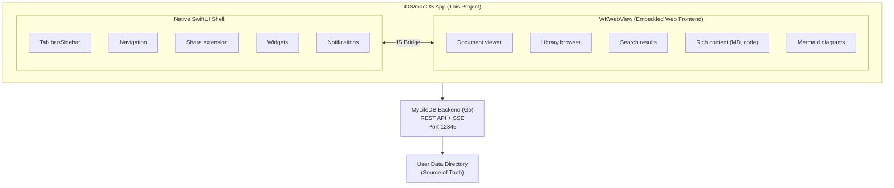
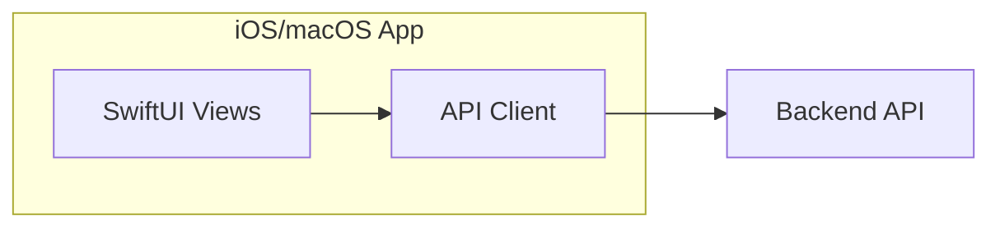
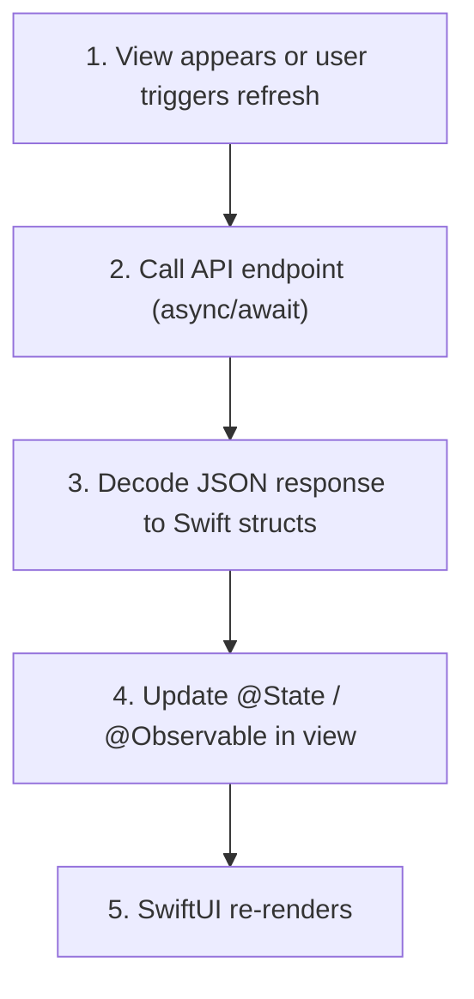
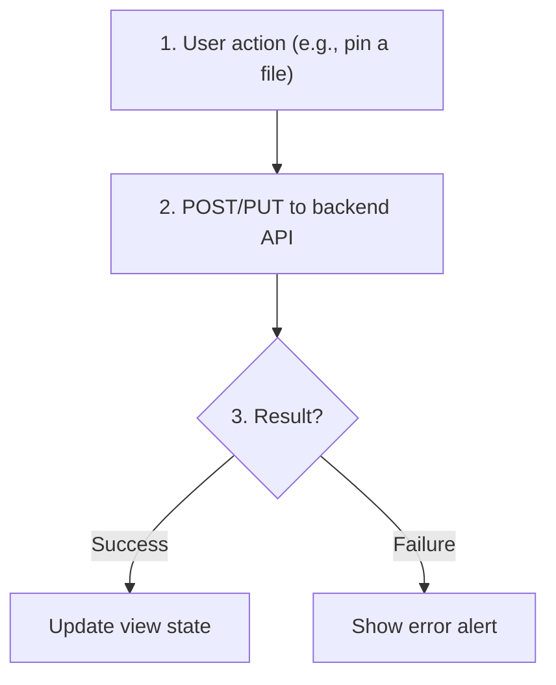
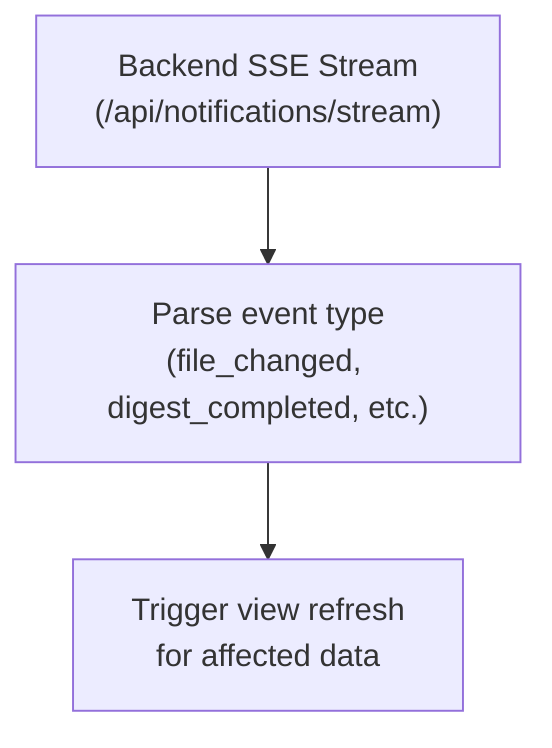

> Native iOS/macOS client for the MyLifeDB personal knowledge management system.

**Related docs:**
- **[UI Architecture](./ui-architecture)** -- Hybrid Native + WebView UI approach

---

## Design Principles

### 1. One Codebase, Multiple Platforms

The app uses **SwiftUI** with a single Xcode target that builds for:
- iPhone
- iPad
- Mac (native, not Catalyst)
- Vision Pro

**How it works:**
- Single target with `SUPPORTED_PLATFORMS = "iphoneos iphonesimulator macosx xros xrsimulator"`
- Platform-specific code uses `#if os(iOS)` / `#if os(macOS)` compile-time conditionals
- SwiftUI automatically adapts navigation, controls, and layout per platform

**Code sharing goal:** 80-95% shared code across all platforms.

### 2. Hybrid Native + WebView Architecture

The app uses a **hybrid approach**: native SwiftUI shell with WebView-rendered content.



**Why hybrid?**
- Reuse 80%+ of existing web frontend code
- Web excels at rich content (Markdown, code highlighting, Mermaid)
- Industry standard (Instagram, Uber, Slack, Discord use this approach)
- Single codebase for complex UI, faster iteration

**See [UI Architecture](./ui-architecture)** for detailed UI implementation.

**Key insight:** The backend owns all data. The iOS app is a view into that data.

### 3. Simple API Client (No Offline/Sync)

The app directly fetches from the backend API. No local caching or sync logic.



- **Fetch on demand** -- Views request data from API when needed
- **No local database** -- Data lives on the backend only
- **Simple error handling** -- Show error states when offline

---

## High-Level Architecture

```
MyLifeDB/
+-- App/
|   +-- MyLifeDBApp.swift          # Entry point
|
+-- API/                           # Backend API client
|   +-- APIClient.swift            # HTTP client with auth
|   +-- Endpoints/                 # Endpoint definitions
|   |   +-- InboxAPI.swift
|   |   +-- LibraryAPI.swift
|   |   +-- SearchAPI.swift
|   |   +-- PeopleAPI.swift
|   +-- Models/                    # API response types (Codable structs)
|       +-- InboxItem.swift
|       +-- FileRecord.swift
|       +-- SearchResult.swift
|       +-- ...
|
+-- Views/                         # SwiftUI views
|   +-- Inbox/
|   |   +-- InboxView.swift
|   |   +-- InboxItemRow.swift
|   +-- Library/
|   |   +-- LibraryView.swift
|   |   +-- FileTreeView.swift
|   +-- Search/
|   |   +-- SearchView.swift
|   +-- People/
|   |   +-- PeopleView.swift
|   +-- Shared/
|       +-- FilePreview.swift
|       +-- DigestBadge.swift
|
+-- Platform/                      # Platform-specific code
|   +-- iOS/
|   +-- macOS/
|
+-- Resources/
    +-- Assets.xcassets
```

---

## Data Flow

### Reading Data



### Writing Data



### Real-time Updates (SSE) -- Optional



---

## Backend API Overview

The app consumes these key API endpoints:

### Inbox
| Method | Endpoint | Description |
|--------|----------|-------------|
| GET | `/api/inbox` | List inbox items (paginated) |
| GET | `/api/inbox/:id` | Get single item with digests |
| POST | `/api/inbox/:id/reenrich` | Re-run AI processing |
| GET | `/api/inbox/pinned` | List pinned inbox items |

### Library
| Method | Endpoint | Description |
|--------|----------|-------------|
| GET | `/api/library/tree` | Get folder tree structure |
| GET | `/api/library/file-info?path=...` | Get file details |
| POST | `/api/library/folder` | Create new folder |
| POST | `/api/library/move` | Move file/folder |
| POST | `/api/library/rename` | Rename file/folder |

### Search
| Method | Endpoint | Description |
|--------|----------|-------------|
| GET | `/api/search?q=...` | Full-text + semantic search |

### People
| Method | Endpoint | Description |
|--------|----------|-------------|
| GET | `/api/people` | List all people |
| POST | `/api/people` | Create person |
| PUT | `/api/people/:id` | Update person |
| POST | `/api/people/:id/merge` | Merge two people |

### Files
| Method | Endpoint | Description |
|--------|----------|-------------|
| GET | `/raw/*path` | Serve raw file content |
| PUT | `/raw/*path` | Save file content |
| GET | `/sqlar/*path` | Serve file from archive (screenshots, etc.) |

### Real-time
| Method | Endpoint | Description |
|--------|----------|-------------|
| GET | `/api/notifications/stream` | SSE event stream |

---

## Key Types (Backend -> Swift Mapping)

### FileRecord
```swift
// Backend JSON (camelCase)
{
  "path": "inbox/photo.jpg",
  "name": "photo.jpg",
  "isFolder": false,
  "size": 102400,
  "mimeType": "image/jpeg",
  "modifiedAt": "2024-01-15T10:30:00Z",
  "createdAt": "2024-01-15T10:30:00Z",
  "textPreview": null,
  "screenshotSqlar": "inbox/photo.jpg/screenshot.png"
}

// Swift struct (Codable, not SwiftData)
struct FileRecord: Codable, Identifiable {
    var id: String { path }
    let path: String
    let name: String
    let isFolder: Bool
    let size: Int?
    let mimeType: String?
    let modifiedAt: Date
    let createdAt: Date
    let textPreview: String?
    let screenshotSqlar: String?
}
```

### InboxItem (API response, extends FileRecord)
```swift
struct InboxItem: Codable, Identifiable {
    var id: String { path }
    let path: String
    let name: String
    let isFolder: Bool
    let size: Int?
    let mimeType: String?
    let modifiedAt: Date
    let createdAt: Date
    let digests: [Digest]
    let textPreview: String?
    let screenshotSqlar: String?
    let isPinned: Bool
}
```

### Digest
```swift
struct Digest: Codable, Identifiable {
    let id: String
    let filePath: String
    let digester: String  // e.g., "summary", "tags", "screenshot"
    let status: DigestStatus
    let content: String?
    let sqlarName: String?
    let error: String?
    let attempts: Int
    let createdAt: Date
    let updatedAt: Date
}

enum DigestStatus: String, Codable {
    case pending, processing, completed, failed, skipped, todo
}
```

---

## Platform-Specific Considerations

### iOS
- Bottom tab bar navigation
- Pull-to-refresh
- Swipe actions on list rows
- Share sheet integration

### macOS
- Sidebar navigation (NavigationSplitView)
- Keyboard shortcuts
- Menu bar integration (optional)
- Multi-window support
- Drag & drop from Finder

### Shared
- NavigationSplitView (works on both)
- Same API models (Codable structs)
- Same API client

---

## Authentication

The app supports the same auth modes as the web client:

| Mode | Description |
|------|-------------|
| `none` | No authentication (local/dev) |
| `password` | Simple password auth |
| `oauth` | OAuth 2.0 / OIDC flow |

For OAuth, the app uses ASWebAuthenticationSession for the login flow.

---

## Future Considerations

1. **Widgets** -- Show pinned items or recent inbox on home screen
2. **Shortcuts** -- Siri shortcuts for quick capture
3. **Share Extension** -- Save content from other apps to inbox
