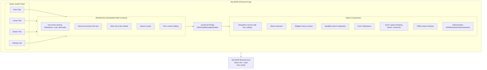
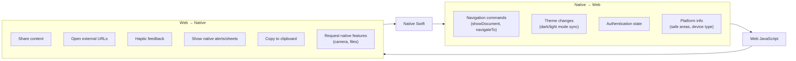

> Hybrid Native + WebView approach for the iOS/macOS client.

---

## Overview

The MyLifeDB Apple client uses a **hybrid architecture** that combines a native SwiftUI shell with WebView-rendered content. This approach maximizes code reuse with the existing web frontend while maintaining a native app experience.

### Why Hybrid?

| Factor | Decision |
|--------|----------|
| **Existing web UI** | We already have a fully functional React web app |
| **Rich content rendering** | Markdown, code highlighting, Mermaid diagrams -- web excels at these |
| **Small team** | One codebase to maintain for web + mobile |
| **Content-focused app** | Not a game or camera app -- WebView performance is sufficient |
| **Industry standard** | Instagram, Uber, Amazon, Discord, Slack all use this approach |

### Trade-offs Accepted

| Benefit | Cost |
|---------|------|
| 80-95% code reuse from web | Slightly less "native feel" in content areas |
| Instant updates (web deploys) | Requires network for most content |
| Superior rich text rendering | Minor scroll physics differences |
| Single codebase for complex UI | JavaScript bridge complexity |

---

## Architecture Diagram



---

## Component Responsibilities

### Native Shell (SwiftUI)

The native shell provides platform-appropriate chrome and OS integrations.

| Component | Platform | Implementation |
|-----------|----------|----------------|
| **Tab Bar** | iOS | Native `TabView` |
| **Sidebar** | macOS/iPad | Native `NavigationSplitView` |
| **Toolbar** | All | Native toolbar with platform styling |
| **Pull-to-refresh** | iOS | Native `.refreshable()` modifier |
| **Share Extension** | All | Native app extension |
| **Widgets** | iOS/macOS | Native WidgetKit |
| **Spotlight** | All | Native Core Spotlight |
| **Notifications** | All | Native UserNotifications |

### WebView Content

The WebView renders all content-heavy screens using the existing web frontend.

| Screen | Why WebView |
|--------|-------------|
| **Document Viewer** | Markdown rendering, code syntax highlighting, Mermaid diagrams |
| **Inbox List** | Complex item cards with previews, badges, actions |
| **Library Browser** | File tree, folder navigation, breadcrumbs |
| **Search Results** | Rich result cards with highlighting |
| **Item Details** | Full digest display, metadata, actions |
| **Settings** | Forms, toggles, preferences |

### JavaScript Bridge

Communication layer between native Swift and web JavaScript.



---

## Screen-by-Screen Breakdown

### Main Navigation

```
iOS (iPhone):                    macOS / iPad:
+---------------------+          +----------------------------------+
|                     |          | +---------+                      |
|                     |          | | Sidebar |                      |
|     WebView         |          | |         |     WebView          |
|     Content         |          | | . Inbox |     Content          |
|                     |          | | . Lib   |                      |
|                     |          | | . Search|                      |
|                     |          | | . ...   |                      |
+---------------------+          | +---------+                      |
| [Inbox][Lib][Search]|          +----------------------------------+
+---------------------+          Native sidebar + WebView content
Native tab bar + WebView
```

### Document Viewer

The document viewer is 100% WebView -- this is where hybrid shines.

```
+------------------------------------------+
| <- Back              | ... | -> Share    |  <- Native toolbar
+------------------------------------------+
|                                          |
|  # Document Title                        |
|                                          |
|  Here is **markdown** with `code`.       |
|                                          |
|  ```python                               |
|  def hello():                            |  <- WebView handles:
|      print("Hello!")  # highlighted      |     . Markdown
|  ```                                     |     . Syntax highlighting
|                                          |     . Mermaid diagrams
|  ```mermaid                              |     . Images
|  graph TD                                |     . Tables
|      A --> B                             |     . Math (LaTeX)
|  ```                                     |
|                                          |
|  [Rendered Mermaid Diagram]              |
|                                          |
+------------------------------------------+
```

---

## Implementation Details

### WebView Setup

```swift
// WebViewContainer.swift
import SwiftUI
import WebKit

struct WebViewContainer: UIViewRepresentable {
    let url: URL
    @Binding var path: String

    func makeUIView(context: Context) -> WKWebView {
        let config = WKWebViewConfiguration()

        // Enable JavaScript bridge
        let contentController = config.userContentController
        contentController.add(context.coordinator, name: "native")

        // Inject platform info
        let script = WKUserScript(
            source: "window.isNativeApp = true; window.platform = '\(platform)';",
            injectionTime: .atDocumentStart,
            forMainFrameOnly: true
        )
        contentController.addUserScript(script)

        let webView = WKWebView(frame: .zero, configuration: config)
        webView.navigationDelegate = context.coordinator

        // iOS: match system scroll behavior
        webView.scrollView.contentInsetAdjustmentBehavior = .automatic

        return webView
    }

    // ... coordinator for message handling
}
```

### JavaScript Bridge Protocol

```typescript
// web/src/native-bridge.ts

interface NativeBridge {
    // Web -> Native
    share(data: { title: string; url?: string; text?: string }): void;
    haptic(style: 'light' | 'medium' | 'heavy'): void;
    openExternal(url: string): void;
    copyToClipboard(text: string): void;
    showAlert(title: string, message: string): void;
    navigate(path: string): void;  // Update native nav state
}

// Native -> Web (called via evaluateJavaScript)
interface NativeToWeb {
    navigateTo(path: string): void;
    setTheme(theme: 'light' | 'dark' | 'system'): void;
    setAuthToken(token: string | null): void;
    refresh(): void;
}

// Usage in web app
if (window.isNativeApp) {
    window.webkit.messageHandlers.native.postMessage({
        action: 'share',
        data: { title: 'Document', url: '...' }
    });
}
```

### Swift Message Handler

```swift
// NativeBridgeHandler.swift

class NativeBridgeHandler: NSObject, WKScriptMessageHandler {
    weak var coordinator: WebViewCoordinator?

    func userContentController(
        _ controller: WKUserContentController,
        didReceive message: WKScriptMessage
    ) {
        guard let body = message.body as? [String: Any],
              let action = body["action"] as? String else { return }

        switch action {
        case "share":
            handleShare(body["data"] as? [String: Any])
        case "haptic":
            handleHaptic(body["style"] as? String)
        case "navigate":
            handleNavigate(body["path"] as? String)
        case "copyToClipboard":
            handleCopy(body["text"] as? String)
        default:
            print("Unknown native bridge action: \(action)")
        }
    }

    private func handleShare(_ data: [String: Any]?) {
        // Present native share sheet
    }

    private func handleHaptic(_ style: String?) {
        let generator = UIImpactFeedbackGenerator(
            style: style == "heavy" ? .heavy : .medium
        )
        generator.impactOccurred()
    }
}
```

---

## Web App Adaptations

The web frontend needs minor adaptations for the native context:

### 1. Detect Native Context

```typescript
// utils/platform.ts
export const isNativeApp = () =>
    typeof window !== 'undefined' && window.isNativeApp === true;

export const platform = () =>
    window.platform || 'web';  // 'ios', 'macos', 'web'
```

### 2. Conditional UI

```tsx
// Hide web-only elements in native app
{!isNativeApp() && <WebHeader />}

// Use native share instead of web share
const handleShare = () => {
    if (isNativeApp()) {
        window.webkit.messageHandlers.native.postMessage({
            action: 'share',
            data: { title, url }
        });
    } else {
        navigator.share({ title, url });
    }
};
```

### 3. Safe Area Handling

```css
/* Respect iOS safe areas */
.content {
    padding-top: env(safe-area-inset-top);
    padding-bottom: env(safe-area-inset-bottom);
    padding-left: env(safe-area-inset-left);
    padding-right: env(safe-area-inset-right);
}

/* When native nav is present, don't double-pad */
.native-app .content {
    padding-top: 0;
}
```

### 4. Theme Sync

```typescript
// Sync with iOS appearance
window.addEventListener('themeChange', (e) => {
    document.documentElement.setAttribute('data-theme', e.detail.theme);
});
```

---

## URL Routing Strategy

The app uses URL-based routing for WebView navigation:

| Native Action | WebView URL |
|---------------|-------------|
| Tap Inbox tab | `{baseURL}/inbox` |
| Tap Library tab | `{baseURL}/library` |
| Tap Search tab | `{baseURL}/search` |
| Open document | `{baseURL}/view/{path}` |
| Open settings | `{baseURL}/settings` |

### Deep Linking

```swift
// Handle deep links
func handleDeepLink(_ url: URL) {
    // mylifedb://view/inbox/document.md
    // -> Navigate to document in WebView

    let path = url.path
    webView.evaluateJavaScript("window.navigateTo('\(path)')")
}
```

---

## Performance Optimizations

### 1. Preload WebView

```swift
// Preload on app launch to hide initial load time
class WebViewPool {
    static let shared = WebViewPool()
    private var preloadedWebView: WKWebView?

    func preload(url: URL) {
        let webView = createWebView()
        webView.load(URLRequest(url: url))
        preloadedWebView = webView
    }

    func getPreloadedWebView() -> WKWebView? {
        defer { preloadedWebView = nil }
        return preloadedWebView
    }
}

// In AppDelegate/App init
WebViewPool.shared.preload(url: backendURL)
```

### 2. Persistent WebView

```swift
// Keep WebView alive across tab switches (don't recreate)
struct ContentView: View {
    @StateObject private var webViewState = WebViewState()

    var body: some View {
        TabView {
            // Same WebView instance, different routes
            WebViewTab(state: webViewState, route: "/inbox")
            WebViewTab(state: webViewState, route: "/library")
            WebViewTab(state: webViewState, route: "/search")
        }
    }
}
```

### 3. Local Asset Bundle (Optional)

For offline support or faster loads, bundle web assets in the app:

```swift
// Load from local bundle instead of network
let localURL = Bundle.main.url(
    forResource: "index",
    withExtension: "html",
    subdirectory: "WebAssets"
)
webView.loadFileURL(localURL!, allowingReadAccessTo: localURL!.deletingLastPathComponent())
```

---

## Native-Only Features

These features remain fully native (no WebView):

| Feature | Reason |
|---------|--------|
| **Share Extension** | Must be native app extension |
| **Widgets** | WidgetKit requires native |
| **Spotlight Search** | Core Spotlight is native API |
| **Push Notifications** | UserNotifications framework |
| **Quick Capture** | Needs to launch instantly |
| **Offline Banner** | Must work without WebView |
| **Authentication Flow** | ASWebAuthenticationSession |
| **App Settings** | System Settings integration |

---

## Migration Path

If we later decide to make specific screens fully native:

1. **Identify candidate** -- Screen with poor WebView UX or needs offline
2. **Build native version** -- SwiftUI implementation
3. **Feature flag** -- Toggle between WebView and native
4. **Gradual rollout** -- Test with subset of users
5. **Remove WebView version** -- Once native is stable

Likely candidates for future native implementation:
- Quick capture flow (needs to be instant)
- Offline inbox view (cached items)
- Image gallery (native performance)

---

## Testing Strategy

### WebView Testing

```swift
// UI Tests can interact with WebView content
func testInboxLoads() {
    let app = XCUIApplication()
    app.launch()

    // Wait for WebView content
    let inboxTitle = app.webViews.staticTexts["Inbox"]
    XCTAssert(inboxTitle.waitForExistence(timeout: 5))
}
```

### JavaScript Bridge Testing

```swift
// Test native bridge receives messages
func testShareBridge() {
    let expectation = expectation(description: "Share called")

    bridgeHandler.onShare = { data in
        XCTAssertEqual(data.title, "Test")
        expectation.fulfill()
    }

    webView.evaluateJavaScript("""
        window.webkit.messageHandlers.native.postMessage({
            action: 'share',
            data: { title: 'Test' }
        })
    """)

    wait(for: [expectation], timeout: 1)
}
```

---

## Summary

| Layer | Technology | Responsibility |
|-------|------------|----------------|
| **Shell** | SwiftUI | Navigation, OS integration, native features |
| **Content** | WKWebView | All content rendering, complex UI |
| **Bridge** | JS <-> Swift | Communication between layers |
| **Backend** | Existing Go API | Data source (unchanged) |

This hybrid approach lets us:
- Ship faster (reuse 80%+ of web code)
- Render complex content perfectly (markdown, code, diagrams)
- Maintain native app feel (shell, gestures, OS integration)
- Update content UI without App Store review
- Keep one codebase for web + mobile
