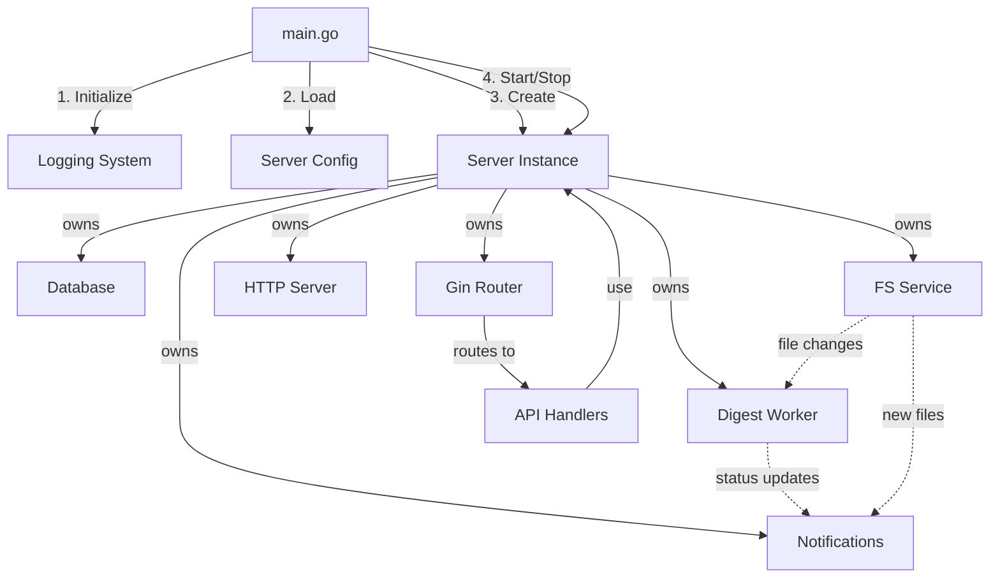
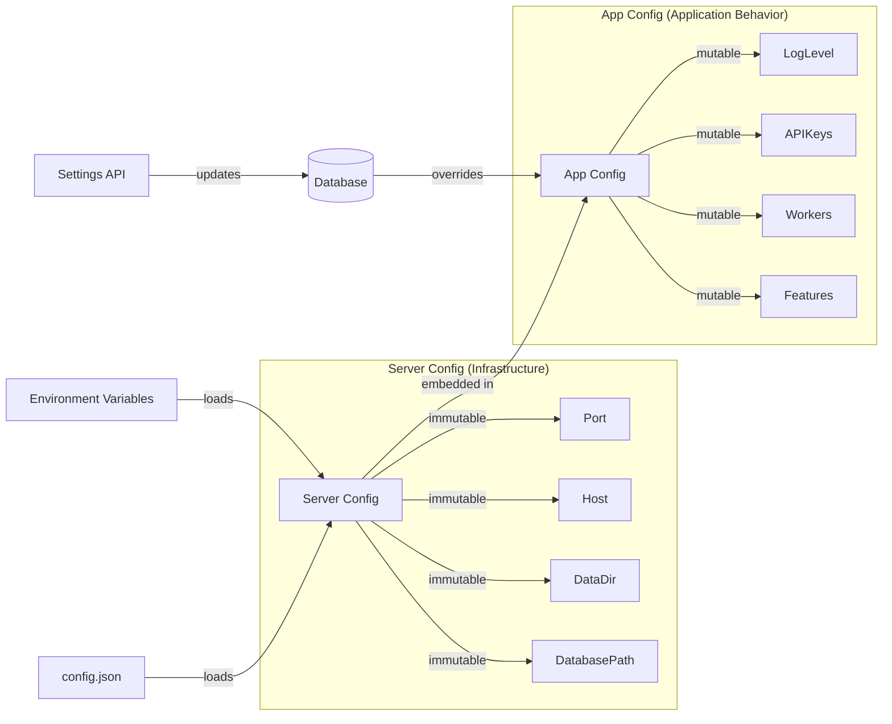
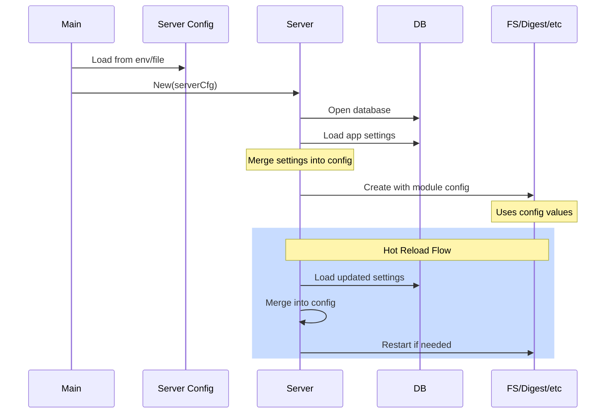
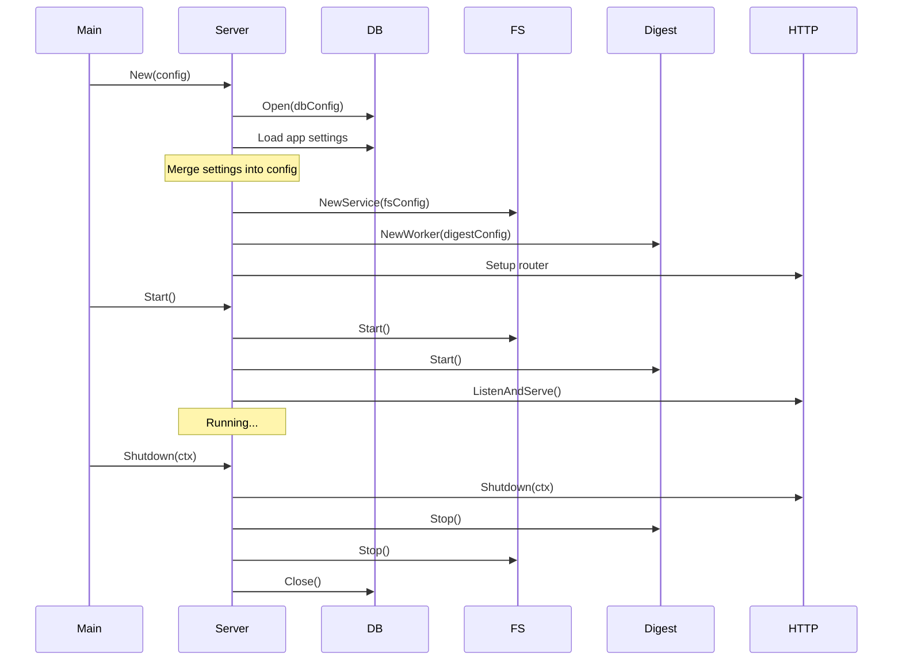
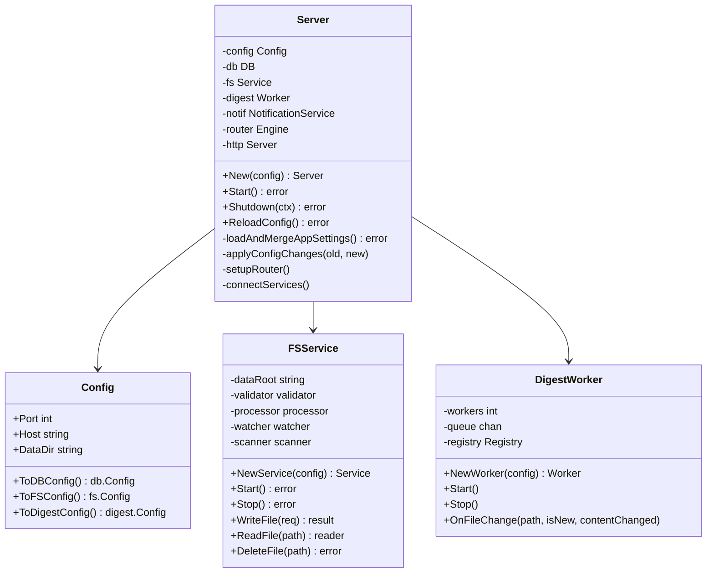
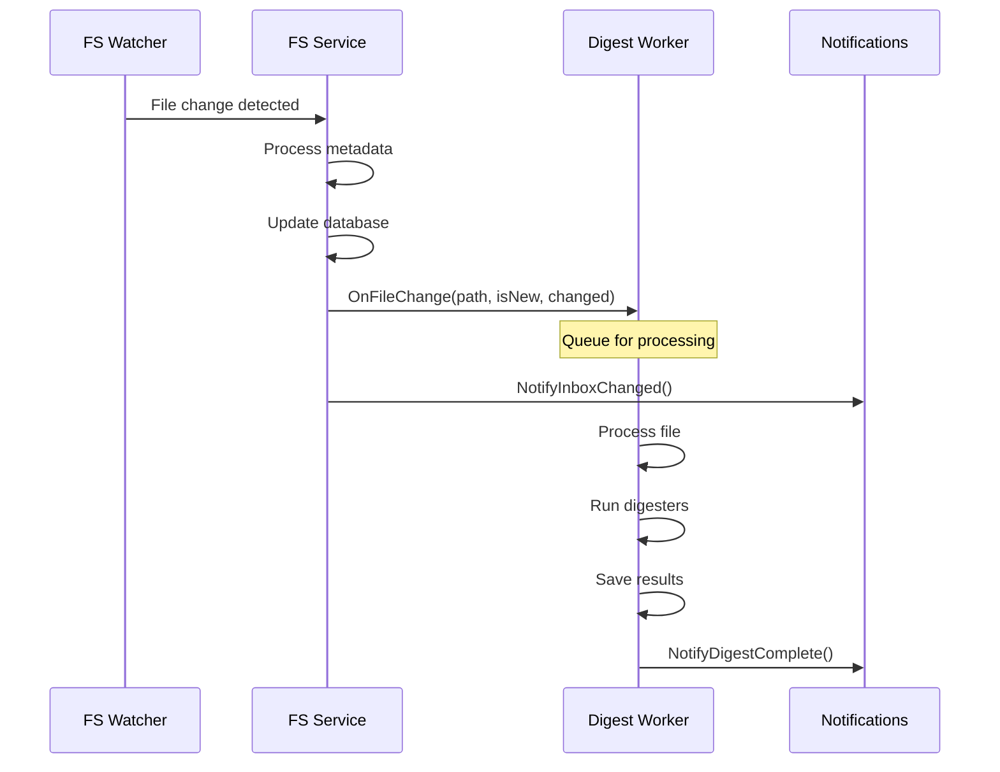
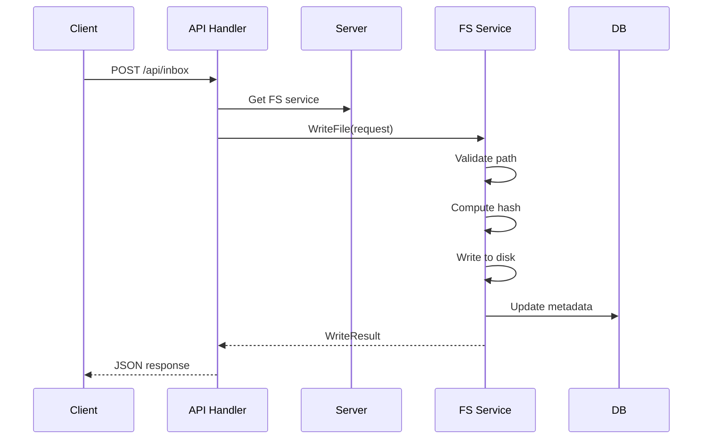
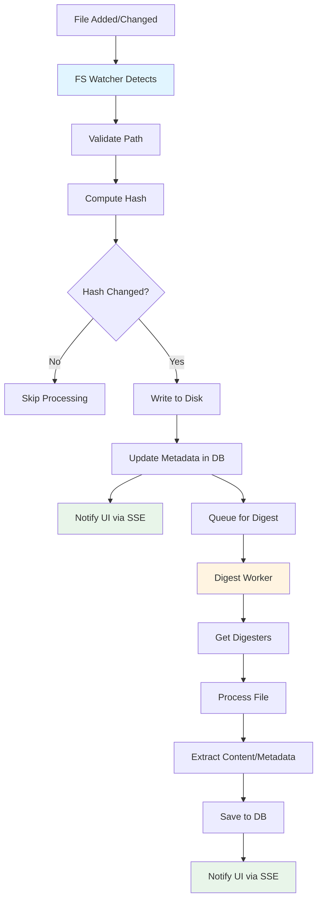
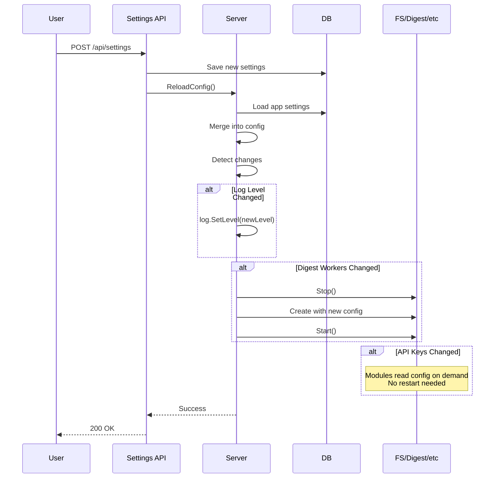
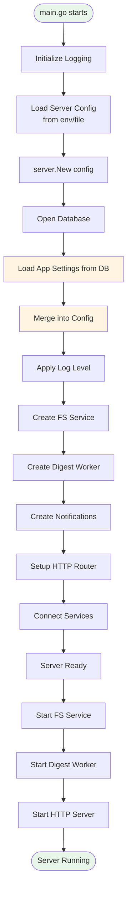

## Overview

MyLifeDB backend is a Go HTTP server that manages a filesystem-based personal knowledge management system. The architecture follows a modular design with clear separation of concerns, explicit dependency management, and support for hot-reloadable configuration.

## Core Principles

1. **No Dependency Injection**: Simple, straightforward initialization
2. **Explicit Dependencies**: Each module declares what it needs via typed config structs
3. **Clear Ownership**: Server owns all stateful components
4. **No Global Singletons**: Except for cross-cutting concerns (logging)
5. **Hot-Reloadable Config**: Application settings can be updated at runtime

## High-Level Architecture



## Configuration Architecture

### Two-Level Configuration System



### Configuration Flow



### Server Config (Immutable Infrastructure)

**Source**: Environment variables, config.json
**Loaded**: Once at startup
**Requires restart**: To change

```go
type server.Config struct {
    // Server infrastructure
    Port int
    Host string
    Env  string

    // Paths
    DataDir      string
    DatabasePath string

    // App settings (can be overridden by DB)
    FSScanInterval  time.Duration
    FSWatchEnabled  bool
    DigestWorkers   int
    DigestQueueSize int
    OpenAIKey       string
    HAIDBaseURL     string
    HAIDAPIKey      string
    MeiliHost       string
    QdrantURL       string
    QdrantAPIKey    string
}
```

### Module Configs (Explicit Dependencies)

Each module defines its own config struct:

```go
// db.Config
type db.Config struct {
    Path            string
    MaxOpenConns    int
    MaxIdleConns    int
    ConnMaxLifetime time.Duration
}

// fs.Config
type fs.Config struct {
    DataRoot     string
    ScanInterval time.Duration
    WatchEnabled bool
}

// digest.Config
type digest.Config struct {
    Workers      int
    QueueSize    int
    OpenAIKey    string
    HAIDBaseURL  string
    HAIDAPIKey   string
}
```

Server converts its config to module configs:

```go
func (c *server.Config) ToDBConfig() db.Config
func (c *server.Config) ToFSConfig() fs.Config
func (c *server.Config) ToDigestConfig() digest.Config
```

## Component Lifecycle



## Server Structure



## Module Communication

### FS Service -> Digest Worker



### API Handler -> Server Components



## Data Flow

### File Processing Pipeline



## Hot Config Reload



## Directory Structure

```
backend/
├── main.go                 # Entry point, main() owns lifecycle
├── server/                 # Server package
│   ├── server.go          # Server struct and lifecycle
│   ├── config.go          # Server config struct
│   └── routes.go          # Router setup
├── api/                   # API handlers
│   ├── inbox.go           # Inbox endpoints
│   ├── library.go         # Library endpoints
│   ├── settings.go        # Settings endpoints
│   └── ...
├── db/                    # Database layer
│   ├── db.go             # Connection management
│   ├── config.go         # DB config struct
│   ├── migrations.go     # Schema migrations
│   └── models.go         # DB models
├── fs/                    # Filesystem service
│   ├── service.go        # Main service
│   ├── config.go         # FS config struct
│   ├── watcher.go        # File watcher
│   ├── scanner.go        # Periodic scanner
│   └── operations.go     # File operations
├── workers/               # Background workers
│   └── digest/
│       ├── worker.go     # Main worker
│       ├── config.go     # Digest config struct
│       ├── registry.go   # Digester registry
│       └── digesters/    # Individual digesters
├── notifications/         # SSE notifications
│   └── service.go
├── log/                   # Logging (package-level)
│   └── log.go
├── config/                # Config utilities (if needed)
│   └── loader.go
└── utils/                 # Shared utilities
    └── ...
```

## Initialization Sequence



## API Handler Pattern

Handlers access server components through the server instance:

```go
// API handlers receive server instance
func SetupRoutes(router *gin.Engine, srv *Server) {
    router.POST("/api/inbox", srv.handleInboxCreate)
    router.GET("/api/inbox/:id", srv.handleInboxGet)
    // ...
}

// Handler methods on server
func (s *Server) handleInboxCreate(c *gin.Context) {
    // Access server components directly
    result, err := s.fs.WriteFile(c.Request.Context(), fs.WriteRequest{
        // ...
    })

    if err != nil {
        c.JSON(500, gin.H{"error": err.Error()})
        return
    }

    c.JSON(200, result)
}
```

## Error Handling Strategy

1. **Infrastructure errors** (DB, FS): Fail fast at startup
2. **Runtime errors**: Log and return HTTP error responses
3. **Background worker errors**: Log and retry with backoff
4. **Graceful degradation**: Continue serving if non-critical services fail

## Testing Strategy

### Unit Tests
- Each module testable independently
- Pass mock configs to constructors
- No global state to clean up

```go
func TestFSService(t *testing.T) {
    cfg := fs.Config{
        DataRoot: t.TempDir(),
        ScanInterval: 1 * time.Hour,
        WatchEnabled: false,
    }

    svc := fs.NewService(cfg)
    // Test service methods
}
```

### Integration Tests
- Create test server with test config
- Use test database
- Verify end-to-end flows

```go
func TestServerIntegration(t *testing.T) {
    cfg := &server.Config{
        Port: 0,  // Random port
        DataDir: t.TempDir(),
        DatabasePath: filepath.Join(t.TempDir(), "test.db"),
    }

    srv, err := server.New(cfg)
    // Test full server lifecycle
}
```

## Performance Considerations

1. **Concurrency**: Digest worker uses multiple goroutines
2. **File locking**: FS service prevents concurrent writes to same file
3. **Database**: Connection pooling with reasonable limits
4. **Caching**: Minimal in-memory caching, filesystem is source of truth
5. **SSE**: Efficient broadcast to multiple clients

## Future Enhancements

1. **Metrics**: Add Prometheus metrics endpoint
2. **Tracing**: Add OpenTelemetry tracing
3. **Health checks**: Add `/health` endpoint
4. **Rate limiting**: Add per-endpoint rate limiting
5. **API versioning**: Support multiple API versions
6. **Config validation**: Add comprehensive config validation
7. **Config schemas**: JSON schema for config files
