## Table of Contents

- [Technical Design Document: MyLifeDB](#technical-design-document-mylifedb)
  - [Table of Contents](#table-of-contents)
  - [1. Design Principles](#1-design-principles)
  - [2. System Architecture](#2-system-architecture)
    - [2.1 Layered Flow](#21-layered-flow)
    - [2.2 Module Responsibilities](#22-module-responsibilities)
  - [3. Server Runtime & Lifecycle](#3-server-runtime--lifecycle)
    - [3.1 Process Architecture](#31-process-architecture)
    - [3.2 Entry Point](#32-entry-point)
    - [3.3 Initialization Sequence](#33-initialization-sequence)
    - [3.4 Graceful Shutdown](#34-graceful-shutdown)
    - [3.5 HMR Behavior](#35-hmr-behavior)
    - [3.6 Real-time Updates](#36-real-time-updates)
  - [4. Technology Stack](#4-technology-stack)
  - [5. Data Models](#5-data-models)
  - [6. API Specifications](#6-api-specifications)
  - [7. Design Decisions](#7-design-decisions)
  - [8. Feature Designs](#8-feature-designs)
    - [8.1 Inbox](#81-inbox)
    - [8.2 Library](#82-library)
    - [8.3 Digesters](#83-digesters)
    - [8.4 Search](#84-search)
    - [8.5 File System Scan](#85-file-system-scan)
    - [8.6 Task Queue](#86-task-queue)
    - [8.7 Misc](#87-misc)
  - [9. UI Overview](#9-ui-overview)

---

## 1. Design Principles

- **Filesystem as truth:** `MY_DATA_DIR` hosts inbox + library folders; SQLite mirrors metadata and can be recomputed at any time.
- **Derived data is disposable:** Digests, search documents, and cache rows can be rebuilt, so recovery is always deterministic.
- **Local-first performance:** Next.js API routes run on the same machine as the data, eliminating network hops while still supporting background work.
- **Transparent modules:** Each service (scanner, digesters, task queue, search bridge) is discoverable under `src/lib/*`.
- **Progressive UX:** Core flows (capture, browse, inspect files) work without AI; digesters and search are additive layers.

---

## 2. System Architecture

### 2.1 Layered Flow


### 2.2 Module Responsibilities

- **Experience layer:** React 19 components (OmniInput, inbox cards, library tree, file inspector, search overlay) fetch JSON from API routes and keep minimal local state.
- **App Router layer:** Handles routing, validation, and streaming responses. API routes live beside the UI and call into domain services.
- **Domain + background layer:** `src/lib/db/*` exposes catalog queries, `src/lib/digest/*` registers digesters, `src/lib/search/*` syncs with Meilisearch, and `src/lib/task-queue/*` powers background execution.
- **Storage & infra layer:** User directories hold raw files, SQLite + SQLAR hold metadata and binary digests, and Meilisearch indexes the rebuildable textual view.

---

## 3. Server Runtime & Lifecycle

### 3.1 Process Architecture

The application runs as a **single Node.js process** that handles both HTTP requests and background services:


**Why single process:**
- Simplicity: No IPC, no separate worker deployment
- SQLite: better-sqlite3 is synchronous and single-connection friendly
- Local-first: All data is on the same machine, no network overhead
- Sufficient for personal use with moderate load

### 3.2 Entry Point

A unified `server.js` handles both development and production modes:

```javascript
// Development: Vite middleware for HMR
const viteDevServer = await vite.createServer({ server: { middlewareMode: true } });
app.use(viteDevServer.middlewares);
app.use(createRequestHandler({
  build: () => viteDevServer.ssrLoadModule("virtual:react-router/server-build")
}));

// Production: Static assets + compiled build
app.use(express.static("build/client"));
app.use(createRequestHandler({ build: await import("./build/server/index.js") }));
```

**npm scripts:**
- `npm run dev` -> `node server.js` (development with HMR)
- `npm run build` -> `react-router build` (compile for production)
- `npm start` -> `NODE_ENV=production node server.js` (production)

### 3.3 Initialization Sequence

On server start, `initializeApp()` runs exactly once:

```
1. Database connection (lazy, on first query)
2. Run migrations (schema_version table)
3. initializeDigesters() - register digester implementations
4. initializeTaskQueue() - start worker polling loop
5. startFileSystemWatcher() - chokidar watches MY_DATA_DIR
6. startPeriodicScanner() - hourly full filesystem scan
7. startDigestSupervisor() - background digest processing
8. registerShutdownHooks() - SIGTERM/SIGINT handlers
```

Services use `globalThis` guards to prevent duplicate initialization during HMR in development.

### 3.4 Graceful Shutdown

On SIGTERM/SIGINT:

```
1. stopDigestSupervisor() - stop processing loop
2. stopFileSystemWatcher() - close chokidar
3. stopPeriodicScanner() - clear interval
4. shutdownWorker() - wait for active tasks (5s timeout)
5. Close Vite dev server (if running)
6. Close Express server
7. process.exit(0)
```

### 3.5 HMR Behavior

| What changes | What happens |
|--------------|--------------|
| React components | Hot reloaded in browser instantly |
| Route loaders/actions | Reloaded via `ssrLoadModule` on next request |
| `app/.server/*` modules | Reloaded on next request |
| `server.js` | Requires manual restart |
| Initialization code | Requires manual restart |

Background services (file watcher, task worker, etc.) are long-running and don't restart on HMR. Changes to their configuration require a full server restart.

### 3.6 Real-time Updates

The `FileSystemWatcher` detects file changes and broadcasts notifications via Server-Sent Events:

```mermaid
graph LR
    A["File saved"] --> B["chokidar detects"]
    B --> C["upsert DB"]
    C --> D["notificationService.notify()"]
    D --> E["SSE stream → browser"]
    E --> F["useInboxNotifications hook"]
    F --> G["InboxFeed re-fetches data"]
```



Notification types: `inbox-changed`, `pin-changed`

---

## 4. Technology Stack

Single stack across client and server: React Router 7 with React 19 + TypeScript, Tailwind + shadcn UI primitives, Node 20 runtime with better-sqlite3 for SQLite access, optional Meilisearch for keyword search, and zero additional backend services.

### 4.1 Dark Mode Implementation

**IMPORTANT:** This project uses **CSS media query-based dark mode**, NOT Tailwind's class-based dark mode.

**How it works:**
- Dark mode is controlled by `@media (prefers-color-scheme: dark)` in `globals.css`
- CSS custom properties (`--background`, `--foreground`, `--muted`, etc.) automatically switch values based on system preference
- The `<html>` element does NOT have a `.dark` class

**Tailwind `dark:` variant does NOT work:**
- The `@custom-variant dark (&:is(.dark *))` in globals.css means `dark:` requires a `.dark` ancestor class
- Since we use media queries (no `.dark` class), Tailwind's `dark:` prefix has no effect
- Example: `bg-white dark:bg-zinc-900` will always show white background

**Correct approach - use semantic color variables:**
```tsx
// WRONG - dark: variant won't work
className="bg-white dark:bg-zinc-900 text-gray-900 dark:text-gray-100"

// CORRECT - semantic variables auto-adapt to dark mode
className="bg-background text-foreground"
className="bg-muted text-muted-foreground"
className="border-border bg-card"
```

**For status colors, use opacity-based values:**
```tsx
// WRONG - dark: variant won't work
className="bg-red-50 dark:bg-red-950 border-red-200 dark:border-red-900"

// CORRECT - opacity works in both modes
className="bg-destructive/10 border-destructive/30"
className="bg-emerald-500/10 border-emerald-500/30"
className="bg-primary/5 border-primary/20"
```

**Available semantic colors:**
| Variable | Usage |
|----------|-------|
| `background` / `foreground` | Page background, primary text |
| `card` / `card-foreground` | Card surfaces |
| `muted` / `muted-foreground` | Subdued backgrounds, secondary text |
| `primary` / `primary-foreground` | Primary actions, emphasis |
| `destructive` | Error states, delete actions |
| `border` | Borders and dividers |
| `input` | Form input borders |
| `ring` | Focus rings |

---

## 5. Data Models

Entries, spaces, clusters, insights, and principles no longer exist. The database now mirrors the filesystem (`files`), digest output (`digests` + `sqlar`), search replicas (`meili_documents`), operational state (`tasks`), user preferences (`settings`), and schema tracking (`schema_version`).


- **Files:** Rebuildable catalog of every folder and file under `MY_DATA_DIR`, including hashes for sub-10MB files.
- **Digests:** Status tracker for every enrichment a file has undergone (summary, tags, screenshot, OCR, etc.).
- **SQLAR:** Stores binary digest payloads such as screenshots or OCR bundles without polluting the user filesystem.
- **Tasks:** Durable queue with retry tracking; payloads mention file paths or digest IDs instead of legacy item IDs.
- **Meili documents:** Mirror the textual view of each file to Meilisearch; rows are regenerated whenever digests change.
- **Settings:** Holds local configuration such as search host overrides, log level, and vendor credentials.
- **Schema version:** Records applied migrations so schema evolution can be coordinated with scanners/digesters.

---

## 6. API Specifications

| Endpoint | Description | Notes |
|----------|-------------|-------|
| `GET /api/inbox` | Lists top-level inbox files/folders with selected digest summaries. | Uses `listFilesWithDigests` and optional pagination parameters. |
| `POST /api/inbox` | Saves text and/or uploaded files into the `inbox/` folder. | Streams multipart uploads straight to disk, then records metadata. |
| `GET /api/library/tree` | Returns a filtered directory tree for any library folder. | Skips reserved/hidden entries and normalizes paths to stay within `MY_DATA_DIR`. |
| `GET /api/library/file` | Streams file contents (text JSON or binary download). | Honors `download=true` and content-type inference; no "size opt" flag is exposed. |
| `GET /api/library/file-info` | Returns metadata plus every digest for a file. | Drives the file inspector page to show enrichment status. |
| `GET /api/digest/[...path]` | Reports digest status for any file path. | Wraps `getDigestStatusView` for UI polling. |
| `POST /api/digest/[...path]` | Forces digesters to run for a specific file. | Instantiates `DigestCoordinator` and enqueues/runs applicable digesters. |
| `GET /api/search` | Keyword search backed by Meilisearch + digest metadata. | Supports query, pagination, optional MIME/path filters, and returns enriched file payloads. |
| `GET/POST /api/tasks` | Lists, creates, or updates tasks for background work. | Used internally by digesters and by the settings UI for manual retries. |
| `GET /api/tasks/stats` and `/api/tasks/worker/*` | Operational endpoints to inspect/pause/resume the worker. | Provides visibility into background processing. |
| `GET/PUT /api/settings` | Reads or updates local configuration. | Captures data root, vendor settings, and UI preferences. |

---

## 7. Design Decisions

| Topic | Options Considered | Decision (with rationale) |
|-------|--------------------|---------------------------|
| Source of truth | Keep legacy `items` table vs. rely on filesystem | Filesystem chosen: simpler mental model, avoids ID drift, and lets other tools edit data without migrations. |
| Digest storage | Sidecar folders, object storage, or SQLAR | SQLAR keeps derived artifacts in SQLite so they can be vacuumed, compressed, and versioned atomically. |
| Search replica | SQLite FTS, Meilisearch, or hybrid | Dedicated Meilisearch index offers BM25 scoring + highlighting while SQLite remains the authoritative catalog. |
| App data folder | Hidden `.app/` vs. visible `app/` | Visible `app/` directory reinforces transparency and makes debugging easy. |
| Task infrastructure | External worker (BullMQ, Temporal) vs. embedded queue | Embedded queue fits offline-first needs, keeps dependencies local, and persists in SQLite. |
| Hash strategy | Always hash vs. size-only vs. adaptive | Adaptive hashing (<10MB) balances change detection accuracy with scan performance for large binaries. |

---

## 8. Feature Designs

### 8.1 Inbox

- `POST /api/inbox` calls `saveToInbox`, writes files into `data/inbox/`, and immediately indexes the top-level folder/file in `files`.
- `GET /api/inbox` filters `listFilesWithDigests('inbox/')` to only show top-level entries, attaches short text previews via `readPrimaryText`, and returns screenshot digests when available.
- Digest recompute buttons (via `/api/digest/...`) work because every row is addressed by path rather than synthetic IDs, so renames remain traceable.

### 8.2 Library

- The stateful library page (`src/app/library/page.tsx`) keeps `openedFiles`, `activeFile`, and expanded folder sets in `localStorage` (`library:*` keys) to survive reloads.
- `FileTree` lazily fetches nodes through `/api/library/tree`, `FileViewer` streams content via `/api/library/file`, and `FileTabs` mirrors open documents so users can treat the page like a mini IDE.
- Deep linking (`/library?open=notes/foo.md`) preloads tabs, and every interaction calls `expandParentFolders` to auto-open the correct tree nodes.

### 8.3 Digesters

- **Architecture:** Registry-based sequential executor. `DigesterRegistry` stores implementations (URL crawler -> summary -> tagging) and each digester self-filters via `canDigest`.
- **Interface:** Every digester exposes `id`, `produces`, optional `requires`, and `digest()` returning the digests it created. Binary outputs land in SQLAR with the `{path_hash}/{digest_type}/filename.ext` convention.
- **Coordinator flow:** `DigestCoordinator.processFile()` loads file metadata + existing digests, loops over registered digesters, skips already terminal outputs (including max-attempt failures), marks pending ones as `in-progress`, then runs the digester. Results persist immediately so partial progress survives crashes.
- **Supervisor loop:** `DigestSupervisor` starts ~10 s after boot, repeatedly calls `findFilesNeedingDigestion(limit=1)` for the oldest eligible file, processes it through the coordinator, and resumes immediately. When no work exists it sleeps 60 s; consecutive failures trigger exponential backoff (5 s -> 10 s -> ... capped at 60 s). A periodic sweep resets any `in-progress` digest rows that have been idle >10 min back to `todo`, preventing deadlocks.
- **Selection + scope:** `findFilesNeedingDigestion` now scans the entire library (every `files` row except reserved roots like `app/`, `.git`, `node_modules/`), ordered by `COALESCE(last_scanned_at, created_at)` so the stalest files go first. A file qualifies when any expected digester is missing, `todo`, or `failed`; completed/skipped outputs are ignored, and active `in-progress` digests are left untouched until the stale sweep resets them.
- **Status + completion:** Digest rows follow `todo -> in-progress -> completed/failed/skipped`. A file stops being selected only when every produced digest is terminal (`completed` or `skipped`). Status is surfaced through `/api/digest/[...path]` and the Inbox/File inspector views poll it for live progress bars.
- **Backfill + evolution:** `initializeDigesters()` registers the current set and calls `ensureAllDigestersForExistingFiles()` to insert `todo` rows for every file in `files`. New files run through `ensureAllDigesters()` as they land (inbox + fs watcher) so the supervisor immediately sees a consistent backlog when new digesters are added and the app restarts.
- **TODOs:**
  - Add per-digester execution timeouts + failure escalation so a stuck external call fails fast instead of relying on the 10 min stale sweep.
  - Track per-file attempt counts and cap/slow retries to avoid hot-looping permanent failures.
  - Surface digest supervisor health metrics (processed counts, failure streaks) via `/api/tasks` or a dedicated endpoint for easier monitoring.

### 8.4 Search

- Unified search lives at `/api/search` and `/components/search-results.tsx`.
- All behavioral details (ranking, debounce strategy, UX flows) are specified in [docs/search-design.md](./search-design.md); this document only tracks how search integrates with the file-centric data model.

### 8.5 File System Scan

- `startPeriodicScanner()` runs `scanLibrary()` to walk every non-reserved folder, hash sub-10MB files, and upsert `files` rows with timestamps.
- Scans skip hidden folders, respect reserved names (e.g., `app/`, `.git`), and reuse stored hashes to avoid reading unchanged binaries.
- Manual rescans can pass `force=true` to refresh metadata when users rewire directories outside the app.

### 8.6 File Deletion

File deletion uses a centralized `deleteFile()` function (`app/.server/files/delete-file.ts`) that ensures complete cleanup across all storage layers:

**Cleanup sequence:**
1. **Filesystem** - `fs.rm()` with `recursive: true` for folders
2. **files table** - Delete file record (and children for folders)
3. **digests table** - Delete all digest rows for the path
4. **sqlar table** - Delete binary artifacts using `{pathHash}/` prefix
5. **meili_documents table** - Delete local tracking row
6. **qdrant_documents table** - Delete local tracking rows
7. **tasks table** - Delete pending tasks for the file
8. **External Meilisearch** - Enqueue deletion task via `enqueueMeiliDelete()`
9. **External Qdrant** - Enqueue deletion task via `enqueueQdrantDelete()`

**Auto-cleanup via CASCADE:**
- `pins` table - FK to `files.path` with `ON DELETE CASCADE`
- `people_embeddings` table - FK to `files.path` with `ON DELETE CASCADE`

**Watcher integration:**
- `FileSystemWatcher` detects `unlink`/`unlinkDir` events and calls `deleteFile()`
- To avoid redundant cleanup when deletion originates from API, the watcher checks if the file record exists before processing
- This is safe because DB operations complete before the watcher event fires (chokidar has debouncing)

**Entry points:**
- `DELETE /api/library/file` - Primary endpoint, uses `deleteFile()`
- `DELETE /api/inbox/$id` - Legacy endpoint, delegates to `deleteFile()`
- `FileSystemWatcher.handleFileDelete()` - External deletions (e.g., Finder, other apps)

### 8.7 Task Queue

- The embedded queue (`src/lib/task-queue/*`) stores tasks in SQLite, exposes HTTP endpoints for inspection, and runs a worker loop inside the Next.js server process.
- Tasks transition through `pending -> enriching -> enriched/failed/skipped`, mirroring digest statuses so the UI can show unified progress bars.
- Retry logic uses exponential backoff with jitter, and handlers (e.g., `digest_url_crawl`) are pure functions that can be re-run without side effects because inputs are file paths.

### 8.8 Misc

- **Schema evolution:** Migrations append to `schema_version`, and UI badges draw attention to stale records so users can trigger re-processing.
- **Settings + vendors:** `/api/settings` persists data dir overrides, Meilisearch hosts, AI vendor preferences, and log levels; initialization (`src/lib/init.ts`) reads them to configure services.
- **App initialization:** `initializeApp()` (wired through instrumentation) ensures digesters, task queue, scanner, database migrations, and search indices come online exactly once per server boot.

---

## 9. UI Overview

- **Home (`src/app/page.tsx`):** Chat-like interface with two-container layout: (1) scrollable feed area displaying either `InboxFeed` or `SearchResults` based on search state, and (2) fixed `OmniInput` at bottom with border-top separator. The feed shows newest items at bottom (chat-style ordering) with smart timestamps ("16:04", "Yesterday 23:10", "10/16 09:33") centered above each card. Infinite scroll loads older items in batches when scrolling up. Cards use intrinsic sizing without fixed aspect ratios, adapting to content naturally. Search seamlessly replaces inbox when user types 2+ characters.
- **OmniInput (`src/components/omni-input.tsx`):** Compact 1-line composer (40px min-height) that persists text in `sessionStorage`, detects input type, performs adaptive debounce search, accepts drag-and-drop files, and notifies parent of search state changes via callback. Input stays visible while feed scrolls independently above it.
- **Inbox feed (`src/components/inbox-feed.tsx`):** Scrollable feed that fetches inbox items in batches (20 per load) via `/api/inbox`, displays them in reverse chronological order (newest at bottom), and implements infinite scroll upwards to load older items. Each card shows timestamps and adapts to content size.
- **Inbox page (`src/app/inbox/page.tsx`):** Alternative inbox view that groups files by local date, renders cards with snippets via `FileCard`, and keeps sticky day headers so long timelines remain scannable even while digest statuses update.
- **Library (`src/app/library/page.tsx` + `src/components/library/*`):** IDE-style split view with persistent tabs, expandable tree, and footer metadata. Local state survives reloads, and each viewer tab can stream binary or text files without leaving the page.
- **File inspector (`src/app/file/[...path]/page.tsx`):** Standalone page showing rich metadata, digest cards, status icons, error traces, and manual re-digest controls for any path.
- **Search overlay (`src/components/search-results.tsx`):** Scrollable feed that replaces inbox when search is active, showing results with timestamps in the same chat-like layout. Displays loading states, error messages, and empty states in centered position. Supports pagination with "load more" button.
- **Settings (`src/app/settings/[[...tab]]`):** Tabbed layout powered by React context that surfaces storage info, vendor credentials, and task queue controls while calling `/api/settings` and `/api/tasks/worker/*`.
- **Shared chrome:** `Header`, `BottomNav`, `Footer` (hidden on homepage), and `ThemeToggle` live under `src/components/`, keep navigation consistent, and respect design tokens defined in `globals.css`. `FileCard` supports optional timestamps and intrinsic sizing via `showTimestamp` prop.

The UI deliberately keeps controls minimal (few borders, subtle hover states) while exposing operational context such as digest status, search matches, and task counts so power users can understand system health at a glance.
