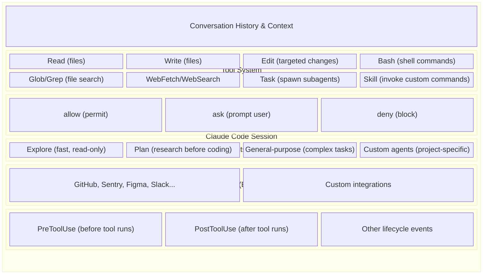
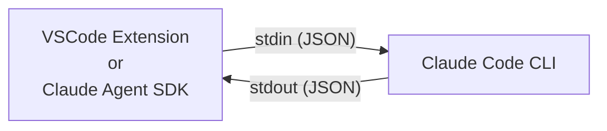
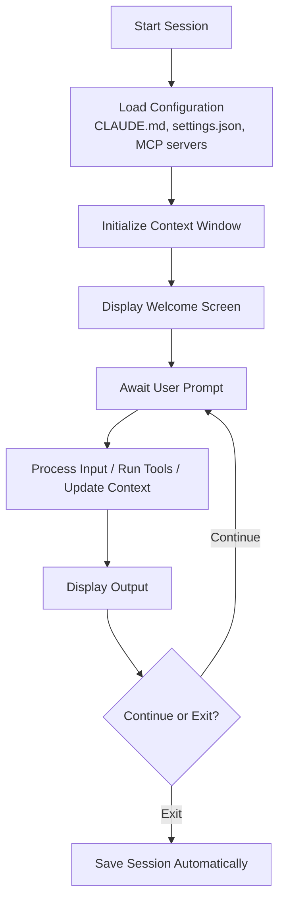
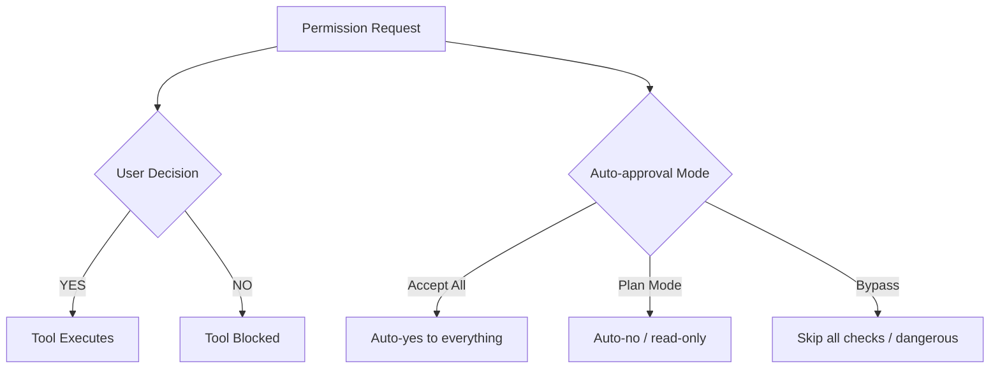
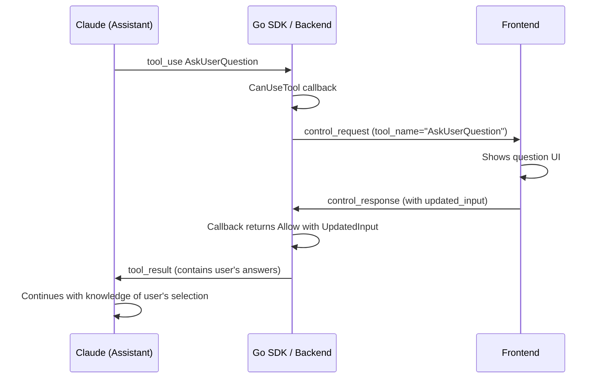
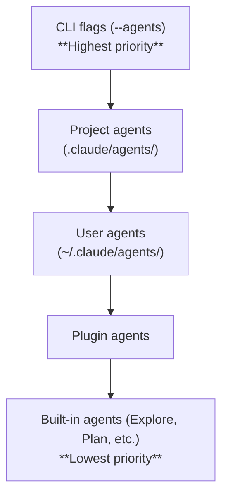
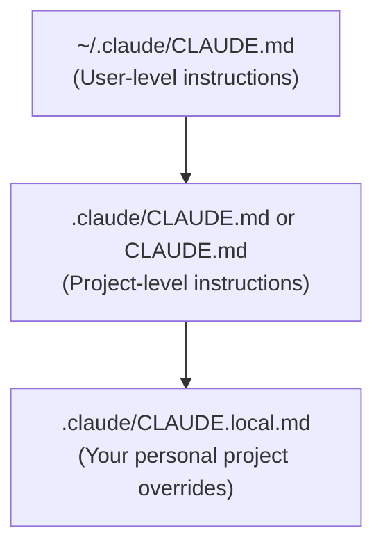
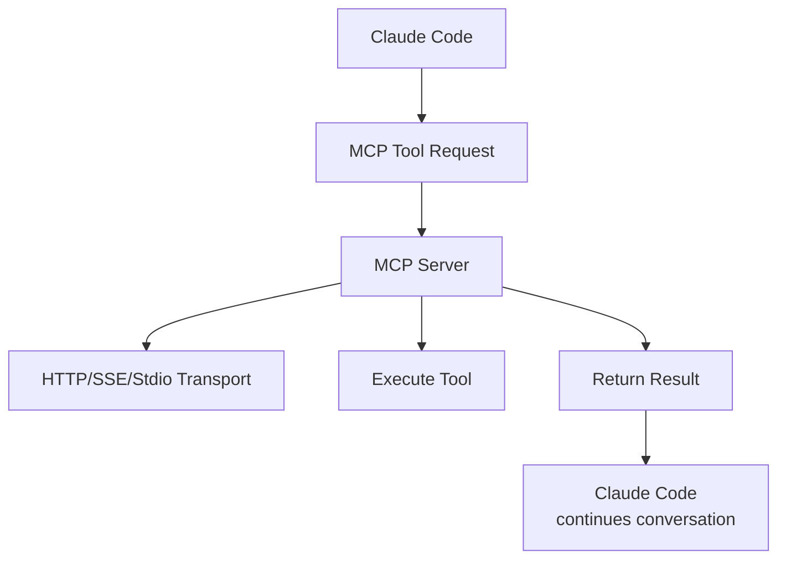

## Overview

**Claude Code** is Anthropic's agentic CLI tool that runs in your terminal, combining powerful AI capabilities with direct code manipulation. Unlike chat interfaces, Claude Code is designed to integrate into your existing development workflow, allowing you to ask questions, make edits, run commands, and commit changes--all from the terminal.

## Core Capabilities

- **Builds features** from descriptions
- **Debugs and fixes issues** by analyzing your codebase
- **Navigates codebases** with comprehensive understanding
- **Automates tedious tasks** (linting, merge conflicts, release notes)
- **Takes direct action** on your filesystem and Git

Key differentiator: It's truly Unix-style and composable (`tail -f app.log | claude -p "alert if you see anomalies"` works).

---

## Architecture: Session-Based Model

Claude Code uses a **session-centric architecture**:



**Sessions are:** Local, persistent, resumable conversations stored on your machine with full message history and tool usage tracking.

---

## SDK & Extension Communication Protocol

The VSCode extension and Claude Agent SDK communicate with the CLI via **structured JSON streaming over stdin/stdout** - not by parsing shell output.

### How It Works



**1. Spawn CLI with JSON flags:**
```bash
claude --output-format stream-json --input-format stream-json --verbose
```

**2. Communication uses newline-delimited JSON (JSON-lines):**
- Each line is a complete JSON object
- Deterministic and parseable (not flaky shell output)
- 1MB default buffer for accumulating partial JSON

### Message Types

**Two categories of messages:**

| Category | Examples |
|----------|----------|
| **Regular messages** | Agent responses, tool outputs, cost tracking |
| **Control messages** | Permission requests, hook callbacks |

### Control Protocol Example

**Permission request (CLI → SDK/Extension):**
```json
{
  "type": "control_request",
  "request_id": "req_1_abc123",
  "request": {
    "subtype": "can_use_tool",
    "tool_name": "Bash",
    "input": {"command": "ls /home"}
  }
}
```

**Permission response (SDK/Extension → CLI via stdin):**
```json
{
  "type": "control_response",
  "request_id": "req_1_abc123",
  "response": {"subtype": "success", "response": {"behavior": "allow"}}
}
```

### Key Implementation Details

| Aspect | Details |
|--------|---------|
| **Protocol** | Newline-delimited JSON (JSON-lines) |
| **Input flag** | `--input-format stream-json` |
| **Output flag** | `--output-format stream-json` |
| **Max buffer** | 1MB default |
| **Concurrency** | Async with write locks to prevent race conditions |
| **Request multiplexing** | `request_id` enables concurrent operations |

### Source Code Reference

The actual implementation is in the open-source Claude Agent SDK:
- **Python**: [`src/claude_agent_sdk/_internal/transport/subprocess_cli.py`](https://github.com/anthropics/claude-agent-sdk-python/blob/main/src/claude_agent_sdk/_internal/transport/subprocess_cli.py)
- **TypeScript**: Equivalent implementation in `@anthropic-ai/claude-agent-sdk`

The VSCode extension uses this same mechanism - it's "Claude Code as a library."

---

## Configuration Hierarchy

Claude Code uses a **scope system** to determine configuration (highest priority first):

1. **MANAGED SETTINGS** - System-wide policies
2. **COMMAND LINE ARGUMENTS** - Runtime flags
3. **LOCAL PROJECT SETTINGS** - `.claude/settings.local.json` (gitignored)
4. **PROJECT SETTINGS** - `.claude/settings.json` (shared with team)
5. **USER SETTINGS** - `~/.claude/settings.json`

Higher scopes override lower scopes.

---

## 1. Sessions & Conversation Flow

### Session Lifecycle



### Key Session Features

- **Automatic persistence**: Sessions auto-save locally to `~/.claude/projects/`
- **Context window management**: Auto-compaction when ~95% capacity reached
- **Resumable**: `claude -c` (continue latest), `claude -r` (resume picker)
- **Named sessions**: Use `/rename` to name sessions for later reference
- **Session picker**: Interactive UI to browse all sessions with search/filter
- **Parallel sessions**: Create multiple worktrees with `git worktree` for isolation

### Conversation State

Each session stores:
- Full message history (user and assistant)
- All tool calls and results
- Conversation checkpoints (can rewind with `Esc+Esc`)
- Context usage metrics
- Cost tracking

### Detecting Work-in-Progress State

To determine if Claude is actively working on a session, check these signals:

| Signal | Indicates Completed |
|--------|---------------------|
| `result` message exists after last assistant message | Yes |
| Assistant message has `stop_reason` (e.g., `"end_turn"`) | Yes |
| Last message timestamp is stale (> 60 seconds old) | Yes (assume completed) |

**Case 1: Completed session (no `result`, no `stop_reason`, but stale)**

```json
{
  "messages": [
    {"type": "queue-operation", "operation": "dequeue", "timestamp": "2026-01-22T14:16:23.027Z"},
    {"type": "file-history-snapshot", "messageId": "60b658ab-..."},
    {"type": "user", "uuid": "60b658ab-...", "message": {"role": "user", "content": "say hello"}, "timestamp": "2026-01-22T14:16:23.115Z"},
    {"type": "assistant", "uuid": "c087e3e0-...", "message": {"role": "assistant", "content": [{"type": "text", "text": "Hello! How can I help you?"}], "stop_reason": null}, "timestamp": "2026-01-22T14:16:26.272Z"}
  ]
}
```

This session is **NOT work-in-progress** because:
- No `result` message
- `stop_reason` is `null`
- But timestamp is old (> 60 seconds ago) → **Completed**

**Only show WIP indicator when ALL conditions favor "working":**
1. No `result` message after last assistant message
2. No `stop_reason` in assistant message
3. Message is recent (within last 60 seconds)

---

## 2. Tool System

Claude Code provides 14+ built-in tools:

### Core Tools

| Tool | Purpose | Permission Required |
|------|---------|-------------------|
| **Read** | Read file contents | No (but can be restricted) |
| **Write** | Create/overwrite files | Yes (can auto-approve) |
| **Edit** | Make targeted edits | Yes (can auto-approve) |
| **Bash** | Execute shell commands | Yes (most restricted) |
| **Glob** | Find files by pattern | No |
| **Grep** | Search file contents | No |
| **WebFetch** | Fetch from URLs | Yes |
| **WebSearch** | Search the web | Yes |
| **Skill** | Invoke slash commands | Yes |
| **Task** | Spawn subagents | No |
| **AskUserQuestion** | Gather requirements | No |
| **NotebookEdit** | Edit Jupyter notebooks | Yes |
| **TodoWrite** | Create task lists | No |

### Tool Permissions Model

Three decision modes:



**Permission Rules** use pattern matching:

```json
{
  "permissions": {
    "allow": [
      "Bash(npm run:*)",        // Prefix match
      "Bash(git * main)",       // Glob match
      "Read(.env)"              // Exact file
    ],
    "ask": [
      "Bash(git push:*)"        // Always prompt
    ],
    "deny": [
      "Bash(rm -rf:*)",         // Dangerous commands
      "Read(.env.*)"            // Sensitive files
    ]
  }
}
```

### Bash Tool Specifics

- **Working directory persists** across commands
- **Environment variables DO NOT persist** between commands
  - Solution: Use `CLAUDE_ENV_FILE=/path/to/setup.sh` before running `claude`
- **Each command runs in fresh shell environment**

### TodoWrite Tool

The TodoWrite tool enables Claude to track task progress, giving users visibility into multi-step operations.

**Message Flow:**

1. **Assistant calls TodoWrite** (`tool_use`):
```json
{
  "type": "assistant",
  "message": {
    "content": [{
      "id": "toolu_01USWNXyVxLzK8uWHxanbaDJ",
      "name": "TodoWrite",
      "type": "tool_use",
      "input": {
        "todos": [
          {"content": "Create new file", "activeForm": "Creating new file", "status": "in_progress"},
          {"content": "Update imports", "activeForm": "Updating imports", "status": "pending"},
          {"content": "Run tests", "activeForm": "Running tests", "status": "pending"}
        ]
      }
    }]
  }
}
```

2. **System confirms** (`tool_result`):
```json
{
  "type": "user",
  "message": {
    "content": [{
      "type": "tool_result",
      "tool_use_id": "toolu_01USWNXyVxLzK8uWHxanbaDJ",
      "content": "Todos have been modified successfully..."
    }]
  },
  "toolUseResult": {
    "newTodos": [...],
    "oldTodos": []
  }
}
```

**TodoItem Structure:**

| Field | Type | Description |
|-------|------|-------------|
| `content` | string | Task description in imperative form ("Create file") |
| `activeForm` | string | Present continuous form ("Creating file") - shown when in_progress |
| `status` | `"pending"` \| `"in_progress"` \| `"completed"` | Current task state |

**Display Rules:**
- `pending` → Show `content` with empty checkbox
- `in_progress` → Show `activeForm` with half-filled indicator
- `completed` → Show `content` with strikethrough and filled checkbox

### AskUserQuestion Tool

The AskUserQuestion tool enables Claude to gather user input during execution. Unlike other tools which execute automatically, this tool requires **user interaction** before continuing.

**Key Behaviors:**

| Mode | Behavior |
|------|----------|
| **CLI mode** (`--dangerously-skip-permissions`) | Claude auto-generates empty answers and continues |
| **SDK/UI mode** (permission callback) | Questions broadcast to frontend, waits for user answers |

**SDK/UI Mode Flow:**

In UI mode, AskUserQuestion uses the **standard `control_request`/`control_response` protocol** (same as all other tools). The frontend detects `tool_name === "AskUserQuestion"` and shows the question UI instead of the permission UI.

1. Claude calls `AskUserQuestion` tool
2. SDK's `CanUseTool` callback is invoked (AskUserQuestion is NOT in allowedTools)
3. Backend broadcasts `control_request` to frontend via WebSocket (standard permission flow)
4. Frontend detects `tool_name === "AskUserQuestion"`, shows question UI
5. Frontend sends `control_response` with `updated_input` containing answers
6. Callback returns `PermissionResultAllow` with `UpdatedInput` containing answers
7. Claude receives tool_result with user's selections

**Why It Uses Permission Callback:**

AskUserQuestion requires user interaction, so it cannot be auto-approved. The permission callback pattern allows the backend to:
1. Intercept the tool call before execution
2. Broadcast `control_request` to all connected WebSocket clients
3. Wait for user response (via `control_response`)
4. Inject user answers via `UpdatedInput`

This matches the official Claude Agent SDK pattern for tools requiring user interaction.

**Message Flow (SDK Mode):**



**Answer Format:**
- Keys are the **full question text** (not indices)
- Values are the **selected option label** or custom text
- Example: `{"Which database?": "PostgreSQL (Recommended)"}`

See [data-models.md Section 4i](./data-models.md#askuserquestion-in-ui-mode-sdk) for detailed message formats.

---

## 3. Permission System

### Permission Modes

```bash
claude                           # Normal mode (asks for permission)
claude --permission-mode plan    # Plan mode (read-only, no execution)
claude --dangerously-skip-permissions  # Bypass (use with caution!)
```

### Working Directories

Claude can access:
- Current working directory (always)
- Additional directories via `permissions.additionalDirectories`
- Home directory limited to non-sensitive paths
- Cannot access other user's home directories

### Permission Precedence

When evaluating a tool use:
1. **Deny** rules first (blocks immediately)
2. **Ask** rules second (prompts user)
3. **Allow** rules last (permits)

**First match wins**: If multiple rules match, the first matching rule determines behavior.

---

## 4. Subagent System

Subagents are **isolated AI assistants** that handle specific tasks with their own context, tools, and permissions.

### Built-in Subagents

| Agent | Model | Tools | Purpose |
|-------|-------|-------|---------|
| **Explore** | Haiku | Read-only | Fast codebase search & analysis |
| **Plan** | Inherits | Read-only | Research before implementation |
| **General-purpose** | Inherits | All tools | Complex multi-step tasks |
| **Bash** | Inherits | Limited | Run commands in separate context |

### Custom Subagents

Create in `.claude/agents/agent-name.md` (project-wide) or `~/.claude/agents/` (personal):

```yaml
---
name: code-reviewer
description: Reviews code for quality and best practices. Use proactively after code changes.
tools: Read, Grep, Glob, Bash
model: sonnet
permissionMode: plan
---

You are a senior code reviewer. When invoked:
1. Run git diff to see recent changes
2. Focus on modified files
3. Check for code quality, security, and maintainability
```

### Subagent Scopes (Priority)



### How Claude Decides to Use Subagents

Claude reads the `description` field and automatically delegates when your request matches.

### Foreground vs Background Subagents

- **Foreground** (default): Block until complete, pass through permission prompts
- **Background** (with `Ctrl+B`): Run concurrently, auto-deny non-pre-approved permissions

---

## 5. Skills System

Skills are **reusable prompts** that teach Claude how to do specific things.

### Structure

```
~/.claude/skills/
  └─ explaining-code/
     ├─ SKILL.md (required, with metadata + instructions)
     ├─ reference.md (optional, linked from SKILL.md)
     └─ scripts/
        └─ helper.py (optional, executed without reading)
```

### SKILL.md Format

```yaml
---
name: explaining-code
description: Explains code with diagrams and analogies. Use when explaining how code works.
allowed-tools: Read, Grep, Glob
model: sonnet
context: fork  # Optional: run in isolated subagent
---

When explaining code, always:
1. Start with an analogy from everyday life
2. Draw an ASCII diagram showing flow/structure
3. Walk through step-by-step
4. Highlight gotchas and misconceptions
```

### How Skills Are Invoked

1. **Automatic Discovery** (default): Claude reads skill descriptions and applies relevant skills
2. **Manual**: Type `/skill-name` to explicitly invoke
3. **Programmatic**: Via `Skill` tool (when Claude chooses)

---

## 6. Memory System (CLAUDE.md)

### CLAUDE.md Files

Claude loads context from multiple locations:



**Precedence**: Local > Project > User

### Modular Rules

Organize project instructions:

```
.claude/
├─ CLAUDE.md (main entry point)
└─ rules/
   ├─ frontend/
   │  └─ react.md
   ├─ backend/
   │  └─ go.md
   └─ git.md
```

Claude automatically discovers and loads relevant rules based on file paths.

---

## 7. MCP (Model Context Protocol)

MCP extends Claude Code with external tools and data sources.

### How MCP Works



### Installing MCP Servers

```bash
# HTTP (recommended)
claude mcp add --transport http github https://api.githubcopilot.com/mcp/

# Stdio (local)
claude mcp add --transport stdio db -- npx -y @bytebase/dbhub --dsn "postgresql://..."
```

### MCP Scope

```bash
claude mcp add --scope local   github https://...   # Only this project (default)
claude mcp add --scope project github https://...   # Shared in .mcp.json
claude mcp add --scope user    github https://...   # All projects for you
```

### Popular MCP Servers

- **GitHub**: Code reviews, PR management, issue tracking
- **Sentry**: Error monitoring and debugging
- **Figma**: Design collaboration
- **PostgreSQL/Databases**: Data querying
- **Slack**: Communication integration

---

## 8. Hooks System

Hooks run custom scripts before/after tool execution.

### Hook Events

| Event | When | Use Case |
|-------|------|----------|
| **PreToolUse** | Before tool executes | Validate commands, enforce policies |
| **PostToolUse** | After tool executes | Run linter after edits, log changes |
| **PermissionRequest** | When permission needed | Custom approval logic |
| **UserPromptSubmit** | Before processing prompt | Add context, validate input |

### Hook Configuration

```json
{
  "hooks": {
    "PreToolUse": [
      {
        "matcher": "Bash",
        "hooks": [
          {
            "type": "command",
            "command": "./scripts/validate-command.sh $TOOL_INPUT"
          }
        ]
      }
    ]
  }
}
```

---

## 9. Keyboard Shortcuts

| Shortcut | Action |
|----------|--------|
| `Ctrl+C` | Cancel/interrupt |
| `Ctrl+D` | Exit session |
| `Ctrl+O` | Toggle verbose mode (show thinking) |
| `Ctrl+R` | Search command history |
| `Ctrl+B` | Background a running task |
| `Shift+Tab` | Toggle permission modes |
| `Esc+Esc` | Rewind/checkpoint |
| `?` | Show all shortcuts |

---

## 10. Extended Thinking Mode

Claude reserves up to 31,999 tokens for internal reasoning on complex problems.

### Toggle Thinking

```bash
Option+T (Mac) / Alt+T (Linux/Win)  # Toggle in session
export MAX_THINKING_TOKENS=10000    # Limit budget
```

### When Useful

- Complex architectural decisions
- Challenging bugs
- Multi-step implementation planning
- Evaluating tradeoffs

---

## 11. Workflow Patterns

### Planning Workflow

```bash
claude --permission-mode plan
> Create a detailed plan for refactoring the auth system

[Claude gathers context with read-only access]
[Returns comprehensive plan]
[Exit plan mode, resume session to implement]
```

### Debugging Workflow

```
> I'm seeing an error when running npm test

[Claude runs test, captures output]

> Suggest fixes

[Claude provides solutions]

> Implement the best fix

[Claude makes edits and verifies]
```

---

## 12. Performance & Cost

### Context Window Management

- **Default output tokens**: 32,000 (expandable to 64,000)
- **Auto-compaction**: Triggers at ~95% capacity
- **Thinking tokens**: Up to 31,999 (included in output budget)

### Cost Optimization

| Strategy | Impact |
|----------|--------|
| Use Haiku for subagents | 80% cost reduction |
| Disable thinking for simple tasks | Save ~20% tokens |
| Use plan mode for exploration | Isolate expensive research |

---

## 13. Quick Start

```bash
# 1. Install
curl -fsSL https://claude.ai/install.sh | bash

# 2. Login
claude
/login

# 3. Use
claude "Build a TODO app"
claude --permission-mode plan "Show me the auth flow"

# 4. Configure
/config                    # Interactive setup
/memory                    # Edit project docs

# 5. Workflow
claude -c                  # Continue last session
claude --resume            # Pick from history
/rename my-feature         # Name session
/cost                      # Check spending
```

---

## File Structure Reference

```
~/.claude/                          User-level config
├─ settings.json                    User settings
├─ agents/                          User subagents
├─ skills/                          User skills
├─ CLAUDE.md                        User memory
└─ projects/                        Session storage

.claude/                            Project config (git-tracked)
├─ settings.json                    Project permissions
├─ agents/                          Project subagents
├─ skills/                          Project skills
├─ CLAUDE.md                        Project documentation
└─ rules/                           Modular rules by path

.claude/settings.local.json         Personal overrides (gitignored)
```

---

## Key Takeaways

1. **Session-based** - All conversations are persistent and resumable
2. **Permission-controlled** - Granular control over what Claude can do
3. **Extensible** - Subagents, skills, MCP servers, hooks
4. **Tool-driven** - Claude acts through well-defined tools
5. **Context-aware** - Automatically loads project documentation
6. **Cost-conscious** - Built-in token management and optimization
