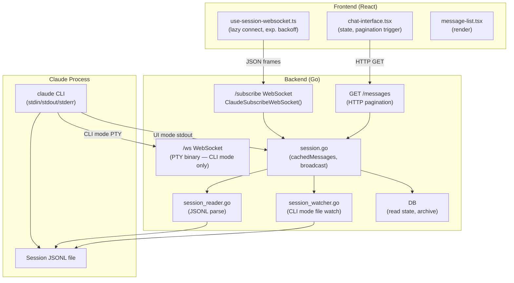
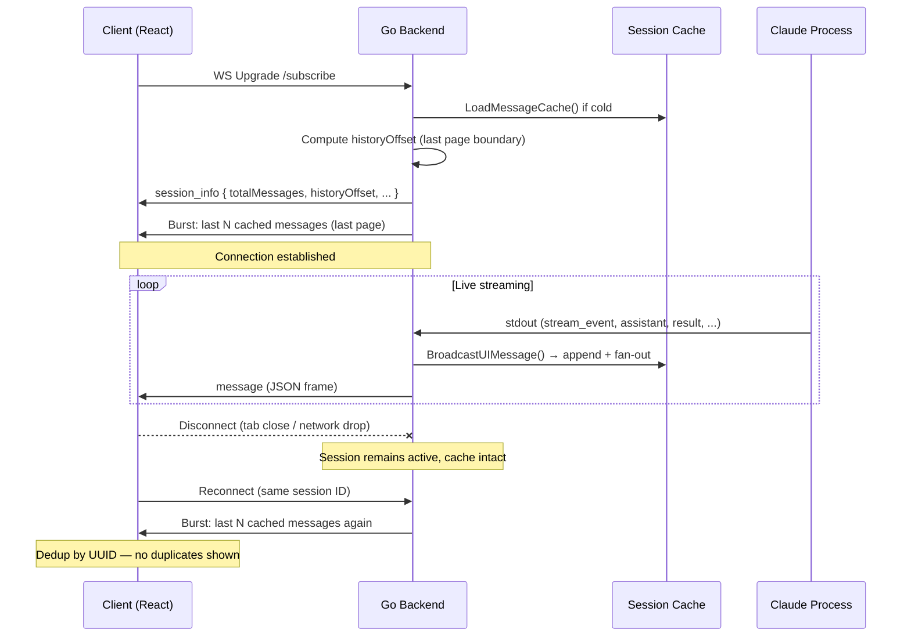
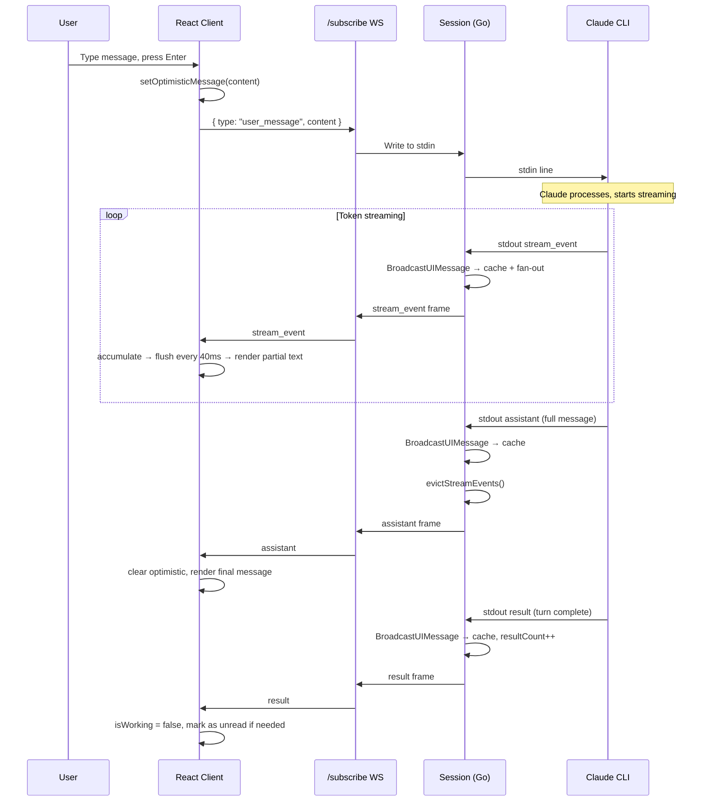

> **Scope**: Backend → Frontend review of the entire session messages pipeline, covering the WebSocket system, message caching, pagination, stream event lifecycle, and performance characteristics. Written 2026-02-23 against the current codebase. Where the existing [`websocket-protocol.md`](./websocket-protocol) describes an older polling-based design, this document reflects the actual implementation.

---

## 1. Core Principles

Before diving into code, it's useful to name the design goals that shaped the system. Every feature below can be traced back to one of these.

| Principle | What it means |
|-----------|--------------|
| **Real-time first** | Streaming tokens appear as Claude generates them; no polling lag |
| **Reconnection transparency** | Clients can disconnect and rejoin without losing context |
| **Memory efficiency** | Keep only what's needed in RAM; evict redundant data promptly |
| **Deduplication** | Every message has a UUID; duplicates are silently discarded everywhere |
| **Non-displayable noise separation** | Transport-level messages (stream events, queue ops, rate limits) are kept out of pagination counts |
| **Cross-device consistency** | Read-state and session state are persisted to the DB; not just in-memory |

---

## 2. System Architecture



Two WebSocket endpoints serve different purposes:

| Endpoint | Mode | Format | Compression | Purpose |
|----------|------|--------|-------------|---------|
| `/api/claude/sessions/:id/subscribe` | UI | JSON text frames | **Disabled** (intentional) | Structured chat, permissions, streaming |
| `/api/claude/sessions/:id/ws` | CLI | Binary | Enabled | Raw PTY I/O for xterm.js |

This document focuses entirely on the **subscribe** endpoint. The terminal endpoint is pass-through PTY data.

---

## 3. Message Types

### 3.1 Session Message Types

All messages share a base envelope:

```typescript
interface SessionMessageEnvelope {
  type: string
  uuid?: string         // Absent on transport-only messages
  parentUuid?: string
  timestamp?: number
}
```

**Persisted to JSONL (durable):**

| Type | Direction | Description |
|------|-----------|-------------|
| `user` | S→C | User input or tool result |
| `assistant` | S→C | Claude text/tool response |
| `result` | S→C | Turn completion marker |
| `progress` | S→C | Tool execution progress / hook events |
| `system` | S→C | Session lifecycle events (init, hooks, errors) |
| `file-history-snapshot` | S→C | Internal file versioning (not displayed) |

**Ephemeral (stdout only, not in JSONL):**

| Type | Direction | Description |
|------|-----------|-------------|
| `stream_event` | S→C | Token-level deltas during generation |
| `rate_limit_event` | S→C | API quota metadata |
| `queue-operation` | S→C | Internal session queue management |

**Bidirectional control:**

| Type | Direction | Cached? | Description |
|------|-----------|---------|-------------|
| `control_request` | S→C | ✅ Yes | Permission request (tool use) |
| `control_response` | C→S | ✅ Yes | Permission decision |
| `set_permission_mode` | C→S | ❌ No | Transient mode change |

> **Why is `set_permission_mode` not cached?**
> If it were cached, every new client that connects would re-receive and re-apply old mode switches. Broadcasting without caching means only currently-connected clients see it.

### 3.2 Non-Displayable Set

The following types are excluded from pagination counts and never rendered in the message list:

```go
// backend — also mirrored in frontend as NON_DISPLAYABLE_TYPES
"stream_event"
"rate_limit_event"
"queue-operation"
"file-history-snapshot"
```

This ensures `historyOffset` math is stable — adding or removing streaming events doesn't shift page boundaries.

---

## 4. WebSocket Connection Lifecycle

### 4.1 Connection Sequence



### 4.2 Initial Burst Design

On every connect, the client receives the **last page** of history (up to `DefaultPageSize = 100` displayable messages). This is a deliberate tradeoff:

- **Why not all messages?** Long sessions can have thousands of messages. Sending all on every connect would be slow and wasteful.
- **Why not zero?** The client needs recent context to reconstruct live state (current turn, pending permissions, unread markers).
- **Why last page specifically?** It gives the user immediate context while keeping the burst bounded and predictable.

Older messages are fetched on demand via HTTP pagination when the user scrolls up.

### 4.3 Frontend Connection Management

**File:** `frontend/app/components/claude/chat/hooks/use-session-websocket.ts`

Key behaviors of the connection hook:

| Behavior | Detail |
|----------|--------|
| **Lazy connect** | No WebSocket created until first `sendMessage()` call |
| **Exponential backoff** | 1s → 2s → 4s → … → 60s max |
| **Infinite retry** | Never gives up after `hasConnected = true` |
| **Token refresh** | Calls `refreshAccessToken()` on wake-up or disconnect |
| **Session isolation** | Stale messages for previous session IDs are discarded |
| **snake_case → camelCase** | Message normalization at the WebSocket entry point |

> **Known gap (H1 in robustness plan):** No heartbeat/ping-pong. Environments with aggressive idle timeouts (AWS ALB 60s, nginx 60s, Cloudflare 100s) may silently drop the connection. The backend sends server-side pings every 30s, but the frontend doesn't send application-level pings. Adding `{ type: "ping" }` every 30s from the client would cover all proxy tiers.

> **Known gap (H2):** No `visibilitychange` handler. When the tab is backgrounded, mobile browsers kill the connection. The terminal component handles this correctly; the chat WebSocket does not.

### 4.4 Session Modes

| Mode | Description | Stdout handling |
|------|-------------|----------------|
| `ui` | JSON streaming | Messages parsed from stdout JSON, pushed to subscribers |
| `cli` | PTY/xterm | PTY binary piped through `/ws`; JSONL file polled separately |

CLI mode uses `SessionWatcher` (fsnotify + polling fallback at 5s) to detect new JSONL entries, then calls `BroadcastUIMessage()`. In UI mode, the backend reads stdout directly.

---

## 5. Message Cache

### 5.1 Cache Structure

```go
// session.go
type Session struct {
    cachedMessages [][]byte        // Raw JSON bytes (passthrough — never re-serialized)
    seenUUIDs      map[string]bool // UUID dedup
    cacheLoaded    bool
    cacheMu        sync.RWMutex
}
```

The cache stores raw bytes, not parsed structs. This is deliberate — parsing every message on every reconnect would be wasteful, and we never need to mutate message content.

### 5.2 Loading

Cache is loaded once from the session JSONL file on first activation:

```
LoadMessageCache()
  → Read JSONL line by line
  → For each line: parseTypedMessage() → strip large read-tool content
  → Track UUID in seenUUIDs
  → Append raw bytes to cachedMessages
```

Large read-tool results are stripped at parse time, reducing payload size across all WebSocket and HTTP responses. This is why WebSocket compression is intentionally disabled — the content is already compact.

### 5.3 Live Appending: BroadcastUIMessage vs BroadcastToClients

Two broadcast methods with different caching behavior:

```
BroadcastUIMessage(data)      → cache + fan-out to all connected clients
BroadcastToClients(data)      → fan-out only (NOT cached)
```

| Used for | Method | Reason |
|----------|--------|--------|
| `user`, `assistant`, `result`, `progress`, `system` | BroadcastUIMessage | Durable history — new clients need these |
| `control_request`, `control_response` | BroadcastUIMessage | State-critical — reconnecting clients need pending permissions |
| `set_permission_mode` response | BroadcastToClients | Transient — should NOT be replayed on reconnect |
| `stream_event` | BroadcastUIMessage | Cached during streaming for mid-stream reconnect recovery |

### 5.4 Deduplication

Before appending to cache:

```go
if uuid != "" && seenUUIDs[uuid] {
    return  // Already in cache (e.g. from JSONL load + stdout overlap)
}
seenUUIDs[uuid] = true
cachedMessages = append(cachedMessages, data)
```

This handles the JSONL-vs-stdout race: in CLI mode, the watcher may pick up a message that was already added via stdout. UUID tracking ensures exactly-once delivery.

---

## 6. Pagination

### 6.1 Design: Last-Page-First + Backward Scroll

```
Session has 450 displayable messages (excluding stream_events, etc.)
DefaultPageSize = 100

On connect:
  historyOffset = 400  (last page boundary)
  Burst: messages [400..449]

User scrolls up → loadOlderMessages():
  offset = max(0, 400 - 100) = 300
  HTTP GET /messages?offset=300&limit=100
  → messages [300..399]
  historyOffset = 300

User scrolls up again:
  offset = max(0, 300 - 100) = 200
  HTTP GET /messages?offset=200&limit=100
  → messages [200..299]
  historyOffset = 200
```

Each backward load prepends to the message list and updates `historyOffset`. The scroll position is preserved by measuring height delta before/after prepend.

### 6.2 HTTP Endpoint

**Backend:** `GetClaudeSessionMessages()` in `backend/api/claude.go`

```
GET /api/claude/sessions/:id/messages?offset=N&limit=100

Response:
{
  sessionId: string
  mode: "ui" | "cli"
  messages: SessionMessage[]   // filtered: no non-displayable types
  totalCount: number           // count of displayable messages only
  offset: number
  limit: number
}
```

The filter is applied identically on both the HTTP endpoint and the initial WS burst, so `historyOffset` arithmetic is consistent.

### 6.3 Frontend Implementation

**File:** `frontend/app/components/claude/chat/chat-interface.tsx`

```typescript
const loadOlderMessages = async () => {
  const offset = Math.max(0, historyOffset - 100)
  const response = await fetch(`/api/claude/sessions/${sessionId}/messages?offset=${offset}&limit=100`)
  const data = await response.json()

  const newMessages = data.messages.filter(m => !NON_DISPLAYABLE_TYPES.has(m.type))

  setHistoryOffset(offset)
  setRawMessages(prev => {
    // Deduplicate by UUID, prepend
    const existing = new Set(prev.map(m => m.uuid))
    const unique = newMessages.filter(m => !existing.has(m.uuid))
    return [...unique, ...prev]
  })
}
```

Triggered by scroll-to-top detection in `message-list.tsx`. When `historyOffset === 0`, no more older messages exist.

### 6.4 Performance Characteristics

| Scenario | Messages transferred on connect |
|----------|--------------------------------|
| Short session (< 100 msgs) | All messages |
| Long session (1000 msgs) | Last 100 only |
| Reconnect mid-stream | Last 100 (includes stream_events) |

---

## 7. Stream Event Lifecycle

### 7.1 What Are Stream Events?

`stream_event` messages carry token-level Anthropic API streaming deltas:

```json
{
  "type": "stream_event",
  "event": {
    "type": "content_block_delta",
    "index": 0,
    "delta": { "type": "text_delta", "text": "Hello, " }
  }
}
```

They arrive in order: `message_start` → `content_block_start` → N×`content_block_delta` → `content_block_stop` → `message_delta` → `message_stop`.

The frontend buffers and flushes these every **40ms** to smooth rendering and batch React state updates.

### 7.2 Why Cache Stream Events At All?

Caching stream events during generation handles one edge case: **mid-stream reconnection**. If the client drops and reconnects while Claude is generating, it receives the accumulated stream events and can resume showing the partial text without waiting for the final `assistant` message.

### 7.3 Eviction After Completion

When the final `assistant` message arrives, stream events are immediately evicted from the cache:

```go
// Triggered from BroadcastUIMessage when type == "assistant"
func (s *Session) evictStreamEvents() {
    s.cacheMu.Lock()
    defer s.cacheMu.Unlock()

    n := 0
    for _, msg := range s.cachedMessages {
        if !isStreamEvent(msg) {
            s.cachedMessages[n] = msg
            n++
        }
    }
    s.cachedMessages = s.cachedMessages[:n]
}

func isStreamEvent(data []byte) bool {
    // Fast path: check first 100 bytes before JSON parse
    prefix := data
    if len(prefix) > 100 {
        prefix = prefix[:100]
    }
    if !bytes.Contains(prefix, []byte(`"stream_event"`)) {
        return false
    }
    var env struct{ Type string }
    json.Unmarshal(data, &env)
    return env.Type == "stream_event"
}
```

**Rationale:** After streaming completes, the full text is in the `assistant` message. Stream events are redundant and would waste memory for the rest of the session's lifetime. Clients reconnecting post-completion get the `assistant` message directly and don't need deltas.

**Timing sequence:**

```
stream_event(delta 1)  → cached
stream_event(delta 2)  → cached
...
stream_event(delta N)  → cached
assistant(full text)   → cached, then evictStreamEvents() runs
                                  → all stream_events removed from cache
```

### 7.4 Potential Race Condition

If new `stream_event` messages arrive *after* `evictStreamEvents()` runs (theoretically possible due to async goroutines), they would be re-added to the cache. In practice this is extremely unlikely because:
1. The `assistant` message is the final output of the Claude process for that turn
2. No more stdout arrives after the assistant message for that turn
3. The eviction is synchronous under the cache lock

This is an acceptable risk given the frequency (effectively zero) and consequence (a few extra bytes in cache that would be evicted on the next turn).

---

## 8. Session State Machine

The backend computes a derived `sessionState` from in-memory session properties:

```
if archived → "archived"
else if pendingPermissionCount > 0 → "unread" (permission waiting)
else if isProcessing → "working"
else if unreadResultCount > 0 → "unread"
else → "idle"
```

State is broadcast via SSE (not WebSocket) to drive the session list UI and Apple client badge counts. Read state (`readResultCount`) is persisted to SQLite via `MAX()` upsert — ensuring state never regresses across device switches.

---

## 9. Performance Optimizations Summary

| Optimization | Where | Impact |
|-------------|-------|--------|
| **Stream event eviction** | `session.go` | Frees N×delta messages after each turn |
| **Large content stripping** | `session_reader.go` | Removes file body from read-tool results at parse time |
| **Non-displayable filtering** | Both WS burst and HTTP | Keeps pagination math clean, reduces noise |
| **Token buffer flush (40ms)** | `chat-interface.tsx` | Batches stream_event renders, reduces re-render churn |
| **Lazy WS connection** | `use-session-websocket.ts` | No connection until user interacts |
| **WS compression disabled** | Backend WS upgrade | Lower memory overhead (content already compact after stripping) |
| **UUID dedup (cache)** | `session.go` | Prevents double-entry from JSONL+stdout overlap |
| **UUID dedup (frontend)** | `chat-interface.tsx` | Prevents duplicate display on reconnect |
| **Last-page-first burst** | WS connect handler | O(page) instead of O(session) on every connect |
| **Read-state MAX() upsert** | `db/claude_sessions.go` | Cross-device consistency without locks |

---

## 10. Data Flow: A Complete Turn



---

## 11. Known Issues & Gaps

These are issues identified during this review. The existing [`claude-chat-robustness-plan.md`](../design/claude-chat-robustness-plan) covers frontend-specific bugs in more detail.

### 11.1 No Frontend Heartbeat (High Priority)

Many reverse proxies (nginx, ALB, Cloudflare) have idle timeouts of 60–100s. The backend sends server-side WS pings every 30s, but the frontend doesn't send application-level pings. The connection can silently drop in certain proxy configurations.

**Fix:** Add `{ type: "ping" }` send every 30s from the frontend. The backend already handles unknown message types gracefully (logs and continues).

### 11.2 No Visibility Change Handling (High Priority)

The terminal component (`terminal.tsx`) correctly reconnects when the tab becomes visible again. The chat WebSocket hook does not. Mobile browsers aggressively kill background connections.

**Fix:** Add `document.addEventListener('visibilitychange', ...)` to `use-session-websocket.ts`, mirroring the terminal implementation.

### 11.3 Unbounded Cache Growth

The `cachedMessages` slice grows throughout a session's lifetime and is only reset on `ReloadMessageCache()` (called during re-activation). A session with many turns could accumulate significant memory. Stream events are evicted per-turn, but all other message types stay forever.

**Consideration:** A background compaction step that periodically writes a snapshot and trims the in-memory slice would cap memory use. Not urgent for typical session lengths, but worth tracking for very long-running sessions.

### 11.4 Permission Mode Not Persisted

`PermissionMode` (acceptEdits, default, etc.) is stored only in the in-memory `Session` struct. A server restart loses the permission mode for all active sessions.

**Consideration:** Persist to DB alongside session metadata. Low risk currently since server restarts are rare.

### 11.5 CLI Mode Watcher Delay

The `SessionWatcher` falls back to 5s polling if fsnotify fails. CLI-mode users could see up to 5s message delay in that case. This is filesystem-dependent and typically doesn't occur, but logging when the fallback activates would help diagnose it.

### 11.6 websocket-protocol.md Is Outdated

The existing `websocket-protocol.md` describes an old polling-based architecture (500ms polls, `ReadSessionHistory`, no caching). The current implementation uses push broadcasting (`BroadcastUIMessage`), an in-memory cache, and paginated HTTP for older messages. That document should be updated or superseded by this review.

---

## 12. Rendering Performance

### 12.1 Message List

All messages are rendered in a single list (`message-list.tsx`) without virtualization. For typical sessions (< 200 displayable messages after pagination), this is fine. For sessions with hundreds of large tool results, it could cause janky scrolling.

**Considered improvement:** `@tanstack/react-virtual` for the message list. This is a non-trivial refactor because message heights vary significantly (tool results can be very tall). Track as a future improvement once sessions routinely exceed 300 displayed messages.

### 12.2 Token Rendering

The 40ms flush interval for stream events is a good balance:
- **Too fast** (< 10ms) → excessive re-renders, visible churn
- **Too slow** (> 100ms) → streaming feels laggy
- **40ms** → ~25 renders/second, smooth without being expensive

### 12.3 React State Shape

`rawMessages` is a flat array; the frontend derives display state (grouping tool calls with their results, resolving progress messages) on each render via memoized selectors. This is correct but means derived state re-computes on every new message. For very large message arrays this could become noticeable — memoizing individual message blocks by UUID would scope re-renders to only changed messages.

---

## 13. Cross-Client Consistency

The backend serves three client types from the same session cache:

| Client | Connection | Notes |
|--------|-----------|-------|
| Web (React) | `/subscribe` WebSocket | Primary client |
| iOS / macOS (SwiftUI) | SSE only (notifications) | Session list + state; no message streaming |
| Web terminal (xterm.js) | `/ws` WebSocket | CLI mode only |

The Apple client does **not** stream messages via WebSocket — it receives session state changes via SSE and opens a WebView that loads the React frontend for actual message display. This means message rendering is consistent across platforms (same React code), and only the session list / badge counts are native.

---

## 14. Review Summary

The cloud session messages system is **well-architected** for its requirements. The two-tier WebSocket design cleanly separates binary PTY traffic from structured chat messages. The cache-and-broadcast model gives reconnecting clients instant context without re-reading from disk. Pagination with non-displayable filtering keeps the math clean. Stream event eviction is elegant — keep what you need for reconnection recovery, drop it the moment it becomes redundant.

**Highest-value improvements (in order):**

1. **Frontend heartbeat** — prevents silent connection drops behind proxies (30 min of work)
2. **Visibility change reconnect** — makes mobile experience reliable (1 hour of work)
3. **Update websocket-protocol.md** — remove confusion about the old polling design (documentation, no code change)
4. **Permission mode persistence** — survive server restarts (medium effort, low urgency)
5. **Message list virtualization** — future-proofing for very long sessions (large effort, low urgency now)

**Things that are working well:**
- UUID-based deduplication at every layer (cache, HTTP response, frontend)
- Stream event lifecycle (cache during stream → evict on completion)
- Last-page-first burst keeping initial connect O(page) not O(session)
- Large content stripping at JSONL parse time keeping payloads small
- Cross-device read state via DB MAX() upsert
