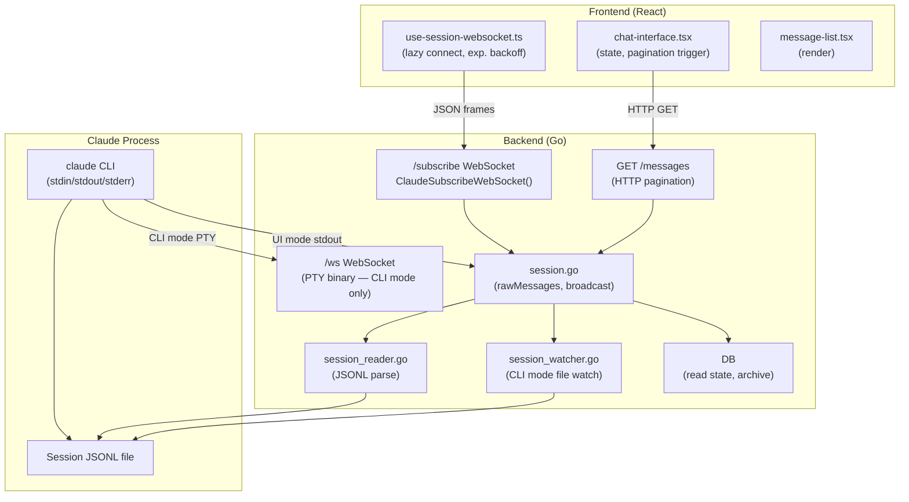
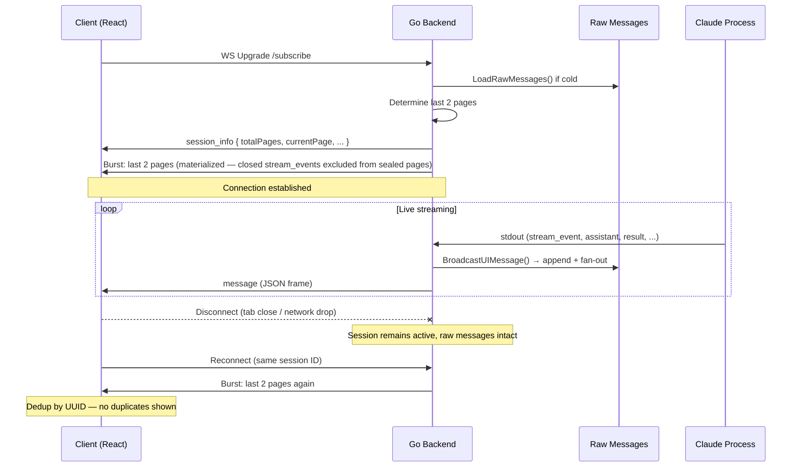
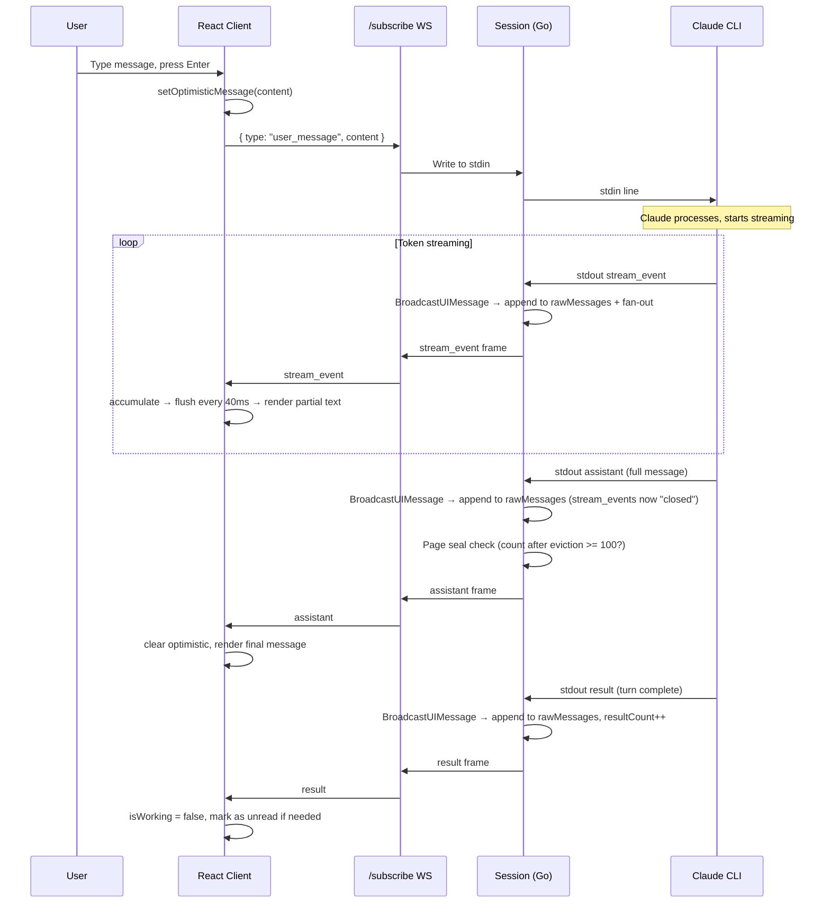

> **Scope**: Backend → Frontend review of the entire session messages pipeline, covering the raw message list, page-based pagination, WebSocket delivery, stream event lifecycle, and rendering. Written 2026-02-23 against the current codebase; updated 2026-02-24 with the page-based pagination design and append-only raw message model. Where the existing [`websocket-protocol.md`](./websocket-protocol) describes an older polling-based design, this document reflects the target implementation.

---

## 1. Design Goals & Constraints

### 1.1 Goals

| # | Goal | What it means |
|---|------|---------------|
| G1 | **Correct** | No duplicated messages, no missed messages. Every message delivered exactly once. |
| G2 | **Real-time updates** | Streaming tokens appear as Claude generates them; no polling lag |
| G3 | **Performant** | Low memory footprint, bounded transfer on connect, no redundant work |
| G4 | **Smooth UI** | No flashes, no jumps, no blank screens during pagination or reconnection |
| G5 | **Easy to maintain and debug** | Adding new message types is mechanical; raw messages are inspectable; issues are traceable to Claude or to our code |
| G6 | **Information-dense, neat UI** | Clean layout first — then expose as much information as possible via scrollable and collapsible containers. No data loss, no clutter. |

### 1.2 Technical Elements & Constraints

Claude Code runs as a subprocess. We get messages from two sources with different characteristics:

| Source | Characteristics |
|--------|----------------|
| **stdout** (stdin/stdout mode) | Real-time, includes ephemeral types (`stream_event`, `rate_limit_event`), messages arrive as Claude produces them |
| **JSONL file** | Durable, written by Claude Code, has write delays, does not include ephemeral types |

The two sources **overlap** — a message may appear in both stdout and the JSONL file. The backend must reconcile them into a single view.

For message type details (types, subtypes, fields, rendering rules), see the [claude-message-handler agent](../../../.claude/agents/claude-message-handler.md).

### 1.3 Design Decisions

These are deliberate choices that shape the architecture. Every component should respect them.

| # | Decision | Rationale |
|---|----------|-----------|
| D1 | **Backend maintains a single source of truth** | One merged, deduplicated message list per session — read from JSONL and stdout, properly reconciled. No secondary caches or parallel lists. |
| D2 | **The message list is append-only** | Messages are never reordered or mutated in the canonical list. New data arrives at the tail. No exceptions — stream event eviction is a view concern handled at the materialized page layer (§7), not a mutation of the raw list. |
| D3 | **Single source, multiple views** | Each consumer (WebSocket burst, HTTP pagination, session state) generates its view by reading from this one list. No copies. |
| D4 | **Keep messages as raw as possible** | Store the bytes as received from JSONL / stdout — no re-serialization, no field stripping in the canonical list. This makes it easy to tell whether an issue originates from Claude or from our code. |
| D5 | **Client builds the same list, paginated** | The client reconstructs the same message list as the backend, but loads it on demand — last 2 pages on connect, older pages on scroll-up via HTTP. |
| D6 | **Client decides rendering** | The backend serves raw messages. The frontend decides what to display, what to skip, how to group, and how to style. Rendering logic lives entirely in the frontend. |

> **Covered in later sections:** Stream event eviction (§7) handles redundant ephemeral messages at the view layer — the raw list is never mutated. Pagination mechanics (§6) detail how D5 works in practice.

---

## 2. System Architecture



Two WebSocket endpoints serve different purposes:

| Endpoint | Mode | Format | Compression | Purpose |
|----------|------|--------|-------------|---------|
| `/api/claude/sessions/:id/subscribe` | UI | JSON text frames | **Disabled** (intentional) | Structured chat, permissions, streaming |
| `/api/claude/sessions/:id/ws` | CLI | Binary | Enabled | Raw PTY I/O for xterm.js |

This document focuses entirely on the **subscribe** endpoint. The terminal endpoint is pass-through PTY data.

---

## 3. Message Types

### 3.1 Session Message Types

All messages share a base envelope:

```typescript
interface SessionMessageEnvelope {
  type: string
  uuid?: string         // Absent on transport-only messages
  parentUuid?: string
  timestamp?: number
}
```

**Persisted to JSONL (durable):**

| Type | Direction | Description |
|------|-----------|-------------|
| `user` | S→C | User input or tool result |
| `assistant` | S→C | Claude text/tool response |
| `result` | S→C | Turn completion marker |
| `progress` | S→C | Tool execution progress / hook events |
| `system` | S→C | Session lifecycle events (init, hooks, errors) |
| `file-history-snapshot` | S→C | Internal file versioning (not displayed) |

**Ephemeral (stdout only, not in JSONL):**

| Type | Direction | Description |
|------|-----------|-------------|
| `stream_event` | S→C | Token-level deltas during generation |
| `rate_limit_event` | S→C | API quota metadata |
| `queue-operation` | S→C | Internal session queue management |

**Bidirectional control:**

| Type | Direction | Stored? | Description |
|------|-----------|---------|-------------|
| `control_request` | S→C | ✅ Yes | Permission request (tool use) |
| `control_response` | C→S | ✅ Yes | Permission decision |
| `set_permission_mode` | C→S | ❌ No | Transient mode change |

> **Why is `set_permission_mode` not stored?**
> If it were stored in the raw list, every new client that connects would re-receive and re-apply old mode switches. Broadcasting without storing means only currently-connected clients see it.

### 3.2 Non-Displayable Set

The frontend defines a set of types that are never rendered in the message list:

```typescript
// frontend — NON_DISPLAYABLE_TYPES
const NON_DISPLAYABLE_TYPES = new Set([
  'stream_event',
  'rate_limit_event',
  'queue-operation',
  'file-history-snapshot',
])
```

**Important distinction:** "Non-displayable" is a **frontend rendering concept** (D6), not a backend pagination concept. The backend treats these differently:

| Type | In raw list? | In page seal count? | In materialized page? | Frontend renders? |
|------|-------------|--------------------|-----------------------|-------------------|
| `stream_event` (closed) | Yes (R1) | No — excluded by eviction (§7) | No | No |
| `stream_event` (open) | Yes (R1) | No — excluded by eviction | Yes — needed for mid-stream reconnect | Routed to streaming buffer |
| `rate_limit_event` | Yes (R1) | **Yes** — counts toward 100 | Yes | No (intercepted for warning banner) |
| `queue-operation` | Yes (R1) | **Yes** — counts toward 100 | Yes | No |
| `file-history-snapshot` | Yes (R1) | **Yes** — counts toward 100 | Yes | No |

Only closed `stream_event` messages are excluded from the page seal count and from materialized pages. The other non-displayable types are infrequent and count toward the 100-message seal threshold. The frontend decides not to render them (D6).

---

## 4. WebSocket Connection Lifecycle

### 4.1 Connection Sequence



### 4.2 Initial Burst Design

On every connect, the client receives the **last 2 pages** — the previous sealed page (~100 messages) plus the current open page. See §6.3 for the full mechanics.

- **Why not all messages?** Long sessions can have thousands of messages. Sending all on every connect would be slow and wasteful (G3).
- **Why not just 1 page?** If the current page has few messages (new turn just started), the user would see almost no context. The previous sealed page guarantees ~100 messages of history.
- **Why 2 specifically?** Bounded (~200 messages worst case) while guaranteeing enough context for the user to orient. Active stream_events in the open page enable mid-stream reconnection recovery.

Older pages are fetched on demand via HTTP when the user scrolls up (§6.4).

### 4.3 Frontend Connection Management

**File:** `frontend/app/components/claude/chat/hooks/use-session-websocket.ts`

Key behaviors of the connection hook:

| Behavior | Detail |
|----------|--------|
| **Lazy connect** | No WebSocket created until first `sendMessage()` call |
| **Exponential backoff** | 1s → 2s → 4s → … → 60s max |
| **Infinite retry** | Never gives up after `hasConnected = true` |
| **Token refresh** | Calls `refreshAccessToken()` on wake-up or disconnect |
| **Session isolation** | Stale messages for previous session IDs are discarded |
| **snake_case → camelCase** | Message normalization at the WebSocket entry point |

> **Known gap (H1 in robustness plan):** No heartbeat/ping-pong. Environments with aggressive idle timeouts (AWS ALB 60s, nginx 60s, Cloudflare 100s) may silently drop the connection. The backend sends server-side pings every 30s, but the frontend doesn't send application-level pings. Adding `{ type: "ping" }` every 30s from the client would cover all proxy tiers.

> **Known gap (H2):** No `visibilitychange` handler. When the tab is backgrounded, mobile browsers kill the connection. The terminal component handles this correctly; the chat WebSocket does not.

### 4.4 Session Modes

| Mode | Description | Stdout handling |
|------|-------------|----------------|
| `ui` | JSON streaming | Messages parsed from stdout JSON, pushed to subscribers |
| `cli` | PTY/xterm | PTY binary piped through `/ws`; JSONL file polled separately |

CLI mode uses `SessionWatcher` (fsnotify + polling fallback at 5s) to detect new JSONL entries, then calls `BroadcastUIMessage()`. In UI mode, the backend reads stdout directly.

---

## 5. Raw Messages

The raw message list is the backend's single source of truth for a session's messages (D1). It is the foundation that all views — WebSocket burst, HTTP pagination, session state — are derived from (D3).

### 5.1 Rules

| # | Rule | Detail |
|---|------|--------|
| R1 | **Append-only** | Messages are only ever appended to the tail. No deletions, no reordering, no in-place mutations. This is the foundational invariant — pagination, deduplication, and debugging all depend on it. |
| R2 | **Raw bytes** | Store the JSON bytes as received from JSONL / stdout. No re-serialization, no field stripping, no transformation. If something looks wrong, you can diff the raw bytes against Claude's output to isolate the source (D4). |
| R3 | **Deduplicated** | Every message with a UUID is tracked. Duplicates (from JSONL + stdout overlap) are silently discarded before appending (G1). |
| R4 | **Single source** | There is one list per session. No secondary caches, no copies. Every consumer reads from this list (D3). |

### 5.2 Structure

```go
// session.go
type Session struct {
    rawMessages [][]byte        // Append-only raw JSON bytes from JSONL + stdout
    seenUUIDs   map[string]bool // UUID dedup — ensures exactly-once append
    loaded      bool
    mu          sync.RWMutex
}
```

Raw bytes, not parsed structs. Parsing on every reconnect would be wasteful, and we never mutate message content (R2).

### 5.3 Loading

The list is populated once from the session JSONL file on first activation:

```
LoadRawMessages()
  → Read JSONL line by line
  → For each line: parseTypedMessage() → track UUID in seenUUIDs
  → Append raw bytes to rawMessages
```

> **Note on large content stripping:** Some messages carry very large payloads — read-tool results can embed entire file contents, making a single message tens or hundreds of KB. These are stripped at JSONL parse time (load time) to keep the raw list compact. This is a reviewed, intentional exception to D4/R2: the stripping logic is simple (truncate one known field) and the original content is always available in the JSONL file on disk if needed for debugging. WebSocket compression is intentionally disabled since content is already compact after stripping.

### 5.4 Live Appending

Two broadcast methods control whether a message enters the raw list:

```
BroadcastUIMessage(data)      → append to rawMessages + fan-out to all connected clients
BroadcastToClients(data)      → fan-out only (NOT stored)
```

| Used for | Method | Reason |
|----------|--------|--------|
| `user`, `assistant`, `result`, `progress`, `system` | BroadcastUIMessage | Durable history — new clients need these |
| `control_request`, `control_response` | BroadcastUIMessage | State-critical — reconnecting clients need pending permissions |
| `stream_event` | BroadcastUIMessage | Needed for mid-stream reconnection recovery |
| `set_permission_mode` response | BroadcastToClients | Transient — should NOT be replayed on reconnect |

### 5.5 Deduplication

Before appending:

```go
if uuid != "" && seenUUIDs[uuid] {
    return  // Already in list (e.g. from JSONL load + stdout overlap)
}
seenUUIDs[uuid] = true
rawMessages = append(rawMessages, data)
```

This handles the JSONL-vs-stdout overlap: in CLI mode, the watcher may pick up a message that was already added via stdout. UUID tracking ensures exactly-once delivery (G1).

---

## 6. Pagination

Pagination delivers the raw message list (§5) to clients in bounded chunks. The design is built on one key property: since the raw list is append-only (R1), **all pages except the last are immutable once sealed**.

### 6.1 Page Model

Pages are a backend concept, shared across all clients (D5). The backend maintains a list of page break indices that partition the raw message list.

```
rawMessages:  [m0, m1, m2, ..., m102, m103, ..., m209, m210, ..., m285]
                 |--- page 0 (sealed) ---|--- page 1 (sealed) ---|--- page 2 (open) ---|
pageBreaks:   [103, 210]
```

| Property | Sealed pages | Current (last) page |
|----------|-------------|---------------------|
| Content changes? | Never — immutable once sealed | Grows as new messages append |
| HTTP cacheable? | Yes — aggressive cache headers | No — must be fetched live |
| Contains stream_events? | No — evicted before sealing | May contain active stream_events |

### 6.2 Page Sealing Rules

A page seals when **both** conditions are met:

1. **Size threshold:** The page has **>= 100 messages after eviction** — stream_events whose `assistant` message has arrived are excluded from the count (see §7)
2. **No open stream:** All streaming turns within the page are closed — meaning every run of `stream_event` messages has a corresponding `assistant` message

The seal check runs after each message is appended to the raw list. When a page seals, its break index is recorded and the next message starts a new page.

**Why both conditions?** Stream_events and their `assistant` message must be on the same page. If a page sealed mid-stream, the `assistant` would land on the next page, and the eviction count would span two pages — breaking the immutability of the sealed page (see §7 for details).

**Design notes:**
- Page boundaries do not align with turn boundaries. A turn's messages may span two pages. This is intentional — pages are a delivery mechanism, not a semantic grouping.
- The ">= 100 after eviction" count includes all message types (user, assistant, result, progress, system, control_request, etc.) except evicted stream_events. The backend does not filter by displayability — that is the client's job (D6).
- Multi-cycle turns (stream → assistant with tool_use → tool executes → stream → assistant → result) trigger eviction on each `assistant`. The page may seal after any of these if the count reaches 100.

### 6.3 Connection: Last 2 Pages + Live Updates

On WebSocket connect, the backend sends:

```
1. session_info { totalPages, currentPage, ... }
2. Messages from the last 2 pages (previous sealed page + current open page)
3. All subsequent live messages as they arrive
```

**Why 2 pages?** If the current page has only a few messages (new turn just started), a single page would give the client almost no context. The previous sealed page provides ~100 messages of history. Worst case (current page nearly full): ~200 messages — still bounded and fast.

```
Session has 5 sealed pages + 1 open page:

On connect:
  Burst: page 4 (sealed, ~100 msgs) + page 5 (open, N msgs)

Live:
  New messages appended to page 5, forwarded to client in real time
  If page 5 seals, page 6 starts — client continues receiving live
```

### 6.4 Scroll-Up: HTTP for Older Pages

Older pages are fetched on demand when the user scrolls up. Since sealed pages are immutable, these are simple HTTP GETs that can be cached aggressively.

```
GET /api/claude/sessions/:id/messages?page=3

Response:
{
  sessionId: string
  page: number
  totalPages: number
  messages: SessionMessage[]   // raw messages in this page
  sealed: boolean              // true for all pages except the last
}
```

Frontend prepends the fetched messages to its list, preserving scroll position via `useLayoutEffect` height-delta adjustment (same mechanism as current — see §12.1). Deduplication by UUID handles any overlap.

When `page === 0` and the user scrolls up, all history is loaded.

### 6.5 Implementation Notes

**Page break storage:** The backend maintains a `pageBreaks []int` — a list of raw-list indices where each sealed page ends. These are computed incrementally as messages append. On server restart, page breaks are re-derived from the JSONL-loaded raw list by replaying the sealing rules. Since JSONL contains no `stream_event` messages (they're ephemeral stdout), the re-derivation is purely count-based and deterministic.

**O(1) seal check:** The seal check runs after every append. To avoid scanning the current page on each check, maintain incrementally:

```
currentPageStart  int   // raw-list index where current page begins
currentPageCount  int   // non-closed-stream-event count in current page
hasOpenStream     bool  // true if stream_events exist without a following assistant
```

On each append:
- `stream_event` → `hasOpenStream = true` (don't increment `currentPageCount`)
- `assistant` → `hasOpenStream = false`, increment `currentPageCount`
- any other type → increment `currentPageCount`
- Then check: `currentPageCount >= 100 && !hasOpenStream` → seal

**Sealed page serving:** Materialized page content (raw messages minus closed stream_events) can be computed once at seal time and stored alongside the break index. This avoids re-filtering on every HTTP request for sealed pages.

### 6.6 Performance Characteristics

| Scenario | Messages transferred on connect |
|----------|--------------------------------|
| Short session (< 100 msgs) | All messages (1 page, not yet sealed) |
| Long session (1000 msgs) | Last ~200 (2 pages) |
| Reconnect mid-stream | Last ~200 (includes stream_events in open page) |
| Scroll-up (per request) | ~100 (1 sealed page, HTTP cacheable) |

---

## 7. Stream Event Lifecycle

Stream events are the highest-volume message type and the only type that becomes fully redundant after a turn completes. This section describes their lifecycle and how eviction works within the page model.

### 7.1 What Are Stream Events?

`stream_event` messages carry token-level Anthropic API streaming deltas:

```json
{
  "type": "stream_event",
  "event": {
    "type": "content_block_delta",
    "index": 0,
    "delta": { "type": "text_delta", "text": "Hello, " }
  }
}
```

They arrive in order: `message_start` → `content_block_start` → N×`content_block_delta` → `content_block_stop` → `message_delta` → `message_stop`.

The frontend buffers and flushes these every **40ms** to smooth rendering and batch React state updates.

### 7.2 Why Keep Stream Events in the Raw List?

Stream events are appended to the raw message list like any other message (R1 — append-only). They serve one purpose there: **mid-stream reconnection recovery**. If the client drops and reconnects while Claude is generating, the raw list contains the accumulated stream events. The client receives them in the WS burst and can resume showing partial text without waiting for the final `assistant` message.

### 7.3 Eviction at the Materialized Layer

The raw message list is never mutated (R1). Eviction is a **view concern** — it happens when materializing pages for serving, not by modifying the raw list.

**The closure signal:** When an `assistant` message arrives, it contains the full text that the preceding `stream_event` deltas were building. The stream events are now redundant. The `assistant` message is the "stream closure" signal.

**How it works:**

```
Raw list (append-only, never mutated):
  [..., stream_event, stream_event, ..., stream_event, assistant, result, ...]
                                                          ↑ closure signal

Page materialization (view layer):
  → When building page contents for serving (WS burst or HTTP),
    skip stream_events that have a corresponding assistant message
  → Stream_events with NO following assistant (active streaming) are KEPT —
    they're needed for mid-stream reconnection

Page seal check (after each append):
  → Count messages in current page, excluding closed stream_events
  → If count >= 100 AND no open stream → seal the page
```

**Why not mutate the raw list?**
- R1 (append-only) is the foundational invariant. Mutating the list would complicate deduplication, pagination index arithmetic, and debugging.
- The raw list is the debugging baseline (D4). If streaming output looks wrong, you can inspect the raw bytes to determine whether the issue is in Claude's output or in our materialization logic.
- The view layer already needs to filter when serving (e.g., the client decides what to render per D6). Excluding closed stream_events is one more filter in the same pass — no extra work.

### 7.4 Timing Sequence

```
stream_event(delta 1)  → appended to raw list
stream_event(delta 2)  → appended to raw list
...
stream_event(delta N)  → appended to raw list
assistant(full text)   → appended to raw list
                          → stream_events before this assistant are now "closed"
                          → page seal check: count after eviction >= 100? seal if so.
result(turn complete)  → appended to raw list
                          → page seal check again
```

At no point is the raw list modified. The eviction is purely logical — a filter applied when reading.

### 7.5 Stream Closure Safety

Stream events from stdout are guaranteed to arrive before their `assistant` message — they flow through a single goroutine reading sequentially from Claude's stdout. No race condition is possible between `stream_event` and `assistant` delivery. This means the closure signal (`assistant` arrival) is always correctly ordered relative to the stream events it closes.

### 7.6 Memory Consideration

Since the raw list retains all stream_events for the session's lifetime, a session with many long streaming turns accumulates bytes that are never served after closure. For typical sessions this is negligible (stream events are small). For very long sessions, a background compaction step could trim the raw list by writing sealed page contents to a snapshot and releasing the underlying raw bytes — but this is an optimization, not a correctness concern.

---

## 8. Session State Machine

The backend computes a derived `sessionState` from in-memory session properties:

```
if archived → "archived"
else if pendingPermissionCount > 0 → "unread" (permission waiting)
else if isProcessing → "working"
else if unreadResultCount > 0 → "unread"
else → "idle"
```

State is broadcast via SSE (not WebSocket) to drive the session list UI and Apple client badge counts. Read state (`readResultCount`) is persisted to SQLite via `MAX()` upsert — ensuring state never regresses across device switches.

---

## 9. Performance Optimizations Summary

| Optimization | Where | Impact |
|-------------|-------|--------|
| **Stream event eviction** | Page materialization | Closed stream_events excluded from page views — raw list untouched (R1) |
| **Large content stripping** | `session_reader.go` | Removes file body from read-tool results at parse time |
| **Non-displayable filtering** | Page materialization + frontend | Backend excludes closed stream_events; frontend decides what to render (D6) |
| **Token buffer flush (40ms)** | `chat-interface.tsx` | Batches stream_event renders, reduces re-render churn |
| **Lazy WS connection** | `use-session-websocket.ts` | No connection until user interacts |
| **WS compression disabled** | Backend WS upgrade | Lower memory overhead (content already compact after stripping) |
| **UUID dedup (raw list)** | `session.go` | Prevents double-entry from JSONL+stdout overlap (G1) |
| **UUID dedup (frontend)** | `chat-interface.tsx` | Prevents duplicate display on reconnect |
| **Last-2-pages burst** | WS connect handler | O(2 pages) instead of O(session) on every connect |
| **Sealed page HTTP caching** | HTTP endpoint | Sealed pages are immutable — serve with aggressive `Cache-Control` headers; browser caches eliminate repeat fetches on scroll-up |
| **O(1) page seal check** | `session.go` | Incremental counters (`currentPageCount`, `hasOpenStream`) avoid scanning current page on every append |
| **Read-state MAX() upsert** | `db/claude_sessions.go` | Cross-device consistency without locks |

---

## 10. Data Flow: A Complete Turn



---

## 11. Known Issues & Gaps

These are issues identified during this review. The existing [`claude-chat-robustness-plan.md`](../design/claude-chat-robustness-plan) covers frontend-specific bugs in more detail.

### 11.1 No Frontend Heartbeat (High Priority)

Many reverse proxies (nginx, ALB, Cloudflare) have idle timeouts of 60–100s. The backend sends server-side WS pings every 30s, but the frontend doesn't send application-level pings. The connection can silently drop in certain proxy configurations.

**Fix:** Add `{ type: "ping" }` send every 30s from the frontend. The backend already handles unknown message types gracefully (logs and continues).

### 11.2 No Visibility Change Handling (High Priority)

The terminal component (`terminal.tsx`) correctly reconnects when the tab becomes visible again. The chat WebSocket hook does not. Mobile browsers aggressively kill background connections.

**Fix:** Add `document.addEventListener('visibilitychange', ...)` to `use-session-websocket.ts`, mirroring the terminal implementation.

### 11.3 Raw List Memory Growth

The `rawMessages` slice is append-only (R1) and grows throughout a session's lifetime. Since eviction is now a view concern (§7.3), stream_events are retained in the raw list even after their `assistant` message arrives. All message types stay in memory for the session's duration.

**Consideration:** For sealed pages, a background compaction step could write the materialized page contents (with closed stream_events excluded) to a snapshot file and release the raw bytes from memory. This would cap in-memory growth to approximately 2 pages (the live serving window). Not urgent for typical session lengths, but worth tracking for very long-running sessions.

### 11.4 Permission Mode Not Persisted

`PermissionMode` (acceptEdits, default, etc.) is stored only in the in-memory `Session` struct. A server restart loses the permission mode for all active sessions.

**Consideration:** Persist to DB alongside session metadata. Low risk currently since server restarts are rare.

### 11.5 CLI Mode Watcher Delay

The `SessionWatcher` falls back to 5s polling if fsnotify fails. CLI-mode users could see up to 5s message delay in that case. This is filesystem-dependent and typically doesn't occur, but logging when the fallback activates would help diagnose it.

### 11.6 Page Break Re-derivation Cost on Restart

Page break indices are held in memory. On server restart, the raw list is reloaded from JSONL and page breaks must be re-derived by replaying the sealing rules. Since JSONL contains no `stream_event` messages (they're ephemeral), re-derivation is purely count-based (seal every 100 messages). For a session with 10,000 messages this is a single O(N) scan — fast enough at startup. If this becomes a bottleneck for very large sessions, page breaks could be persisted to a metadata file alongside the JSONL.

### 11.7 websocket-protocol.md Is Outdated

The existing `websocket-protocol.md` describes an old polling-based architecture (500ms polls, `ReadSessionHistory`). The current implementation uses push broadcasting (`BroadcastUIMessage`), an append-only raw message list, page-based materialization, and paginated HTTP for older pages. That document should be updated or superseded by this review.

---

## 12. Rendering Performance

### 12.1 Message List

All messages are rendered in a single list (`message-list.tsx`) without virtualization. For typical sessions (< 200 displayable messages after pagination), this is fine. For sessions with hundreds of large tool results, it could cause janky scrolling.

**Considered improvement:** `@tanstack/react-virtual` for the message list. This is a non-trivial refactor because message heights vary significantly (tool results can be very tall). Track as a future improvement once sessions routinely exceed 300 displayed messages.

### 12.2 Token Rendering

The 40ms flush interval for stream events is a good balance:
- **Too fast** (< 10ms) → excessive re-renders, visible churn
- **Too slow** (> 100ms) → streaming feels laggy
- **40ms** → ~25 renders/second, smooth without being expensive

### 12.3 React State Shape

`rawMessages` is a flat array; the frontend derives display state (grouping tool calls with their results, resolving progress messages) on each render via memoized selectors. This is correct but means derived state re-computes on every new message. For very large message arrays this could become noticeable — memoizing individual message blocks by UUID would scope re-renders to only changed messages.

---

## 13. Cross-Client Consistency

The backend serves three client types from the same raw message list:

| Client | Connection | Notes |
|--------|-----------|-------|
| Web (React) | `/subscribe` WebSocket | Primary client |
| iOS / macOS (SwiftUI) | SSE only (notifications) | Session list + state; no message streaming |
| Web terminal (xterm.js) | `/ws` WebSocket | CLI mode only |

The Apple client does **not** stream messages via WebSocket — it receives session state changes via SSE and opens a WebView that loads the React frontend for actual message display. This means message rendering is consistent across platforms (same React code), and only the session list / badge counts are native.

---

## 14. Review Summary

The cloud session messages system is **well-architected** for its requirements. The two-tier WebSocket design cleanly separates binary PTY traffic from structured chat messages. The append-only raw message list (§5) gives a single source of truth that all views derive from. Page-based pagination (§6) with stable, immutable sealed pages keeps delivery bounded and HTTP-cacheable. Stream event eviction at the materialized layer (§7) keeps what you need for reconnection recovery while excluding redundant data from served pages — without mutating the raw list.

**Highest-value improvements (in order):**

1. **Frontend heartbeat** — prevents silent connection drops behind proxies (30 min of work)
2. **Visibility change reconnect** — makes mobile experience reliable (1 hour of work)
3. **Update websocket-protocol.md** — remove confusion about the old polling design (documentation, no code change)
4. **Permission mode persistence** — survive server restarts (medium effort, low urgency)
5. **Message list virtualization** — future-proofing for very long sessions (large effort, low urgency now)

**Things that are working well:**
- Append-only raw message list as single source of truth (R1, D1)
- UUID-based deduplication at every layer (raw list, page serving, frontend)
- Stream event lifecycle (kept in raw list for reconnection → excluded from sealed pages at materialization)
- Page-based pagination with immutable sealed pages (HTTP cacheable, stable boundaries)
- Last-2-pages burst keeping initial connect O(2 pages) not O(session)
- Large content stripping at JSONL parse time keeping payloads small
- Cross-device read state via DB MAX() upsert

---

## 15. Scenarios

Common scenarios and the expected behavior at each layer. Use these to verify correctness and as regression criteria.

### 15.1 Fresh Session — First Connect

| Layer | Behavior |
|-------|----------|
| Backend | Raw list is empty. `LoadRawMessages()` reads JSONL (empty or just `system:init`). |
| WS burst | `session_info` with `totalPages: 1, currentPage: 0`. Burst sends 0–1 messages (single open page). |
| Frontend | Shows empty chat or system init. Input ready. |
| Expected UX | Clean empty state. No spinners, no "loading" for an empty session. |

### 15.2 Reconnect — Session Idle (Claude Not Streaming)

| Layer | Behavior |
|-------|----------|
| Backend | Raw list has completed turns. No open streams. All previous pages sealed. |
| WS burst | Last 2 pages — sealed page (~100 msgs, closed stream_events excluded) + current page. |
| Frontend | Dedup by UUID — messages already in `rawMessages` are skipped. New ones appended. No clear-and-refill. |
| Expected UX | Seamless. User sees the same messages. No flash, no scroll jump. |

### 15.3 Reconnect — Mid-Stream (Claude Actively Generating)

| Layer | Behavior |
|-------|----------|
| Backend | Raw list has completed turns + current turn's stream events at tail. Current page is open (stream not closed). |
| WS burst | Last 2 pages — previous sealed page + current open page (includes active stream_events). |
| Frontend | Displayable messages → `rawMessages`. Stream events → streaming buffer. Streaming text resumes rendering. |
| Expected UX | User sees message history + partial streaming text. Streaming continues from where it was. No lost tokens. |

### 15.4 Long Session — Initial Connect (Hundreds of Messages)

| Layer | Behavior |
|-------|----------|
| Backend | Many sealed pages + current open page. |
| WS burst | Last 2 pages (~200 messages). `session_info` with `totalPages`. |
| Frontend | Renders last 2 pages. `currentPage > 1` enables scroll-up loading. |
| Expected UX | Fast initial load. User sees recent context. Scroll up fetches older sealed pages via HTTP. |

### 15.5 Scroll Up — Load Older Pages

| Layer | Behavior |
|-------|----------|
| HTTP | `GET /messages?page=N`. Sealed page served with aggressive cache headers. ~100 messages per page (closed stream_events excluded). |
| Frontend | Dedup by UUID, prepend to `rawMessages`. `useLayoutEffect` adjusts scroll position by height delta. |
| Expected UX | Older messages appear above. No scroll jump. When `page === 0`, all history loaded. Sealed pages cached by browser — instant on revisit. |

### 15.6 Long Streaming Turn (Many Stream Events in Raw List)

| Layer | Behavior |
|-------|----------|
| Backend | Stream events accumulate in raw list (R1 — append-only). Current page stays open (stream not closed, seal blocked). |
| WS burst (if reconnect) | Last 2 pages — previous sealed page (no stream_events) + current open page (includes active stream_events). |
| Frontend | Stream events routed to buffer (40ms flush). Displayable messages populate `rawMessages`. |
| Expected UX | Message list shows completed turns. Streaming text renders smoothly. No blank screen — previous sealed page guarantees displayable messages are present. |

### 15.7 Turn Completes — Stream Event Closure and Page Seal

| Layer | Behavior |
|-------|----------|
| Backend | `assistant` message appended to raw list → stream_events before it are now "closed" → page seal check: count after eviction >= 100? If yes, seal and start new page. |
| WS live | `assistant` frame sent to all connected clients. |
| Frontend | Receives `assistant` message. Clears streaming buffer. Renders final message in `rawMessages`. |
| Expected UX | Streaming text replaced by final formatted message. No flicker — React 18 batches the clear + render. |

### 15.8 Rate Limit Warning

| Layer | Behavior |
|-------|----------|
| Backend | `rate_limit_event` appended to raw list via `BroadcastUIMessage`, broadcast to clients. |
| Frontend | `handleMessage` intercepts before `rawMessages`. If `utilization >= 0.75` or `status === 'allowed_warning'` → `setRateLimitWarning`. |
| Expected UX | Amber banner appears above input. Shows utilization %, window type, reset time. Dismissible. Does **not** appear as a chat message. |

### 15.9 Permission Request (Tool Use Approval)

| Layer | Behavior |
|-------|----------|
| Backend | `control_request` appended to raw list via `BroadcastUIMessage` (survives reconnect). |
| Frontend | `handleMessage` routes to `permissions.handleControlRequest`. Renders permission UI inline. |
| User action | Approve/deny → `control_response` sent via WS. Backend forwards to Claude stdin. |
| Expected UX | Permission prompt appears inline in the message flow. Persists across reconnects until resolved. |

### 15.10 New Message Type from Claude Code Update

| Layer | Behavior |
|-------|----------|
| Backend | Unknown type passes through — raw bytes appended to list, broadcast, served. No parsing failure. |
| Frontend | Falls through to `UnknownMessageBlock` — renders raw JSON in a collapsible block. |
| Expected UX | User sees the message (not silently dropped). Raw JSON aids debugging. Developer adds proper rendering later per G6. |

### 15.11 Multiple Clients on Same Session

| Layer | Behavior |
|-------|----------|
| Backend | Each WS client registered as subscriber. `BroadcastUIMessage` fans out to all. Same raw message list serves all HTTP pagination requests. |
| Read state | `MarkClaudeSessionRead` uses `MAX()` upsert — highest read count wins. No regression across devices. |
| Expected UX | All clients see the same messages. Opening on any device marks session as read. No stale "unread" badges. |

### 15.12 Session State Transitions

| Trigger | State | How it resolves |
|---------|-------|-----------------|
| Claude starts processing | `working` | `isProcessing` flag set on session |
| `result` message arrives, no client viewing | `unread` | `resultCount` exceeds `lastReadResultCount` in DB |
| Client connects to session | `idle` | Connect handler writes full `resultCount` to DB via `MarkClaudeSessionRead` |
| `control_request` arrives | `unread` | `pendingPermissionCount > 0` |
| User responds to permission | `working` or `idle` | Permission resolved, count decremented |

---

## 16. Historical Issues

Six issues encountered during development and how the current design addresses each one.

---

### 16.1 Rate Limit Event Not Rendered

**Issue:** The `rate_limit_event` message type (e.g. a 94% API utilization warning) was silently dropped. Users had no indication they were approaching rate limits.

**Root cause:** `rate_limit_event` was added to `NON_DISPLAYABLE_TYPES` (both backend and frontend), which correctly excluded it from the message list and pagination counts. But there was no separate code path to surface the rate limit information to the user.

**Current status: Resolved.**

`rate_limit_event` remains in `NON_DISPLAYABLE_TYPES` — it should not appear as a chat message. Instead, `handleMessage` in `chat-interface.tsx` intercepts `rate_limit_event` before it reaches `setRawMessages` and extracts the `rate_limit_info` payload:

- If `status === 'allowed_warning'` or `utilization >= 0.75` → sets `rateLimitWarning` state
- Otherwise → clears the warning

The `RateLimitWarning` component renders a dismissible amber banner showing utilization percentage, rate limit window type, and reset time. The two concerns (exclude from message list vs. show warning banner) are cleanly separated.

**Residual risk:** None. The interception happens before the `NON_DISPLAYABLE_TYPES` filter, so there is no ordering dependency.

---

### 16.2 UI Flashes During Pagination and Message Arrival

**Issue:** Visual glitches — the message list would flash or jump when older pages were prepended or when certain messages arrived (particularly on reconnection).

**Root cause:** Two separate flash sources:
1. **Pagination prepend:** Browser paints the DOM before scroll position is adjusted, causing a single-frame jump
2. **Reconnection:** Clearing `rawMessages` on reconnect creates an empty-list frame before new messages arrive

**Current status: Resolved.**

**Pagination flash** — `message-list.tsx` uses `useLayoutEffect` (not `useEffect`) to adjust scroll position. `useLayoutEffect` fires synchronously after DOM mutation but before browser paint. The hook computes the scroll height delta from the prepend and adds it to `scrollTop`, keeping visible content in place with no visible jump. The adjustment is gated on `prevScrollTopRef < 300` (user was near top when prepend happened).

**Reconnection flash** — `chat-interface.tsx` uses a deferred clear mechanism (`pendingReconnectClearRef`). Instead of clearing `rawMessages` immediately on reconnect (which would render an empty list for one frame), the clear is deferred to the arrival of the first new message. React 18's automatic batching combines the clear and the new message into a single render, eliminating the empty-list flash.

**Streaming token batching** — `stream_event` deltas are buffered and flushed to state every 40ms (~25 renders/second), preventing per-token re-render churn.

**Residual risk:** The `useLayoutEffect` scroll adjustment relies on `messages.length` as its dependency. If a message update changes content without changing count (e.g. UUID-matched replacement), the effect doesn't fire. This is acceptable because content-only updates don't change scroll height significantly.

---

### 16.3 Scroll Preload Slow Due to Non-Displayable Messages

**Issue:** Loading older pages via scroll-up required many round trips because non-displayable messages (stream_events, rate_limit_events, etc.) inflated each page. A page of 100 messages might contain only a handful of displayable messages, requiring many fetches to fill the viewport.

**Root cause:** The HTTP pagination endpoint applied `offset` and `limit` to the raw message list before filtering non-displayable types.

**Current status: Resolved.**

The new page-based pagination (§6) eliminates this class of issue entirely. Pages are sealed with a count of >= 100 messages after eviction (closed stream_events excluded). Each sealed page contains ~100 meaningful messages by construction. The HTTP endpoint serves pages by number, not by offset/limit into a raw list.

**Residual risk:** None. The page sealing rules ensure every sealed page has a bounded, useful number of messages.

---

### 16.4 Stream Event Eviction Interaction with Pagination

**Issue:** Stream event eviction relies on the next `assistant` message arriving in `BroadcastUIMessage`. Question: does this interact correctly with paginated history loading, or could evicted/un-evicted stream events appear in older pages?

**Root cause:** Conceptual concern about the eviction lifecycle — whether the raw list and HTTP endpoint could serve inconsistent views of stream events.

**Current status: Resolved. No interaction issue exists.**

The new design (§6 + §7) eliminates this interaction concern structurally:

1. **Raw list is append-only (R1).** No in-place eviction ever runs. Stream events remain in the raw list but are excluded from page views after their `assistant` message arrives (§7.3).

2. **Sealed pages never contain open stream_events.** The page sealing rule requires all streams to be closed before sealing. Closed stream_events are excluded from the materialized page content. Sealed pages served via HTTP are guaranteed stream-event-free.

3. **Active stream_events live in the current (open) page.** They are served in the WS burst for mid-stream reconnection. The frontend routes them to the streaming buffer, not `rawMessages`.

**Residual risk:** None. The append-only raw list + view-layer eviction + page sealing rules make this a non-issue by construction.

---

### 16.5 Blank Screen When Recent Messages Are All Stream Events

**Issue (old design):** During a long streaming turn, the in-memory message list could contain 100+ `stream_event` messages as the most recent entries. The initial WebSocket burst delivered the last page using fragile offset arithmetic. If the client's `rawMessages` ended up empty (all received messages were stream_events routed to the streaming buffer), the `messages.length === 0` guard blocked adaptive fill, leaving the user with a blank screen.

**Root cause (old design):** The initial burst's page boundary (`historyOffset`) was computed from displayable count but used as an index into the raw cache. This fragile arithmetic could result in a burst containing only stream_events when all displayable messages fell before the slice start.

**Current status: Resolved by the page-based design (§6).**

The new design eliminates the offset arithmetic entirely. The WS burst sends the **last 2 pages**:

- The **previous sealed page** always contains ~100 displayable messages (closed stream_events excluded by the materialization layer). This page guarantees the user sees message history.
- The **current open page** may contain active stream_events (if Claude is streaming). The frontend routes these to the streaming buffer.

Since the burst always includes a sealed page with displayable content, the user never sees a blank screen — even during a long streaming turn with hundreds of stream_events in the current page.

**Residual risk:** None. The previous fragile index arithmetic is replaced by explicit page boundaries. The 2-page burst structurally guarantees displayable content is present.

---

### 16.6 Session Stuck as "Unread" Forever

**Issue:** When `result` messages live in older pages (before `historyOffset`), the initial WebSocket burst delivers zero results. If `deliveredResults` stays 0, `persistReadState` never writes to the DB. The session never transitions from "unread" to "idle" even while the user is actively viewing it.

**Root cause:** The original implementation only counted `result` messages in the initial burst and live streaming. Opening a session and viewing it was not sufficient to mark historical turns as read.

**Current status: Resolved.**

The connect handler now counts **all** result messages in the full raw message list, not just those in the burst:

```go
// On connect (UI mode):
rawMessages := session.GetRawMessages()
resultCount := 0
for _, msgBytes := range rawMessages {
    if type == "result" { resultCount++ }
}
if resultCount > 0 {
    db.MarkClaudeSessionRead(sessionID, resultCount)
    deliveredResults.Store(int32(resultCount))
}
```

The code comment explains the rationale: *"result messages may live in older pages that are NOT included in the initial WebSocket burst. [...] Opening the session in the UI is sufficient to consider the historical turns 'seen'."*

This runs before the initial burst is sent. `MarkClaudeSessionRead` uses a `MAX()` upsert, so concurrent or repeated calls never regress the read count. During the live session, each new `result` message increments `deliveredResults` and persists inline. On disconnect, `defer persistReadState()` acts as a safety net.

Unread state is computed by comparing the session's live `resultCount` (incremented in `BroadcastUIMessage` on each `result`) against the DB's `last_read_message_count`. If the live count exceeds the persisted read count, the session shows as "unread". Since the connect handler writes the full raw list's result count to the DB, opening a session immediately resolves any historical unread state.

**Residual risk:** CLI-mode sessions use the same pattern (counting all results in `initialMessages` on connect). The `MAX()` upsert prevents race conditions between multiple clients. No residual risk identified.
