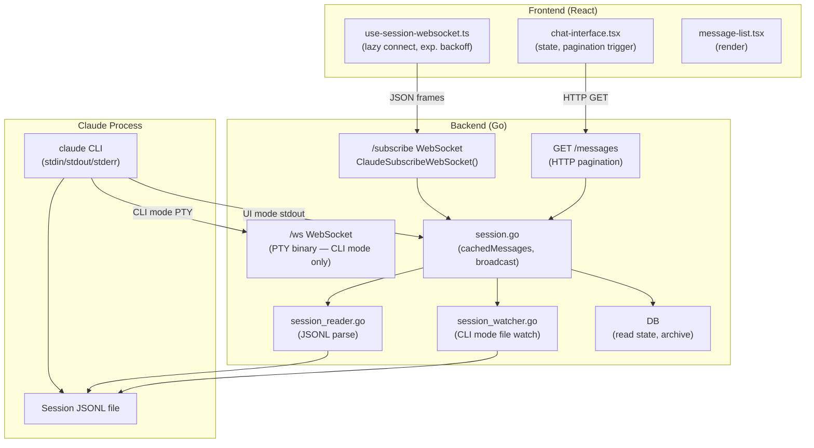
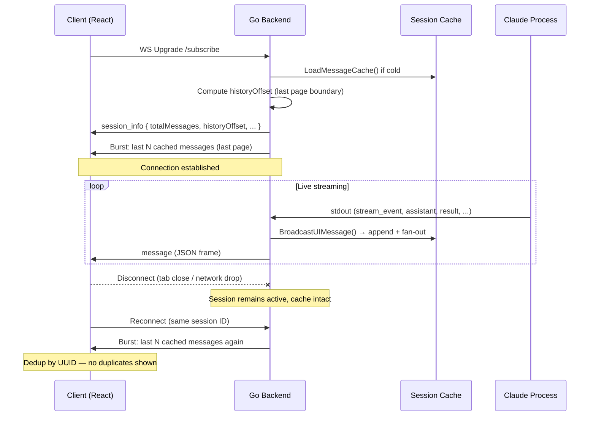
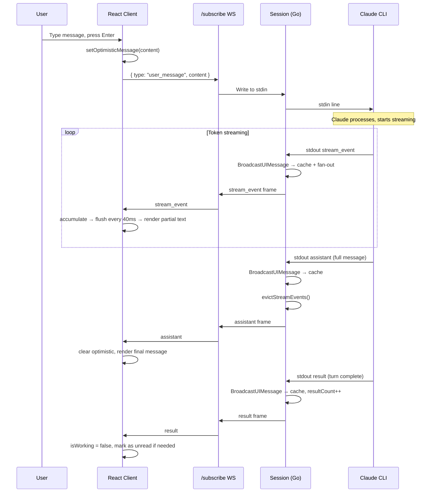

> **Scope**: Backend → Frontend review of the entire session messages pipeline, covering the WebSocket system, message caching, pagination, stream event lifecycle, and performance characteristics. Written 2026-02-23 against the current codebase. Where the existing [`websocket-protocol.md`](./websocket-protocol) describes an older polling-based design, this document reflects the actual implementation.

---

## 1. Design Goals & Constraints

### 1.1 Goals

| # | Goal | What it means |
|---|------|---------------|
| G1 | **Correct** | No duplicated messages, no missed messages. Every message delivered exactly once. |
| G2 | **Real-time updates** | Streaming tokens appear as Claude generates them; no polling lag |
| G3 | **Performant** | Low memory footprint, bounded transfer on connect, no redundant work |
| G4 | **Smooth UI** | No flashes, no jumps, no blank screens during pagination or reconnection |
| G5 | **Easy to maintain and debug** | Adding new message types is mechanical; raw messages are inspectable; issues are traceable to Claude or to our code |
| G6 | **Information-dense, neat UI** | Clean layout first — then expose as much information as possible via scrollable and collapsible containers. No data loss, no clutter. |

### 1.2 Technical Elements & Constraints

Claude Code runs as a subprocess. We get messages from two sources with different characteristics:

| Source | Characteristics |
|--------|----------------|
| **stdout** (stdin/stdout mode) | Real-time, includes ephemeral types (`stream_event`, `rate_limit_event`), messages arrive as Claude produces them |
| **JSONL file** | Durable, written by Claude Code, has write delays, does not include ephemeral types |

The two sources **overlap** — a message may appear in both stdout and the JSONL file. The backend must reconcile them into a single view.

For message type details (types, subtypes, fields, rendering rules), see the [claude-message-handler agent](../../../.claude/agents/claude-message-handler.md).

### 1.3 Design Decisions

These are deliberate choices that shape the architecture. Every component should respect them.

| # | Decision | Rationale |
|---|----------|-----------|
| D1 | **Backend maintains a single source of truth** | One merged, deduplicated message list per session — read from JSONL and stdout, properly reconciled. No secondary caches or parallel lists. |
| D2 | **The message list is append-only** | Messages are never reordered or mutated in the canonical list. New data arrives at the tail. (Stream event eviction is a controlled exception — see §7.) |
| D3 | **Single source, multiple views** | Each consumer (WebSocket burst, HTTP pagination, session state) generates its view by reading from this one list. No copies. |
| D4 | **Keep messages as raw as possible** | Store the bytes as received from JSONL / stdout — no re-serialization, no field stripping in the canonical list. This makes it easy to tell whether an issue originates from Claude or from our code. (Large content stripping is applied when *serving*, not when *storing*.) |
| D5 | **Client builds the same list, paginated** | The client reconstructs the same message list as the backend, but loads it on demand — last page on connect, older pages on scroll. |
| D6 | **Client decides rendering** | The backend serves raw messages. The frontend decides what to display, what to skip, how to group, and how to style. Rendering logic lives entirely in the frontend. |

> **Covered in later sections:** Stream event eviction (§7) is a deliberate exception to D2 — it removes redundant ephemeral messages after each turn to bound memory. Pagination mechanics (§6) detail how D5 works in practice.

---

## 2. System Architecture



Two WebSocket endpoints serve different purposes:

| Endpoint | Mode | Format | Compression | Purpose |
|----------|------|--------|-------------|---------|
| `/api/claude/sessions/:id/subscribe` | UI | JSON text frames | **Disabled** (intentional) | Structured chat, permissions, streaming |
| `/api/claude/sessions/:id/ws` | CLI | Binary | Enabled | Raw PTY I/O for xterm.js |

This document focuses entirely on the **subscribe** endpoint. The terminal endpoint is pass-through PTY data.

---

## 3. Message Types

### 3.1 Session Message Types

All messages share a base envelope:

```typescript
interface SessionMessageEnvelope {
  type: string
  uuid?: string         // Absent on transport-only messages
  parentUuid?: string
  timestamp?: number
}
```

**Persisted to JSONL (durable):**

| Type | Direction | Description |
|------|-----------|-------------|
| `user` | S→C | User input or tool result |
| `assistant` | S→C | Claude text/tool response |
| `result` | S→C | Turn completion marker |
| `progress` | S→C | Tool execution progress / hook events |
| `system` | S→C | Session lifecycle events (init, hooks, errors) |
| `file-history-snapshot` | S→C | Internal file versioning (not displayed) |

**Ephemeral (stdout only, not in JSONL):**

| Type | Direction | Description |
|------|-----------|-------------|
| `stream_event` | S→C | Token-level deltas during generation |
| `rate_limit_event` | S→C | API quota metadata |
| `queue-operation` | S→C | Internal session queue management |

**Bidirectional control:**

| Type | Direction | Cached? | Description |
|------|-----------|---------|-------------|
| `control_request` | S→C | ✅ Yes | Permission request (tool use) |
| `control_response` | C→S | ✅ Yes | Permission decision |
| `set_permission_mode` | C→S | ❌ No | Transient mode change |

> **Why is `set_permission_mode` not cached?**
> If it were cached, every new client that connects would re-receive and re-apply old mode switches. Broadcasting without caching means only currently-connected clients see it.

### 3.2 Non-Displayable Set

The following types are excluded from pagination counts and never rendered in the message list:

```go
// backend — also mirrored in frontend as NON_DISPLAYABLE_TYPES
"stream_event"
"rate_limit_event"
"queue-operation"
"file-history-snapshot"
```

This ensures `historyOffset` math is stable — adding or removing streaming events doesn't shift page boundaries.

---

## 4. WebSocket Connection Lifecycle

### 4.1 Connection Sequence



### 4.2 Initial Burst Design

On every connect, the client receives the **last page** of history (up to `DefaultPageSize = 100` displayable messages). This is a deliberate tradeoff:

- **Why not all messages?** Long sessions can have thousands of messages. Sending all on every connect would be slow and wasteful.
- **Why not zero?** The client needs recent context to reconstruct live state (current turn, pending permissions, unread markers).
- **Why last page specifically?** It gives the user immediate context while keeping the burst bounded and predictable.

Older messages are fetched on demand via HTTP pagination when the user scrolls up.

### 4.3 Frontend Connection Management

**File:** `frontend/app/components/claude/chat/hooks/use-session-websocket.ts`

Key behaviors of the connection hook:

| Behavior | Detail |
|----------|--------|
| **Lazy connect** | No WebSocket created until first `sendMessage()` call |
| **Exponential backoff** | 1s → 2s → 4s → … → 60s max |
| **Infinite retry** | Never gives up after `hasConnected = true` |
| **Token refresh** | Calls `refreshAccessToken()` on wake-up or disconnect |
| **Session isolation** | Stale messages for previous session IDs are discarded |
| **snake_case → camelCase** | Message normalization at the WebSocket entry point |

> **Known gap (H1 in robustness plan):** No heartbeat/ping-pong. Environments with aggressive idle timeouts (AWS ALB 60s, nginx 60s, Cloudflare 100s) may silently drop the connection. The backend sends server-side pings every 30s, but the frontend doesn't send application-level pings. Adding `{ type: "ping" }` every 30s from the client would cover all proxy tiers.

> **Known gap (H2):** No `visibilitychange` handler. When the tab is backgrounded, mobile browsers kill the connection. The terminal component handles this correctly; the chat WebSocket does not.

### 4.4 Session Modes

| Mode | Description | Stdout handling |
|------|-------------|----------------|
| `ui` | JSON streaming | Messages parsed from stdout JSON, pushed to subscribers |
| `cli` | PTY/xterm | PTY binary piped through `/ws`; JSONL file polled separately |

CLI mode uses `SessionWatcher` (fsnotify + polling fallback at 5s) to detect new JSONL entries, then calls `BroadcastUIMessage()`. In UI mode, the backend reads stdout directly.

---

## 5. Message Cache

### 5.1 Cache Structure

```go
// session.go
type Session struct {
    cachedMessages [][]byte        // Raw JSON bytes (passthrough — never re-serialized)
    seenUUIDs      map[string]bool // UUID dedup
    cacheLoaded    bool
    cacheMu        sync.RWMutex
}
```

The cache stores raw bytes, not parsed structs. This is deliberate — parsing every message on every reconnect would be wasteful, and we never need to mutate message content.

### 5.2 Loading

Cache is loaded once from the session JSONL file on first activation:

```
LoadMessageCache()
  → Read JSONL line by line
  → For each line: parseTypedMessage() → strip large read-tool content
  → Track UUID in seenUUIDs
  → Append raw bytes to cachedMessages
```

Large read-tool results are stripped at parse time, reducing payload size across all WebSocket and HTTP responses. This is why WebSocket compression is intentionally disabled — the content is already compact.

### 5.3 Live Appending: BroadcastUIMessage vs BroadcastToClients

Two broadcast methods with different caching behavior:

```
BroadcastUIMessage(data)      → cache + fan-out to all connected clients
BroadcastToClients(data)      → fan-out only (NOT cached)
```

| Used for | Method | Reason |
|----------|--------|--------|
| `user`, `assistant`, `result`, `progress`, `system` | BroadcastUIMessage | Durable history — new clients need these |
| `control_request`, `control_response` | BroadcastUIMessage | State-critical — reconnecting clients need pending permissions |
| `set_permission_mode` response | BroadcastToClients | Transient — should NOT be replayed on reconnect |
| `stream_event` | BroadcastUIMessage | Cached during streaming for mid-stream reconnect recovery |

### 5.4 Deduplication

Before appending to cache:

```go
if uuid != "" && seenUUIDs[uuid] {
    return  // Already in cache (e.g. from JSONL load + stdout overlap)
}
seenUUIDs[uuid] = true
cachedMessages = append(cachedMessages, data)
```

This handles the JSONL-vs-stdout race: in CLI mode, the watcher may pick up a message that was already added via stdout. UUID tracking ensures exactly-once delivery.

---

## 6. Pagination

### 6.1 Design: Last-Page-First + Backward Scroll

```
Session has 450 displayable messages (excluding stream_events, etc.)
DefaultPageSize = 100

On connect:
  historyOffset = 400  (last page boundary)
  Burst: messages [400..449]

User scrolls up → loadOlderMessages():
  offset = max(0, 400 - 100) = 300
  HTTP GET /messages?offset=300&limit=100
  → messages [300..399]
  historyOffset = 300

User scrolls up again:
  offset = max(0, 300 - 100) = 200
  HTTP GET /messages?offset=200&limit=100
  → messages [200..299]
  historyOffset = 200
```

Each backward load prepends to the message list and updates `historyOffset`. The scroll position is preserved by measuring height delta before/after prepend.

### 6.2 HTTP Endpoint

**Backend:** `GetClaudeSessionMessages()` in `backend/api/claude.go`

```
GET /api/claude/sessions/:id/messages?offset=N&limit=100

Response:
{
  sessionId: string
  mode: "ui" | "cli"
  messages: SessionMessage[]   // filtered: no non-displayable types
  totalCount: number           // count of displayable messages only
  offset: number
  limit: number
}
```

The filter is applied identically on both the HTTP endpoint and the initial WS burst, so `historyOffset` arithmetic is consistent.

### 6.3 Frontend Implementation

**File:** `frontend/app/components/claude/chat/chat-interface.tsx`

```typescript
const loadOlderMessages = async () => {
  const offset = Math.max(0, historyOffset - 100)
  const response = await fetch(`/api/claude/sessions/${sessionId}/messages?offset=${offset}&limit=100`)
  const data = await response.json()

  const newMessages = data.messages.filter(m => !NON_DISPLAYABLE_TYPES.has(m.type))

  setHistoryOffset(offset)
  setRawMessages(prev => {
    // Deduplicate by UUID, prepend
    const existing = new Set(prev.map(m => m.uuid))
    const unique = newMessages.filter(m => !existing.has(m.uuid))
    return [...unique, ...prev]
  })
}
```

Triggered by scroll-to-top detection in `message-list.tsx`. When `historyOffset === 0`, no more older messages exist.

### 6.4 Performance Characteristics

| Scenario | Messages transferred on connect |
|----------|--------------------------------|
| Short session (< 100 msgs) | All messages |
| Long session (1000 msgs) | Last 100 only |
| Reconnect mid-stream | Last 100 (includes stream_events) |

---

## 7. Stream Event Lifecycle

### 7.1 What Are Stream Events?

`stream_event` messages carry token-level Anthropic API streaming deltas:

```json
{
  "type": "stream_event",
  "event": {
    "type": "content_block_delta",
    "index": 0,
    "delta": { "type": "text_delta", "text": "Hello, " }
  }
}
```

They arrive in order: `message_start` → `content_block_start` → N×`content_block_delta` → `content_block_stop` → `message_delta` → `message_stop`.

The frontend buffers and flushes these every **40ms** to smooth rendering and batch React state updates.

### 7.2 Why Cache Stream Events At All?

Caching stream events during generation handles one edge case: **mid-stream reconnection**. If the client drops and reconnects while Claude is generating, it receives the accumulated stream events and can resume showing the partial text without waiting for the final `assistant` message.

### 7.3 Eviction After Completion

When the final `assistant` message arrives, stream events are immediately evicted from the cache:

```go
// Triggered from BroadcastUIMessage when type == "assistant"
func (s *Session) evictStreamEvents() {
    s.cacheMu.Lock()
    defer s.cacheMu.Unlock()

    n := 0
    for _, msg := range s.cachedMessages {
        if !isStreamEvent(msg) {
            s.cachedMessages[n] = msg
            n++
        }
    }
    s.cachedMessages = s.cachedMessages[:n]
}

func isStreamEvent(data []byte) bool {
    // Fast path: check first 100 bytes before JSON parse
    prefix := data
    if len(prefix) > 100 {
        prefix = prefix[:100]
    }
    if !bytes.Contains(prefix, []byte(`"stream_event"`)) {
        return false
    }
    var env struct{ Type string }
    json.Unmarshal(data, &env)
    return env.Type == "stream_event"
}
```

**Rationale:** After streaming completes, the full text is in the `assistant` message. Stream events are redundant and would waste memory for the rest of the session's lifetime. Clients reconnecting post-completion get the `assistant` message directly and don't need deltas.

**Timing sequence:**

```
stream_event(delta 1)  → cached
stream_event(delta 2)  → cached
...
stream_event(delta N)  → cached
assistant(full text)   → cached, then evictStreamEvents() runs
                                  → all stream_events removed from cache
```

### 7.4 Potential Race Condition

If new `stream_event` messages arrive *after* `evictStreamEvents()` runs (theoretically possible due to async goroutines), they would be re-added to the cache. In practice this is extremely unlikely because:
1. The `assistant` message is the final output of the Claude process for that turn
2. No more stdout arrives after the assistant message for that turn
3. The eviction is synchronous under the cache lock

This is an acceptable risk given the frequency (effectively zero) and consequence (a few extra bytes in cache that would be evicted on the next turn).

---

## 8. Session State Machine

The backend computes a derived `sessionState` from in-memory session properties:

```
if archived → "archived"
else if pendingPermissionCount > 0 → "unread" (permission waiting)
else if isProcessing → "working"
else if unreadResultCount > 0 → "unread"
else → "idle"
```

State is broadcast via SSE (not WebSocket) to drive the session list UI and Apple client badge counts. Read state (`readResultCount`) is persisted to SQLite via `MAX()` upsert — ensuring state never regresses across device switches.

---

## 9. Performance Optimizations Summary

| Optimization | Where | Impact |
|-------------|-------|--------|
| **Stream event eviction** | `session.go` | Frees N×delta messages after each turn |
| **Large content stripping** | `session_reader.go` | Removes file body from read-tool results at parse time |
| **Non-displayable filtering** | Both WS burst and HTTP | Keeps pagination math clean, reduces noise |
| **Token buffer flush (40ms)** | `chat-interface.tsx` | Batches stream_event renders, reduces re-render churn |
| **Lazy WS connection** | `use-session-websocket.ts` | No connection until user interacts |
| **WS compression disabled** | Backend WS upgrade | Lower memory overhead (content already compact after stripping) |
| **UUID dedup (cache)** | `session.go` | Prevents double-entry from JSONL+stdout overlap |
| **UUID dedup (frontend)** | `chat-interface.tsx` | Prevents duplicate display on reconnect |
| **Last-page-first burst** | WS connect handler | O(page) instead of O(session) on every connect |
| **Read-state MAX() upsert** | `db/claude_sessions.go` | Cross-device consistency without locks |

---

## 10. Data Flow: A Complete Turn



---

## 11. Known Issues & Gaps

These are issues identified during this review. The existing [`claude-chat-robustness-plan.md`](../design/claude-chat-robustness-plan) covers frontend-specific bugs in more detail.

### 11.1 No Frontend Heartbeat (High Priority)

Many reverse proxies (nginx, ALB, Cloudflare) have idle timeouts of 60–100s. The backend sends server-side WS pings every 30s, but the frontend doesn't send application-level pings. The connection can silently drop in certain proxy configurations.

**Fix:** Add `{ type: "ping" }` send every 30s from the frontend. The backend already handles unknown message types gracefully (logs and continues).

### 11.2 No Visibility Change Handling (High Priority)

The terminal component (`terminal.tsx`) correctly reconnects when the tab becomes visible again. The chat WebSocket hook does not. Mobile browsers aggressively kill background connections.

**Fix:** Add `document.addEventListener('visibilitychange', ...)` to `use-session-websocket.ts`, mirroring the terminal implementation.

### 11.3 Unbounded Cache Growth

The `cachedMessages` slice grows throughout a session's lifetime and is only reset on `ReloadMessageCache()` (called during re-activation). A session with many turns could accumulate significant memory. Stream events are evicted per-turn, but all other message types stay forever.

**Consideration:** A background compaction step that periodically writes a snapshot and trims the in-memory slice would cap memory use. Not urgent for typical session lengths, but worth tracking for very long-running sessions.

### 11.4 Permission Mode Not Persisted

`PermissionMode` (acceptEdits, default, etc.) is stored only in the in-memory `Session` struct. A server restart loses the permission mode for all active sessions.

**Consideration:** Persist to DB alongside session metadata. Low risk currently since server restarts are rare.

### 11.5 CLI Mode Watcher Delay

The `SessionWatcher` falls back to 5s polling if fsnotify fails. CLI-mode users could see up to 5s message delay in that case. This is filesystem-dependent and typically doesn't occur, but logging when the fallback activates would help diagnose it.

### 11.6 websocket-protocol.md Is Outdated

The existing `websocket-protocol.md` describes an old polling-based architecture (500ms polls, `ReadSessionHistory`, no caching). The current implementation uses push broadcasting (`BroadcastUIMessage`), an in-memory cache, and paginated HTTP for older messages. That document should be updated or superseded by this review.

---

## 12. Rendering Performance

### 12.1 Message List

All messages are rendered in a single list (`message-list.tsx`) without virtualization. For typical sessions (< 200 displayable messages after pagination), this is fine. For sessions with hundreds of large tool results, it could cause janky scrolling.

**Considered improvement:** `@tanstack/react-virtual` for the message list. This is a non-trivial refactor because message heights vary significantly (tool results can be very tall). Track as a future improvement once sessions routinely exceed 300 displayed messages.

### 12.2 Token Rendering

The 40ms flush interval for stream events is a good balance:
- **Too fast** (< 10ms) → excessive re-renders, visible churn
- **Too slow** (> 100ms) → streaming feels laggy
- **40ms** → ~25 renders/second, smooth without being expensive

### 12.3 React State Shape

`rawMessages` is a flat array; the frontend derives display state (grouping tool calls with their results, resolving progress messages) on each render via memoized selectors. This is correct but means derived state re-computes on every new message. For very large message arrays this could become noticeable — memoizing individual message blocks by UUID would scope re-renders to only changed messages.

---

## 13. Cross-Client Consistency

The backend serves three client types from the same session cache:

| Client | Connection | Notes |
|--------|-----------|-------|
| Web (React) | `/subscribe` WebSocket | Primary client |
| iOS / macOS (SwiftUI) | SSE only (notifications) | Session list + state; no message streaming |
| Web terminal (xterm.js) | `/ws` WebSocket | CLI mode only |

The Apple client does **not** stream messages via WebSocket — it receives session state changes via SSE and opens a WebView that loads the React frontend for actual message display. This means message rendering is consistent across platforms (same React code), and only the session list / badge counts are native.

---

## 14. Review Summary

The cloud session messages system is **well-architected** for its requirements. The two-tier WebSocket design cleanly separates binary PTY traffic from structured chat messages. The cache-and-broadcast model gives reconnecting clients instant context without re-reading from disk. Pagination with non-displayable filtering keeps the math clean. Stream event eviction is elegant — keep what you need for reconnection recovery, drop it the moment it becomes redundant.

**Highest-value improvements (in order):**

1. **Frontend heartbeat** — prevents silent connection drops behind proxies (30 min of work)
2. **Visibility change reconnect** — makes mobile experience reliable (1 hour of work)
3. **Update websocket-protocol.md** — remove confusion about the old polling design (documentation, no code change)
4. **Permission mode persistence** — survive server restarts (medium effort, low urgency)
5. **Message list virtualization** — future-proofing for very long sessions (large effort, low urgency now)

**Things that are working well:**
- UUID-based deduplication at every layer (cache, HTTP response, frontend)
- Stream event lifecycle (cache during stream → evict on completion)
- Last-page-first burst keeping initial connect O(page) not O(session)
- Large content stripping at JSONL parse time keeping payloads small
- Cross-device read state via DB MAX() upsert

---

## 15. Scenarios

Common scenarios and the expected behavior at each layer. Use these to verify correctness and as regression criteria.

### 15.1 Fresh Session — First Connect

| Layer | Behavior |
|-------|----------|
| Backend | Cache is empty. `LoadMessageCache()` reads JSONL (empty or just `system:init`). |
| WS burst | `session_info` with `totalMessages: 0` (or 1). Burst sends 0–1 messages. |
| Frontend | Shows empty chat or system init. Input ready. |
| Expected UX | Clean empty state. No spinners, no "loading" for an empty session. |

### 15.2 Reconnect — Session Idle (Claude Not Streaming)

| Layer | Behavior |
|-------|----------|
| Backend | Cache has completed turns. Stream events already evicted. |
| WS burst | Last page of displayable messages (up to 100). `session_info` with accurate `totalMessages`. |
| Frontend | Dedup by UUID — messages already in `rawMessages` are skipped. New ones appended. No clear-and-refill. |
| Expected UX | Seamless. User sees the same messages. No flash, no scroll jump. |

### 15.3 Reconnect — Mid-Stream (Claude Actively Generating)

| Layer | Behavior |
|-------|----------|
| Backend | Cache has completed turns + current turn's stream events at tail. |
| WS burst | Last page of displayable messages + tail stream events (raw cache from `historyOffset`). |
| Frontend | Displayable messages → `rawMessages`. Stream events → streaming buffer. Streaming text resumes rendering. |
| Expected UX | User sees message history + partial streaming text. Streaming continues from where it was. No lost tokens. |

### 15.4 Long Session — Initial Connect (Hundreds of Messages)

| Layer | Behavior |
|-------|----------|
| Backend | `displayableCount` used to compute `historyOffset`. Only last page served on connect. |
| WS burst | Up to 100 displayable messages + `session_info` with full `totalMessages`. |
| Frontend | Renders last page. `historyOffset > 0` enables scroll-up loading. |
| Expected UX | Fast initial load. User sees recent context. Scroll up reveals "load more" or auto-fetches older pages. |

### 15.5 Scroll Up — Load Older Pages

| Layer | Behavior |
|-------|----------|
| HTTP | `GET /messages?offset=N&limit=100`. Backend filters non-displayable first, then slices. Page always has up to 100 displayable messages. |
| Frontend | Dedup by UUID, prepend to `rawMessages`. `useLayoutEffect` adjusts scroll position by height delta. `historyOffset` decremented. |
| Expected UX | Older messages appear above. No scroll jump. When `historyOffset === 0`, all history loaded. |

### 15.6 Long Streaming Turn (Many Stream Events in Cache)

| Layer | Behavior |
|-------|----------|
| Backend | Stream events accumulate at cache tail. Previous turns' events already evicted. |
| WS burst (if reconnect) | `historyOffset` based on displayable count — points into the displayable region. Slice includes displayable messages + tail stream events. |
| Frontend | Stream events routed to buffer (40ms flush). Displayable messages populate `rawMessages`. |
| Expected UX | Message list shows completed turns. Streaming text renders smoothly. No blank screen — displayable messages are always present before the stream event tail. |

### 15.7 Turn Completes — Stream Event Eviction

| Layer | Behavior |
|-------|----------|
| Backend | `assistant` message arrives → `BroadcastUIMessage` caches it → `evictStreamEvents()` removes all stream events from cache (under lock). |
| WS live | `assistant` frame sent to all connected clients. |
| Frontend | Receives `assistant` message. Clears streaming buffer. Renders final message in `rawMessages`. |
| Expected UX | Streaming text replaced by final formatted message. No flicker — React 18 batches the clear + render. |

### 15.8 Rate Limit Warning

| Layer | Behavior |
|-------|----------|
| Backend | `rate_limit_event` broadcast to clients (cached via `BroadcastUIMessage`). |
| Frontend | `handleMessage` intercepts before `rawMessages`. If `utilization >= 0.75` or `status === 'allowed_warning'` → `setRateLimitWarning`. |
| Expected UX | Amber banner appears above input. Shows utilization %, window type, reset time. Dismissible. Does **not** appear as a chat message. |

### 15.9 Permission Request (Tool Use Approval)

| Layer | Behavior |
|-------|----------|
| Backend | `control_request` cached via `BroadcastUIMessage` (survives reconnect). |
| Frontend | `handleMessage` routes to `permissions.handleControlRequest`. Renders permission UI inline. |
| User action | Approve/deny → `control_response` sent via WS. Backend forwards to Claude stdin. |
| Expected UX | Permission prompt appears inline in the message flow. Persists across reconnects until resolved. |

### 15.10 New Message Type from Claude Code Update

| Layer | Behavior |
|-------|----------|
| Backend | Unknown type passes through — raw bytes cached, broadcast, served. No parsing failure. |
| Frontend | Falls through to `UnknownMessageBlock` — renders raw JSON in a collapsible block. |
| Expected UX | User sees the message (not silently dropped). Raw JSON aids debugging. Developer adds proper rendering later per G6. |

### 15.11 Multiple Clients on Same Session

| Layer | Behavior |
|-------|----------|
| Backend | Each WS client registered as subscriber. `BroadcastUIMessage` fans out to all. Same cache serves all HTTP pagination requests. |
| Read state | `MarkClaudeSessionRead` uses `MAX()` upsert — highest read count wins. No regression across devices. |
| Expected UX | All clients see the same messages. Opening on any device marks session as read. No stale "unread" badges. |

### 15.12 Session State Transitions

| Trigger | State | How it resolves |
|---------|-------|-----------------|
| Claude starts processing | `working` | `isProcessing` flag set on session |
| `result` message arrives, no client viewing | `unread` | `resultCount` exceeds `lastReadResultCount` in DB |
| Client connects to session | `idle` | Connect handler writes full `resultCount` to DB via `MarkClaudeSessionRead` |
| `control_request` arrives | `unread` | `pendingPermissionCount > 0` |
| User responds to permission | `working` or `idle` | Permission resolved, count decremented |

---

## 16. Historical Issues

Six issues encountered during development and how the current design addresses each one.

---

### 16.1 Rate Limit Event Not Rendered

**Issue:** The `rate_limit_event` message type (e.g. a 94% API utilization warning) was silently dropped. Users had no indication they were approaching rate limits.

**Root cause:** `rate_limit_event` was added to `NON_DISPLAYABLE_TYPES` (both backend and frontend), which correctly excluded it from the message list and pagination counts. But there was no separate code path to surface the rate limit information to the user.

**Current status: Resolved.**

`rate_limit_event` remains in `NON_DISPLAYABLE_TYPES` — it should not appear as a chat message. Instead, `handleMessage` in `chat-interface.tsx` intercepts `rate_limit_event` before it reaches `setRawMessages` and extracts the `rate_limit_info` payload:

- If `status === 'allowed_warning'` or `utilization >= 0.75` → sets `rateLimitWarning` state
- Otherwise → clears the warning

The `RateLimitWarning` component renders a dismissible amber banner showing utilization percentage, rate limit window type, and reset time. The two concerns (exclude from message list vs. show warning banner) are cleanly separated.

**Residual risk:** None. The interception happens before the `NON_DISPLAYABLE_TYPES` filter, so there is no ordering dependency.

---

### 16.2 UI Flashes During Pagination and Message Arrival

**Issue:** Visual glitches — the message list would flash or jump when older pages were prepended or when certain messages arrived (particularly on reconnection).

**Root cause:** Two separate flash sources:
1. **Pagination prepend:** Browser paints the DOM before scroll position is adjusted, causing a single-frame jump
2. **Reconnection:** Clearing `rawMessages` on reconnect creates an empty-list frame before new messages arrive

**Current status: Resolved.**

**Pagination flash** — `message-list.tsx` uses `useLayoutEffect` (not `useEffect`) to adjust scroll position. `useLayoutEffect` fires synchronously after DOM mutation but before browser paint. The hook computes the scroll height delta from the prepend and adds it to `scrollTop`, keeping visible content in place with no visible jump. The adjustment is gated on `prevScrollTopRef < 300` (user was near top when prepend happened).

**Reconnection flash** — `chat-interface.tsx` uses a deferred clear mechanism (`pendingReconnectClearRef`). Instead of clearing `rawMessages` immediately on reconnect (which would render an empty list for one frame), the clear is deferred to the arrival of the first new message. React 18's automatic batching combines the clear and the new message into a single render, eliminating the empty-list flash.

**Streaming token batching** — `stream_event` deltas are buffered and flushed to state every 40ms (~25 renders/second), preventing per-token re-render churn.

**Residual risk:** The `useLayoutEffect` scroll adjustment relies on `messages.length` as its dependency. If a message update changes content without changing count (e.g. UUID-matched replacement), the effect doesn't fire. This is acceptable because content-only updates don't change scroll height significantly.

---

### 16.3 Scroll Preload Slow Due to Non-Displayable Messages

**Issue:** Loading older pages via scroll-up required many round trips because non-displayable messages (stream_events, rate_limit_events, etc.) inflated each page. A page of 100 messages might contain only a handful of displayable messages, requiring many fetches to fill the viewport.

**Root cause:** The HTTP pagination endpoint applied `offset` and `limit` to the raw message list before filtering non-displayable types.

**Current status: Resolved.**

`GetClaudeSessionMessages` in `backend/api/claude.go` now filters non-displayable types **first**, then applies `offset`/`limit` to the already-filtered list:

```
1. Build allMessages[] by iterating cachedMessages, keeping only displayable types
2. totalCount = len(allMessages)           // displayable only
3. messages = allMessages[offset : offset+limit]  // pagination on filtered set
```

A page of 100 always contains up to 100 displayable messages. The frontend applies a defensive filter on the HTTP response as a safety net, but the backend filtering is authoritative.

**Residual risk:** None for the HTTP endpoint. The initial WebSocket burst uses a different code path (see §16.5) where the raw cache is sent — but that path is only for the most recent page and intentionally includes stream_events for mid-stream reconnection.

---

### 16.4 Stream Event Eviction Interaction with Pagination

**Issue:** Stream event eviction relies on the next `assistant` message arriving in `BroadcastUIMessage`. Question: does this interact correctly with paginated history loading, or could evicted/un-evicted stream events appear in older pages?

**Root cause:** Conceptual concern about the eviction lifecycle — whether the cache and HTTP endpoint could serve inconsistent views of stream events.

**Current status: Resolved. No interaction issue exists.**

Three layers prevent stream events from appearing in paginated history:

1. **Eviction on completion:** `evictStreamEvents()` runs synchronously (under `cacheMu` lock) when `BroadcastUIMessage` receives a `type: "assistant"` message. All stream events from the preceding turn are removed from `cachedMessages` before any subsequent read.

2. **HTTP endpoint filtering:** `GetClaudeSessionMessages` applies `IsNonDisplayableMessage` to every message before pagination. Even if eviction hasn't run yet (mid-stream), stream events are excluded from HTTP responses.

3. **CLI mode:** Stream events are ephemeral stdout output, never written to the session JSONL file. CLI-mode pagination reads from JSONL, so stream events are structurally absent.

The only context where stream events are intentionally served is the initial WebSocket burst during active streaming (for mid-stream reconnection recovery). In that context, the frontend routes them to the streaming buffer, not `rawMessages`.

**Residual risk:** None for pagination. The eviction + filtering + JSONL-absence triple-guard covers all code paths.

---

### 16.5 Blank Screen When Recent Messages Are All Stream Events

**Issue:** During a long streaming turn, the in-memory cache could contain 100+ `stream_event` messages as the most recent entries. The initial WebSocket burst delivers the last page from the raw cache. If `rawMessages` ends up empty (all received messages are stream_events routed to the streaming buffer), the `messages.length === 0` guard could block adaptive fill, leaving the user with a blank screen.

**Root cause:** The initial burst's page boundary (`historyOffset`) is computed from `displayableCount`, but the slice index is applied to the raw `cachedMessages` array. The design assumes non-displayable messages are concentrated at the tail of the cache (current turn's stream events), which is true given per-turn eviction. But if all displayable messages fall before the slice start, the burst contains only stream events.

**Current status: Resolved by design, with a noted fragility.**

The resolution relies on an invariant: **stream events from completed turns are evicted, so only the current turn's stream events exist in the cache, always at the tail.** This means:

- `displayableCount` reflects all displayable messages in the cache (completed turns' messages)
- `historyOffset` points to a position within the displayable messages
- Since evicted-turn messages are contiguous before the current turn's stream events, `cachedMessages[historyOffset:]` includes the correct last page of displayable messages **plus** the tail stream events

Example: 150 displayable messages + 200 stream_events (at tail). `historyOffset = 100`. `cachedMessages[100:]` = last 50 displayable messages + 200 stream_events. Frontend gets 50 displayable messages (correct) + streaming content.

The frontend routes `stream_event` to the streaming text buffer (not `rawMessages`), so displayable messages populate the message list while streaming text renders separately.

**Residual risk: The index arithmetic is fragile.** It depends on the invariant that non-displayable messages are strictly at the tail. If other non-displayable types (e.g. `rate_limit_event`, `queue-operation`) are cached via `BroadcastUIMessage` and scattered throughout the cache, the raw-cache index would diverge from the displayable-count-based offset. Currently this is mitigated by:
- `rate_limit_event` being infrequent
- `queue-operation` behavior depending on broadcast method (needs verification)
- `file-history-snapshot` being persisted to JSONL but filtered at the non-displayable level

A more robust approach would compute the burst by filtering the cache first (like the HTTP endpoint does), then slicing. The tradeoff is that the current approach avoids an extra filtering pass on every connect and naturally includes tail stream events for reconnection.

---

### 16.6 Session Stuck as "Unread" Forever

**Issue:** When `result` messages live in older pages (before `historyOffset`), the initial WebSocket burst delivers zero results. If `deliveredResults` stays 0, `persistReadState` never writes to the DB. The session never transitions from "unread" to "idle" even while the user is actively viewing it.

**Root cause:** The original implementation only counted `result` messages in the initial burst and live streaming. Opening a session and viewing it was not sufficient to mark historical turns as read.

**Current status: Resolved.**

The connect handler now counts **all** result messages in the full cache, not just those in the burst:

```go
// On connect (UI mode):
cachedMessages := session.GetCachedMessages()
cacheResultCount := 0
for _, msgBytes := range cachedMessages {
    if type == "result" { cacheResultCount++ }
}
if cacheResultCount > 0 {
    db.MarkClaudeSessionRead(sessionID, cacheResultCount)
    deliveredResults.Store(int32(cacheResultCount))
}
```

The code comment explains the rationale: *"result messages may live in older cache pages that are NOT included in the initial WebSocket burst. [...] Opening the session in the UI is sufficient to consider the historical turns 'seen'."*

This runs before the initial burst is sent. `MarkClaudeSessionRead` uses a `MAX()` upsert, so concurrent or repeated calls never regress the read count. During the live session, each new `result` message increments `deliveredResults` and persists inline. On disconnect, `defer persistReadState()` acts as a safety net.

Unread state is computed by comparing the session's live `resultCount` (incremented in `BroadcastUIMessage` on each `result`) against the DB's `last_read_message_count`. If the live count exceeds the persisted read count, the session shows as "unread". Since the connect handler writes the full cache's result count to the DB, opening a session immediately resolves any historical unread state.

**Residual risk:** CLI-mode sessions use the same pattern (counting all results in `initialMessages` on connect). The `MAX()` upsert prevents race conditions between multiple clients. No residual risk identified.
