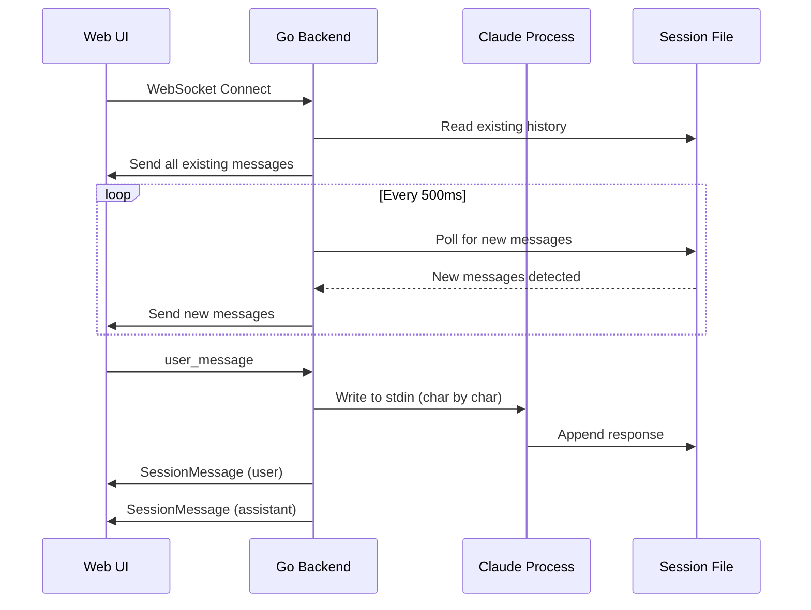

## Overview

This document describes the WebSocket protocol used for real-time bidirectional communication between the web UI and Claude Code sessions. The protocol is aligned with the official [claude.ai/code](https://claude.ai/code) implementation.

**Protocol Version**: 1.0
**Endpoint**: `ws://localhost:12345/api/claude/sessions/:sessionId/subscribe`
**Message Format**: JSON (text frames)
**Encoding**: UTF-8

---

## Connection Flow



---

## Working State Detection

The client can determine if Claude is actively working by tracking message patterns:

**Working indicators**:
- **Progress messages** (`type: "progress"`) - Tool execution in progress
- **Incomplete conversation** - User message sent but no final assistant response yet
- **Multiple assistant messages in sequence** - Claude is still generating (tool calls, thinking, final response)

**Idle indicators**:
- **Queue operation** (`type: "queue-operation", operation: "dequeue"`) - Claude finished processing and returned to prompt
- **Final assistant message** - Last message is assistant text (no tool calls)

**Frontend implementation**:
```typescript
// Track working state
let isWorking = false
let lastMessageType = null
let lastAssistantHasToolCalls = false

ws.onmessage = (event) => {
  const msg = JSON.parse(event.data)

  if (msg.type === 'user') {
    isWorking = true // User sent message, Claude will respond
  } else if (msg.type === 'progress') {
    isWorking = true // Tool executing
  } else if (msg.type === 'assistant') {
    const hasToolCalls = msg.message.content?.some(b => b.type === 'tool_use')
    lastAssistantHasToolCalls = hasToolCalls
    isWorking = hasToolCalls // Still working if tool calls present
  } else if (msg.type === 'queue-operation' && msg.operation === 'dequeue') {
    isWorking = false // Claude returned to prompt, done working
  }

  setIsStreaming(isWorking)
}
```

---

## Message Types

### 1. Client → Server

#### User Message
```json
{
  "type": "user_message",
  "content": "What files are in this directory?"
}
```

**Fields**:
- `type` - Always `"user_message"`
- `content` - User's input text (string)

**Behavior**:
- Server writes content to Claude PTY character-by-character (avoids readline paste detection)
- Appends `\n` (newline) automatically
- Updates session `lastActivity` timestamp

---

### 2. Server → Client

#### SessionMessage (Standard Format)

All messages from server follow the `SessionMessage` structure from Claude's JSONL files.

**User Message**:
```json
{
  "type": "user",
  "uuid": "c0a21d6f-3652-4f86-a36b-b98d75a15298",
  "parentUuid": null,
  "timestamp": "2026-01-19T04:45:15.012Z",
  "message": {
    "role": "user",
    "content": "What files are in this directory?"
  }
}
```

**Assistant Text Response**:
```json
{
  "type": "assistant",
  "uuid": "a953b709-f2f8-46e3-8c99-4f9b01f8e6d5",
  "parentUuid": "c0a21d6f-3652-4f86-a36b-b98d75a15298",
  "timestamp": "2026-01-19T04:45:17.971Z",
  "message": {
    "role": "assistant",
    "model": "claude-sonnet-4-5-20250929",
    "id": "msg_011ZDfTwZ6PbL4YwkoxGTyTE",
    "content": [
      {
        "type": "text",
        "text": "I'll check the directory for you."
      }
    ],
    "usage": {
      "input_tokens": 245,
      "cache_read_input_tokens": 17070,
      "output_tokens": 12
    }
  },
  "requestId": "req_011CXG8NGkcHf7UFyKrGqvEg"
}
```

**Assistant Tool Call**:
```json
{
  "type": "assistant",
  "uuid": "75819da3-58d5-4d30-a167-a1449fd87738",
  "parentUuid": "a953b709-f2f8-46e3-8c99-4f9b01f8e6d5",
  "timestamp": "2026-01-19T04:45:18.615Z",
  "message": {
    "role": "assistant",
    "content": [
      {
        "type": "tool_use",
        "id": "toolu_014EkHUXLk8xUUUqjocQNd8g",
        "name": "Bash",
        "input": {
          "command": "ls -la"
        }
      }
    ]
  }
}
```

**Tool Result**:
```json
{
  "type": "user",
  "uuid": "8f3c5d2a-1234-5678-9abc-def012345678",
  "parentUuid": "75819da3-58d5-4d30-a167-a1449fd87738",
  "timestamp": "2026-01-19T04:45:19.123Z",
  "message": {
    "role": "user",
    "content": [
      {
        "type": "tool_result",
        "tool_use_id": "toolu_014EkHUXLk8xUUUqjocQNd8g",
        "content": "total 48\ndrwxr-xr-x  12 user  staff   384 Jan 19 12:45 .\n..."
      }
    ]
  },
  "toolUseResult": {
    "toolUseId": "toolu_014EkHUXLk8xUUUqjocQNd8g",
    "isError": false
  }
}
```

**Progress Message (Tool Execution)**:
```json
{
  "type": "progress",
  "uuid": "26978643-ffbd-4e71-8fe2-16f258a3ce06",
  "parentUuid": "67d14f47-796f-4d74-89a2-355aca40aa7b",
  "timestamp": "2026-01-21T09:36:55.890Z",
  "data": {
    "type": "hook_progress",
    "hookEvent": "PreToolUse",
    "hookName": "PreToolUse:Read",
    "command": "callback"
  },
  "toolUseID": "toolu_01X5nzhSfiEL5MQ8DUeeFZhY"
}
```

**Queue Operation (Session State)**:
```json
{
  "type": "queue-operation",
  "operation": "dequeue",
  "timestamp": "2026-01-21T09:56:54.360Z",
  "sessionId": "7afc3e49-d4dd-410a-8fc2-8d26cf6e1f80"
}
```

**Thinking Block (Extended Thinking)**:
```json
{
  "type": "assistant",
  "uuid": "b812dc15-5444-460a-bae4-2111a7f2c2f8",
  "parentUuid": "...",
  "timestamp": "2026-01-21T12:21:15.789Z",
  "message": {
    "role": "assistant",
    "model": "claude-opus-4-5-20251101",
    "content": [
      {
        "type": "thinking",
        "thinking": "Let me analyze the directory structure carefully...",
        "signature": "EsQCCkYICxgCKkAw8Q1KeDQe..."
      }
    ],
    "usage": {
      "input_tokens": 8,
      "cache_read_input_tokens": 21436,
      "output_tokens": 1
    }
  }
}
```

#### Error Message
```json
{
  "type": "error",
  "error": "Failed to send message to session"
}
```

**When sent**:
- PTY write failure
- Session not found
- Internal server error

**Client behavior**: Display error to user, reset streaming state

#### Stream Event (Progressive Updates)

When `IncludePartialMessages` is enabled in the SDK options, the server sends `stream_event` messages containing Anthropic API streaming events. These enable progressive text display as Claude generates responses.

**Message Format**:
```json
{
  "type": "stream_event",
  "event": {
    "type": "content_block_delta",
    "index": 0,
    "delta": {
      "type": "text_delta",
      "text": "Here is some "
    }
  }
}
```

**Event Sequence** (for a typical response):
1. `message_start` - Response generation begins
2. `content_block_start` - A content block (text/thinking/tool_use) begins
3. `content_block_delta` (xN) - Incremental content updates
4. `content_block_stop` - Content block complete
5. `message_delta` - Message metadata update (stop_reason, usage)
6. `message_stop` - Response generation complete

**Delta Types**:

| Delta Type | In Event | Contains |
|------------|----------|----------|
| `text_delta` | `content_block_delta` | `delta.text` - incremental text |
| `thinking_delta` | `content_block_delta` | `delta.thinking` - incremental thinking |
| `input_json_delta` | `content_block_delta` | `delta.partial_json` - tool input JSON |

**Client Implementation**:
```typescript
// Accumulate streaming text
let streamingText = ''

ws.onmessage = (event) => {
  const msg = JSON.parse(event.data)

  if (msg.type === 'stream_event') {
    const evt = msg.event

    // Accumulate text deltas
    if (evt.type === 'content_block_delta' && evt.delta?.type === 'text_delta') {
      streamingText += evt.delta.text
      updateUI(streamingText)
    }

    // Clear on completion
    if (evt.type === 'message_stop') {
      streamingText = ''
    }
  }

  // Full assistant message arrives after stream completes
  if (msg.type === 'assistant') {
    streamingText = ''  // Clear streaming state
    renderFinalMessage(msg)
  }
}
```

**Timing Characteristics** (typical):
- Average delta interval: ~65ms
- Minimum: ~0.2ms (burst)
- Maximum: ~240ms (thinking/pauses)

**When sent**:
- Only when session has `IncludePartialMessages: true` in SDK options
- Not persisted to JSONL (streaming-only)

---

## Content Block Types

Messages can contain different types of content blocks in the `message.content` array:

### Text Block
```typescript
{
  type: 'text',
  text: string
}
```

### Thinking Block (Opus 4.5+ Extended Thinking)
```typescript
{
  type: 'thinking',
  thinking: string,        // Extended reasoning content
  signature?: string       // Cryptographic signature for verification
}
```

### Tool Use Block
```typescript
{
  type: 'tool_use',
  id: string,              // Tool invocation ID (e.g., "toolu_...")
  name: string,            // Tool name (e.g., "Read", "Bash", "Edit")
  input: Record<string, unknown>  // Tool parameters
}
```

### Tool Result Block
```typescript
{
  type: 'tool_result',
  tool_use_id: string,     // References tool_use.id
  content: string | Array<{type: string, ...}>,
  is_error?: boolean       // true if tool execution failed
}
```

---

## Backend Implementation

### Endpoint Handler

**File**: `backend/api/claude.go`
**Function**: `ClaudeSubscribeWebSocket()`

**Key behaviors**:

1. **Connection Initialization**:
   - Accept WebSocket upgrade
   - Ensure Claude session is activated
   - Send all existing messages from session JSONL file
   - Start polling goroutine (500ms interval)
   - Start ping goroutine (30s interval)

2. **Polling Loop**:
   ```go
   pollTicker := time.NewTicker(500 * time.Millisecond)
   for {
       messages := claude.ReadSessionHistory(sessionID, workingDir)
       if len(messages) > lastMessageCount {
           // Send new messages
           newMessages := messages[lastMessageCount:]
           for _, msg := range newMessages {
               conn.Write(ctx, websocket.MessageText, json.Marshal(msg))
           }
           lastMessageCount = len(messages)
       }
   }
   ```

3. **Client Message Handling**:
   ```go
   for {
       var inMsg struct {
           Type    string `json:"type"`
           Content string `json:"content"`
       }
       conn.Read(ctx) -> json.Unmarshal(msg, &inMsg)

       if inMsg.Type == "user_message" {
           // Write to PTY character-by-character
           for _, ch := range inMsg.Content + "\n" {
               session.PTY.Write([]byte(string(ch)))
           }
       }
   }
   ```

4. **Graceful Shutdown**:
   - Client disconnection stops all goroutines
   - Context cancellation propagates to polling/ping loops
   - Session remains active (can be reconnected)

---

## Frontend Implementation

### WebSocket Client

**File**: `frontend/app/components/claude/chat/chat-interface.tsx`

**Connection Setup**:
```typescript
useEffect(() => {
  const protocol = window.location.protocol === 'https:' ? 'wss:' : 'ws:'
  const wsUrl = `${protocol}//${window.location.host}/api/claude/sessions/${sessionId}/subscribe`

  const ws = new WebSocket(wsUrl)
  wsRef.current = ws

  ws.onopen = () => {
    console.log('WebSocket connected')
    setWsConnected(true)
  }

  ws.onmessage = (event) => {
    const data = JSON.parse(event.data)

    // Handle error messages
    if (data.type === 'error') {
      setIsStreaming(false)
      return
    }

    // Handle SessionMessage
    const sessionMsg: SessionMessage = data
    const converted = convertToMessage(sessionMsg)

    setMessages(prev => {
      // Deduplicate by UUID
      if (prev.some(m => m.id === converted.id)) return prev
      return [...prev, converted]
    })

    // Stop streaming when assistant responds
    if (converted.role === 'assistant') {
      setIsStreaming(false)
    }
  }

  ws.onerror = (error) => {
    console.error('WebSocket error:', error)
    setWsConnected(false)
  }

  ws.onclose = () => {
    console.log('WebSocket disconnected')
    setWsConnected(false)
  }

  return () => ws.close()
}, [sessionId])
```

**Sending Messages**:
```typescript
const sendMessage = useCallback((content: string) => {
  if (!wsRef.current || wsRef.current.readyState !== WebSocket.OPEN) {
    console.error('WebSocket not connected')
    return
  }

  setIsStreaming(true)

  // Optimistic UI update
  setMessages(prev => [...prev, {
    id: crypto.randomUUID(),
    role: 'user',
    content,
    timestamp: Date.now()
  }])

  // Send via WebSocket
  wsRef.current.send(JSON.stringify({
    type: 'user_message',
    content
  }))
}, [])
```

**Message Conversion**:
```typescript
function convertToMessage(sessionMsg: SessionMessage): Message {
  const { content, role } = sessionMsg.message

  let textContent = ''
  let toolCalls: ToolCall[] = []
  let thinkingBlocks: ThinkingBlock[] = []

  if (typeof content === 'string') {
    textContent = content
  } else if (Array.isArray(content)) {
    // Extract text blocks
    textContent = content
      .filter(isTextBlock)
      .map(block => block.text)
      .join('\n')

    // Extract thinking blocks
    thinkingBlocks = content
      .filter(isThinkingBlock)
      .map(block => ({
        type: 'thinking',
        thinking: block.thinking,
        signature: block.signature
      }))

    // Extract tool calls
    toolCalls = content
      .filter(isToolUseBlock)
      .map(block => ({
        id: block.id,
        name: block.name,
        parameters: block.input,
        status: 'completed'
      }))
  }

  return {
    id: sessionMsg.uuid,
    role,
    content: textContent,
    toolCalls: toolCalls.length > 0 ? toolCalls : undefined,
    thinking: thinkingBlocks.length > 0 ? thinkingBlocks : undefined,
    timestamp: new Date(sessionMsg.timestamp).getTime()
  }
}
```

---

## Message Threading

Messages form a tree structure using `uuid` and `parentUuid`:

```
User Message (uuid: A, parentUuid: null)
  ├─ Assistant Response (uuid: B, parentUuid: A)
  │   ├─ Tool Call (uuid: C, parentUuid: B)
  │   │   └─ Tool Result (uuid: D, parentUuid: C)
  │   └─ Final Response (uuid: E, parentUuid: D)
  └─ [Alternative branch if user edits/forks]
```

**Building Thread Tree**:
```typescript
function buildMessageTree(messages: SessionMessage[]): MessageNode[] {
  const byUuid = new Map<string, MessageNode>()
  const roots: MessageNode[] = []

  // Create nodes
  for (const msg of messages) {
    byUuid.set(msg.uuid, { ...msg, children: [] })
  }

  // Build tree
  for (const msg of messages) {
    const node = byUuid.get(msg.uuid)!

    if (!msg.parentUuid) {
      roots.push(node)
    } else {
      const parent = byUuid.get(msg.parentUuid)
      if (parent) {
        parent.children.push(node)
      } else {
        // Orphaned message - treat as root
        roots.push(node)
      }
    }
  }

  return roots
}
```

---

## Connection Lifecycle

### Initial Connection
1. Client opens WebSocket to `/api/claude/sessions/:id/subscribe`
2. Server validates session exists (creates/resumes if needed)
3. Server sends all existing messages from JSONL file
4. Server starts polling loop (500ms) and ping loop (30s)
5. Client receives messages and builds UI

### Active Session
1. User types message and hits Enter
2. Client sends `{type: "user_message", content: "..."}` via WebSocket
3. Server writes to Claude PTY character-by-character
4. Claude processes input and writes to JSONL file
5. Server polling loop detects new messages
6. Server sends new messages to client via WebSocket
7. Client updates UI in real-time

### Disconnection
1. Client closes tab/browser → WebSocket closes
2. Server detects disconnect → stops polling/ping goroutines
3. Session remains active in backend (can be reconnected)
4. Next connection resumes from same session

### Reconnection
1. Client reconnects to same session ID
2. Server sends all messages (including any missed during disconnect)
3. Client deduplicates by UUID (no duplicates shown)
4. Session continues seamlessly

---

## Error Handling

### Client-Side Errors

**WebSocket Connection Failed**:
```typescript
ws.onerror = (error) => {
  console.error('WebSocket error:', error)
  setWsConnected(false)
  // Show "Disconnected" indicator in UI
}
```

**Message Parse Error**:
```typescript
try {
  const data = JSON.parse(event.data)
} catch (error) {
  console.error('Failed to parse message:', error)
  setIsStreaming(false)
}
```

**Send Error**:
```typescript
try {
  ws.send(JSON.stringify({ type: 'user_message', content }))
} catch (error) {
  console.error('Failed to send message:', error)
  setIsStreaming(false)
  // Show error toast
}
```

### Server-Side Errors

**Session Not Found**:
```go
session, err := claudeManager.GetSession(sessionID)
if err != nil {
    c.JSON(http.StatusNotFound, gin.H{"error": "Session not found"})
    return
}
```

**PTY Write Failed**:
```go
if _, err := session.PTY.Write(charByte); err != nil {
    log.Error().Err(err).Msg("PTY write failed")

    // Send error to client
    errMsg := map[string]interface{}{
        "type":  "error",
        "error": "Failed to send message to session",
    }
    conn.Write(ctx, websocket.MessageText, json.Marshal(errMsg))
}
```

**Session File Read Error**:
```go
messages, err := claude.ReadSessionHistory(sessionID, workingDir)
if err != nil {
    log.Debug().Err(err).Msg("failed to read session history")
    continue  // Keep polling, file may appear later
}
```

---

## Performance Considerations

### Polling Interval
- **Current**: 500ms
- **Tradeoff**: Lower = more responsive, higher CPU usage
- **Alternative**: File watching (inotify/fsnotify) for instant updates

### Message Deduplication
- Client checks `prev.some(m => m.id === converted.id)` before adding
- Prevents duplicates on reconnection or race conditions

### Initial Load
- Server sends all existing messages on connect
- For long sessions (1000+ messages), consider pagination:
  - Initial load: Last 50 messages
  - Lazy load: Fetch earlier messages on scroll

### Binary Frames
- Currently uses text frames (JSON)
- Could optimize to binary (MessagePack) for large sessions

---

## Security Considerations

### Authentication
- WebSocket inherits HTTP session authentication
- No additional auth needed (handled at middleware layer)

### Origin Validation
```go
websocket.AcceptOptions{
    InsecureSkipVerify: true  // Skip origin check
}
```
**Note**: Origin check disabled because auth handled at higher layer. Consider enabling for production.

### Input Validation
- Server validates `type` field before processing
- Content passed directly to PTY (Claude validates internally)

---

## Comparison to Official claude.ai/code

| Feature | Official | Our Implementation | Status |
|---------|----------|-------------------|--------|
| Endpoint Pattern | `/v1/sessions/ws/:id/subscribe` | `/api/claude/sessions/:id/subscribe` | Aligned |
| Message Format | SessionMessage JSONL | SessionMessage JSONL | Aligned |
| Bidirectional | Yes | Yes | Aligned |
| Initial History | Sent on connect | Sent on connect | Aligned |
| Thinking Blocks | Supported | Supported | Aligned |
| Tool Calls | Supported | Supported | Aligned |
| Threading (uuid/parentUuid) | Supported | Supported | Aligned |
| Polling Interval | Unknown | 500ms | Aligned |
| Error Handling | Yes | Yes | Aligned |

---

## Future Enhancements

### 1. File Watching Instead of Polling
```go
watcher, _ := fsnotify.NewWatcher()
watcher.Add(sessionFilePath)

for {
    select {
    case event := <-watcher.Events:
        if event.Op&fsnotify.Write == fsnotify.Write {
            // File modified - read new messages
        }
    }
}
```

### 2. Compression for Large Messages
```typescript
// Client
const compressed = await compress(JSON.stringify(message))
ws.send(compressed)

// Server
decompressed := decompress(msg)
```

### 3. Resume from Specific Message
```json
{
  "type": "subscribe",
  "fromUuid": "a953b709-f2f8-46e3-8c99-4f9b01f8e6d5"
}
```

### 4. Typing Indicators
```json
{
  "type": "typing",
  "isTyping": true
}
```

### 5. Message Acknowledgment
```json
{
  "type": "ack",
  "uuid": "c0a21d6f-3652-4f86-a36b-b98d75a15298"
}
```

---

## Troubleshooting

### WebSocket Won't Connect

**Check 1**: Is backend running?
```bash
curl http://localhost:12345/api/claude/sessions
```

**Check 2**: Is session valid?
```bash
curl http://localhost:12345/api/claude/sessions/{sessionId}
```

**Check 3**: Check browser console
```javascript
// Should see:
[ChatInterface] Connecting to WebSocket: ws://localhost:12345/api/claude/sessions/.../subscribe
[ChatInterface] WebSocket connected
```

### Messages Not Appearing

**Check 1**: Is polling working?
```bash
# Backend logs should show:
[INFO] sending initial messages sessionId=... messageCount=5
[INFO] sending new messages via WebSocket sessionId=... newCount=1 totalCount=6
```

**Check 2**: Is session JSONL file updating?
```bash
tail -f ~/.claude/projects/-Users-...-my-life-db/{sessionId}.jsonl
```

**Check 3**: Check message deduplication
```javascript
// Client logs should show:
[ChatInterface] Received message: assistant b812dc15-5444-460a-bae4-2111a7f2c2f8
```

### Duplicate Messages

**Cause**: Client received same message multiple times
**Fix**: Ensure UUID-based deduplication is working:
```typescript
if (prev.some(m => m.id === converted.id)) {
  return prev  // Skip duplicate
}
```

---

## See Also

- [data-models.md](./data-models) - Session JSONL file format details
- [Official WebSocket API](https://developer.mozilla.org/en-US/docs/Web/API/WebSocket) - Browser WebSocket API reference
