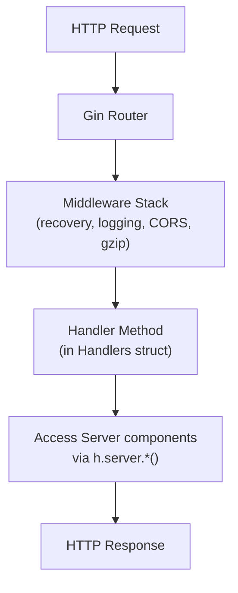

The API layer provides 50+ HTTP endpoints for the frontend and external integrations.

## Architecture



## Key Components

| Location | Purpose |
|----------|---------|
| `backend/api/routes.go` | Route registration |
| `backend/api/handlers.go` | Handlers struct definition |
| `backend/api/*.go` | Handler implementations by feature |

## Handler Structure

All handlers are methods on the `Handlers` struct:

```go
// backend/api/handlers.go
type Handlers struct {
    server *server.Server
}

func NewHandlers(s *server.Server) *Handlers {
    return &Handlers{server: s}
}

// Handler method pattern
func (h *Handlers) GetInbox(c *gin.Context) {
    // Access components via h.server
    db := h.server.DB()
    fs := h.server.FS()

    // Handle request...
    c.JSON(200, result)
}
```

## Route Groups

### Authentication (`/api/auth`, `/api/oauth`)

| Route | Method | Handler | Description |
|-------|--------|---------|-------------|
| `/api/auth/login` | POST | `Login` | Password login |
| `/api/auth/logout` | POST | `Logout` | Logout |
| `/api/oauth/authorize` | GET | `OAuthAuthorize` | Start OAuth flow |
| `/api/oauth/callback` | GET | `OAuthCallback` | OAuth callback |
| `/api/oauth/refresh` | POST | `OAuthRefresh` | Refresh access token |
| `/api/oauth/token` | GET | `OAuthToken` | Get token info |
| `/api/oauth/logout` | POST | `OAuthLogout` | OAuth logout |

### Inbox (`/api/inbox`)

| Route | Method | Handler | Description |
|-------|--------|---------|-------------|
| `/api/inbox` | GET | `GetInbox` | List inbox items |
| `/api/inbox` | POST | `CreateInboxItem` | Create inbox item |
| `/api/inbox/pinned` | GET | `GetPinnedInboxItems` | List pinned items |
| `/api/inbox/:id` | GET | `GetInboxItem` | Get single item |
| `/api/inbox/:id` | PUT | `UpdateInboxItem` | Update item |
| `/api/inbox/:id` | DELETE | `DeleteInboxItem` | Delete item |
| `/api/inbox/:id/reenrich` | POST | `ReenrichInboxItem` | Re-process digests |
| `/api/inbox/:id/status` | GET | `GetInboxItemStatus` | Get digest status |

### Digest (`/api/digest`)

| Route | Method | Handler | Description |
|-------|--------|---------|-------------|
| `/api/digest/digesters` | GET | `GetDigesters` | List available digesters |
| `/api/digest/stats` | GET | `GetDigestStats` | Digest statistics |
| `/api/digest/reset/:digester` | DELETE | `ResetDigester` | Reset digester for all files |
| `/api/digest/file/*path` | GET | `GetDigest` | Get file's digests |
| `/api/digest/file/*path` | POST | `TriggerDigest` | Trigger digest processing |

### Library (`/api/library`)

| Route | Method | Handler | Description |
|-------|--------|---------|-------------|
| `/api/library/tree` | GET | `GetLibraryTree` | Get folder tree |
| `/api/library/file-info` | GET | `GetLibraryFileInfo` | Get file metadata |
| `/api/library/file` | DELETE | `DeleteLibraryFile` | Delete file |
| `/api/library/pin` | POST | `PinFile` | Pin a file |
| `/api/library/pin` | DELETE | `UnpinFile` | Unpin a file |
| `/api/library/rename` | POST | `RenameLibraryFile` | Rename file |
| `/api/library/move` | POST | `MoveLibraryFile` | Move file |
| `/api/library/folder` | POST | `CreateLibraryFolder` | Create folder |

### People (`/api/people`)

| Route | Method | Handler | Description |
|-------|--------|---------|-------------|
| `/api/people` | GET | `GetPeople` | List people |
| `/api/people` | POST | `CreatePerson` | Create person |
| `/api/people/:id` | GET | `GetPerson` | Get person |
| `/api/people/:id` | PUT | `UpdatePerson` | Update person |
| `/api/people/:id` | DELETE | `DeletePerson` | Delete person |
| `/api/people/:id/merge` | POST | `MergePeople` | Merge two people |
| `/api/people/embeddings/:id/assign` | POST | `AssignEmbedding` | Assign embedding to person |
| `/api/people/embeddings/:id/unassign` | POST | `UnassignEmbedding` | Unassign embedding |

### Claude Code (`/api/claude`)

| Route | Method | Handler | Description |
|-------|--------|---------|-------------|
| `/api/claude/sessions` | GET | `ListClaudeSessions` | List active sessions |
| `/api/claude/sessions/all` | GET | `ListAllClaudeSessions` | List all sessions (with history) |
| `/api/claude/sessions` | POST | `CreateClaudeSession` | Create new session |
| `/api/claude/sessions/:id` | GET | `GetClaudeSession` | Get session details |
| `/api/claude/sessions/:id/messages` | GET | `GetClaudeSessionMessages` | Get session messages |
| `/api/claude/sessions/:id/messages` | POST | `SendClaudeMessage` | Send message |
| `/api/claude/sessions/:id` | PATCH | `UpdateClaudeSession` | Update session |
| `/api/claude/sessions/:id/deactivate` | POST | `DeactivateClaudeSession` | Deactivate session |
| `/api/claude/sessions/:id` | DELETE | `DeleteClaudeSession` | Delete session |

### WebSocket Routes

Registered on main router (not API group) to bypass middleware:

| Route | Handler | Description |
|-------|---------|-------------|
| `/api/claude/sessions/:id/ws` | `ClaudeWebSocket` | Bidirectional Claude WebSocket |
| `/api/claude/sessions/:id/subscribe` | `ClaudeSubscribeWebSocket` | Read-only Claude WebSocket |
| `/api/asr/realtime` | `RealtimeASR` | Real-time ASR WebSocket |

### Other Routes

| Route | Method | Handler | Description |
|-------|--------|---------|-------------|
| `/api/search` | GET | `Search` | Full-text search |
| `/api/ai/summarize` | POST | `Summarize` | AI summarization |
| `/api/settings` | GET | `GetSettings` | Get settings |
| `/api/settings` | PUT | `UpdateSettings` | Update settings |
| `/api/settings` | POST | `ResetSettings` | Reset to defaults |
| `/api/stats` | GET | `GetStats` | App statistics |
| `/api/upload/tus/*path` | Any | `TUSHandler` | TUS upload protocol |
| `/api/upload/finalize` | POST | `FinalizeUpload` | Finalize upload |
| `/api/directories` | GET | `GetDirectories` | List directories |
| `/api/vendors/openai/models` | GET | `GetOpenAIModels` | List OpenAI models |
| `/api/notifications/stream` | GET | `NotificationStream` | SSE stream |
| `/api/asr` | POST | `ASRHandler` | Non-realtime ASR |
| `/raw/*path` | GET | `ServeRawFile` | Serve raw file |
| `/raw/*path` | PUT | `SaveRawFile` | Save raw file |
| `/sqlar/*path` | GET | `ServeSqlarFile` | Serve SQLAR file |

## Handler File Organization

Handlers are organized by feature area:

| File | Handlers |
|------|----------|
| `auth.go` | Login, Logout |
| `oauth.go` | OAuth* handlers |
| `inbox.go` | Inbox CRUD |
| `digest.go` | Digest operations |
| `library.go` | Library file management |
| `people.go` | People CRUD |
| `claude.go` | Claude sessions |
| `search.go` | Search |
| `ai.go` | AI summarization |
| `settings.go` | Settings |
| `upload.go` | File uploads |
| `files.go` | Raw file serving |
| `notifications.go` | SSE handler |
| `realtime_asr.go` | WebSocket ASR |

## Common Patterns

### Request Parsing

```go
func (h *Handlers) CreateInboxItem(c *gin.Context) {
    var req struct {
        URL     string `json:"url"`
        Content string `json:"content"`
    }

    if err := c.ShouldBindJSON(&req); err != nil {
        c.JSON(400, gin.H{"error": err.Error()})
        return
    }

    // ...
}
```

### Query Parameters

```go
func (h *Handlers) GetInbox(c *gin.Context) {
    limit, _ := strconv.Atoi(c.DefaultQuery("limit", "50"))
    offset, _ := strconv.Atoi(c.DefaultQuery("offset", "0"))
    // ...
}
```

### Path Parameters

```go
func (h *Handlers) GetInboxItem(c *gin.Context) {
    id := c.Param("id")
    // ...
}

// Wildcard paths
func (h *Handlers) GetDigest(c *gin.Context) {
    path := c.Param("path")  // Includes leading /
    path = strings.TrimPrefix(path, "/")
    // ...
}
```

### Response Patterns

```go
// Success with data
c.JSON(200, result)

// Success with message
c.JSON(200, gin.H{"message": "Item created"})

// Error response
c.JSON(400, gin.H{"error": "Invalid request"})
c.JSON(404, gin.H{"error": "Not found"})
c.JSON(500, gin.H{"error": "Internal server error"})

// No content
c.Status(204)
```

### Accessing Components

```go
func (h *Handlers) SomeHandler(c *gin.Context) {
    // Database
    db := h.server.DB()

    // Filesystem
    fs := h.server.FS()

    // Digest worker
    digest := h.server.Digest()

    // Notifications
    notif := h.server.Notifications()

    // Shutdown context (for long-running handlers)
    ctx := h.server.ShutdownContext()
}
```

## Adding a New Endpoint

1. **Add handler method** (in appropriate file or new file):
   ```go
   // backend/api/my_feature.go
   func (h *Handlers) MyNewHandler(c *gin.Context) {
       // Parse request
       var req MyRequest
       if err := c.ShouldBindJSON(&req); err != nil {
           c.JSON(400, gin.H{"error": err.Error()})
           return
       }

       // Access components
       db := h.server.DB()

       // Business logic
       result, err := doSomething(db, req)
       if err != nil {
           c.JSON(500, gin.H{"error": err.Error()})
           return
       }

       // Return response
       c.JSON(200, result)
   }
   ```

2. **Register route** in `routes.go`:
   ```go
   func SetupRoutes(r *gin.Engine, h *Handlers) {
       api := r.Group("/api")
       // ...
       api.POST("/my-feature", h.MyNewHandler)
   }
   ```

3. **For WebSocket routes**, register on main router:
   ```go
   // WebSocket needs to bypass gzip middleware
   r.GET("/api/my-websocket", h.MyWebSocketHandler)
   ```

## Error Handling

```go
func (h *Handlers) SomeHandler(c *gin.Context) {
    result, err := h.server.DB().SomeQuery()
    if err != nil {
        if errors.Is(err, sql.ErrNoRows) {
            c.JSON(404, gin.H{"error": "Not found"})
            return
        }
        log.Error().Err(err).Msg("query failed")
        c.JSON(500, gin.H{"error": "Internal server error"})
        return
    }
    c.JSON(200, result)
}
```

## Files to Modify

| Task | Files |
|------|-------|
| Add new endpoint | Create handler in `backend/api/*.go`, register in `routes.go` |
| Change route structure | `backend/api/routes.go` |
| Modify request/response | Relevant handler file |
| Add middleware | `backend/server/server.go` setupRouter() |
