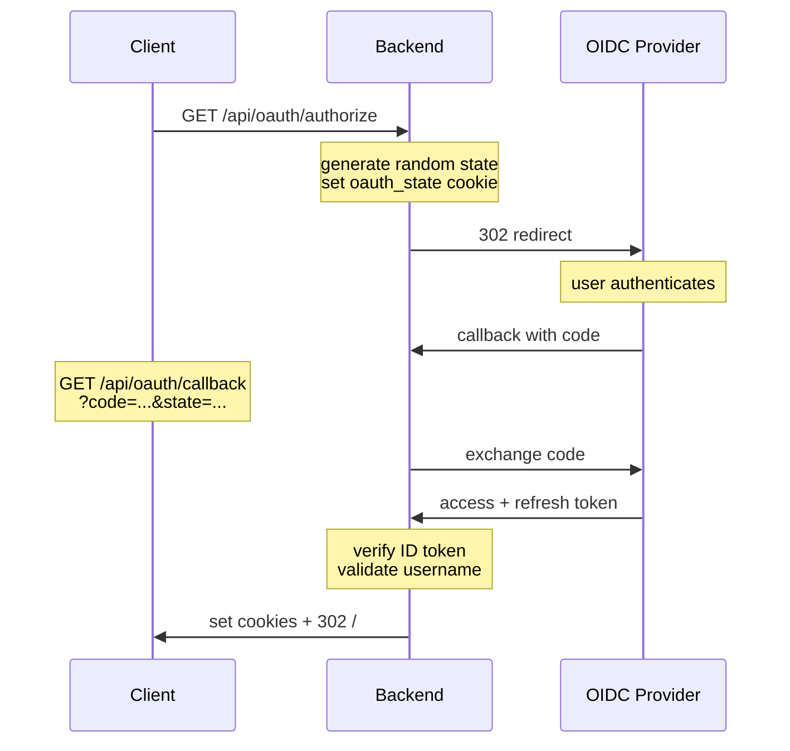
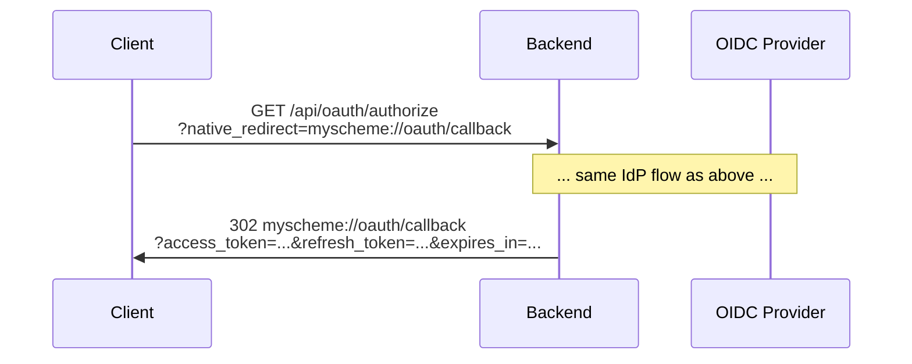
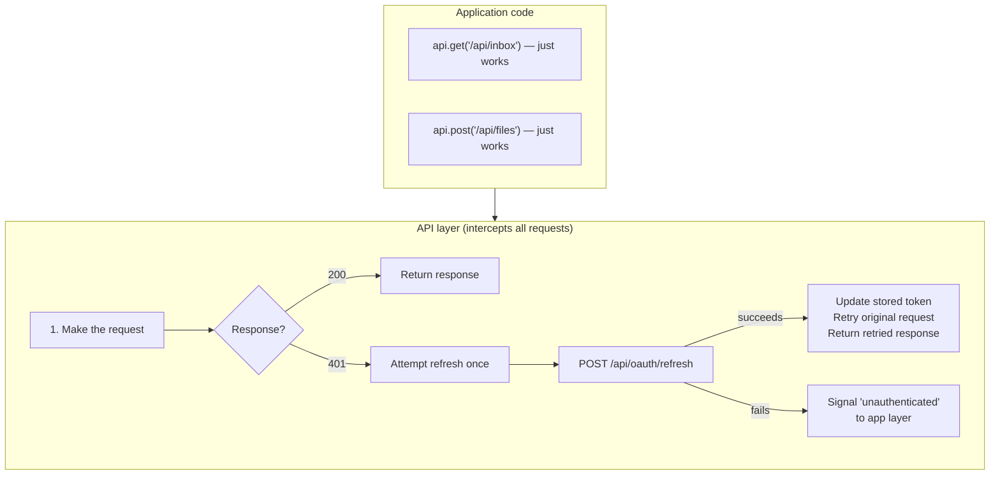

The auth system supports three modes configured via `MLD_AUTH_MODE` environment variable.

| Mode | Description | Use Case |
|------|-------------|----------|
| `none` | No authentication (default) | Local development, single-user |
| `password` | Simple password auth | Basic protection |
| `oauth` | OIDC/OAuth 2.0 | Production, SSO integration |

## Configuration

```bash
# Auth mode (required)
MLD_AUTH_MODE=none|password|oauth

# OAuth (required when mode=oauth)
MLD_OAUTH_CLIENT_ID=your-client-id
MLD_OAUTH_CLIENT_SECRET=your-secret
MLD_OAUTH_ISSUER_URL=https://your-idp.com
MLD_OAUTH_REDIRECT_URI=https://your-app.com/api/oauth/callback

# Single-user filter (optional) — rejects logins from other usernames
MLD_EXPECTED_USERNAME=user@domain.com
```

OIDC discovery is automatic — the backend fetches `/.well-known/openid-configuration` from the issuer URL.

## API Routes

### OAuth

| Route | Method | Purpose |
|-------|--------|---------|
| `/api/oauth/authorize` | GET | Start OAuth flow — redirects to IdP |
| `/api/oauth/callback` | GET | OAuth callback — receives auth code from IdP |
| `/api/oauth/token` | GET | Validate current token, return user info |
| `/api/oauth/refresh` | POST | Refresh access token |
| `/api/oauth/logout` | POST | Clear auth cookies |

### Password

| Route | Method | Purpose |
|-------|--------|---------|
| `/api/auth/login` | POST | Login with password |
| `/api/auth/logout` | POST | Logout, clear session cookie |

### Route Protection

All `/api/*` routes (except auth endpoints) are protected by `AuthMiddleware` when `MLD_AUTH_MODE != "none"`. The middleware checks:

- **OAuth mode** — validates `access_token` cookie (or `Authorization: Bearer <token>` header) against the OIDC provider
- **Password mode** — validates `session` cookie against the database

Unauthorized requests receive `401` with `{"error": "Unauthorized", "code": "INVALID_TOKEN"|"INVALID_SESSION"}`.

## OAuth Login Flow

Two variants depending on whether the client can receive cookies directly.

### Cookie-based (web browsers)



After the redirect, the client has `access_token` and `refresh_token` cookies. All subsequent API calls include them automatically.

### Redirect-based (native clients)

For clients that can't receive HTTP cookies (native apps, CLI tools), pass `native_redirect` to get tokens back via URL redirect instead:



The client receives tokens as URL query parameters, stores them in platform-appropriate secure storage, and sends them via `Authorization: Bearer <token>` header on subsequent requests.

### Cookies

| Cookie | Max-Age | Path | Scope |
|--------|---------|------|-------|
| `access_token` | Token's expiry (~1h) | `/` | All API calls |
| `refresh_token` | 30 days | `/api/oauth` | Refresh endpoint only |
| `oauth_state` | 5 minutes | `/api/oauth` | CSRF validation during login |

All cookies are `HttpOnly`. `Secure` is set in production.

### Token Validation

```
GET /api/oauth/token
Authorization: Bearer <access_token>  (or access_token cookie)

200 { "authenticated": true, "username": "...", "sub": "...", "email": "..." }
401 { "authenticated": false, "error": "invalid_token" }
```

### Token Refresh

```
POST /api/oauth/refresh
Cookie: refresh_token=...  (or send refresh_token in request body for non-cookie clients)

200 {
  "success": true,
  "access_token": "new-token",
  "refresh_token": "new-or-same",
  "expiresIn": 3600
}
Set-Cookie: access_token=...; refresh_token=...

401  (refresh token expired or invalid)
```

## Password Auth Flow

```
POST /api/auth/login
Content-Type: application/json
{ "password": "..." }

200 { "success": true, "sessionId": "..." }
Set-Cookie: session=<64-char-hex-token>; Max-Age=2592000; Path=/; HttpOnly; Secure

401 { "error": "Invalid password" }
```

- First login with no stored password creates one (bootstrap)
- Sessions are stored in the `sessions` table (30-day expiry, extended on use)
- Logout clears the `session` cookie

## Client Integration Guide

### Auth check

No dedicated "am I logged in?" endpoint is needed. Any protected API call works:

1. Call any API endpoint (e.g. `GET /api/settings`)
2. `200` → authenticated
3. `401` → not authenticated (or token expired — see refresh below)

### Transparent token refresh

Clients should handle token refresh **in the API/networking layer** so that application code never deals with auth. The recommended pattern:



This keeps auth invisible to feature code. The app layer only needs to handle the final "unauthenticated" signal (e.g. show login screen).

### Proactive refresh (optional)

To avoid the latency of a failed request → refresh → retry cycle, clients can proactively refresh before the token expires:

1. After login or refresh, read `expiresIn` from the response (or parse the JWT `exp` claim)
2. Schedule a background refresh for ~60 seconds before expiry
3. On app resume/foreground, check if the token is expiring soon (< 2 min) and refresh if so

This is an optimization — the reactive 401-based refresh is the required baseline.

### Auth state

Clients typically expose a simple auth state to the UI:

| State | Meaning |
|-------|---------|
| `unknown` | App just launched, haven't checked yet |
| `checking` | Validating token or refreshing |
| `authenticated` | Valid session, user info available |
| `unauthenticated` | No valid session, show login |

Transitions: `unknown` → `checking` → `authenticated` or `unauthenticated`. The API layer's refresh failure triggers `authenticated` → `unauthenticated`.

## Key Files

| Component | Location |
|-----------|----------|
| Auth mode detection | `backend/auth/oauth.go` |
| OIDC provider setup | `backend/auth/oidc_provider.go` |
| Auth middleware | `backend/api/middleware.go` |
| OAuth handlers | `backend/api/oauth.go` |
| Password handlers | `backend/api/auth.go` |
| Session storage | `backend/db/sessions.go` |
| Route registration | `backend/api/routes.go` |
