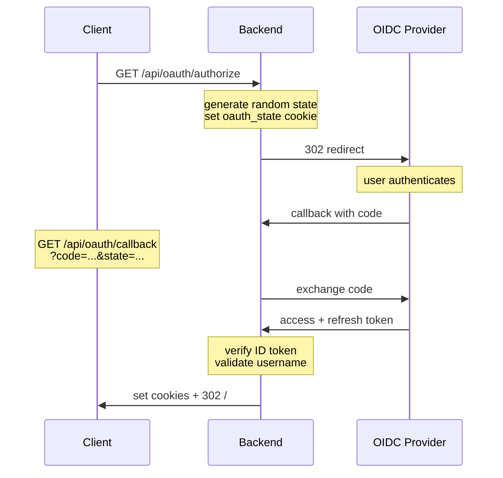
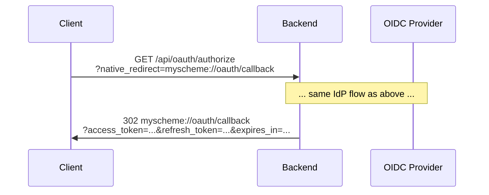
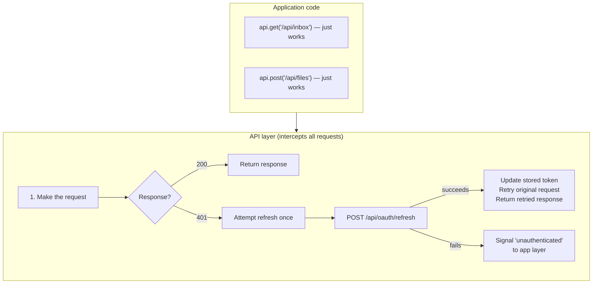
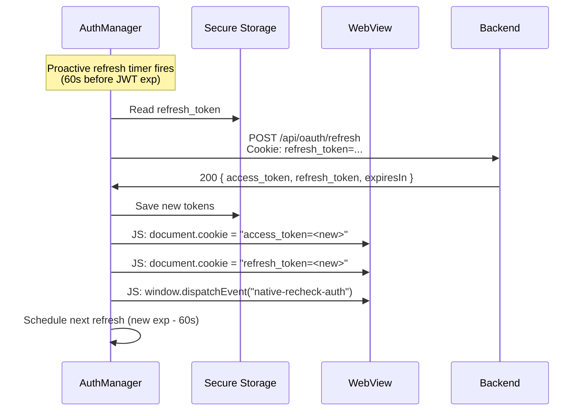
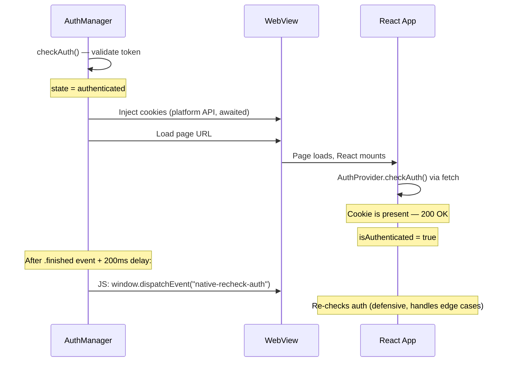

The auth system supports three modes configured via `MLD_AUTH_MODE` environment variable.

| Mode | Description | Use Case |
|------|-------------|----------|
| `none` | No authentication (default) | Local development, single-user |
| `password` | Simple password auth | Basic protection |
| `oauth` | OIDC/OAuth 2.0 | Production, SSO integration |

## Configuration

```bash
# Auth mode (required)
MLD_AUTH_MODE=none|password|oauth

# OAuth (required when mode=oauth)
MLD_OAUTH_CLIENT_ID=your-client-id
MLD_OAUTH_CLIENT_SECRET=your-secret
MLD_OAUTH_ISSUER_URL=https://your-idp.com
MLD_OAUTH_REDIRECT_URI=https://your-app.com/api/oauth/callback

# Single-user filter (optional) — rejects logins from other usernames
MLD_EXPECTED_USERNAME=user@domain.com
```

OIDC discovery is automatic — the backend fetches `/.well-known/openid-configuration` from the issuer URL.

## API Routes

### OAuth

| Route | Method | Purpose |
|-------|--------|---------|
| `/api/oauth/authorize` | GET | Start OAuth flow — redirects to IdP |
| `/api/oauth/callback` | GET | OAuth callback — receives auth code from IdP |
| `/api/oauth/token` | GET | Validate current token, return user info |
| `/api/oauth/refresh` | POST | Refresh access token |
| `/api/oauth/logout` | POST | Clear auth cookies |

### Password

| Route | Method | Purpose |
|-------|--------|---------|
| `/api/auth/login` | POST | Login with password |
| `/api/auth/logout` | POST | Logout, clear session cookie |

### Route Protection

All `/api/*` routes (except auth endpoints) are protected by `AuthMiddleware` when `MLD_AUTH_MODE != "none"`. The middleware checks:

- **OAuth mode** — validates `access_token` cookie (or `Authorization: Bearer <token>` header) against the OIDC provider
- **Password mode** — validates `session` cookie against the database

Unauthorized requests receive `401` with `{"error": "Unauthorized", "code": "INVALID_TOKEN"|"INVALID_SESSION"}`.

## OAuth Login Flow

Two variants depending on whether the client can receive cookies directly.

### Cookie-based (web browsers)



After the redirect, the client has `access_token` and `refresh_token` cookies. All subsequent API calls include them automatically.

### Redirect-based (native clients)

For clients that can't receive HTTP cookies (native apps, CLI tools), pass `native_redirect` to get tokens back via URL redirect instead:



The client receives tokens as URL query parameters, stores them in platform-appropriate secure storage, and sends them via `Authorization: Bearer <token>` header on subsequent requests.

### Cookies

| Cookie | Max-Age | Path | Scope |
|--------|---------|------|-------|
| `access_token` | Token's expiry (~1h) | `/` | All API calls |
| `refresh_token` | 30 days | `/api/oauth` | Refresh endpoint only |
| `oauth_state` | 5 minutes | `/api/oauth` | CSRF validation during login |

All cookies are `HttpOnly`. `Secure` is set in production.

### Token Validation

```
GET /api/oauth/token
Authorization: Bearer <access_token>  (or access_token cookie)

200 { "authenticated": true, "username": "...", "sub": "...", "email": "..." }
401 { "authenticated": false, "error": "invalid_token" }
```

### Token Refresh

```
POST /api/oauth/refresh
Cookie: refresh_token=...  (or send refresh_token in request body for non-cookie clients)

200 {
  "success": true,
  "access_token": "new-token",
  "refresh_token": "new-or-same",
  "expiresIn": 3600
}
Set-Cookie: access_token=...; refresh_token=...

401  (refresh token expired or invalid)
```

## Password Auth Flow

```
POST /api/auth/login
Content-Type: application/json
{ "password": "..." }

200 { "success": true, "sessionId": "..." }
Set-Cookie: session=<64-char-hex-token>; Max-Age=2592000; Path=/; HttpOnly; Secure

401 { "error": "Invalid password" }
```

- First login with no stored password creates one (bootstrap)
- Sessions are stored in the `sessions` table (30-day expiry, extended on use)
- Logout clears the `session` cookie

## Client Integration Guide

### Auth check

No dedicated "am I logged in?" endpoint is needed. Any protected API call works:

1. Call any API endpoint (e.g. `GET /api/settings`)
2. `200` → authenticated
3. `401` → not authenticated (or token expired — see refresh below)

### Transparent token refresh

Clients should handle token refresh **in the API/networking layer** so that application code never deals with auth. The recommended pattern:



This keeps auth invisible to feature code. The app layer only needs to handle the final "unauthenticated" signal (e.g. show login screen).

#### Concurrent 401 handling

When multiple requests fail with 401 simultaneously, clients must deduplicate refresh attempts. While one refresh is in-flight, queue other failed requests and retry them after it resolves. Use a mutex / single-flight pattern to prevent multiple concurrent refresh calls.

### Proactive refresh (optional)

To avoid the latency of a failed request → refresh → retry cycle, clients can proactively refresh before the token expires:

1. After login or refresh, read `expiresIn` from the response (or parse the JWT `exp` claim)
2. Schedule a background refresh for ~60 seconds before expiry
3. On app resume/foreground, check if the token is expiring soon (< 2 min) and refresh if so

This is an optimization — the reactive 401-based refresh is the required baseline.

### Auth state

Clients typically expose a simple auth state to the UI:

| State | Meaning |
|-------|---------|
| `unknown` | App just launched, haven't checked yet |
| `checking` | Validating token or refreshing |
| `authenticated` | Valid session, user info available |
| `unauthenticated` | No valid session, show login |

Transitions: `unknown` → `checking` → `authenticated` or `unauthenticated`. The API layer's refresh failure triggers `authenticated` → `unauthenticated`.

### SSE / long-lived connections

SSE endpoints like `/api/notifications/stream` are protected by the same `AuthMiddleware` — auth is validated **once** when the connection is established. These connections differ from normal API calls in two important ways:

1. **No mid-stream 401.** The middleware checks auth before the handler runs. If the token is expired, the client receives a 401 and the SSE stream never opens. There is no in-band auth error during an active stream.
2. **No automatic retry-with-refresh.** Unlike `fetchWithRefresh` where the wrapper can intercept a 401, retry refresh, and replay the request transparently, SSE connections must handle auth failure in the reconnect logic.

#### Web clients (EventSource)

Use **cookie-based auth only** — never pass tokens as query parameters. The browser's `EventSource` reuses the URL on reconnect; a stale token baked into the query string causes infinite 401 loops.

```typescript
// Correct — cookie is sent automatically and updates after refresh
const es = new EventSource('/api/notifications/stream');

// Wrong — stale token baked into URL
const es = new EventSource(`/api/notifications/stream?token=${token}`);
```

Per the [WHATWG spec](https://html.spec.whatwg.org/multipage/server-sent-events.html), `EventSource` does **not** auto-reconnect on HTTP errors (only on connection drops after a successful 200). A 401 sets `readyState = CLOSED` and fires `onerror` once. The client must manage reconnection:

```
onerror fires → close EventSource → refresh token → wait (with backoff) → create new EventSource
```

#### Native clients (URLSession / OkHttp)

Native HTTP clients receive the full HTTP response before streaming starts. The delegate/callback **must check the status code** before treating the connection as successful:

```
didReceive response:
  → if 401: reject (don't reset backoff)
  → if 200: accept, reset backoff
```

:::caution
A common bug: resetting the reconnect backoff on *any* HTTP response (including 401). This defeats exponential backoff and produces rapid-fire retry loops — the server sees ~1 request/second indefinitely.
:::

#### Reconnect backoff requirements

All clients must implement exponential backoff on SSE reconnection failure:

| Client | Base delay | Backoff | Cap | Reset on |
|--------|-----------|---------|-----|----------|
| Web (EventSource) | 5s | 2× | 60s | Successful `onopen` or visibility change |
| Native (URLSession) | 1s | 2× | 30s | Successful 200 response |

The reconnect cycle should attempt a token refresh before each retry, but must still apply backoff regardless of whether the refresh succeeded.

## Hybrid App Auth (Native + WebView)

Native apps that embed WebViews (iOS, Android, desktop) need auth in **two networking stacks**: native HTTP client (for native API calls) and the WebView (for embedded web content). The recommended pattern is **cookie injection** — native owns all tokens and injects them as cookies into the WebView's cookie store.

### Architecture: native owns auth

```
AuthManager (singleton, secure storage)
  |
  |-- accessToken + refreshToken --> platform secure storage (Keychain / Android Keystore)
  |-- proactive refresh (JWT exp - 60s) + reactive refresh (on 401)
  |-- single-flight refresh (mutex prevents concurrent refresh calls)
  |
  |-- on token change --> push to all active WebViews
  |
  +---> Native API Client              WebView Cookie Injection
        (Authorization: Bearer header)  (document.cookie via JS)
        from secure storage             from secure storage
```

Key principle: **native is the single source of truth for tokens.** The WebView receives tokens as cookies but never manages them. The refresh token never leaves native.

### Why cookie injection

Several patterns exist for passing auth to a WebView. Cookie injection is recommended because:

| Pattern | Intercepts fetch/XHR? | Web code changes? | Verdict |
|---------|----------------------|-------------------|---------|
| **Cookie injection** | N/A (auto-sent) | None | Recommended |
| Custom URL scheme handler | Only custom schemes | Must rewrite API URLs | Over-engineered for most cases |
| JS bridge proxy | Yes (via bridge) | Must replace all fetch calls | High overhead, breaks streaming |
| Service worker | Yes | Must register SW | Unreliable on iOS |
| Header on initial load only | No (first request only) | None | Useless for SPAs |

Cookie injection keeps the web frontend 100% standard — plain `fetch()` with `credentials: 'same-origin'`, same code in browser and WebView. Platform-specific code lives entirely in the native shell's cookie injection layer.

### Cookie injection rules

#### 1. Inject both cookies

The WebView needs both `access_token` (for API requests) and `refresh_token` (so the web-side `fetchWithRefresh` fallback works):

| Cookie | Value source | Path | Expires |
|--------|-------------|------|---------|
| `access_token` | From secure storage | `/` | JWT `exp` claim |
| `refresh_token` | From secure storage | `/api/oauth` | 30 days from now |

#### 2. Always set explicit expiry

Never create session cookies (no `Expires`). Platform WebView processes can be killed at any time (memory pressure, background suspension), and session cookies are lost. Always set `Expires` from the JWT `exp` claim or a fixed duration.

#### 3. Inject via JavaScript, not the system cookie store

Use `document.cookie = "..."` via JavaScript evaluation instead of the platform's `HTTPCookieStorage` / `CookieManager`. This bypasses the async cookie store synchronization delay that causes race conditions on page load.

```javascript
// Inject via JS evaluation on the WebView — immediate, synchronous, no delay
document.cookie = "access_token=<token>; path=/; max-age=3600; secure; samesite=lax";
```

Platform cookie stores (`HTTPCookieStorage.shared` on iOS, `CookieManager` on Android) sync to the WebView's internal store asynchronously with unpredictable delay. JavaScript injection takes effect immediately.

:::caution
`HttpOnly` cookies cannot be set via JavaScript. Since the backend sets cookies as `HttpOnly`, the JS-injected cookies are technically duplicates that shadow the server-set cookies. This is acceptable — the JS-injected cookie ensures auth is available immediately, and the server-set `HttpOnly` cookie provides the security baseline for subsequent requests.
:::

#### 4. Inject before page load, and after every token refresh

| Event | Action |
|-------|--------|
| Before initial WebView page load | Inject cookies (via platform cookie store API is OK here since you `await` completion before loading) |
| After every native token refresh | Inject cookies via JS + signal WebView to re-check auth |
| On app foreground resume | Check token freshness, inject if refreshed |
| On WebView process crash/reload | Re-inject cookies before reload |

#### 5. Signal WebView auth changes via native bridge

After injecting new cookies (e.g., after a token refresh), dispatch a custom event so the web frontend re-checks auth state:

```javascript
// Called by native after injecting fresh cookies
window.dispatchEvent(new Event("native-recheck-auth"));
```

The web frontend listens for this event and re-validates:

```javascript
window.addEventListener("native-recheck-auth", () => {
  // Re-check auth — the cookies are already fresh
  fetch("/api/settings", { credentials: "same-origin" })
    .then(res => setIsAuthenticated(res.ok));
});
```

:::note
Dispatch this event **after** cookie injection, not before. On initial page load, add a short delay (~200ms) to ensure React has mounted its event listeners.
:::

#### 6. Native refresh token stays in secure storage only

The refresh token cookie injected into the WebView is a **convenience fallback** — it allows the web-side `fetchWithRefresh` to work if native somehow fails to push a fresh access token. In normal operation, native proactively refreshes and pushes new cookies, so the web side never needs to refresh on its own.

**Never** store the refresh token in JavaScript-accessible storage (localStorage, sessionStorage, JS variables). The injected cookie is scoped to `/api/oauth` path and is only sent to the refresh endpoint.

### Lifecycle: native refresh pushes to WebView



### Lifecycle: initial page load



### Lifecycle: WebView process crash

WebView processes can be terminated by the OS at any time. On crash recovery:

1. Re-inject cookies from secure storage (they may have been lost)
2. Reload the page
3. The normal "initial page load" flow takes over

### Platform implementation notes

| Platform | Secure storage | Cookie injection (pre-load) | Cookie injection (runtime) |
|----------|---------------|---------------------------|---------------------------|
| iOS / macOS | Keychain | `WKHTTPCookieStore.setCookie()` (awaited) | `webView.evaluateJavaScript("document.cookie=...")` |
| Android | Android Keystore | `CookieManager.setCookie()` | `webView.evaluateJavascript("document.cookie=...")` |
| Desktop (Electron) | OS keychain / safeStorage | `session.cookies.set()` | `webContents.executeJavaScript("document.cookie=...")` |

For the new SwiftUI `WebPage` API (iOS 26+), use `webPage.callJavaScript()` for runtime injection. For pre-load injection, `HTTPCookieStorage.shared` syncs to the WebView's internal store — but **always await the sync** before calling `webPage.load()`.

### What the web frontend needs

The web frontend should work identically in browser and WebView. Minimal changes:

1. **`fetchWithRefresh` stays** — defensive fallback for web-side token refresh via cookie
2. **Listen for `native-recheck-auth`** — re-check auth when native signals a token change
3. **Detect native context** — `window.isNativeApp` (set by native bridge polyfill) to hide browser-only UI like login redirects

No special API URL schemes, no fetch overrides, no bridge proxying. Standard `fetch()` with `credentials: 'same-origin'`.

## Key Files

| Component | Location |
|-----------|----------|
| Auth mode detection | `backend/auth/oauth.go` |
| OIDC provider setup | `backend/auth/oidc_provider.go` |
| Auth middleware | `backend/api/middleware.go` |
| OAuth handlers | `backend/api/oauth.go` |
| Password handlers | `backend/api/auth.go` |
| Session storage | `backend/db/sessions.go` |
| Route registration | `backend/api/routes.go` |
