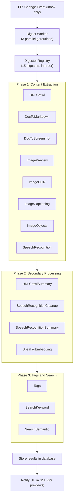

The digest system processes files to extract content, metadata, generate previews, and create search embeddings.

## Architecture



## Key Components

| Location | Purpose |
|----------|---------|
| `backend/workers/digest/worker.go` | Worker pool, queue management, supervisor |
| `backend/workers/digest/registry.go` | Digester registration and ordering |
| `backend/workers/digest/types.go` | Digester interface, status types, cascading resets |
| `backend/workers/digest/digesters.go` | All 15 digester implementations |
| `backend/workers/digest/content_sources.go` | Text extraction priority system |

## Worker Architecture

```go
type Worker struct {
    cfg        Config
    db         *db.DB
    notif      *notifications.Service
    queue      chan string     // File paths to process (default: 1000 capacity)
    processing sync.Map        // Prevents concurrent processing of same file
}
```

The worker runs **3 parallel goroutines** (configurable) that pull from the queue.

### Important: Inbox-Only Processing

**Only inbox files are auto-digested.** Library files get basic file records and metadata, but no digest processing:

```go
func (w *Worker) OnFileChange(filePath string, isNew bool, contentChanged bool) {
    // Only auto-digest files in inbox directory
    if !isInboxFile(filePath) {
        return  // Skip library files
    }
    // Queue for processing...
}
```

## Supervisor Loop

The supervisor runs every **30 seconds** (not 60s or 5 minutes) to check for pending digests:

```go
func (w *Worker) supervisorLoop() {
    ticker := time.NewTicker(30 * time.Second)
    for {
        select {
        case <-ticker.C:
            w.checkPendingDigests()  // Re-queue files with pending/failed digests
        case <-w.stopChan:
            return
        }
    }
}
```

## Digester Interface

```go
type Digester interface {
    // Name returns the unique digester name
    Name() string

    // Label returns the human-readable label for UI display
    Label() string

    // Description returns what this digester does
    Description() string

    // GetOutputDigesters returns the list of digest records this digester produces
    // Returns empty/nil to use the digester name
    GetOutputDigesters() []string

    // CanDigest checks if this digester applies to the given file type
    CanDigest(filePath string, file *db.FileRecord, dbConn *sql.DB) (bool, error)

    // Digest executes the digest operation
    Digest(filePath string, file *db.FileRecord, existingDigests []db.Digest, dbConn *sql.DB) ([]DigestInput, error)
}
```

## All 15 Digesters

Digesters are executed in this exact order (defined in `registry.go`):

### Phase 1: Content Extraction

| Digester | Output Names | Description |
|----------|--------------|-------------|
| URLCrawlDigester | `url-crawl-content`, `url-crawl-screenshot` | Fetches URL content and takes screenshot |
| DocToMarkdownDigester | `doc-to-markdown` | Converts documents to markdown (HAID) |
| DocToScreenshotDigester | `doc-to-screenshot` | Generates document preview screenshot |
| **ImagePreviewDigester** | `image-preview` | Converts HEIC/HEIF to JPEG for browser compatibility |
| ImageOCRDigester | `image-ocr` | Extracts text from images (HAID) |
| ImageCaptioningDigester | `image-captioning` | Generates image descriptions (OpenAI Vision) |
| ImageObjectsDigester | `image-objects` | Detects objects in images (HAID) |
| SpeechRecognitionDigester | `speech-recognition` | Transcribes audio (Aliyun or HAID whisperx) |

### Phase 2: Secondary Processing

| Digester | Output Names | Description |
|----------|--------------|-------------|
| URLCrawlSummaryDigester | `url-crawl-summary` | Summarizes crawled content (OpenAI) |
| SpeechRecognitionCleanupDigester | `speech-recognition-cleanup` | Cleans up ASR transcripts |
| SpeechRecognitionSummaryDigester | `speech-recognition-summary` | Summarizes transcripts |
| SpeakerEmbeddingDigester | `speaker-embedding` | Extracts speaker embeddings for identification |

### Phase 3: Tags and Search

| Digester | Output Names | Description |
|----------|--------------|-------------|
| TagsDigester | `tags` | Generates tags from content (OpenAI) |
| SearchKeywordDigester | `search-keyword` | Indexes in Meilisearch |
| SearchSemanticDigester | `search-semantic` | Creates vector embeddings (Qdrant) |

## Digest Status

```go
type DigestStatus string

const (
    DigestStatusTodo       DigestStatus = "todo"
    DigestStatusInProgress DigestStatus = "in-progress"
    DigestStatusCompleted  DigestStatus = "completed"
    DigestStatusSkipped    DigestStatus = "skipped"
    DigestStatusFailed     DigestStatus = "failed"
)

const MaxDigestAttempts = 3  // Retry up to 3 times
```

### Status Meanings

| Status | Meaning |
|--------|---------|
| `todo` | Pending processing |
| `in-progress` | Currently being processed |
| `completed` | Successfully processed (may have null content) |
| `skipped` | File type doesn't match (`CanDigest` returned false) |
| `failed` | Processing error (will retry up to 3 times) |

## Cascading Resets

When an upstream digester completes with content, downstream digesters are reset to `todo`:

```go
var CascadingResets = map[string][]string{
    "url-crawl-content":     {"url-crawl-summary", "tags", "search-keyword", "search-semantic"},
    "doc-to-markdown":       {"tags", "search-keyword", "search-semantic"},
    "image-ocr":             {"tags", "search-keyword", "search-semantic"},
    "image-captioning":      {"tags", "search-keyword", "search-semantic"},
    "image-objects":         {"tags", "search-keyword", "search-semantic"},
    "speech-recognition":    {"speaker-embedding", "speech-recognition-cleanup", "speech-recognition-summary", "tags", "search-keyword", "search-semantic"},
    "url-crawl-summary":     {"tags"},
    "speech-recognition-summary": {"tags", "search-keyword", "search-semantic"},
    "tags":                  {"search-keyword", "search-semantic"},
}
```

**Important**: Cascading resets only apply to terminal states (completed, skipped, failed). Digests in `todo` or `in-progress` are not reset.

## Content Source Priority

The `content_sources.go` file defines priority order for text extraction (used by tags, search):

1. `url-crawl-content` (parse JSON)
2. `doc-to-markdown` (raw)
3. `image-ocr` (raw)
4. `image-captioning` (raw)
5. `image-objects` (parse JSON, extract descriptions)
6. `speech-recognition` (parse JSON segments or raw)
7. Local file (`.md`, `.txt`)
8. Folder's `text.md`

## Backfill on Startup

On startup, the worker ensures all inbox files have digest placeholders for all registered digesters:

```go
func (w *Worker) ensureAllFilesHaveDigests() {
    // Query all non-folder files in inbox directory
    query := `SELECT path FROM files WHERE is_folder = 0 AND (path = 'inbox' OR path LIKE 'inbox/%')`
    // For each file, call EnsureDigestersForFile()
}
```

This handles:
- Files added before the EnsureDigestersForFile logic existed
- New digesters added to the registry

## Screenshot Digesters

Three digesters produce screenshots that update the file's `screenshot_sqlar` field:

```go
func isScreenshotDigester(digester string) bool {
    return digester == "url-crawl-screenshot" ||
           digester == "doc-to-screenshot" ||
           digester == "image-preview"
}
```

When these complete, an SSE notification is sent:
```go
w.notif.NotifyPreviewUpdated(filePath, previewType)
// previewType: "screenshot" or "image"
```

## ASR Provider Selection

The `SpeechRecognitionDigester` dynamically selects between two providers based on user settings:

1. **Aliyun Fun-ASR** (default) - Fast, no diarization
2. **HAID whisperx** - Slower, with speaker diarization

## Processing Flow

```go
func (w *Worker) processFile(filePath string) {
    // 1. Prevent concurrent processing of same file
    if _, loaded := w.processing.LoadOrStore(filePath, true); loaded {
        return  // Already processing
    }
    defer w.processing.Delete(filePath)

    // 2. Get file record
    file, err := db.GetFileByPath(filePath)

    // 3. Process each digester in order
    for _, digester := range GlobalRegistry.GetAll() {
        // Check if outputs are in-progress (skip)
        // Check for pending outputs (todo, or failed with retries left)
        // Check CanDigest (skip if false)
        // Mark as in-progress
        // Execute digester
        // Save outputs with cascading resets
    }
}
```

## Error Handling

| Condition | Result |
|-----------|--------|
| `CanDigest` returns error | Mark failed, continue |
| `CanDigest` returns false | Mark skipped |
| `Digest` returns error | Mark failed, increment attempts |
| `Digest` returns no outputs | Mark failed |
| Attempts >= 3 | Stay failed (no more retries) |

## Adding a New Digester

1. Add to `backend/workers/digest/digesters.go`:
   ```go
   type MyNewDigester struct{}

   func (d *MyNewDigester) Name() string { return "my-new" }
   func (d *MyNewDigester) Label() string { return "My New Digester" }
   func (d *MyNewDigester) Description() string { return "Does something new" }
   func (d *MyNewDigester) GetOutputDigesters() []string { return nil }

   func (d *MyNewDigester) CanDigest(filePath string, file *db.FileRecord, dbConn *sql.DB) (bool, error) {
       return strings.HasSuffix(filePath, ".xyz"), nil
   }

   func (d *MyNewDigester) Digest(filePath string, file *db.FileRecord, existingDigests []db.Digest, dbConn *sql.DB) ([]DigestInput, error) {
       // Process file...
       return []DigestInput{
           {Digester: "my-new", Status: DigestStatusCompleted, Content: &content},
       }, nil
   }
   ```

2. Add to `digesterOrder` in `registry.go`:
   ```go
   var digesterOrder = []Digester{
       // ... existing digesters ...
       &MyNewDigester{},  // Add in appropriate phase
   }
   ```

3. If it produces output that others depend on, add to `CascadingResets`:
   ```go
   "my-new": {"tags", "search-keyword", "search-semantic"},
   ```

## Database Schema

```sql
CREATE TABLE digests (
    id TEXT PRIMARY KEY,
    file_path TEXT NOT NULL,
    digester TEXT NOT NULL,     -- Digester output name
    status TEXT NOT NULL,       -- todo, in-progress, completed, skipped, failed
    content TEXT,               -- Extracted text content
    sqlar_name TEXT,            -- Binary data filename in SQLAR
    error TEXT,                 -- Error message if failed
    attempts INTEGER DEFAULT 0, -- Retry count
    created_at TEXT NOT NULL,
    updated_at TEXT NOT NULL,
    UNIQUE(file_path, digester)
);
```

## Files to Modify

| Task | Files |
|------|-------|
| Add new digester | `backend/workers/digest/digesters.go`, `registry.go` |
| Change cascading behavior | `backend/workers/digest/types.go` |
| Modify queue behavior | `backend/workers/digest/worker.go` |
| Change content source priority | `backend/workers/digest/content_sources.go` |
