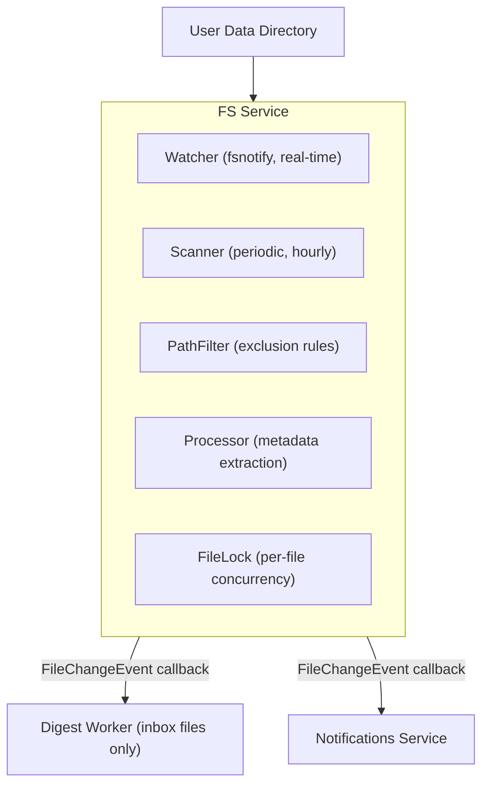

The FS service monitors the user's data directory for changes and triggers downstream processing.

## Architecture



## Key Components

| Location | Purpose |
|----------|---------|
| `backend/fs/service.go` | Main service, coordinates components |
| `backend/fs/watcher.go` | fsnotify wrapper for real-time changes |
| `backend/fs/scanner.go` | Periodic full directory scan |
| `backend/fs/pathfilter.go` | Path exclusion rules (11 categories) |
| `backend/fs/operations.go` | File CRUD operations |
| `backend/fs/processor.go` | Metadata extraction (hash, text preview) |

## Service Structure

```go
type Service struct {
    cfg Config

    // Sub-components (unexported)
    validator *validator
    processor *metadataProcessor   // Note: unexported type
    watcher   *watcher             // nil if WatchEnabled=false
    scanner   *scanner

    // Concurrency control
    fileLock *fileLock

    // File change notification
    changeHandler FileChangeHandler
    handlerMu     sync.RWMutex

    // Lifecycle
    stopChan chan struct{}
    wg       sync.WaitGroup
}
```

## PathFilter System

The PathFilter provides sophisticated file/directory exclusion with 11 categories:

```go
type Category int

const (
    CategoryHidden       Category = 1 << iota  // Dotfiles (.git, .hidden)
    CategoryBackup                             // Backup files (~file, *.bak)
    CategoryVCS                                // Version control (.git, .svn)
    CategoryIDE                                // IDE configs (.idea, .vscode)
    CategoryDependencies                       // Package dirs (node_modules, vendor)
    CategoryCache                              // Cache dirs (__pycache__, .cache)
    CategoryBuild                              // Build output (dist, build, target)
    CategoryVirtualEnv                         // Virtual envs (venv, .venv)
    CategoryOS                                 // OS files (.DS_Store, Thumbs.db)
    CategoryLogs                               // Log files (*.log)
    CategoryAppReserved                        // App-reserved (inbox, app at root)
)
```

### Exclusion Presets

```go
const (
    ExcludeNone    Category = 0  // No exclusions

    ExcludeDefault = CategoryHidden | CategoryBackup | CategoryVCS |
                     CategoryDependencies | CategoryCache |
                     CategoryVirtualEnv | CategoryOS

    ExcludeForTree = CategoryHidden | CategoryDependencies |
                     CategoryOS | CategoryAppReserved

    ExcludeForIndexing = CategoryHidden | CategoryBackup | CategoryVCS |
                         CategoryIDE | CategoryDependencies | CategoryCache |
                         CategoryBuild | CategoryVirtualEnv | CategoryOS |
                         CategoryLogs

    ExcludeAll = // All categories
)
```

### Usage

```go
// Create filter with default exclusions
filter := NewPathFilter(ExcludeDefault)

// Check if path should be excluded
if filter.IsExcluded("node_modules/package/index.js") {
    // Skip this file
}

// Faster single-entry check (for directory iteration)
if filter.IsExcludedEntry(".git", true) {  // true = at root level
    // Skip this entry
}
```

### Exclusion Patterns

The PathFilter checks against extensive pattern lists:

- **VCS**: `.git`, `.svn`, `.hg`, `.bzr`, `cvs`, `.fossil`, `_darcs`
- **IDE**: `.idea`, `.vscode`, `.vs`, `.project`, `.xcworkspace`, `.vim`, `.emacs.d`, `.cursor`
- **Dependencies**: `node_modules`, `vendor`, `bower_components`, `.npm`, `.yarn`, `.cargo`, `.m2`, `pods`
- **Cache**: `.cache`, `__pycache__`, `.pytest_cache`, `.next`, `.nuxt`, `.turbo`, `.terraform`
- **Build**: `dist`, `build`, `out`, `target`, `bin`, `obj`, `release`, `debug`
- **OS**: `.DS_Store`, `Thumbs.db`, `desktop.ini`, `$RECYCLE.BIN`, `.Trash-1000`

## Event Types

```go
type FileChangeEvent struct {
    FilePath       string    // Relative path from data root
    IsNew          bool      // True if file was just created
    ContentChanged bool      // True if content was modified
    Timestamp      time.Time
}
```

## Callback Pattern

The service doesn't directly call digest worker or notifications. Instead, a callback is set during server initialization:

```go
// backend/server/server.go
s.fsService.SetFileChangeHandler(func(event fs.FileChangeEvent) {
    if event.ContentChanged {
        s.digestWorker.OnFileChange(event.FilePath, event.IsNew, true)
    }
    if event.IsNew || event.ContentChanged {
        s.notifService.NotifyInboxChanged()
    }
})
```

**Important**: The handler is called in a **goroutine** to avoid blocking:
```go
func (s *Service) notifyFileChange(event FileChangeEvent) {
    if handler != nil {
        go handler(event)  // Async execution
    }
}
```

**DO**: Use the callback for downstream actions
**DON'T**: Import digest worker or notifications directly in fs package

## Watcher (Real-time)

Uses fsnotify to detect file changes immediately:

```go
func (w *watcher) Start() error {
    w.watcher.Add(w.cfg.DataRoot)  // Watch root
    // Recursively add subdirectories

    for {
        select {
        case event := <-w.watcher.Events:
            w.handleEvent(event)
        case err := <-w.watcher.Errors:
            log.Error().Err(err).Msg("watcher error")
        case <-w.stopChan:
            return nil
        }
    }
}
```

### Debouncing

Rapid file changes are debounced:
- Multiple rapid writes to same file -> single event after quiet period

### Known Issue

**Bug**: In `service.Stop()`, if `WatchEnabled=false`, `s.watcher` is nil and `s.watcher.Stop()` will panic. The code should check for nil:

```go
func (s *Service) Stop() error {
    close(s.stopChan)
    if s.watcher != nil {  // Should add this check
        s.watcher.Stop()
    }
    s.scanner.Stop()
    s.wg.Wait()
    return nil
}
```

## Scanner (Periodic)

Catches changes that watcher might miss (network drives, external modifications):

```go
func (s *scanner) Start() error {
    // Initial scan after 10 second delay
    time.Sleep(10 * time.Second)
    s.scanAll()

    // Then scan every hour (configurable via ScanInterval)
    ticker := time.NewTicker(s.interval)
    for {
        select {
        case <-ticker.C:
            s.scanAll()
        case <-s.stopChan:
            return nil
        }
    }
}
```

Configuration:
- **Initial scan delay**: 10 seconds
- **Max concurrency**: 10 goroutines
- **Scan interval**: configurable (default: 1 hour)

## Processing Marker

The service uses a `sync.Map` to prevent duplicate processing when API creates a file and fsnotify immediately detects it:

```go
// When API writes a file
s.markProcessing(filePath)  // Mark as "we're handling this"

// When fsnotify detects the same file
if s.isProcessing(filePath) {
    return  // Skip, API already handling it
}
```

## File Operations

### WriteFile

```go
func (s *Service) WriteFile(ctx context.Context, req WriteRequest) (*WriteResult, error)

type WriteRequest struct {
    Path        string
    Content     io.Reader
    ContentType string
    Overwrite   bool
}
```

### ReadFile

```go
func (s *Service) ReadFile(ctx context.Context, path string) (io.ReadCloser, error)
```

### DeleteFile

```go
func (s *Service) DeleteFile(ctx context.Context, path string) error
```

### MoveFile

```go
func (s *Service) MoveFile(ctx context.Context, src, dst string) error
```

Move operation:
- Preserves hash and text preview
- Falls back from rename to copy+delete for cross-filesystem moves

## Database Adapter

The FS service uses an interface instead of direct db.DB dependency:

```go
type DBAdapter interface {
    GetFileByPath(path string) (*db.FileRecord, error)
    UpsertFile(file *db.FileRecord) error
    DeleteFile(path string) error
    // ...
}
```

This allows testing without a real database.

## Text File Detection

The service detects text files by extension for preview extraction:

```go
var textExtensions = map[string]bool{
    // Markup
    ".md": true, ".markdown": true, ".txt": true, ".rst": true,
    // Code
    ".go": true, ".py": true, ".js": true, ".ts": true, ".jsx": true, ".tsx": true,
    ".java": true, ".c": true, ".cpp": true, ".h": true, ".rs": true, ".rb": true,
    ".php": true, ".swift": true, ".kt": true, ".scala": true, ".cs": true,
    // Config
    ".json": true, ".yaml": true, ".yml": true, ".toml": true, ".xml": true,
    ".ini": true, ".conf": true, ".env": true,
    // Web
    ".html": true, ".htm": true, ".css": true, ".scss": true, ".less": true,
    // Shell
    ".sh": true, ".bash": true, ".zsh": true, ".fish": true,
    // Other
    ".sql": true, ".graphql": true, ".proto": true,
}
```

## Configuration

```go
type Config struct {
    DataRoot     string        // User data directory
    WatchEnabled bool          // Enable fsnotify watcher
    ScanInterval time.Duration // Periodic scan interval
    DB           DBAdapter     // Database interface
}
```

## Common Modifications

### Adding new watched directories
- Update `Config` in `backend/fs/types.go`
- Add directory to watcher in `watcher.go`

### Changing scan interval
- Modify `ScanInterval` in config or environment variable

### Adding file type filtering
- Modify `pathfilter.go` to add extension checks
- Or filter in the change handler callback

### Adding exclusion patterns
- Add to the appropriate category map in `pathfilter.go`:
  ```go
  var vcsNames = map[string]bool{
      ".git":    true,
      ".myNewVcs": true,  // Add new pattern
  }
  ```

### Handling new event types
- Add case in `watcher.handleEvent()`
- Extend `FileChangeEvent` fields if needed
- Update callback handler in server.go

## Files to Modify

| Task | Files |
|------|-------|
| Change watch behavior | `backend/fs/watcher.go` |
| Change scan behavior | `backend/fs/scanner.go` |
| Add exclusion rules | `backend/fs/pathfilter.go` |
| Add validation rules | `backend/fs/validator.go` |
| Modify event handling | `backend/server/server.go` (callback) |
| File operations | `backend/fs/operations.go` |
