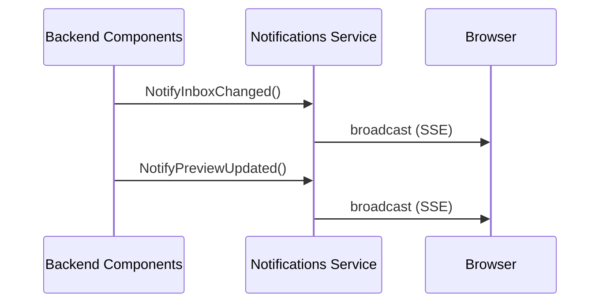

The notifications service provides real-time updates to the frontend via Server-Sent Events (SSE).

## Architecture



## Key Components

| Location | Purpose |
|----------|---------|
| `backend/notifications/service.go` | Pub/sub service, event broadcasting |
| `backend/api/notifications.go` | SSE HTTP handler with heartbeat |
| `frontend/app/hooks/use-notifications.ts` | Frontend hooks for consuming events |

## Event Structure

```go
// backend/notifications/service.go
type EventType string

const (
    EventInboxChanged   EventType = "inbox-changed"
    EventPinChanged     EventType = "pin-changed"
    EventDigestUpdate   EventType = "digest-update"
    EventPreviewUpdated EventType = "preview-updated"
    EventConnected      EventType = "connected"
)

type Event struct {
    Type      EventType `json:"type"`
    Timestamp int64     `json:"timestamp"`      // Unix millisecond timestamp, auto-set
    Path      string    `json:"path,omitempty"` // File path for file-specific events
    Data      any       `json:"data,omitempty"` // Additional event data
}
```

## Event Types

| Type | Triggered By | Data | Purpose |
|------|--------------|------|---------|
| `inbox-changed` | File added/modified in inbox | - | Refresh inbox UI |
| `digest-update` | Digest processing complete | `{path}` | Update file metadata display |
| `preview-updated` | Screenshot/preview generated | `{path, previewType}` | Show preview in UI |
| `pin-changed` | File pinned/unpinned | `{path}` | Update pin indicators |
| `connected` | Client connects | - | Initial handshake confirmation |

### Preview Types

The `preview-updated` event includes a `previewType` field:
- `"screenshot"` - URL crawl or document screenshot
- `"image"` - Image preview (HEIC->JPEG conversion)

## Service Implementation

```go
type Service struct {
    mu          sync.RWMutex
    subscribers map[chan Event]struct{}  // Active SSE connections
    done        chan struct{}            // Shutdown signal
}

// Subscribe creates a new subscription channel
// Returns the event channel and an unsubscribe function
func (s *Service) Subscribe() (<-chan Event, func()) {
    ch := make(chan Event, 10)  // Buffer size: 10 events
    // ...
    return ch, unsubscribe
}
```

### Buffer Size

Subscriber channels are buffered with **10 events** (not 100). When slow clients fill the buffer, events are silently dropped:

```go
func (s *Service) Notify(event Event) {
    // Auto-set timestamp if not provided
    if event.Timestamp == 0 {
        event.Timestamp = time.Now().UnixMilli()
    }

    for ch := range s.subscribers {
        select {
        case ch <- event:
            // Sent successfully
        default:
            // Channel full, skip this subscriber (silent drop)
        }
    }
}
```

## SSE Handler

```go
// backend/api/notifications.go
func (h *Handlers) NotificationStream(c *gin.Context) {
    // Set SSE headers
    c.Header("Content-Type", "text/event-stream")
    c.Header("Cache-Control", "no-cache")
    c.Header("Connection", "keep-alive")
    c.Header("X-Accel-Buffering", "no")  // Disable nginx buffering

    events, unsubscribe := h.server.Notifications().Subscribe()
    defer unsubscribe()

    // Send initial connected event
    sendSSEEventGin(c, notifications.Event{
        Type:      notifications.EventConnected,
        Timestamp: time.Now().UnixMilli(),
    })

    // Heartbeat every 30 seconds (keeps connection alive behind proxies)
    ticker := time.NewTicker(30 * time.Second)
    defer ticker.Stop()

    for {
        select {
        case <-h.server.ShutdownContext().Done():
            return
        case event, ok := <-events:
            if !ok { return }
            sendSSEEventGin(c, event)
            c.Writer.Flush()
        case <-ticker.C:
            fmt.Fprintf(c.Writer, ": heartbeat\n\n")  // SSE comment
            c.Writer.Flush()
        case <-c.Request.Context().Done():
            return
        }
    }
}
```

### SSE Headers

| Header | Value | Purpose |
|--------|-------|---------|
| `Content-Type` | `text/event-stream` | SSE content type |
| `Cache-Control` | `no-cache` | Prevent caching |
| `Connection` | `keep-alive` | Keep connection open |
| `X-Accel-Buffering` | `no` | Disable nginx buffering |

## Frontend Integration

### Shared EventSource Connection

The frontend uses a singleton pattern with ref-counting to share one SSE connection across all hooks:

```typescript
// frontend/app/hooks/use-notifications.ts

// Singleton EventSource (shared across all hook instances)
let sharedEventSource: EventSource | null = null;
let connectionRefCount = 0;

// Event listeners registry
const listeners: Set<(event: MessageEvent) => void> = new Set();

function subscribe(listener: (event: MessageEvent) => void) {
    listeners.add(listener);
    connectionRefCount++;

    // Connect if first subscriber
    if (connectionRefCount === 1) {
        connectToNotifications();
    }

    return () => {
        listeners.delete(listener);
        connectionRefCount--;

        // Disconnect if no more subscribers
        if (connectionRefCount === 0) {
            disconnectFromNotifications();
        }
    };
}
```

### Authentication

If OAuth is enabled, the access token is passed via query parameter:

```typescript
const accessToken = localStorage.getItem('access_token');
let url = '/api/notifications/stream';
if (accessToken) {
    url += `?token=${encodeURIComponent(accessToken)}`;
}
```

### Frontend Hooks

#### useInboxNotifications

Triggers a debounced callback on any notification event (except `connected`):

```typescript
interface UseInboxNotificationsOptions {
    onInboxChange: () => void;
    enabled?: boolean;
}

export function useInboxNotifications(options: UseInboxNotificationsOptions) {
    const { onInboxChange, enabled = true } = options;

    // Debounce with 200ms delay to batch rapid notifications
    const debouncedOnChange = useMemo(
        () => debounce(onInboxChange, 200),
        [onInboxChange]
    );

    useEffect(() => {
        if (!enabled) return;

        const listener = (event: MessageEvent) => {
            const data = JSON.parse(event.data);
            if (data.type === 'connected') return;
            debouncedOnChange();  // Trigger on any event
        };

        return subscribe(listener);
    }, [enabled, debouncedOnChange]);
}
```

#### usePreviewNotifications

Triggers callback when a preview is ready:

```typescript
interface UsePreviewNotificationsOptions {
    onPreviewUpdated: (filePath: string, previewType: string) => void;
    enabled?: boolean;
}

export function usePreviewNotifications(options: UsePreviewNotificationsOptions) {
    const { onPreviewUpdated, enabled = true } = options;

    useEffect(() => {
        if (!enabled) return;

        const listener = (event: MessageEvent) => {
            const data = JSON.parse(event.data);
            if (data.type === 'preview-updated' && data.path) {
                const previewType = data.data?.previewType || 'unknown';
                onPreviewUpdated(data.path, previewType);
            }
        };

        return subscribe(listener);
    }, [enabled, onPreviewUpdated]);
}
```

### Usage Example

```typescript
// frontend/app/routes/home.tsx
function HomePage() {
    const queryClient = useQueryClient();

    useInboxNotifications({
        onInboxChange: () => {
            queryClient.invalidateQueries({ queryKey: ['feed'] });
        }
    });

    usePreviewNotifications({
        onPreviewUpdated: (filePath, previewType) => {
            queryClient.invalidateQueries({ queryKey: ['feed'] });
        }
    });

    // ...
}
```

## Publishing Events

### Convenience Methods

```go
// backend/notifications/service.go

// NotifyInboxChanged - file added/modified in inbox
func (s *Service) NotifyInboxChanged() {
    s.Notify(Event{
        Type:      EventInboxChanged,
        Timestamp: time.Now().UnixMilli(),
    })
}

// NotifyPinChanged - file pinned/unpinned
func (s *Service) NotifyPinChanged(path string) {
    s.Notify(Event{
        Type:      EventPinChanged,
        Timestamp: time.Now().UnixMilli(),
        Path:      path,
    })
}

// NotifyPreviewUpdated - screenshot/preview ready
func (s *Service) NotifyPreviewUpdated(path string, previewType string) {
    s.Notify(Event{
        Type:      EventPreviewUpdated,
        Timestamp: time.Now().UnixMilli(),
        Path:      path,
        Data: map[string]interface{}{
            "previewType": previewType,
        },
    })
}
```

### Where Events Are Triggered

| Event | Location | Trigger |
|-------|----------|---------|
| `inbox-changed` | `server/server.go` | FS service file change callback |
| `inbox-changed` | `api/inbox.go` | CreateInboxItem handler |
| `pin-changed` | `api/library.go` | Pin/unpin handlers |
| `preview-updated` | `workers/digest/worker.go` | Screenshot digester completion |

**Note**: `digest-update` is defined but currently not triggered anywhere in the codebase.

## Common Modifications

### Adding a New Event Type

1. Add constant to `backend/notifications/service.go`:
   ```go
   const EventMyNewEvent EventType = "my-new-event"
   ```

2. Add convenience method (optional):
   ```go
   func (s *Service) NotifyMyNewEvent(data interface{}) {
       s.Notify(Event{
           Type: EventMyNewEvent,
           Data: data,
       })
   }
   ```

3. Trigger from backend code:
   ```go
   h.server.Notifications().NotifyMyNewEvent(myData)
   ```

4. Handle in frontend hook or create a new hook

### Connection Lifecycle Features

The frontend handles:
- **Auto-reconnect**: 5 second delay after connection error
- **Visibility change**: Reconnects when tab becomes visible
- **Ref counting**: Disconnects when no hooks are subscribed

## Files to Modify

| Task | Files |
|------|-------|
| Add event types | `backend/notifications/service.go` |
| Change SSE behavior | `backend/api/notifications.go` |
| Frontend handling | `frontend/app/hooks/use-notifications.ts` |
