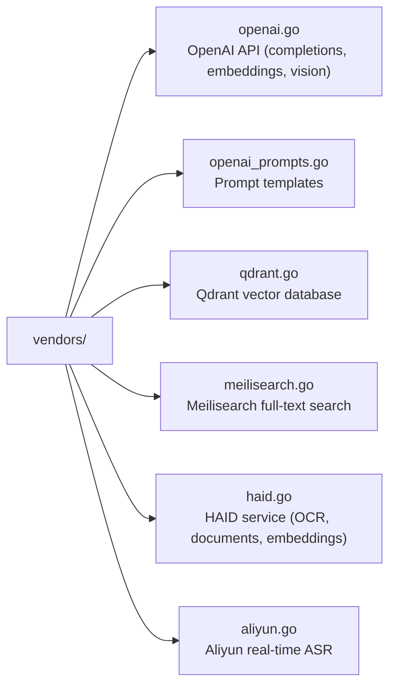

The vendors package provides clients for external services used by the application.

## Architecture



## Service Overview

| Service | Purpose | Configuration |
|---------|---------|---------------|
| OpenAI | Completions, embeddings, vision | `OPENAI_API_KEY`, `OPENAI_BASE_URL`, `OPENAI_MODEL` |
| Qdrant | Vector similarity search | `QDRANT_HOST`, `QDRANT_API_KEY`, `QDRANT_COLLECTION` |
| Meilisearch | Full-text keyword search | `MEILI_HOST`, `MEILI_API_KEY`, `MEILI_INDEX` |
| HAID | OCR, document conversion, whisperx | `HAID_BASE_URL`, `HAID_API_KEY`, `HAID_CHROME_CDP_URL` |
| Aliyun | Real-time speech recognition | (configured in settings) |

## OpenAI

### Configuration

```bash
OPENAI_API_KEY=sk-...
OPENAI_BASE_URL=https://api.openai.com/v1  # Optional, for compatible APIs
OPENAI_MODEL=gpt-4o-mini                   # Default model
```

### Functions

```go
// backend/vendors/openai.go

// Chat completion
func OpenAIComplete(messages []OpenAIMessage, options ...OpenAIOption) (string, error)

// Generate embeddings
func OpenAIEmbeddings(texts []string) ([][]float32, error)

// Vision (image analysis)
func OpenAIVision(prompt string, imageURL string) (string, error)

// List available models
func OpenAIListModels() ([]OpenAIModel, error)
```

### Types

```go
type OpenAIMessage struct {
    Role    string `json:"role"`    // "system", "user", "assistant"
    Content string `json:"content"`
}

type OpenAIOption func(*openAIRequest)

// Options
func WithModel(model string) OpenAIOption
func WithMaxTokens(n int) OpenAIOption
func WithTemperature(t float32) OpenAIOption
```

### Prompts

```go
// backend/vendors/openai_prompts.go

// Pre-defined prompts for common tasks
var PromptSummarize = "Summarize the following content..."
var PromptGenerateTags = "Generate relevant tags for..."
var PromptImageCaption = "Describe this image..."
```

## Qdrant

Vector database for semantic search.

### Configuration

```bash
QDRANT_HOST=http://localhost:6333
QDRANT_API_KEY=              # Optional
QDRANT_COLLECTION=mylifedb_vectors
```

### Functions

```go
// backend/vendors/qdrant.go

// Initialize collection (called on startup)
func QdrantEnsureCollection() error

// Store vectors
func QdrantUpsert(points []QdrantPoint) error

// Search by vector
func QdrantSearch(vector []float32, limit int) ([]QdrantSearchResult, error)

// Delete by file path
func QdrantDelete(filePath string) error

// Get collection info
func QdrantGetCollectionInfo() (*QdrantCollectionInfo, error)
```

### Types

```go
type QdrantPoint struct {
    ID      string             // Usually file path hash
    Vector  []float32          // Embedding vector
    Payload map[string]any     // Metadata (path, text, etc.)
}

type QdrantSearchResult struct {
    ID      string
    Score   float32
    Payload map[string]any
}
```

## Meilisearch

Full-text search engine.

### Configuration

```bash
MEILI_HOST=http://localhost:7700
MEILI_API_KEY=
MEILI_INDEX=mylifedb_files
```

### Functions

```go
// backend/vendors/meilisearch.go

// Initialize index (called on startup)
func MeiliEnsureIndex() error

// Index documents
func MeiliIndex(docs []MeiliDocument) error

// Search
func MeiliSearch(query string, limit int) ([]MeiliSearchResult, error)

// Delete document
func MeiliDelete(id string) error

// Get index stats
func MeiliGetStats() (*MeiliStats, error)
```

### Types

```go
type MeiliDocument struct {
    ID       string            // Usually file path
    Content  string            // Searchable text
    Path     string
    Title    string
    Tags     []string
}

type MeiliSearchResult struct {
    ID    string
    Score float32
    // ... matched document fields
}
```

## HAID

Custom service for document processing.

### Configuration

```bash
HAID_BASE_URL=http://your-haid-server
HAID_API_KEY=
HAID_CHROME_CDP_URL=  # For screenshots
```

### Functions

```go
// backend/vendors/haid.go

// Document to Markdown
func HAIDDocToMarkdown(filePath string) (string, error)

// OCR (image to text)
func HAIDOCR(imagePath string) (string, error)

// Object detection
func HAIDDetectObjects(imagePath string) ([]HAIDObject, error)

// Generate embeddings
func HAIDEmbeddings(texts []string) ([][]float32, error)

// Speech recognition (whisperx with diarization)
func HAIDWhisperX(audioPath string) (*HAIDTranscript, error)

// Take screenshot of URL
func HAIDScreenshot(url string) ([]byte, error)

// Take screenshot of document
func HAIDDocScreenshot(filePath string) ([]byte, error)
```

### Types

```go
type HAIDObject struct {
    Label      string  `json:"label"`
    Confidence float32 `json:"confidence"`
    BoundingBox struct {
        X, Y, Width, Height int
    } `json:"bounding_box"`
}

type HAIDTranscript struct {
    Segments []HAIDSegment `json:"segments"`
    Language string        `json:"language"`
}

type HAIDSegment struct {
    Start   float64 `json:"start"`
    End     float64 `json:"end"`
    Text    string  `json:"text"`
    Speaker string  `json:"speaker"`  // With diarization
}
```

## Aliyun

Real-time speech recognition.

### Configuration

Configured via user settings (not environment variables):
- Access Key ID
- Access Key Secret
- App Key

### Functions

```go
// backend/vendors/aliyun.go

// Create real-time ASR connection
func AliyunCreateASRConnection(settings AliyunSettings) (*AliyunASRConnection, error)

// Non-realtime ASR (file upload)
func AliyunASRFile(audioPath string, settings AliyunSettings) (*AliyunTranscript, error)
```

### Real-time ASR Flow

```go
conn, err := AliyunCreateASRConnection(settings)
if err != nil {
    return err
}
defer conn.Close()

// Send audio chunks
for chunk := range audioChunks {
    conn.SendAudio(chunk)
}

// Receive transcripts
for transcript := range conn.Results() {
    // Handle partial/final results
}
```

## Error Handling

All vendor functions check if the service is configured before making calls:

```go
func OpenAIComplete(messages []OpenAIMessage, options ...OpenAIOption) (string, error) {
    cfg := config.Get()
    if cfg.OpenAIAPIKey == "" {
        return "", errors.New("OpenAI API key not configured")
    }
    // ...
}
```

## Service Availability

Check if services are configured:

```go
cfg := config.Get()

// OpenAI
if cfg.OpenAIAPIKey != "" {
    // OpenAI is available
}

// Qdrant
if cfg.QdrantHost != "" {
    // Qdrant is available
}

// Meilisearch
if cfg.MeiliHost != "" {
    // Meilisearch is available
}

// HAID
if cfg.HAIDBaseURL != "" {
    // HAID is available
}
```

## Usage in Digesters

```go
// backend/workers/digest/digesters.go

func (d *ImageCaptioningDigester) Digest(...) ([]DigestInput, error) {
    cfg := config.Get()
    if cfg.OpenAIAPIKey == "" {
        return nil, errors.New("OpenAI not configured")
    }

    // Read image and convert to base64
    imageURL := "data:image/jpeg;base64," + base64Data

    // Call OpenAI Vision
    caption, err := vendors.OpenAIVision(
        "Describe this image in detail.",
        imageURL,
    )
    if err != nil {
        return nil, err
    }

    return []DigestInput{
        {Digester: "image-captioning", Status: DigestStatusCompleted, Content: &caption},
    }, nil
}
```

## Adding a New Vendor

1. **Create vendor file**:
   ```go
   // backend/vendors/myservice.go
   package vendors

   import "github.com/xiaoyuanzhu-com/my-life-db/config"

   type MyServiceClient struct {
       baseURL string
       apiKey  string
   }

   func NewMyServiceClient() *MyServiceClient {
       cfg := config.Get()
       return &MyServiceClient{
           baseURL: cfg.MyServiceURL,
           apiKey:  cfg.MyServiceAPIKey,
       }
   }

   func (c *MyServiceClient) DoSomething(input string) (string, error) {
       if c.apiKey == "" {
           return "", errors.New("MyService not configured")
       }
       // Make API call...
   }
   ```

2. **Add configuration**:
   ```go
   // backend/config/config.go
   type Config struct {
       // ...
       MyServiceURL    string
       MyServiceAPIKey string
   }

   func load() *Config {
       return &Config{
           // ...
           MyServiceURL:    getEnv("MY_SERVICE_URL", ""),
           MyServiceAPIKey: getEnv("MY_SERVICE_API_KEY", ""),
       }
   }
   ```

3. **Document in CLAUDE.md**

## Local Development

### Docker Services

```bash
# Start Meilisearch
./run.js meili
# or: docker run -p 7700:7700 getmeili/meilisearch:v1.6

# Start Qdrant
./run.js qdrant
# or: docker run -p 6333:6333 qdrant/qdrant:latest
```

### Testing Vendor Connections

```go
// Test OpenAI
response, err := vendors.OpenAIComplete([]OpenAIMessage{
    {Role: "user", Content: "Hello"},
})

// Test Meilisearch
err := vendors.MeiliEnsureIndex()

// Test Qdrant
err := vendors.QdrantEnsureCollection()
```

## Files to Modify

| Task | Files |
|------|-------|
| Add new vendor | Create `backend/vendors/myservice.go` |
| Modify OpenAI calls | `backend/vendors/openai.go` |
| Add prompts | `backend/vendors/openai_prompts.go` |
| Change search behavior | `backend/vendors/meilisearch.go` or `qdrant.go` |
