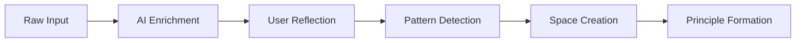
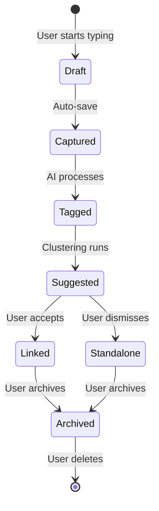
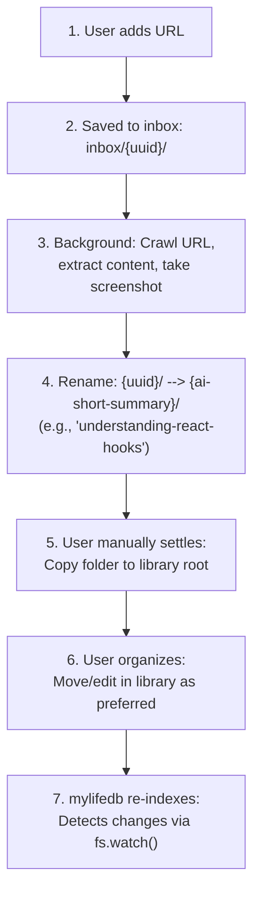

**Version:** 1.1
**Last Updated:** 2025-10-28
**Status:** Updated - URL Crawl & Data Architecture
**Owner:** Product Team

---

## Table of Contents

1. [Executive Summary](#1-executive-summary)
2. [Product Overview](#2-product-overview)
3. [User Personas & Use Cases](#3-user-personas--use-cases)
4. [Functional Requirements](#4-functional-requirements)
5. [User Experience](#5-user-experience)
6. [User Flows & Journeys](#6-user-flows--journeys)
7. [Success Metrics & KPIs](#7-success-metrics--kpis)
8. [Implementation Roadmap](#8-implementation-roadmap)
9. [Out of Scope](#9-out-of-scope)
10. [Appendices](#10-appendices)

---

## 1. Executive Summary

### 1.1 Product Vision

MyLifeDB is a personal knowledge management system that helps people capture information effortlessly and transform it into structured, meaningful knowledge through AI-assisted organization.

**Mission:** Enable users to build a lifelong library of personal knowledge without the burden of upfront organization.

### 1.2 Core Value Proposition

- **Frictionless capture:** Zero cognitive overhead for input — users never think "where should this go?"
- **AI-assisted structure:** Intelligent pattern recognition with user control — AI suggests, user decides
- **Data ownership:** Full control and portability of personal data — no vendor lock-in
- **Long-term continuity:** System that evolves with user's thinking over years

### 1.3 Product Principles

1. **User Agency:** AI suggests, but the user always has final say
2. **Progressive Enhancement:** Start simple, add complexity only as needed
3. **Data Transparency:** All AI decisions are auditable and explainable
4. **Offline-First:** Core functionality works without internet connection
5. **Open Standards:** Data stored in human-readable formats (Markdown, JSON)

### 1.4 Target Release

- **MVP (v1.0):** Q2 2025
- **Platform:** Web application
- **Deployment:** Self-hosted (primary) / Cloud optional (future)

---

## 2. Product Overview

### 2.1 Product Description

MyLifeDB implements a **dual-zone architecture** that separates capture from organization:

| Zone | Purpose | User Mental Model | Design Philosophy |
|------|---------|-------------------|-------------------|
| **Inbox** | Continuous stream for raw captures | "My daily flow" | Speed, freedom, motion |
| **Library** | Curated, structured knowledge spaces | "Where things I care about live" | Calm, permanence, reflection |

### 2.2 Content Lifecycle

The system transforms raw information into structured knowledge through this natural progression:



**Key Insight:** Users don't organize upfront. The system observes patterns and suggests structure, which users confirm or reject.

### 2.3 Problem Statement

**Current Pain Points:**
- Traditional note-taking apps require too much upfront organization (folders, tags, links)
- Information gets lost across multiple tools (Notes, Evernote, Google Docs, etc.)
- No intelligent way to see connections between ideas over time
- Vendor lock-in and data portability concerns
- Tools feel like "work" rather than natural thinking extensions

**Our Solution:**
MyLifeDB removes the organizational burden by:
1. Accepting any input without categorization
2. Using AI to detect patterns over time
3. Suggesting (not forcing) organizational structures
4. Keeping user in control of final decisions
5. Maintaining full data ownership and portability

---

## 3. User Personas & Use Cases

### 3.1 Primary Persona: "The Reflective Learner"

**Name:** Alex Chen
**Age:** 32
**Occupation:** Product Designer / Knowledge Worker
**Tech Savvy:** Medium-High

**Background:**
Alex reads widely, takes courses, journals regularly, and wants to connect ideas across domains. They've tried Notion, Roam Research, and Obsidian but found them too rigid or requiring too much manual linking.

**Goals:**
- Capture ideas quickly without disrupting creative flow
- Discover patterns in their thinking over months/years
- Build a personal knowledge base that grows organically
- Maintain complete privacy and data ownership
- Export data at any time without vendor lock-in

**Frustrations:**
- Current tools demand upfront decisions about organization
- Manually creating links between notes feels like busywork
- Information silos across 5+ different apps
- Fear of losing years of notes if service shuts down
- No way to see "what am I thinking about lately?"

**Daily Routine:**
- Morning: Reviews weekly reflection digest
- Throughout day: Quick-captures ideas via keyboard shortcut
- Evening: Browses Library to revisit past insights
- Weekly: Reviews AI-suggested clusters and creates new Spaces

### 3.2 Secondary Persona: "The Privacy-Conscious Professional"

**Name:** Jordan Kim
**Age:** 45
**Occupation:** Healthcare professional / Researcher
**Tech Savvy:** Medium

**Goals:**
- Keep sensitive notes completely private (local storage)
- No cloud dependencies or data sharing
- Simple, reliable system that "just works"
- Minimal learning curve

**Pain Points:**
- Distrust of cloud services with personal/professional data
- Complex tools require too much time to learn
- Need for offline-first functionality

### 3.3 Key Use Cases

#### UC-001: Quick Capture

**Scenario:** Alex is reading an article and has a sudden insight about their design project.

**Flow:**
1. Alex presses `⌘N` (global keyboard shortcut)
2. Quick-add modal appears
3. Alex types: "Whitespace in UI creates cognitive breathing room — relates to minimalism"
4. Alex presses Enter
5. System auto-saves to Inbox
6. System runs AI tagging (non-blocking)
7. Alex sees notification: "Linked to Design & Minimalism?"
8. Alex can accept/dismiss or ignore

**Outcome:** Idea captured in <10 seconds without leaving current context.

#### UC-002: Weekly Reflection

**Scenario:** It's Sunday morning, and Alex receives a weekly digest.

**Flow:**
1. System sends notification: "Weekly Reflection Ready — 3 new clusters detected"
2. Alex clicks notification → opens Reflection View
3. Alex sees suggested clusters:
   - "Design Thinking" (7 entries, 82% confidence)
   - "Sleep Patterns" (5 entries, 75% confidence)
   - "Cooking" (3 entries, 68% confidence)
4. Alex reviews "Design Thinking" cluster:
   - Sees 7 related entries from the past week
   - AI suggests title: "Design Thinking"
   - Alex renames to "UX Philosophy"
5. Alex clicks "Confirm" → Space created in Library
6. Alex dismisses "Cooking" (not interested)
7. Alex snoozes "Sleep Patterns" for next week

**Outcome:** 7 scattered entries now organized into meaningful Space with minimal effort.

#### UC-003: Discovering Insights

**Scenario:** Alex explores their "UX Philosophy" Space after 3 months of entries.

**Flow:**
1. Alex opens Library → selects "UX Philosophy" Space
2. Space shows:
   - 42 linked entries
   - 3 AI-generated insights
   - 1 user-created principle
3. Alex clicks "Insights" tab
4. Insight #1: "You mention 'user empathy' in 18 entries, mostly on Mondays"
5. Insight #2: "Strong connection to 'Design Systems' Space (12 shared entries)"
6. Alex promotes Insight #1 to Principle: "Empathy is my design foundation"
7. Alex explores cross-link to "Design Systems" Space

**Outcome:** Alex discovers meta-patterns in their thinking they wouldn't have noticed manually.

#### UC-004: Search & Retrieval

**Scenario:** Alex remembers writing about "cognitive load" but can't remember when.

**Flow:**
1. Alex opens global search (`⌘K`)
2. Alex types: "cognitive load"
3. Results appear in <500ms:
   - 5 Inbox entries
   - 2 Library Spaces
4. Alex filters by "Last Month"
5. Alex clicks result → opens entry detail
6. System shows: "Also found in UX Philosophy Space"

**Outcome:** Alex finds the entry and discovers it's part of a larger pattern.

---

## 4. Functional Requirements

### 4.1 Capture System

| ID | Feature | Description | Priority | Acceptance Criteria |
|----|---------|-------------|----------|---------------------|
| **FR-001** | Text Input | User can type and save text entries | P0 | Entry saved in <2s; no explicit "save" button |
| **FR-002** | File Upload | User can upload images, PDFs, documents | P0 | Drag-drop support; max 50MB per file |
| **FR-003** | Voice Recording | User can record audio notes | P1 | Auto-transcription; playback available |
| **FR-004** | Link Capture | User can save web links with preview | P1 | Auto-fetch title/description/image |
| **FR-005** | Keyboard Shortcuts | Global quick-add shortcut | P0 | `⌘N` / `Ctrl+N` works app-wide |
| **FR-006** | Auto-Save | No manual save required | P0 | Saves on blur; shows "Saving..." indicator |
| **FR-007** | Offline Capture | Works without internet | P1 | Queues entries; syncs when online |

### 4.2 AI Processing

| ID | Feature | Description | Priority | Acceptance Criteria |
|----|---------|-------------|----------|---------------------|
| **FR-010** | Auto-Tagging | Generate relevant tags per entry | P0 | ≥2 tags; ≤5 tags; <2s processing time |
| **FR-011** | Similarity Detection | Identify related entries | P0 | ≥3 similar items with ≥70% confidence |
| **FR-012** | Clustering | Group related entries into Spaces | P0 | Weekly batch job; min 3 entries per cluster |
| **FR-013** | Natural Language Search | Parse conversational queries | P1 | "show me focus notes from last week" works |
| **FR-014** | Insight Generation | Summarize patterns per Space | P1 | ≥1 insight per Space with ≥10 entries |
| **FR-015** | Confidence Scoring | All suggestions include % confidence | P0 | Visual indicator (color-coded) |
| **FR-016** | AI Explainability | Show reasoning for suggestions | P1 | "Why?" link shows AI logic |

### 4.3 Organization System

| ID | Feature | Description | Priority | Acceptance Criteria |
|----|---------|-------------|----------|---------------------|
| **FR-020** | Space Creation (AI) | Create Space from cluster | P0 | One-click accept; <1s creation |
| **FR-021** | Space Creation (Manual) | User creates Space without AI | P0 | Form: title, description, cover |
| **FR-022** | Space Metadata | Edit title, description, cover, color | P0 | Real-time preview |
| **FR-023** | Multi-Space Linking | Entry can belong to multiple Spaces | P1 | Many-to-many relationship |
| **FR-024** | Cross-Space Relations | Show related Spaces | P1 | Auto-detect based on shared entries |
| **FR-025** | Archive Spaces | Archive inactive Spaces | P2 | Auto-prompt after 90 days no access |
| **FR-026** | Merge Spaces | Combine two Spaces | P2 | Preserves all entries and metadata |

### 4.4 Reflection Features

| ID | Feature | Description | Priority | Acceptance Criteria |
|----|---------|-------------|----------|---------------------|
| **FR-030** | Weekly Digest | Email/notification with clusters | P1 | Sent every 7 days; configurable day |
| **FR-031** | Emerging Topics | Show low-confidence clusters | P1 | <60% confidence; opt-in review |
| **FR-032** | Principles | Promote insights to permanent truths | P1 | User can add notes; timestamp tracked |
| **FR-033** | Trend Visualization | Charts of topic frequency over time | P2 | Word cloud, timeline, heatmap |
| **FR-034** | Reflection History | View past digests | P2 | Archive of all weekly digests |

### 4.5 Search & Navigation

| ID | Feature | Description | Priority | Acceptance Criteria |
|----|---------|-------------|----------|---------------------|
| **FR-040** | Global Search | Search all content (Inbox + Library) | P0 | <500ms for 10k entries; keyboard shortcut `⌘K` |
| **FR-041** | Date Filter | Filter by time range | P0 | Calendar picker; presets (today, week, month) |
| **FR-042** | Type Filter | Filter by content type | P1 | Text, voice, file, link |
| **FR-043** | Tag Filter | Filter by tags | P1 | Multi-select tag list |
| **FR-044** | Confidence Filter | Filter AI suggestions by confidence | P1 | Slider: 0-100% |
| **FR-045** | Breadcrumb Navigation | Show entry → Space → Principle path | P0 | Clickable breadcrumbs |
| **FR-046** | Saved Searches | Save common search queries | P2 | Name and reuse filters |

### 4.6 Data Management

| ID | Feature | Description | Priority | Acceptance Criteria |
|----|---------|-------------|----------|---------------------|
| **FR-050** | Export Space (Markdown) | Download Space as .md files | P0 | Zip folder with all entries |
| **FR-051** | Export All Data | Export entire Library | P0 | JSON + Markdown; <10s for 1k entries |
| **FR-052** | Import Markdown | Bulk-import .md files | P1 | Auto-detect frontmatter |
| **FR-053** | Auto-Backup | Scheduled backups | P1 | Daily; configurable location |
| **FR-054** | Delete All Data | GDPR compliance | P0 | Confirmation dialog; irreversible |
| **FR-055** | Data Portability | Export in standard formats | P0 | No proprietary formats |

---

## 5. User Experience

### 5.1 Interface Design Philosophy

**Inbox:** Light, airy, motion-forward
- Color: Light blue/gray (#f8fafc, #3b82f6)
- Feeling: Speed, freedom, flow
- Metaphor: River of thoughts

**Library:** Warm, stable, reflective
- Color: Warm beige/amber (#faf8f5, #d97706)
- Feeling: Calm, permanence, wisdom
- Metaphor: Well-organized bookshelf

**Design Tone:**
- Minimal, generous whitespace
- Calm, polite voice ("Looks like you've been exploring sleep patterns")
- Micro-animations for delight (cards "settle" from Inbox to Library)
- No gamification, no progress bars, no badges

### 5.2 Inbox View (Wireframe)

```
┌─────────────────────────────────────────────────────────────┐
│  [Logo]  Inbox  Library  Search          [Profile] [Theme]  │
├─────────────────────────────────────────────────────────────┤
│                                                               │
│  ┌───────────────────────────────────────────────────────┐  │
│  │  ⊕ Quick add...                    🎤  📷  📁  ⌨ ⌘N  │  │
│  └───────────────────────────────────────────────────────┘  │
│                                                               │
│  [ All · Notes · Media · Links · Voice · AI Clusters ]       │
│                                                               │
│  ┌─────────────────────────────────┐  ┌─────────────────┐  │
│  │ ┌─────────────────────────────┐ │  │ This Week       │  │
│  │ │ "Focus on deep work..."     │ │  │                 │  │
│  │ │ #focus #productivity        │ │  │ 27 entries      │  │
│  │ │ 2 hours ago | Text          │ │  │                 │  │
│  │ │ [→ Focus Space?] [•••]      │ │  │ Suggested:      │  │
│  │ └─────────────────────────────┘ │  │ • Sleep (5)     │  │
│  │                                 │  │ • Focus (7)     │  │
│  │ ┌─────────────────────────────┐ │  │ • Journal (3)   │  │
│  │ │ [Image thumbnail]           │ │  │                 │  │
│  │ │ "Morning run route"         │ │  │ [Reflect Now→]  │  │
│  │ │ #health #exercise           │ │  │                 │  │
│  │ │ Yesterday | Photo           │ │  └─────────────────┘  │
│  │ │ [•••]                       │ │                       │
│  │ └─────────────────────────────┘ │                       │
│  └─────────────────────────────────┘                       │
└─────────────────────────────────────────────────────────────┘
```

**Component Behaviors:**

| Component | Behavior | User Feedback |
|-----------|----------|---------------|
| Quick-add bar | Always sticky at top; expands on focus | Placeholder changes: "What's on your mind?" |
| Entry card | Hover → show actions; click → detail view | Subtle shadow lift on hover |
| AI suggestion chip | Non-intrusive; dismissible with X | Fades out smoothly on dismiss |
| Filter bar | Instant filtering (no "Apply" button) | Active filter highlighted in accent color |
| Summary panel | Collapsible; auto-refreshes | Smooth slide-in animation |

### 5.3 Reflection View (Wireframe)

```
┌─────────────────────────────────────────────────────────────┐
│  Weekly Reflection | Week of Oct 7-13                       │
├─────────────────────────────────────────────────────────────┤
│  ┌──────────────┐  ┌──────────────────┐  ┌──────────────┐  │
│  │ Suggested    │  │ Preview          │  │ Actions      │  │
│  │ Clusters     │  │                  │  │              │  │
│  │              │  │ Focus & Energy   │  │ ✅ Confirm   │  │
│  │ ▶ Focus (7)  │  │ 7 items, 82%     │  │              │  │
│  │   82% conf.  │  │                  │  │ ✏️ Rename    │  │
│  │              │  │ • "Deep work..." │  │              │  │
│  │ □ Sleep (5)  │  │ • "Pomodoro..." │  │ 🔗 Merge     │  │
│  │   75% conf.  │  │ • "Flow state"  │  │              │  │
│  │              │  │ ...              │  │ 🕓 Later     │  │
│  │ □ Health (3) │  │                  │  │              │  │
│  │   68% conf.  │  │ Related Spaces:  │  │ ❌ Dismiss   │  │
│  │              │  │ → Productivity   │  │              │  │
│  │ Emerging:    │  │                  │  └──────────────┘  │
│  │ • Cooking(4) │  └──────────────────┘                    │
│  │   58% conf.  │                                           │
│  └──────────────┘                                           │
└─────────────────────────────────────────────────────────────┘
```

**Interaction Details:**
- Left panel: Click cluster → preview appears
- Preview panel: Scroll through all entries in cluster
- Actions: Large, clear buttons; no confirmation needed for "Later"
- Confidence indicator: Color-coded (green >80%, yellow 60-80%, gray <60%)

### 5.4 Library View (Wireframe)

```
┌─────────────────────────────────────────────────────────────┐
│  Library                                                     │
├──────────────┬──────────────────────────────────────────────┤
│ 📚 Spaces    │  [Cover Image]                              │
│              │  Focus & Productivity                        │
│ ▼ Active     │  "Techniques and insights for deep work"    │
│  • Focus     │                                              │
│  • Sleep     │  [ Notes · Insights · Principles ]          │
│  • Health    │                                              │
│              │  ┌─────────────────────────────────────────┐│
│ ▶ Projects   │  │ Notes (14)                              ││
│              │  │                                         ││
│ ▶ Archived   │  │ "Deep work requires..."                ││
│              │  │ 2 weeks ago                            ││
│ [+ New]      │  │                                         ││
│              │  │ "Pomodoro technique..."                ││
│              │  │ 1 month ago                            ││
│              │  │                                         ││
│              │  │ "Flow state triggers..."               ││
│              │  │ 3 months ago                           ││
│              │  └─────────────────────────────────────────┘│
│              │                                              │
│              │  Related Spaces: → Energy, → Habits         │
└──────────────┴──────────────────────────────────────────────┘
```

**Features:**
- Sidebar: Collapsible groups; drag to reorder Spaces
- Cover Image: Click to change; supports solid colors or images
- Tabs: Smooth transition between Notes/Insights/Principles
- Related Spaces: Clickable links; auto-updated based on connections

### 5.5 Design System

**Typography:**
- Headings: SF Pro Display / Inter
- Body: SF Pro Text / Inter
- Code: SF Mono / Geist Mono
- Scale: 12px / 14px / 16px / 18px / 20px / 24px / 30px

**Colors:**

Inbox Theme:
- Background: `#f8fafc` (slate-50)
- Accent: `#3b82f6` (blue-500)
- Text: `#1e293b` (slate-800)

Library Theme:
- Background: `#faf8f5` (warm-gray)
- Accent: `#d97706` (amber-600)
- Text: `#292524` (stone-800)

Semantic:
- Success: `#10b981` (green-500)
- Warning: `#f59e0b` (amber-500)
- Error: `#ef4444` (red-500)

**Spacing:**
- Base unit: 4px
- Common: 8px, 12px, 16px, 24px, 32px, 48px

**Animations:**
- Duration: 200ms (fast), 300ms (normal), 500ms (slow)
- Easing: `cubic-bezier(0.4, 0, 0.2, 1)`

---

## 6. User Flows & Journeys

### 6.1 Entry Lifecycle



### 6.2 Onboarding Journey

**Goal:** Get user to first "aha moment" in <5 minutes

| Step | Action | Duration | Success Indicator |
|------|--------|----------|-------------------|
| 1 | Sign up | 30s | Email verified |
| 2 | Welcome tour (optional skip) | 2min | 3 tooltips shown |
| 3 | First capture | 30s | Entry created |
| 4 | See AI tag suggestion | 10s | Tag accepted/dismissed |
| 5 | Create first Space (manual) | 1min | Space created |
| 6 | Link entry to Space | 10s | Entry linked |

**Onboarding checklist:**
- [ ] Create your first entry
- [ ] Accept an AI tag suggestion
- [ ] Create a Space
- [ ] Review your first weekly digest (after 7 days)

### 6.3 Weekly Reflection Flow

```mermaid
sequenceDiagram
    participant S as System
    participant U as User
    participant AI as AI Engine
    participant DB as Database

    Note over S: Every Sunday 9am
    S->>AI: Run clustering on past week
    AI->>AI: Detect patterns (≥3 entries)
    AI->>DB: Save clusters
    S->>U: Send digest notification
    U->>S: Open Reflection View
    S->>U: Show 3 suggested clusters
    U->>S: Select "Focus" cluster
    S->>U: Preview 7 entries
    U->>S: Click "Confirm"
    S->>DB: Create Space "Focus"
    DB->>DB: Link 7 entries
    S->>U: Navigate to new Space
    U->>S: Add description
    S->>DB: Update Space
    S->>U: Show success message
```



### 6.4 Content Discovery Flow

**Scenario:** User explores existing Space to find insights

```mermaid
flowchart TD
    A[User opens Library] --> B[Select Space]
    B --> C[View Notes tab]
    C --> D{Enough entries?}
    D -->|Yes, >10| E[Click Insights tab]
    D -->|No, <10| F[See "Add more entries"]
    E --> G[View AI-generated insights]
    G --> H{Insight valuable?}
    H -->|Yes| I[Promote to Principle]
    H -->|No| J[Dismiss insight]
    I --> K[Add personal notes]
    K --> L[Principle saved]
    G --> M[See related Spaces]
    M --> N[Click related Space]
    N --> B
```

---

## 7. Success Metrics & KPIs

### 7.1 North Star Metric

**Metric:** Weekly Active Reflectors (WAR)
- **Definition:** Users who review ≥1 AI cluster suggestion per week
- **Target:** ≥40% of registered users
- **Why:** Reflects core product value — AI helps users discover patterns

### 7.2 Engagement Metrics

| Metric | Target | Measurement | Success Threshold |
|--------|--------|-------------|-------------------|
| **Daily Active Users (DAU)** | 40% of registered | Daily | ≥35% sustained for 30 days |
| **Avg. captures per user/week** | ≥10 | Weekly | ≥8 sustained for 4 weeks |
| **Reflection completion rate** | ≥60% | Weekly | % of users who review digest |
| **Avg. session duration** | ≥5 min | Daily | Indicates engagement depth |
| **D7 / D30 retention** | 50% / 35% | Cohort analysis | New user retention |

### 7.3 AI Performance Metrics

| Metric | Target | Measurement | Impact |
|--------|--------|-------------|--------|
| **Tag acceptance rate** | ≥80% | User accept/reject ratio | Tag quality |
| **Cluster acceptance rate** | ≥75% | Confirmed vs dismissed | Clustering accuracy |
| **Avg. cluster confidence** | ≥72% | Mean of all clusters | Model precision |
| **Search relevance (top-3)** | ≥85% | Click-through on results 1-3 | Search quality |

### 7.4 Product Health Metrics

| Metric | Target | Alert Threshold | Action |
|--------|--------|-----------------|--------|
| **Data export rate** | ≥25% of users | <10% | Investigate trust issues |
| **Support tickets per 100 users** | <5 | >10 | Improve UX/documentation |
| **API error rate** | <1% | >2% | Engineering escalation |
| **P95 page load time** | <1s | >2s | Performance optimization |

### 7.5 User Satisfaction

**Measurement Methods:**
- **NPS (Net Promoter Score):** Survey every 90 days; target ≥40
- **CSAT (Customer Satisfaction):** Post-feature surveys; target ≥4.2/5
- **Feature adoption:** Track usage of new features within 30 days

**Qualitative Feedback:**
- Monthly user interviews (5-10 power users)
- In-app feedback widget
- Community forum monitoring

---

## 8. Implementation Roadmap

### 8.1 MVP (Phase 1) — 12 Weeks (Q1 2025)

**Goal:** Prove core value proposition with beta users

**Scope:**
- ✅ Basic Inbox (text capture only)
- ✅ Manual Space creation
- ✅ Simple AI tagging (2-3 tags per entry)
- ✅ Full-text search
- ✅ Export Spaces to Markdown
- ✅ Local storage (offline-first)

**Out of Scope for MVP:**
- Voice/file capture
- AI clustering
- Insights/Principles
- Integrations

**Success Criteria:**
- 10 beta users completing onboarding
- ≥50 entries per user per week
- Tag acceptance ≥70%
- <2 critical bugs
- Positive qualitative feedback

**Sprint Breakdown:**

| Sprint | Weeks | Focus | Deliverables |
|--------|-------|-------|--------------|
| 1-2 | 1-2 | Foundation | Next.js setup, auth, DB schema, design system |
| 3-4 | 3-4 | Capture | Quick-add component, entry list, basic tagging |
| 5-6 | 5-6 | Organization | Space CRUD, entry-space linking, sidebar |
| 7-8 | 7-8 | AI | Tagging service, OpenAI integration, confidence scoring |
| 9-10 | 9-10 | Search | Full-text search, filters, results UI |
| 11-12 | 11-12 | Polish | Export, bug fixes, beta onboarding, docs |

### 8.2 V1.0 (Phase 2) — 8 Weeks (Q2 2025)

**Goal:** Launch core AI features and go public

**Scope:**
- ✅ AI clustering (weekly batch)
- ✅ Reflection View (digest UI)
- ✅ Weekly digest notifications
- ✅ Voice capture + transcription
- ✅ Semantic search (vector-based)
- ✅ Cross-Space relationships

**Success Criteria:**
- 100+ active users
- Cluster acceptance ≥75%
- D30 retention ≥30%
- NPS ≥35

### 8.3 V1.1 (Phase 3) — 6 Weeks (Q3 2025)

**Goal:** Add reflection depth features

**Scope:**
- ✅ Insights generation
- ✅ Principles feature
- ✅ Trend visualization
- ✅ Mobile-responsive design
- ✅ Import from Markdown

**Success Criteria:**
- 500+ active users
- ≥20% users create ≥1 principle
- Mobile usage ≥30% of sessions

### 8.4 V2.0 (Phase 4) — Future

**Potential Features:**
- Progressive Web App (PWA) for mobile
- Browser extension for quick capture
- Calendar/email integrations
- Collaborative Spaces (opt-in sharing)
- Self-hosted deployment package
- API for third-party integrations

**Decision Criteria:**
- User demand (feature requests)
- Competitive landscape
- Technical feasibility
- Alignment with core principles

---

## 9. Out of Scope

The following features are **explicitly not included** in V1:

### 9.1 No Team Collaboration (V1)
- ❌ Multi-user Spaces
- ❌ Real-time collaborative editing
- ❌ Commenting/discussions
- ❌ Permissions/sharing

**Rationale:** V1 focuses on individual knowledge management. Collaboration adds complexity that conflicts with "calm, personal" positioning.

### 9.2 No Complex Integrations (V1)
- ❌ Notion/Roam sync
- ❌ Calendar integration
- ❌ Email capture
- ❌ Zapier/IFTTT

**Rationale:** Integration maintenance is costly. Focus on core value first.

### 9.3 No Gamification (Ever)
- ❌ Streaks
- ❌ Points/badges
- ❌ Leaderboards
- ❌ Achievement system

**Rationale:** Conflicts with calm, reflective design philosophy.

### 9.4 No Cloud-Required Features (V1)
- ❌ Cloud sync
- ❌ Multi-device sync
- ❌ Public sharing

**Rationale:** V1 is local-first. Cloud is optional future enhancement.

### 9.5 No AI Chat (V1)
- ❌ Conversational AI interface
- ❌ "Ask questions to your notes"
- ❌ AI assistant

**Rationale:** Current AI features (tagging, clustering) are non-intrusive. Chat shifts paradigm to "tool does thinking for you."

---

## 10. Data Architecture & URL Crawl Feature

### 10.1 Data Directory Structure

**Decision:** Separate app-managed data from user-owned content

```
MY_DATA_DIR/
├── inbox/                           # Temporary staging area
│   └── {ai-generated-slug}/
│       ├── content.md
│       ├── content.html
│       ├── screenshot.png
│       └── main-content.md
├── app/
│   └── my-life-db/
│       ├── database.sqlite          # App state, index, metadata
│       └── cache/                   # Thumbnails, temp files
│
└── {user-content}/                  # User's library (free-form structure)
    ├── bookmarks/
    ├── notes/
    ├── projects/
    └── ...                          # Whatever structure user creates
```

**Key Principles:**
1. **Inbox is app-managed:** Lives in `inbox/` (temporary staging)
2. **Library is user-owned:** Lives in root directory, completely free-form structure
3. **Multi-app compatibility:** Other apps can read/write to `MY_DATA_DIR` root
4. **No `.meta.json` pollution:** Metadata stays in database, not scattered in user folders

**Alternatives Considered:**
- ❌ **Inbox in root directory:** Rejected - clutters user's space with app concept
- ❌ **Library folder layer:** Rejected - unnecessary nesting, user owns root directly
- ❌ **`.meta.json` files:** Rejected - pollutes user directories, should use database

### 10.2 File System Indexing Strategy

**Decision:** Full file system index in SQLite for semantic search

```sql
CREATE TABLE indexed_files (
  path TEXT PRIMARY KEY,
  file_name TEXT NOT NULL,
  is_folder BOOLEAN NOT NULL,
  file_size INTEGER,
  modified_at DATETIME NOT NULL,
  content_hash TEXT,               -- Only for text files
  indexed_at DATETIME
);
```

**Sync Mechanism:** Hybrid approach
- **fs.watch() API:** Real-time file system monitoring
- **Startup reconciliation:** Light scan to remove deleted files from index
- **Change detection:** `mtime + size` for binary files, `mtime + size + hash` for text files

**Why Full Index:**
- Enables fast semantic search across all content (not just mylifedb-managed)
- Supports multi-app scenario (discovers files added by other apps)
- Performance acceptable: 10k files ~500ms scan (only checks timestamps)

**Alternatives Considered:**
- ❌ **Minimal index (mylifedb-only):** Rejected - semantic search would miss user-added content
- ❌ **Cached folder sizes:** Rejected - adds complexity, on-demand calculation fast enough
- ⚠️ **Content hash for all files:** Rejected - too slow for large binary files (images, videos)

### 10.3 URL Crawl Workflow

**User Journey:**



**Settlement Approach: "Deadly Simple Export"**
- Inbox item becomes a **self-contained folder** with human-readable files
- User copies folder to library root (or any location)
- User freely organizes: rename, move, merge, split, edit
- mylifedb observes and learns from user's final organization

**Example Output:**

Inbox folder:
```
inbox/understanding-react-hooks/
├── content.md           # Main content in markdown
├── content.html         # Original HTML (preserved)
├── screenshot.png       # Visual memory
└── main-content.md      # Extracted article (cleaned)
```

User settles → copies to library root:
```
understanding-react-hooks/
└── (same files)
```

User organizes → moves to preferred location:
```
dev/react/understanding-react-hooks/
└── (mylifedb learns: React content → dev/react/)
```

**Design Philosophy:**
- **Human-first:** Output is readable markdown, not JSON blobs
- **User control:** mylifedb suggests, user decides final structure
- **Learning-friendly:** Observe user's manual organization to improve auto-suggestions

**Alternatives Considered:**
- ❌ **Auto-move to library:** Rejected - removes user control, might organize incorrectly
- ❌ **Keep in inbox forever:** Rejected - inbox is temporary staging, not permanent storage
- ⚠️ **Append to existing files:** Possible but complex - support later after observing user patterns

### 10.4 Content Type Detection vs. Destination Classification

**Key Insight:** These are **two separate concerns**

#### Type Detection (Fast, Deterministic)
```typescript
// Pure code-based detection (client-side capable)
function detectContentType(item): 'url' | 'text' | 'image' | 'pdf' | 'video' | 'audio'
```

**Approach:** File extension, MIME type, simple heuristics
**Speed:** Instant (<1ms)
**Accuracy:** 100% for type detection

#### Destination Classification (Flexible, AI-Powered)

**Decision: Single Evolving LLM Prompt**

```typescript
const guide = `
CURRENT LIBRARY STRUCTURE:
- dev/ (23 items)
- dev/react/ (8 items)
- recipes/ (12 items)

LEARNED PATTERNS (from user's past choices):
- github.com → dev/ (confidence: 0.95, seen 18 times)
- keyword "meeting" → notes/ (confidence: 0.7, seen 5 times)

RULES:
- Prefer existing folders
- github.com almost always goes to dev/
- Consider content meaning, not just source type
`;

// Single LLM call with full context
const result = await llm.classify(item, guide);
```

**Why This Approach:**
- **Simplest architecture:** One smart prompt, no complex pipeline
- **Fully transparent:** User can read/edit entire guide
- **Auto-evolves:** Learns from user actions, updates prompt
- **Type-agnostic:** URL can go to notes/todo/anywhere based on content

**Learning from User Actions:**
```typescript
// When user moves: inbox/understanding-react-hooks → dev/react/understanding-react-hooks
await learnPattern({
  domain: "github.com",
  keywords: ["react", "hooks"],
  destination: "dev/react/",
  confidence: +0.1  // Boost confidence
});

// Next time: github.com + "react" → dev/react/ (higher confidence)
```

**Alternatives Considered:**
- ❌ **Complex decision tree:** Rejected - rigid, hard to evolve
- ❌ **Sequential pipeline (rules → LLM):** Rejected - adds complexity
  - **Trade-off:** Fast path for common URLs (skip LLM) vs. simpler architecture
  - **Decision:** Accept LLM cost (~1-2s) for simplicity
  - **Mitigation:** Cache identical URLs, async background processing
- ❌ **Type-based classification:** Rejected - URLs can be notes/todos/etc., depends on content

### 10.5 Search Architecture

**Decision: Dual Search System**

1. **Meilisearch:** Instant keyword search (<50ms)
   - Typo-tolerant
   - Faceted search
   - Real-time indexing

2. **Qdrant:** Semantic/vector search (~100-200ms)
   - Conceptual similarity
   - "Find similar ideas"
   - Embeddings-based

**Deployment:** Docker Compose (both services)

**Why Both:**
- **Keyword search:** Fast, precise, user expects it
- **Semantic search:** Discovers connections, "find things I forgot"
- **Common practice:** Many modern apps use both (e.g., Notion, Obsidian plugins)

**UI Strategy:**
- Default: Show keyword results first (instant feedback)
- Background: Load semantic results
- User can toggle: "Keyword" vs "Semantic" vs "Both"

**Alternatives Considered:**
- ❌ **SQLite FTS5 only:** Rejected - no semantic search, limited features
- ❌ **Qdrant only:** Rejected - slower, users expect instant keyword search
- ❌ **sqlite-vss (SQLite vector):** Rejected - less mature, fewer features than Qdrant
  - **Trade-off:** Simplicity (one DB) vs. features (dedicated vector DB)
  - **Decision:** Accept Docker Compose complexity for better search experience

### 10.6 Archive Strategy

**Decision: Separate table + directory**

```sql
-- Move archived items to separate table
CREATE TABLE archived_files (
  -- Same schema as indexed_files
);

-- Physical location
.my-life-db/archive/{original-path}/
```

**Why:**
- **Performance:** Active queries never touch archived data
- **Clean separation:** Archive excluded from file watch
- **Recoverable:** Can unarchive anytime

**UI Behavior:**
- Default views: `WHERE archived = 0`
- Settings toggle: "Show Archived Items"
- Unarchive: Move row back + restore files

**Alternatives Considered:**
- ❌ **Boolean flag only:** Rejected - archived items still impact query performance
- ✅ **Separate table:** Chosen - complete isolation, better performance

---

## 11. Appendices

### 11.1 Glossary

| Term | Definition | Example |
|------|------------|---------|
| **Entry** | Any captured item in the Inbox | A text note, voice memo, or uploaded file |
| **Space** | Organized container in the Library | "UX Philosophy" Space with 42 design notes |
| **Cluster** | AI-detected group of similar entries | 7 entries about "focus" detected this week |
| **Insight** | AI-generated summary or pattern | "You mention 'empathy' in 18 entries" |
| **Principle** | User-confirmed enduring knowledge | "Empathy is my design foundation" |
| **Embedding** | Vector representation for semantic search | 1536-dimensional array representing entry meaning |
| **Confidence** | AI certainty score (0-100%) | 82% confidence = high-quality cluster |

### 10.2 Competitive Analysis

| Product | Strengths | Weaknesses | MyLifeDB Difference |
|---------|-----------|------------|---------------------|
| **Notion** | Flexible, powerful | Overwhelming, requires upfront structure | No structure required upfront |
| **Roam Research** | Bidirectional links, networked | Manual linking, expensive | AI auto-detects connections |
| **Obsidian** | Local-first, Markdown | Steep learning curve, manual | AI-assisted, simpler UX |
| **Evernote** | Mature, reliable | Dated UX, no AI insights | Modern UI, AI clustering |
| **Mem** | AI-powered, auto-organization | Cloud-only, expensive | Local-first, transparent AI |

### 10.3 User Feedback Themes (Beta)

**What Users Love:**
- "Finally, a tool that doesn't make me think about organization"
- "The weekly digest is like having a therapist for my notes"
- "I trust it because my data stays local"

**What Users Want:**
- Voice capture (planned V1.0)
- Mobile app (planned V2.0)
- Better cross-Space navigation (planned V1.1)

**What Users Don't Want:**
- Social features
- Complex workflows
- Notification overload

### 10.4 Design Inspirations

- **Craft:** Clean, minimal document editor
- **Linear:** Calm, purposeful UI
- **Things 3:** Delightful micro-interactions
- **Bear:** Simple, focused writing experience
- **Reflect:** AI-assisted note-taking (competitor)

### 10.5 Open Questions

| Question | Owner | Decision Deadline |
|----------|-------|-------------------|
| Should we support multiple AI providers? | Product | Sprint 7 |
| What's the max file size for uploads? | Engineering | Sprint 4 |
| How often should clustering run? (daily vs weekly) | Product + ML | Sprint 8 |
| Do we need a mobile app for V1? | Product | Before V1.1 planning |

### 10.6 References

- [Technical Design Document](./tech-design.md)
- [Product Design Principles](https://basecamp.com/gettingreal)
- [JTBD Framework](https://jobs-to-be-done.com/)

---

## Revision History

| Version | Date | Author | Changes |
|---------|------|--------|---------|
| 1.1 | 2025-10-28 | Product Team | Added URL crawl workflow, data architecture decisions, search strategy, classification approach |
| 1.0 | 2025-10-15 | Product Team | Initial product requirements document |

---

**End of Document**

For technical implementation details, see [Technical Design Document](./tech-design.md).
