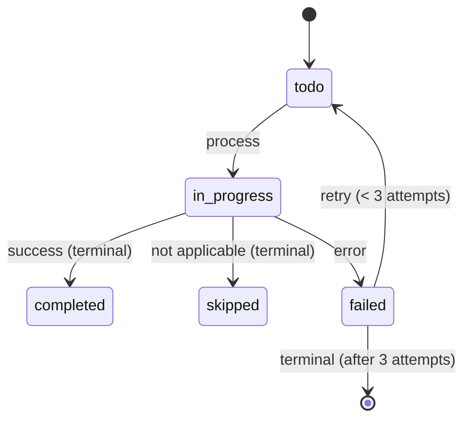
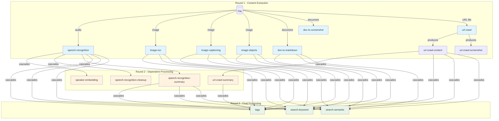

The digest system is a pipeline architecture that processes files through multiple stages of AI-powered enrichment (crawling, conversion, summarization, tagging, indexing, etc.).

## Overview

**Purpose**: Transform raw files into enriched, searchable content by running them through a series of digesters that extract, transform, and index information.

**Key Principles**:
- **Sequential Processing**: Digesters execute in registration order, allowing later digesters to depend on earlier ones
- **Incremental State**: Each digester produces one or more digest records with independent status tracking
- **Terminal States**: Once a digest reaches "completed" or "skipped" status, it stays terminal (no reprocessing)
- **Idempotent**: Safe to call `processFile()` multiple times - uses locking to prevent concurrent processing
- **Rebuildable**: All digest data can be deleted and regenerated from source files

## Data Models

### Digest Record

Stored in the `digests` table, each record represents one unit of processing output.

```typescript
interface Digest {
  id: string;              // UUID
  filePath: string;        // Relative path from DATA_ROOT (e.g., 'inbox/photo.jpg')
  digester: string;        // Digester name (e.g., 'doc-to-markdown', 'tags')
  status: DigestStatus;    // Current processing state
  content: string | null;  // Text content (markdown, JSON, etc.)
  sqlarName: string | null; // Path to binary artifacts in SQLAR (e.g., screenshots)
  error: string | null;    // Error message if failed
  attempts: number;        // Retry count (max 3)
  createdAt: string;       // ISO timestamp
  updatedAt: string;       // ISO timestamp
}

type DigestStatus =
  | 'todo'        // Not yet processed
  | 'in-progress' // Currently processing
  | 'completed'   // Successfully finished (terminal)
  | 'skipped'     // Not applicable or no output (terminal)
  | 'failed';     // Error occurred (terminal after 3 attempts)
```

**Key Fields**:
- `filePath`: Links digest to source file (no synthetic item IDs)
- `digester`: Identifies which digester produced this output
- `content`: Stores text output (markdown, JSON payloads, metadata)
- `sqlarName`: References binary artifacts stored in SQLAR table (compressed screenshots, HTML, etc.)
- `status`: Tracks processing state with clear terminal conditions

### State Transitions



**Terminal States**:
- `completed`: Digester successfully produced output
- `skipped`: Digester will never apply to this file (e.g., url-crawl on a PDF, doc-to-markdown on a text file)
- `failed` (after 3 attempts): Digester failed and max retries reached

**Non-Terminal States**:
- `todo`: Waiting to be processed
- `in-progress`: Currently executing
- `failed` (< 3 attempts): Will retry on next processing cycle (includes dependency failures)

### Binary Artifacts (SQLAR)

Large or binary outputs (screenshots, processed HTML, etc.) are stored in the `sqlar` table using SQLite's archive format:

```
Path format: {path_hash}/{digester_name}/{filename}
Example: a1b2c3d4e5f6/screenshot/page.png

- Automatically compressed with zlib
- Referenced by digest.sqlarName field
- Cleaned up when file is deleted or reset
```

## Digester Architecture

### Core Design Principle: Deterministic Digest Sets

**Users should see a deterministic set of digests for each file based on file type alone.**

When a user sees a file, they should know exactly which digests to expect:
- Image file → `image-ocr`, `image-captioning`, `image-objects`, `tags`, `search-keyword`, `search-semantic`
- Audio file → `speech-recognition`, `speaker-embedding`, `tags`, `search-keyword`, `search-semantic`
- URL file → `url-crawl-content`, `url-crawl-screenshot`, `url-crawl-summary`, `tags`, `search-keyword`, `search-semantic`

This means:
1. **`skipped` status** = "This digester doesn't apply to this file type" (deterministic)
2. **`failed` status** = "This digester applies but couldn't complete" (transient)
3. **`completed` status** = "This digester ran successfully" (may have null content)

### Digester Interface

Each digester implements this interface:

```typescript
interface Digester {
  readonly name: string;
  readonly label: string;  // Human-readable label for UI display
  readonly description: string;

  // Check if this digester applies to the file TYPE
  // MUST be deterministic based on file type only (MIME, extension, content structure)
  // MUST NOT check processing status of other digesters
  canDigest(
    filePath: string,
    file: FileRecordRow,
    db: Database
  ): Promise<boolean>;

  // Execute processing and return outputs
  // MUST return all declared outputs (from getOutputDigesters)
  // MUST throw errors for failures (dependencies not ready, service errors)
  // MAY return completed with null content if nothing to extract
  digest(
    filePath: string,
    file: FileRecordRow,
    existingDigests: Digest[],
    db: Database
  ): Promise<DigestInput[]>;

  // Optional: Specify multiple output digest names
  getOutputDigesters?(): string[];
}
```

**Key Rules**:

1. **`canDigest()` - File Type Check Only**
   - Check MIME type, file extension, or file content structure (e.g., "is this a URL?")
   - **NEVER** check `existingDigests` or processing status of other digesters
   - Returns `false` → digester marked `skipped` (terminal, deterministic)

2. **`digest()` - Must Produce All Outputs or Throw**
   - If dependencies not ready → **throw error** (will retry)
   - If external service fails → **throw error** (will retry)
   - If no content to extract → return `completed` with null content
   - **MUST** return all outputs declared in `getOutputDigesters()`

3. **Multiple Outputs**: A digester can produce multiple digest records (e.g., UrlCrawlerDigester produces `url-crawl-content`, `url-crawl-screenshot`)

4. **Dependency Access**: Later digesters can read outputs from earlier digesters via `existingDigests` parameter in `digest()`

### Registered Digesters (Execution Order)

Digesters execute in registration order. Order matters for dependencies:

1. **UrlCrawlerDigester** (no dependencies)
   - Label: "URL Crawler"
   - Outputs: `url-crawl-content`, `url-crawl-html`, `screenshot`, `url-metadata`
   - Extracts URL from file, crawls webpage, captures screenshot

2. **DocToMarkdownDigester** (no dependencies)
   - Label: "Doc to Markdown"
   - Outputs: `doc-to-markdown`
   - Converts PDF/Word/PowerPoint/Excel/EPUB to markdown using HAID service

3. **SpeechRecognitionDigester** (no dependencies)
   - Label: "Speech Recognition"
   - Outputs: `speech-recognition`
   - Transcribes audio/video files to text

4. **SpeakerEmbeddingDigester** (depends on speech-recognition)
   - Label: "Speaker ID"
   - Outputs: `speaker-embedding`
   - Extracts speaker embeddings for speaker identification

5. **SpeechRecognitionCleanupDigester** (depends on speech-recognition)
   - Label: "Speech Recognition Cleanup"
   - Outputs: `speech-recognition-cleanup`
   - Uses LLM to polish and fix speech recognition results

6. **SpeechRecognitionSummaryDigester** (depends on speech-recognition)
   - Label: "Speech Recognition Summary"
   - Outputs: `speech-recognition-summary`
   - Generates markdown summary of speech transcripts

7. **ImageOcrDigester** (no dependencies)
   - Label: "Image OCR"
   - Outputs: `image-ocr`
   - Extracts text from images using OCR

8. **ImageCaptioningDigester** (no dependencies)
   - Label: "Image Captioning"
   - Outputs: `image-captioning`
   - Generates captions for images

9. **ImageObjectsDigester** (no dependencies)
   - Label: "Image Objects"
   - Outputs: `image-objects`
   - Detects objects in images with descriptions, categories, tags, and bounding boxes
   - Uses vision model (google/gemini-2.5-flash-preview)
   - Returns JSON with object name, description (including visible text), category, tags, and normalized bounding box coordinates

10. **UrlCrawlSummaryDigester** (depends on url-crawl-content)
    - Label: "Summary"
    - Outputs: `url-crawl-summary`
    - Generates AI summary of crawled content

11. **TagsDigester** (depends on text content)
    - Label: "Tags"
    - Outputs: `tags`
    - Generates semantic tags for file content

12. **SearchKeywordDigester** (depends on text content)
    - Label: "Keyword Search"
    - Outputs: `search-keyword`
    - Indexes content in Meilisearch for full-text search

13. **SearchSemanticDigester** (depends on text content)
    - Label: "Semantic Search"
    - Outputs: `search-semantic`
    - Generates embeddings and indexes in Qdrant for vector search

**Dependency Pattern**: Later digesters can safely read outputs from earlier digesters because `processFile()` loads fresh digest state at the start of each iteration.

## Processing Workflows

### Automatic Processing (Background)

The `DigestSupervisor` runs continuously in the background:

**Trigger 1: Continuous Loop**
```
1. Every 1 second, find files needing digestion
2. Process one file through all digesters
3. If file has failures, apply exponential backoff
4. Repeat
```

**Trigger 2: File System Watcher**
```
1. Listen to file change events from FileSystemWatcher
2. When file added/modified, immediately process
3. Prevents waiting for next loop tick
```

**Stale Digest Cleanup**:
- Every 60 seconds, reset digests stuck in "in-progress" for > 10 minutes
- Handles crashes or long-running processes
- Resets status to "todo" for retry

### Manual Processing (API)

Users can manually trigger digest processing:

**Endpoint**: `POST /api/digest/{...path}`

```typescript
// Example: POST /api/digest/inbox/my-file.docx

1. Validate file exists
2. Call processFileDigests(filePath, { reset: true })
3. Reset clears existing digests (preserves attempt counts)
4. Process all digesters synchronously
5. Return success/error response
```

**Reset Behavior**:
- Sets all digest statuses to "todo"
- Clears content and sqlarName fields
- Resets attempt counts to 0 (allows full retry cycle)
- Deletes SQLAR artifacts for the file

### Processing Algorithm

The `DigestCoordinator.processFile()` method orchestrates the pipeline:

```typescript
async processFile(filePath: string, options?: { reset?: boolean }) {
  // 1. Acquire database-level lock (prevent concurrent processing across processes)
  if (!tryAcquireLock(filePath, 'DigestCoordinator')) {
    log.debug('file already being processed, skipping');
    return;
  }

  try {
    // 2. Load file metadata
    const file = getFileByPath(filePath);

    // 3. Optional: Reset existing digests
    if (options?.reset) {
      resetDigests(filePath);
    }

    // 4. Get all registered digesters (in order)
    const digesters = registry.getAll();

    // 5. Process each digester sequentially
    for (const digester of digesters) {
      // 5a. Load FRESH digest state (critical for dependencies)
      const existingDigests = listDigestsForPath(filePath);

      // 5b. Get all output names for this digester
      const outputNames = digester.getOutputDigesters?.() ?? [digester.name];

      // 5c. Skip if any output is in-progress
      const inProgress = outputNames.some(name =>
        existingDigests.find(d => d.digester === name && d.status === 'in-progress')
      );
      if (inProgress) continue;

      // 5d. Find pending outputs (todo or failed with attempts < 3)
      const pendingOutputs = outputNames.filter(name => {
        const digest = existingDigests.find(d => d.digester === name);
        if (!digest) return true; // Never created
        if (digest.status === 'todo') return true;
        if (digest.status === 'failed' && digest.attempts < 3) return true;
        return false; // Terminal state
      });

      if (pendingOutputs.length === 0) continue; // All terminal

      // 5e. Check if digester applies
      const can = await digester.canDigest(filePath, file, existingDigests, db);
      if (!can) {
        markDigests(filePath, pendingOutputs, 'skipped', 'Not applicable');
        continue;
      }

      // 5f. Mark as in-progress and increment attempts
      markDigests(filePath, pendingOutputs, 'in-progress', null, { incrementAttempts: true });

      // 5g. Execute digester
      const outputs = await digester.digest(filePath, file, existingDigests, db);

      // 5h. Save outputs to database
      for (const output of outputs) {
        await saveDigestOutput(filePath, output);
      }

      // 5i. Mark missing outputs as skipped
      const producedNames = new Set(outputs.map(o => o.digester));
      const missing = pendingOutputs.filter(name => !producedNames.has(name));
      if (missing.length > 0) {
        markDigests(filePath, missing, 'skipped', 'Output not produced');
      }
    }
  } catch (error) {
    log.error('digester failed', error);
    markDigests(filePath, pendingOutputs, 'failed', error.message);
  } finally {
    // 6. Release database lock
    releaseLock(filePath);
  }
}
```

**Key Mechanisms**:

1. **Database-Level Locking**: Prevents concurrent `processFile()` calls for same file across processes
   - Uses `processing_locks` table in SQLite for cross-process coordination
   - Multiple systems (API, supervisor, watcher) can safely trigger processing
   - First caller acquires lock, subsequent callers skip silently
   - Lock released in `finally` block (handles errors)
   - Stale locks (>10 min) are automatically cleaned up on supervisor startup

2. **File Selection Exclusion**: Files with any `in-progress` digest are excluded from `findFilesNeedingDigestion`
   - Prevents supervisor from re-picking a file that's currently being processed
   - Query includes: `AND d.file_path NOT IN (SELECT file_path FROM digests WHERE status = 'in-progress')`

3. **Fresh State Loading**: `listDigestsForPath()` called at start of each digester iteration
   - Later digesters see outputs from earlier digesters
   - Enables dependency chains (e.g., search depends on doc-to-markdown)

4. **Terminal State Respect**: Once a digest reaches "completed" or "skipped", it stays terminal
   - Prevents redundant reprocessing
   - Reset option (`{ reset: true }`) explicitly clears terminal states

5. **Max Attempts Protection**: Failed digests retry up to 3 times
   - `attempts` field incremented on each failure
   - After 3 attempts, digest stays in "failed" state (terminal)
   - Manual reset (via API) clears attempt counts, allowing fresh retry cycle

6. **Partial Progress**: Each digest saved immediately after completion
   - Survives crashes or interruptions
   - Next run resumes from where it left off

## File Type to Digester Mapping

Each file type has a deterministic set of digesters that apply to it. This is based on MIME type and file extension, not runtime content detection.

### Primary Text Sources by File Type

| File Type | Primary Text Source Digester | Fallback Text Source |
|-----------|------------------------------|----------------------|
| URL (`.md` with URL content) | `url-crawl-content` | - |
| Document (PDF, DOCX, XLSX, PPTX, EPUB) | `doc-to-markdown` | - |
| Image (PNG, JPG, GIF, WEBP, etc.) | `image-ocr` | `image-captioning` |
| Audio/Video (MP3, WAV, MP4, etc.) | `speech-recognition` | - |
| Text file (`.md`, `.txt`, `.json`, etc.) | Local file content | - |

### Digester Applicability by File Type

| Digester | URL | Document | Image | Audio/Video | Text |
|----------|-----|----------|-------|-------------|------|
| url-crawl | yes | - | - | - | - |
| doc-to-markdown | - | yes | - | - | - |
| doc-to-screenshot | - | yes | - | - | - |
| speech-recognition | - | - | - | yes | - |
| speaker-embedding | - | - | - | yes | - |
| image-ocr | - | - | yes | - | - |
| image-captioning | - | - | yes | - | - |
| image-objects | - | - | yes | - | - |
| url-crawl-summary | yes | - | - | - | - |
| tags | yes | yes | yes | yes | yes |
| search-keyword | yes | yes | yes | yes | yes |
| search-semantic | yes | yes | yes | yes | yes |

## Cascading Resets

When a content-producing digester completes with new content, it triggers automatic resets of dependent digesters. This ensures downstream digesters re-process with the updated content.

### Dependency Flowchart



**Execution Order Summary:**

| Round | Digesters | Description |
|-------|-----------|-------------|
| **1** | `speech-recognition`, `image-ocr`, `image-captioning`, `image-objects`, `doc-to-markdown`, `doc-to-screenshot`, `url-crawl` | Content extraction from source files |
| **2** | `speaker-embedding`, `speech-recognition-cleanup`, `speech-recognition-summary`, `url-crawl-summary` | Depends on Round 1 outputs |
| **3** | `tags`, `search-keyword`, `search-semantic` | Final processing, cascaded from any content producer |

### Reset Triggers

Each digester declares which downstream digesters should be reset when it completes:

```typescript
// Hardcoded reset mappings
const CASCADING_RESETS: Record<string, string[]> = {
  'url-crawl-content': ['url-crawl-summary', 'tags', 'search-keyword', 'search-semantic'],
  'doc-to-markdown': ['tags', 'search-keyword', 'search-semantic'],
  'image-ocr': ['tags', 'search-keyword', 'search-semantic'],
  'image-captioning': ['tags', 'search-keyword', 'search-semantic'],
  'image-objects': ['tags', 'search-keyword', 'search-semantic'],
  'speech-recognition': ['speaker-embedding', 'speech-recognition-cleanup', 'speech-recognition-summary', 'tags', 'search-keyword', 'search-semantic'],
  'url-crawl-summary': ['tags'],  // Summary can improve tags
  'speech-recognition-summary': ['tags', 'search-keyword', 'search-semantic'],
};
```

### Reset Behavior

When a digester completes:
1. Coordinator checks if digester has cascading resets defined
2. For each downstream digester in the reset list:
   - If status is `completed` or `skipped`, reset to `todo`
   - If status is `failed`, reset to `todo` (clears attempts)
   - If status is `todo` or `in-progress`, leave unchanged
3. Downstream digesters will run on next processing cycle

**Example Flow (Image with OCR)**:
1. `image-ocr` runs, finds text "Meeting Notes 2024"
2. Coordinator sees `image-ocr` completed with content
3. Resets `tags`, `search-keyword`, `search-semantic` to `todo`
4. `tags` runs, generates tags from OCR text
5. `search-keyword` runs, indexes OCR text

**Example Flow (Image without OCR text)**:
1. `image-ocr` runs, finds no text (content is empty/null)
2. `image-captioning` runs, generates "A photo of a sunset over the ocean"
3. Coordinator sees `image-captioning` completed with content
4. Resets `tags`, `search-keyword`, `search-semantic` to `todo`
5. `tags` runs, generates tags from caption
6. `search-keyword` runs, indexes caption

## Dependent Digester Behavior

Digesters that depend on text content (tags, search) follow these rules:

### Always Complete (Never Skip for "No Content")

Dependent digesters should always reach a terminal state:
- **Has text content**: Process and mark `completed` with content
- **No text content available**: Mark `completed` with empty/null content (not `skipped`)
- **External service error**: Mark `failed` (will retry)

This ensures:
1. UI shows clear status (not perpetually "todo")
2. Cascading resets work correctly (completed state can be reset)
3. No confusion between "not applicable" vs "no content found"

### `skipped` vs `completed` with No Content

- **`skipped`**: File type is fundamentally incompatible (e.g., `url-crawl` on a PDF)
- **`completed` with null content**: File type is compatible but no content was produced

```typescript
// Example: SearchKeywordDigester for an image
async digest(filePath, file, existingDigests, db) {
  const text = getTextContent(file, existingDigests);

  if (!text) {
    // No text available - complete with no content (don't skip)
    return [{
      digester: 'search-keyword',
      status: 'completed',
      content: null,  // Explicitly null
      error: null,
    }];
  }

  // Has text - index it
  await indexToMeilisearch(filePath, text);
  return [{
    digester: 'search-keyword',
    status: 'completed',
    content: JSON.stringify({ indexed: true, wordCount: text.split(' ').length }),
  }];
}
```

### Getting Text Content

Each dependent digester knows which text sources to check based on file type:

```typescript
function getTextContent(file: FileRecordRow, digests: Digest[]): string | null {
  // Check digest-based sources first (in priority order)
  const urlContent = getDigestContent(digests, 'url-crawl-content');
  if (urlContent) return parseUrlContentMarkdown(urlContent);

  const docContent = getDigestContent(digests, 'doc-to-markdown');
  if (docContent) return docContent;

  const ocrContent = getDigestContent(digests, 'image-ocr');
  if (ocrContent) return ocrContent;

  const captionContent = getDigestContent(digests, 'image-captioning');
  if (captionContent) return captionContent;

  const transcriptContent = getDigestContent(digests, 'speech-recognition');
  if (transcriptContent) return parseTranscriptText(transcriptContent);

  // Fall back to local file for text files
  if (isTextFile(file)) {
    return readLocalFile(file.path);
  }

  return null;
}
```

## Common Patterns

### Multiple Outputs

**Pattern**: Single digester produces multiple related outputs

```typescript
class UrlCrawlerDigester implements Digester {
  name = 'url-crawler';

  getOutputDigesters() {
    return ['url-crawl-content', 'url-crawl-html', 'screenshot', 'url-metadata'];
  }

  async digest(filePath, file, existingDigests, db) {
    // Single crawl operation
    const result = await crawlUrl(url);

    // Return multiple digest records
    return [
      { digester: 'url-crawl-content', content: result.markdown, ... },
      { digester: 'url-crawl-html', content: result.html, ... },
      { digester: 'screenshot', sqlarName: 'hash/screenshot/page.png', ... },
      { digester: 'url-metadata', content: JSON.stringify(metadata), ... },
    ];
  }
}
```

Coordinator tracks each output independently with its own status.

## Troubleshooting

### Issue: Search digesters not running for documents

**Symptom**: doc-to-markdown completes, but search-keyword/search-semantic show "skipped" or "failed"

**Previous Cause (Fixed)**: Digesters were marked as "skipped" when dependencies weren't ready, making them permanently terminal even when dependencies later succeeded.

**Solution Implemented**: Digesters now throw errors instead of returning null when dependencies are missing:
- When doc-to-markdown fails or hasn't completed yet, dependent digesters throw errors
- This marks them as 'failed' (retryable) instead of 'skipped' (terminal)
- When doc-to-markdown succeeds on retry, dependent digesters automatically retry and succeed
- Both digesters follow the same retry logic (max 3 attempts)

**Additional Protection**: File-level locking in coordinator prevents concurrent processing
- Multiple calls to `processFile()` for the same file are rejected with warning log
- Ensures digesters see consistent state within a single processing run

### Issue: Digests stuck in "in-progress"

**Symptom**: Files not processing, digests show "in-progress" for long time

**Cause**: Process crashed or digester hung without finishing

**Fix**: Stale digest cleanup runs every 60 seconds
- Resets digests in "in-progress" for > 10 minutes
- Changes status back to "todo" for retry

### Issue: Digester failing repeatedly

**Symptom**: Digest shows "failed" status with error message

**Solution**:
1. Check error message in digest.error field
2. If attempts < 3, will auto-retry on next cycle
3. If attempts = 3, digest is terminal - must manually reset
4. Use `POST /api/digest/{path}` with reset=true to retry

## Best Practices

1. **Order Matters**: Register digesters in dependency order
   - Content-producing digesters first (url-crawl, doc-to-markdown, image-ocr, etc.)
   - Content-consuming digesters later (tags, search)

2. **Check Fresh State**: Always use `existingDigests` parameter passed to your digester
   - Contains latest digest records including earlier digesters in same run
   - Never cache or reuse digest state across calls

3. **`canDigest()` Must Be Deterministic by File Type**
   - Check MIME type, file extension, or content structure only
   - **NEVER** check `existingDigests` or upstream digester status
   - Example: `speaker-embedding` returns true for all audio/video files
   - Example: `url-crawl` returns true for text files containing URLs

4. **`skipped` vs `failed` vs `completed`**
   - **`skipped`**: File type doesn't match (only from `canDigest() → false`)
   - **`failed`**: Digester applies but couldn't complete (dependency not ready, service error)
   - **`completed`**: Digester ran successfully (content may be null if nothing to extract)

   The key insight: users expect a **deterministic set of digests** for each file type.
   If a file is audio, user expects `speaker-embedding` to exist - either completed or failed, never skipped.

5. **Let Errors Propagate**: For any failures in `digest()`
   - **ALWAYS** throw errors - never return `DigestInput` with `status: 'failed'`
   - Coordinator catches errors, increments attempts, and marks as failed
   - After 3 attempts, digest stays failed (terminal)

   ```typescript
   // CORRECT: Throw errors for any failures
   async digest(...): Promise<DigestInput[]> {
     // Dependency not ready - throw (will retry when ready)
     const speechDigest = existingDigests.find(d => d.digester === 'speech-recognition');
     if (!speechDigest || speechDigest.status !== 'completed') {
       throw new Error('Speech recognition not ready');
     }

     // External service - let errors propagate
     const result = await externalService.process(file);
     return [{ digester: 'my-digester', status: 'completed', content: result }];
   }

   // CORRECT: Complete with no content when nothing to extract
   async digest(...): Promise<DigestInput[]> {
     const text = getTextContent(file, existingDigests);
     if (!text) {
       return [{ digester: 'search-keyword', status: 'completed', content: null }];
     }
     // ... index text
   }

   // WRONG: Returning failed status directly
   async digest(...): Promise<DigestInput[]> {
     try {
       const result = await externalService.process(file);
       return [{ status: 'completed', ... }];
     } catch (error) {
       return [{ status: 'failed', error: error.message }]; // DON'T DO THIS
     }
   }
   ```

6. **Multi-Output Digesters Must Return All Outputs**
   - If `getOutputDigesters()` returns `['a', 'b']`, `digest()` must return both
   - Each output can be `completed` (with or without content)
   - If any output can't be produced, throw error (don't skip individual outputs)

7. **Cascading Resets are Automatic**: Don't manually reset downstream digesters
   - Define reset mappings in `CASCADING_RESETS` constant
   - Coordinator handles resets after each digester completes with content
   - Downstream digesters will re-run on next processing cycle
