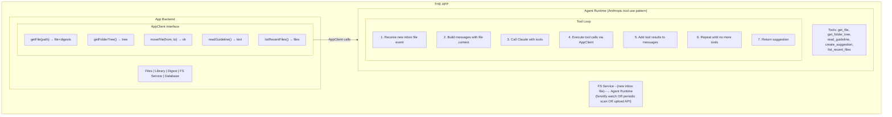
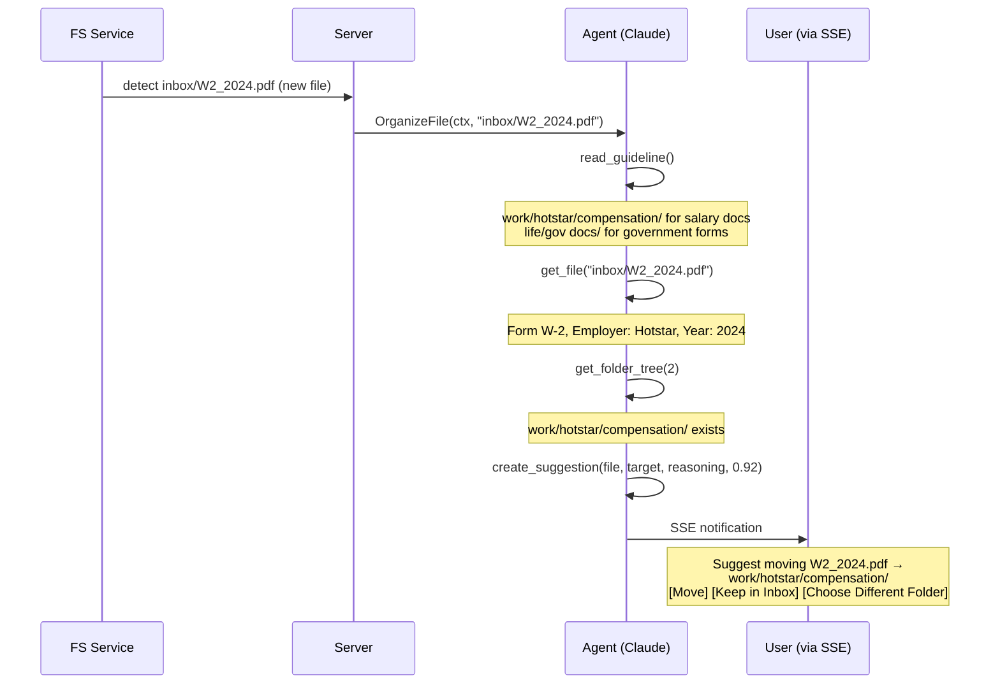

This document describes the agent architecture for the MyLifeDB inbox, leveraging **Claude's native tool use** pattern.

---

## Core Principle

**Reuse the agent pattern that already works** (like Claude API's tool use), rather than inventing a new skill system.

The agent is:
- A **separate logical entity** that lives alongside the app
- Uses the app's capabilities through a clean **AppClient** interface
- Communicates via **Anthropic's tool use protocol** (or OpenAI's function calling)
- **Event-driven** -- triggered automatically when new files arrive in inbox
- Independent enough to be extracted to a service later

### Two Search Layers

The system has two distinct search capabilities:

| Layer | What it is | How it works |
|-------|-----------|--------------|
| **App search** | Keyword + semantic search | Meilisearch + Qdrant, already built, used by `/api/search` |
| **Agent search** | Intelligent file understanding | Claude reasons over file content, folder structure, and guidelines using tools -- this is the new capability |

The agent does NOT wrap the existing app search. The agent IS the new search -- it uses Claude's reasoning over `get_file`, `get_folder_tree`, and `read_guideline` tools to understand files and decide where they belong.

---

## Architecture



---

## The AppClient Interface

This is the **contract** between the agent and the app. The agent only accesses the app through this.

```go
// backend/agent/appclient/client.go

// AppClient defines how the agent interacts with MyLifeDB
// This interface could be implemented via direct calls (LocalClient)
// or via HTTP (RemoteClient) for service deployment
type AppClient interface {
    // ------------------------------------------------------------------
    // FILE RETRIEVAL
    // ------------------------------------------------------------------

    // Get file metadata and digests
    GetFile(ctx context.Context, path string) (*FileWithDigests, error)

    // List recently added files
    ListRecentFiles(ctx context.Context, limit int, mimeTypePrefix string) ([]FileSummary, error)

    // ------------------------------------------------------------------
    // ORGANIZATION
    // ------------------------------------------------------------------

    // Get folder tree structure
    GetFolderTree(ctx context.Context, depth int) (*FolderNode, error)

    // Read user's organization guideline
    ReadGuideline(ctx context.Context) (string, error)

    // Move a file (updates DB + search indices)
    MoveFile(ctx context.Context, from, to string) error

    // ------------------------------------------------------------------
    // SUGGESTIONS (Agent-specific state)
    // ------------------------------------------------------------------

    // Create a pending organization suggestion
    CreateSuggestion(ctx context.Context, s *Suggestion) (string, error)

    // Get pending suggestion for a file
    GetPendingSuggestion(ctx context.Context, filePath string) (*Suggestion, error)

    // Execute/reject a suggestion
    ResolveSuggestion(ctx context.Context, suggestionID, action string) error
}

// FileWithDigests includes file + all digest content
type FileWithDigests struct {
    Path      string
    Name      string
    MimeType  string
    Size      int64
    CreatedAt time.Time
    Digests   map[string]DigestContent // key = digester name
}

// Suggestion is a pending organization action
type Suggestion struct {
    ID           string
    FilePath     string
    TargetFolder string
    Reasoning    string
    Confidence   float64
    Status       string // pending, accepted, rejected, expired
    CreatedAt    time.Time
}
```

---

## Implementation: LocalAppClient

For same-process deployment, directly call app services:

```go
// backend/agent/appclient/local.go

type LocalAppClient struct {
    db *db.DB
    fs *fs.Service
}

func NewLocalClient(db *db.DB, fs *fs.Service) *LocalAppClient {
    return &LocalAppClient{db: db, fs: fs}
}

func (c *LocalAppClient) GetFile(ctx context.Context, path string) (*FileWithDigests, error) {
    file, err := c.db.GetFile(ctx, path)
    if err != nil {
        return nil, err
    }

    digests, err := c.db.GetDigests(ctx, path)
    if err != nil {
        return nil, err
    }

    return &FileWithDigests{
        Path:      file.Path,
        Name:      file.Name,
        MimeType:  file.MimeType,
        Size:      file.Size,
        CreatedAt: file.CreatedAt,
        Digests:   digestsToMap(digests),
    }, nil
}

func (c *LocalAppClient) GetFolderTree(ctx context.Context, depth int) (*FolderNode, error) {
    return c.fs.GetFolderTree(depth)
}

func (c *LocalAppClient) ReadGuideline(ctx context.Context) (string, error) {
    content, err := c.fs.ReadFile("guideline.md")
    if err != nil {
        return "No guideline.md found", nil
    }
    return string(content), nil
}

func (c *LocalAppClient) MoveFile(ctx context.Context, from, to string) error {
    return c.fs.MoveFile(from, to)
}

// Suggestions stored in DB
func (c *LocalAppClient) CreateSuggestion(ctx context.Context, s *Suggestion) (string, error) {
    return c.db.CreateSuggestion(ctx, s)
}

func (c *LocalAppClient) GetPendingSuggestion(ctx context.Context, filePath string) (*Suggestion, error) {
    return c.db.GetPendingSuggestion(ctx, filePath)
}

func (c *LocalAppClient) ResolveSuggestion(ctx context.Context, id, action string) error {
    return c.db.ResolveSuggestion(ctx, id, action)
}
```

---

## The Agent

The agent processes a single inbox file per invocation. No conversation history -- each file is an independent task.

```go
// backend/agent/agent.go

type Agent struct {
    app   AppClient
    llm   LLMClient  // Anthropic or OpenAI client
    model string
}

func NewAgent(app AppClient, llm LLMClient, model string) *Agent {
    return &Agent{
        app:   app,
        llm:   llm,
        model: model,
    }
}

// OrganizeFile is called when a new file appears in inbox.
// The agent uses Claude + tools to understand the file and suggest organization.
func (a *Agent) OrganizeFile(ctx context.Context, filePath string) (*Suggestion, error) {
    tools := a.buildTools()
    systemPrompt := a.buildSystemPrompt(ctx)

    // Initial message tells Claude about the new file
    messages := []Message{
        {Role: "user", Content: fmt.Sprintf(
            "A new file has arrived in inbox: %s. "+
            "Analyze it and suggest where it should be organized.", filePath)},
    }

    // Tool loop - Claude decides what to do
    for turn := 0; turn < 10; turn++ {
        completion, err := a.llm.Complete(ctx, CompletionRequest{
            Model:     a.model,
            System:    systemPrompt,
            Messages:  messages,
            Tools:     tools,
            MaxTokens: 4096,
        })
        if err != nil {
            return nil, err
        }

        // No tools = agent is done reasoning
        if len(completion.ToolUse) == 0 {
            // Check if a suggestion was created during tool calls
            suggestion, _ := a.app.GetPendingSuggestion(ctx, filePath)
            return suggestion, nil // may be nil if agent couldn't decide
        }

        // Add assistant message with tool use
        messages = append(messages, Message{
            Role:    "assistant",
            Content: completion.Content,
            ToolUse: completion.ToolUse,
        })

        // Execute each tool call via AppClient
        for _, tool := range completion.ToolUse {
            result, err := a.executeTool(ctx, tool)

            messages = append(messages, Message{
                Role:         "user",
                ToolResultID: tool.ID,
                Content:      formatToolResult(result, err),
            })
        }
    }

    return nil, fmt.Errorf("agent exceeded max turns for %s", filePath)
}
```

---

## Tool Definitions

Tools map directly to AppClient methods:

```go
func (a *Agent) buildTools() []ToolDefinition {
    return []ToolDefinition{
        {
            Name:        "get_file",
            Description: "Get detailed information about a file including extracted content from digests (OCR, transcription, etc.)",
            InputSchema: map[string]any{
                "type": "object",
                "properties": map[string]any{
                    "path": map[string]any{
                        "type":        "string",
                        "description": "File path",
                    },
                },
                "required": []string{"path"},
            },
        },
        {
            Name:        "get_folder_tree",
            Description: "Get the library folder structure to see available organization destinations",
            InputSchema: map[string]any{
                "type": "object",
                "properties": map[string]any{
                    "depth": map[string]any{
                        "type":        "integer",
                        "description": "How deep to traverse (default 2)",
                    },
                },
            },
        },
        {
            Name:        "read_guideline",
            Description: "Read the user's guideline.md file to understand their organization patterns and folder structure",
            InputSchema: map[string]any{
                "type":       "object",
                "properties": map[string]any{},
            },
        },
        {
            Name:        "create_suggestion",
            Description: "Create a pending suggestion to move a file to a folder. This requires user confirmation before executing.",
            InputSchema: map[string]any{
                "type": "object",
                "properties": map[string]any{
                    "file_path": map[string]any{
                        "type":        "string",
                        "description": "File to move",
                    },
                    "target_folder": map[string]any{
                        "type":        "string",
                        "description": "Destination folder",
                    },
                    "reasoning": map[string]any{
                        "type":        "string",
                        "description": "Brief explanation of why this is the right folder (1-2 sentences)",
                    },
                    "confidence": map[string]any{
                        "type":        "number",
                        "description": "Confidence score 0.0-1.0",
                    },
                },
                "required": []string{"file_path", "target_folder", "reasoning", "confidence"},
            },
        },
        {
            Name:        "list_recent_files",
            Description: "List recently added files for context",
            InputSchema: map[string]any{
                "type": "object",
                "properties": map[string]any{
                    "limit": map[string]any{
                        "type":        "integer",
                        "description": "Number of files (default 10)",
                    },
                    "type": map[string]any{
                        "type":        "string",
                        "description": "Filter by mime type prefix",
                    },
                },
            },
        },
    }
}
```

---

## Tool Execution

Map tool calls to AppClient methods:

```go
func (a *Agent) executeTool(ctx context.Context, tool ToolUse) (any, error) {
    switch tool.Name {
    case "get_file":
        var params struct {
            Path string `json:"path"`
        }
        json.Unmarshal(tool.Input, &params)
        return a.app.GetFile(ctx, params.Path)

    case "get_folder_tree":
        var params struct {
            Depth int `json:"depth"`
        }
        json.Unmarshal(tool.Input, &params)
        if params.Depth == 0 {
            params.Depth = 2
        }
        return a.app.GetFolderTree(ctx, params.Depth)

    case "read_guideline":
        return a.app.ReadGuideline(ctx)

    case "create_suggestion":
        var params struct {
            FilePath     string  `json:"file_path"`
            TargetFolder string  `json:"target_folder"`
            Reasoning    string  `json:"reasoning"`
            Confidence   float64 `json:"confidence"`
        }
        json.Unmarshal(tool.Input, &params)

        return a.app.CreateSuggestion(ctx, &Suggestion{
            FilePath:     params.FilePath,
            TargetFolder: params.TargetFolder,
            Reasoning:    params.Reasoning,
            Confidence:   params.Confidence,
        })

    case "list_recent_files":
        var params struct {
            Limit int    `json:"limit"`
            Type  string `json:"type"`
        }
        json.Unmarshal(tool.Input, &params)
        if params.Limit == 0 {
            params.Limit = 10
        }
        return a.app.ListRecentFiles(ctx, params.Limit, params.Type)

    default:
        return nil, fmt.Errorf("unknown tool: %s", tool.Name)
    }
}
```

---

## System Prompt

The system prompt tells Claude its role and how to organize files:

```
You are an auto-organization agent for MyLifeDB, a personal knowledge management system.

## Your Task

A new file has arrived in the inbox. Your job is to:
1. Examine the file (content, metadata, name)
2. Read the user's organization guideline
3. Check the folder tree for available destinations
4. Suggest the best folder for this file

## User's Organization Patterns

{guideline_content}

## Available Tools

- get_file: Get file content and metadata (including digests like OCR, transcription)
- get_folder_tree: See the user's folder structure
- read_guideline: Read the user's organization guide
- list_recent_files: See recently added files for context
- create_suggestion: Suggest moving the file to a folder (requires user confirmation)

## How to Organize

1. **Always read guideline.md first** to understand the user's patterns
2. Check the folder tree to see available destinations
3. Examine the file content and metadata via get_file
4. Call create_suggestion with the best folder, clear reasoning, and confidence score

**Important**: Always call create_suggestion -- never move files directly. The user must confirm.

### Confidence levels:
- High (>0.9): Strong match to existing patterns (e.g., W-2 form -> work/company/compensation/)
- Medium (0.7-0.9): Good match but some uncertainty
- Low (<0.7): Still suggest, but note the uncertainty in reasoning

If you truly cannot determine where a file belongs, respond without calling create_suggestion.
```

```go
func (a *Agent) buildSystemPrompt(ctx context.Context) string {
    // Read user's guideline
    guideline, _ := a.app.ReadGuideline(ctx)

    return fmt.Sprintf(systemPromptTemplate, guideline)
}
```

---

## Example Flow

### New inbox file: W2_2024.pdf



---

## Database Schema

### Suggestions

```sql
CREATE TABLE organization_suggestions (
    id TEXT PRIMARY KEY,
    file_path TEXT NOT NULL,
    target_folder TEXT NOT NULL,
    reasoning TEXT NOT NULL,
    confidence REAL NOT NULL,
    status TEXT DEFAULT 'pending', -- pending, accepted, rejected, expired
    created_at TIMESTAMP DEFAULT CURRENT_TIMESTAMP,
    resolved_at TIMESTAMP
);
```

No conversations or messages tables needed -- the agent processes one file at a time with no persistent conversation state.

---

## API Endpoints

### List pending suggestions

```
GET /api/inbox/suggestions
  ?status=pending

Response:
{
  "suggestions": [
    {
      "id": "sug-789",
      "file_path": "inbox/W2_2024.pdf",
      "target_folder": "work/hotstar/compensation/",
      "reasoning": "W-2 is a tax form from your employer Hotstar...",
      "confidence": 0.92,
      "status": "pending",
      "created_at": "2025-02-05T10:00:05Z"
    }
  ]
}
```

### Resolve suggestion

```
POST /api/inbox/suggestions/:id/resolve
{
  "action": "accept" // or "reject"
}

Response:
{
  "success": true,
  "file_moved": true, // only for accept action
  "new_path": "work/hotstar/compensation/W2_2024.pdf"
}
```

Suggestions also arrive via SSE notifications in real-time.

---

## Trigger: FS Service New File Event

Hook into the FS service's new-file signal. This covers all sources: fsnotify watch, periodic scan, and upload API.

```go
// backend/server/server.go

func (s *Server) wireEventHandlers() {
    // ... existing handlers ...

    // Trigger agent when a new file appears in inbox
    s.fsService.OnNewFile(func(filePath string) {
        if strings.HasPrefix(filePath, "inbox/") {
            go s.organizeInboxFile(filePath)
        }
    })
}

func (s *Server) organizeInboxFile(filePath string) {
    ctx, cancel := context.WithTimeout(context.Background(), 60*time.Second)
    defer cancel()

    suggestion, err := s.agent.OrganizeFile(ctx, filePath)
    if err != nil {
        log.Error().Err(err).Str("file", filePath).Msg("agent organization failed")
        return
    }

    // If agent created a suggestion, notify user via SSE
    if suggestion != nil {
        s.notifService.NotifyOrganizationSuggestion(suggestion)
    }
}
```

The trigger fires immediately on file detection -- it does **not** wait for digest processing or any other pipeline step.

---

## Server Integration

Add agent to the Server struct:

```go
// backend/server/server.go

type Server struct {
    // ... existing fields ...

    agent     *agent.Agent
    appClient agent.AppClient
}

func New(cfg *Config) (*Server, error) {
    // ... existing initialization ...

    // Create AppClient interface
    s.appClient = agent.NewLocalClient(s.database, s.fsService)

    // Create LLM client
    llmClient := vendors.NewOpenAIClient(cfg.OpenAIConfig)

    // Create agent
    s.agent = agent.NewAgent(s.appClient, llmClient, cfg.AgentModel)

    // Wire event handlers (including inbox file trigger)
    s.wireEventHandlers()

    return s, nil
}

func (s *Server) Agent() *agent.Agent { return s.agent }
```

---

## Configuration

Add agent settings to config:

```go
// backend/config/config.go

type AgentConfig struct {
    Enabled   bool   `env:"AGENT_ENABLED" default:"true"`
    Model     string `env:"AGENT_MODEL" default:"claude-3-5-sonnet-20250219"`
    MaxTokens int    `env:"AGENT_MAX_TOKENS" default:"4096"`
    MaxTurns  int    `env:"AGENT_MAX_TURNS" default:"10"`

    // Auto-organization
    AutoOrganize bool    `env:"AGENT_AUTO_ORGANIZE" default:"true"`
    MinConfidence float64 `env:"AGENT_MIN_CONFIDENCE" default:"0.7"`
}
```

---

## Implementation Phases

### Phase 1: Foundation
- [ ] Database migration (organization_suggestions table)
- [ ] AppClient interface definition
- [ ] LocalAppClient implementation
- [ ] Agent struct with OrganizeFile + tool loop
- [ ] Tool definitions and execution

### Phase 2: FS Trigger + Wiring
- [ ] FS service `OnNewFile` event for inbox files
- [ ] Server wiring: FS event -> agent.OrganizeFile
- [ ] SSE notification for new suggestions

### Phase 3: API + Frontend
- [ ] API endpoints (list suggestions, resolve suggestion)
- [ ] Suggestion UI in inbox: accept/reject/choose different folder
- [ ] SSE integration for real-time suggestion display

### Phase 4: Polish
- [ ] Error handling and retries
- [ ] Timeout management for agent calls
- [ ] Testing and bug fixes

---

## Future Enhancements

### User-Initiated Chat
- Add `POST /api/inbox/agent/message` for interactive conversations
- Conversation history, multi-turn follow-ups
- User can ask agent to search, explain files, etc.

### Learning from Decisions
- Track accepted/rejected suggestions
- Adjust confidence scores based on patterns
- Suggest updates to guideline.md

### Bulk Operations
- "Organize all inbox files"
- "Find all untagged photos"
- Batch suggestion review

### Advanced Tools
- `tag_file` - Add tags to files
- `summarize_file` - Generate summaries
- `find_similar` - Find related files
- `extract_entities` - Find people, dates, locations

### RemoteAppClient
For service deployment:

```go
// backend/agent/appclient/remote.go

type RemoteAppClient struct {
    baseURL string
    client  *http.Client
}

func (c *RemoteAppClient) Search(ctx context.Context, req SearchRequest) (*SearchResult, error) {
    // HTTP call to app API
    return httpPost[SearchResult](c.client, c.baseURL+"/api/search", req)
}

// ... other methods via HTTP
```

---

## Design Philosophy

This architecture prioritizes **simplicity and single responsibility**:

1. **Event-driven, not chat-driven** -- Agent reacts to FS events, no user-initiated API needed initially
2. **One file, one invocation** -- No conversation state; each file is processed independently
3. **Native tool use** -- Leverages Claude's well-tested tool calling instead of custom abstractions
4. **Two distinct search layers** -- App search (keyword+semantic) and agent search (Claude reasoning) serve different purposes
5. **Clean separation** -- AppClient interface allows future extraction to separate service
6. **Easy to extend** -- Add user-initiated chat, new tools, or multi-agent patterns when needed

---

## Related Documents

- [components-reference.md](components-reference.md) - Detailed component definitions (system prompts, tools, execution flow)
- [architecture.md](../architecture.md) - Overall system architecture
- [components/digest-system.md](components/digest-system.md) - File processing pipeline
- [components/fs-service.md](components/fs-service.md) - Filesystem operations
- [components/claude-code.md](components/claude-code.md) - Reference for conversation UI patterns

---

*Created: 2025-02-05*
*Last updated: 2025-02-06*
