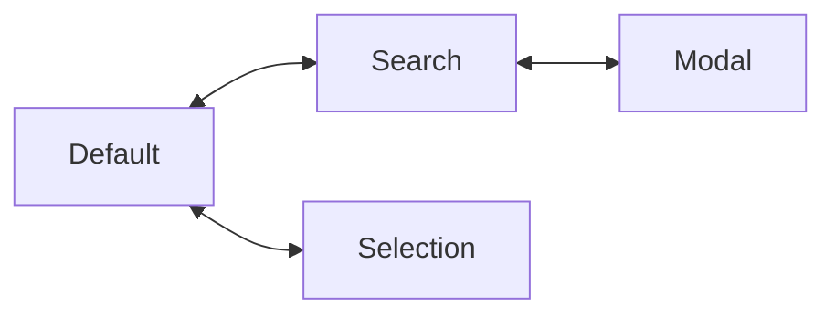
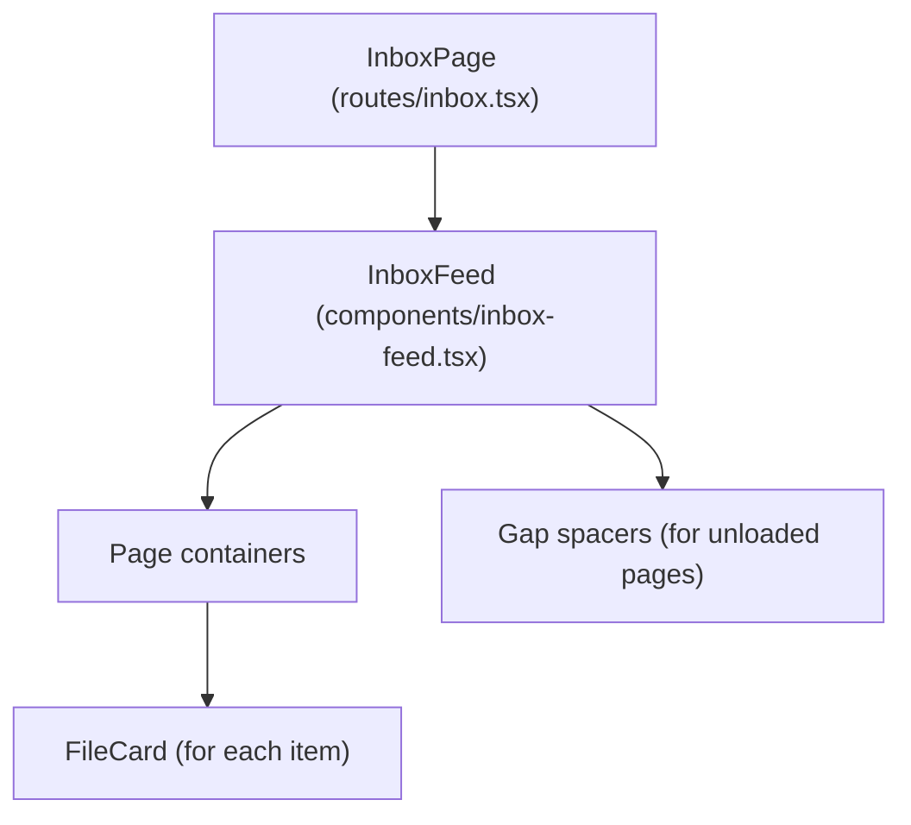
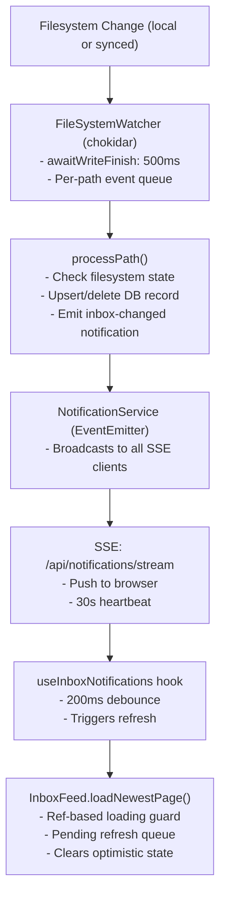

## Overview

The inbox uses a **chat-style UI** where newest items appear at the bottom and users scroll up to see older items.

## Interaction Modes

The inbox has four mutually exclusive interaction modes:

| Mode | Trigger | UI Changes | Exit |
|------|---------|------------|------|
| **Default** | Initial state | OmniInput visible, feed scrollable | - |
| **Search** | Type in OmniInput | SearchResults overlay replaces feed | Clear input or locate item |
| **Selection** | Long-press → "Select" | Checkboxes appear, MultiSelectActionBar replaces OmniInput | Cancel or deselect all |
| **Modal** | Click/tap file card | Full-screen modal with navigation | Close modal or click outside |

### Mode Priority

Modes are exclusive - only one can be active at a time:



- **Search** and **Default** toggle based on input/results
- **Selection** can be entered from Default (not from Search or Modal)
- **Modal** can be opened from Default, Search, or Selection mode
- Exiting Modal returns to previous mode

### Default Mode

The base state with full inbox functionality:

- OmniInput at bottom for text/file input and search
- InboxFeed shows files in chat-style layout
- PinnedTags bar above input
- Right-click/long-press opens context menu

### Search Mode

Active when search results exist:

- SearchResults component overlays (replaces) InboxFeed
- Feed remains mounted but invisible (`visibility: hidden`)
- "Locate in Feed" action clears search and scrolls to item
- Clearing input returns to Default mode

**State tracking:**
```typescript
const isSearching = searchState.isKeywordSearching || searchState.isSemanticSearching;
const showSearchResults = hasCurrentResults || isSearchingWithPreviousResults;
```

### Selection Mode

For batch operations on multiple files:

- Entered via context menu "Select" action
- Circle checkboxes appear on all file cards
- OmniInput slides out, MultiSelectActionBar slides in
- Available actions: Share, Delete, Cancel
- Deselecting last item exits selection mode

**State tracking:**
```typescript
// SelectionContext
interface SelectionState {
  selectedPaths: Set<string>;
  isSelectionMode: boolean;  // true when selectedPaths.size > 0
}
```

### Modal Mode

Full-screen file preview with navigation:

- Managed by `ModalNavigationProvider` context
- Single `NavigationModal` rendered at provider level
- Keyboard (←/→) and swipe navigation between files
- Digests panel toggle for AI-generated content
- Modal stays mounted while navigating (prevents flash)

**State tracking:**
```typescript
// ModalNavigationContext
interface ModalNavigationSnapshot {
  currentFile: FileWithDigests | null;
  isOpen: boolean;
  hasPrev: boolean;
  hasNext: boolean;
}
```

### Mode Transitions

| From | To | Trigger |
|------|----|---------|
| Default | Search | Type query with results |
| Search | Default | Clear input, locate item |
| Default | Selection | Context menu → Select |
| Selection | Default | Cancel, deselect all, delete all |
| Any | Modal | Click file card |
| Modal | Previous | Close modal |

## Data Model

### Cursor-Based Pagination

API endpoint: `/api/inbox`

| Parameter | Description |
|-----------|-------------|
| `limit` | Number of items per page (default: 30) |
| `before` | Cursor for loading older items |
| `after` | Cursor for loading newer items |
| `around` | Cursor to center on (for pin navigation) |

**Cursor format:** `{created_at}:{path}`
- Example: `1737885600000:inbox/photo.jpg`
- Composite key ensures stable, deterministic ordering

**Response structure:**
```typescript
interface InboxResponse {
  items: InboxItem[];
  cursors: {
    first: string | null;  // Cursor of first item (newest in batch)
    last: string | null;   // Cursor of last item (oldest in batch)
  };
  hasMore: {
    older: boolean;  // More items exist before this batch
    newer: boolean;  // More items exist after this batch
  };
}
```

### Why Cursor-Based?

- **Stable pagination**: New items don't shift existing pages
- **Cacheable**: Same cursor always returns same items
- **Sparse loading**: Can jump to any cursor without loading intermediates
- **Efficient**: Uses indexed `WHERE created_at < ?` queries

## Page Index Convention

```
Page 0  = newest items (bottom of UI, user starts here)
Page 1  = older items
Page 2  = even older items
...
Page N  = oldest loaded items (top of UI)
```

Pages are stored in a sparse `Map<pageIndex, PageData>`:
- Gaps are allowed (e.g., pages 0, 1, 50 loaded with 2-49 as gaps)
- Gaps render as height-estimated spacers
- Scrolling into a gap triggers loading that page

## Display Order

Items are **reversed** within each page before rendering:

```tsx
page.items.slice().reverse().map(...)
```

Visual order:
- **TOP**: Oldest loaded items (highest page index)
- **BOTTOM**: Newest items (page 0, user starts here)

## Scrolling Behavior

| User Action | Direction | What Loads |
|-------------|-----------|------------|
| Scroll UP | Toward top | Older items (`loadOlderPage`) |
| Scroll DOWN | Toward bottom | Newer items (`loadNewerPage`) if not at page 0 |

## Implementation Details

### Scroll Container

The `InboxFeed` component uses a **dedicated scroll container** (not window scroll):

```tsx
<div ref={scrollContainerRef} className="h-full overflow-y-auto">
  {/* pages and spacers */}
</div>
```

This container must be inside a parent with `overflow-hidden` and a constrained height.

### Initial Load

1. Fetch newest page (no cursor) - becomes page 0
2. Auto-scroll to bottom: `container.scrollTop = container.scrollHeight`
3. User sees newest items first

### Stick-to-Bottom with Async Content

The feed keeps scroll pinned to bottom while images load asynchronously. This uses a **content stabilization** pattern:

1. **ResizeObserver** watches the content div (not container) for size changes
2. When content changes (images loading), mark `contentStabilized = false` and reset a 500ms timer
3. After 500ms of no resize events, mark `contentStabilized = true`
4. **Scroll handler** only allows `stickToBottom` to become `false` when content is stabilized

This prevents a race condition where async image loading causes scroll events that would prematurely disable stick-to-bottom before all content has loaded.

### Infinite Scroll Triggers

- **Near top** (`scrollTop < 200px`): Call `loadOlderPage()` to fetch older items
- **Near bottom** (`distanceFromBottom < 200px`): Call `loadNewerPage()` if not at page 0

### Page Loading Functions

| Function | Trigger | Page Index Assignment |
|----------|---------|----------------------|
| `loadNewestPage()` | Initial load, refresh | Assigns page 0 |
| `loadOlderPage(fromPageIndex)` | Scroll near top | Assigns `fromPageIndex + 1` |
| `loadNewerPage(fromPageIndex)` | Scroll near bottom | Assigns `fromPageIndex - 1` |
| `loadPageAroundCursor(cursor)` | Pin navigation | Assigns based on position |

### LRU Page Eviction

Maximum **10 pages** (300 items) kept in memory:

```typescript
const MAX_PAGES = 10;

function evictDistantPages(viewportPageIndex: number) {
  if (pages.size <= MAX_PAGES) return;

  // Sort pages by distance from viewport center
  // Evict furthest pages until size <= MAX_PAGES
}
```

### Height Measurement

Since FileCard heights vary, we measure after render:

```typescript
useLayoutEffect(() => {
  itemRefs.current.forEach((el, path) => {
    const height = el.getBoundingClientRect().height;
    setItemHeights(prev => new Map(prev).set(path, height));
  });
}, [pages]);
```

**Estimated height** for unloaded pages:
- Running average of measured item heights
- Default: 200px per item
- Used for spacer heights: `BATCH_SIZE * estimatedItemHeight`

### Gap Spacers

Unloaded pages render as empty divs with estimated heights:

```tsx
{!pages.has(pageIndex) && (
  <div
    style={{ height: estimatePageHeight(pageIndex) }}
    data-page-index={pageIndex}
  />
)}
```

**IntersectionObserver** detects when spacers enter viewport (with 200px margin) and triggers page loading.

### Scroll Position Preservation

When loading/evicting pages, uses **anchor-based adjustment**:

1. Before change: Find first visible item, record its `path` and viewport-relative `top`
2. After change: Find same element, measure new `top`
3. Adjust `scrollTop` by delta to maintain visual position

### State Tracking

| State | Purpose |
|-------|---------|
| `pages` | `Map<number, PageData>` - loaded pages |
| `itemHeights` | `Map<string, number>` - measured heights by path |
| `loadingPages` | `Set<number>` - pages currently being fetched |
| `viewportPageIndex` | Current center page for LRU decisions |

### Key Constants

```tsx
const BATCH_SIZE = 30;
const MAX_PAGES = 10;
const SCROLL_THRESHOLD = 200; // px from edge to trigger load
const DEFAULT_ITEM_HEIGHT = 200; // px, for initial estimates
```

## Pin Navigation

Pinned items include their cursor for direct navigation:

```typescript
interface PinnedItem {
  path: string;
  cursor: string;  // created_at:path
  displayText: string;
}
```

**Navigation flow:**
1. User clicks pinned tag
2. `onTagClick(cursor)` called
3. `loadPageAroundCursor(cursor)` fetches page containing target
4. Page assigned index based on position relative to loaded pages
5. After render, `scrollToItem(path)` with highlight animation

**No position API needed** - cursor IS the position.

## Component Hierarchy



The `InboxFeed` component is also used on the home page with the same behavior.

---

## Multi-Select Mode

The inbox supports multi-select for batch operations on files.

### Entering Selection Mode

- **Context menu**: Right-click (desktop) or long-press (mobile) any file card → "Select"
- First selected item automatically enters selection mode

### Selection Mode UI

**Visual Indicators:**
- Circle checkbox appears at left edge of each file card row
- Unchecked: hollow circle (`Circle` icon)
- Checked: filled circle with checkmark (`CheckCircle2` icon)

**Input Area Transition:**
- OmniInput slides up and fades out
- MultiSelectActionBar slides up in its place
- Animated with 200ms ease-out transition

### Selection Interactions

| Action | Result |
|--------|--------|
| Tap card | Toggle selection |
| Tap checkbox | Toggle selection |
| Deselect last item | Exit selection mode |

### MultiSelectActionBar

**Location:** Replaces OmniInput at bottom of screen

**Layout:**
```
[X selected] ─────────────── [Share] [Delete] [Cancel]
```

**Dimensions:**
- Height: 48px (half of OmniInput)
- Same styling: `rounded-xl border bg-muted`

**Actions:**

| Action | Icon | Behavior |
|--------|------|----------|
| Share | Share2 | Share all selected files via Web Share API (hidden if unsupported) |
| Delete | Trash2 | Show confirmation dialog, then batch delete |
| Cancel | X | Clear selection, exit selection mode |

**Share Behavior:**
- Uses `navigator.canShare({ files })` to check support
- Fetches all selected files as blobs
- Shares via native share sheet
- Hidden on devices that don't support file sharing

**Delete Behavior:**
- Shows AlertDialog: "Delete X items?"
- Deletes all selected files in parallel
- Clears selection and exits selection mode on completion

### Implementation

**Files:**
- `app/contexts/selection-context.tsx` - Selection state management
- `app/components/multi-select-action-bar.tsx` - Action bar component
- `app/components/FileCard/ui/selection-wrapper.tsx` - Checkbox overlay

**SelectionContext API:**
```typescript
interface SelectionContextValue {
  selectedPaths: Set<string>;
  isSelectionMode: boolean;
  toggleSelection: (path: string) => void;
  clearSelection: () => void;
  enterSelectionMode: (path: string) => void;
  isSelected: (path: string) => boolean;
}
```

**Hooks:**
- `useSelection()` - Throws if not in SelectionProvider
- `useSelectionSafe()` - Returns null if not in SelectionProvider

## Real-Time Sync

The inbox automatically updates when files change on disk, including changes from other devices via cloud sync.

### Architecture Overview



### Design Principles

1. **Filesystem is source of truth** - Always check actual file state, not event type
2. **Per-path serialization** - Events for same path processed sequentially (no race conditions)
3. **Single notification type** - `inbox-changed` for all changes (add/update/delete)
4. **Client debounce** - Batch rapid notifications into single refresh
5. **Optimistic UI reconciliation** - Fresh data clears optimistic state

### Server-Side: File System Watcher

**File:** `app/.server/scanner/fs-watcher.ts`

The watcher uses chokidar with `awaitWriteFinish` to detect stable files:

```typescript
chokidar.watch(DATA_ROOT, {
  awaitWriteFinish: {
    stabilityThreshold: 500,  // Wait 500ms for file to stabilize
    pollInterval: 100,
  },
});
```

**Per-path queue** ensures events for the same path are serialized:

```typescript
// Map<path, Promise> - each path has its own queue
private pathQueues = new Map<string, Promise<void>>();

private queuePathProcessing(fullPath: string): void {
  const existingQueue = this.pathQueues.get(relativePath) ?? Promise.resolve();
  const newQueue = existingQueue.then(() => this.processPath(...));
  this.pathQueues.set(relativePath, newQueue);
}
```

**Unified processing** - all events (add/change/unlink) go through same handler:

```typescript
private async processPath(relativePath: string, fullPath: string): Promise<void> {
  const exists = await this.fileExists(fullPath);  // Check actual state

  if (exists) {
    // Upsert file record, notify UI
  } else {
    // Delete file record, notify UI
  }
}
```

### Notification System

**File:** `app/.server/notifications/notification-service.ts`

Single notification type for inbox changes:

```typescript
type NotificationEventType = 'inbox-changed' | 'pin-changed';

interface NotificationEvent {
  type: NotificationEventType;
  timestamp: string;
}
```

All inbox operations emit `inbox-changed` - the client always fetches fresh data.

### Client-Side: SSE Hook

**File:** `app/hooks/use-inbox-notifications.ts`

The hook connects to SSE and debounces rapid notifications:

```typescript
const DEBOUNCE_MS = 200;

// Debounce batches rapid notifications
const debouncedOnChange = useMemo(
  () => debounce(onInboxChange, DEBOUNCE_MS),
  [onInboxChange]
);

eventSource.onmessage = (event) => {
  const data = JSON.parse(event.data);
  if (data.type === 'connected') return;
  debouncedOnChange();  // Debounced refresh
};
```

### Client-Side: Refresh Logic

**File:** `app/components/inbox-feed.tsx`

**Ref-based loading guard** prevents race conditions:

```typescript
const loadingNewestPageRef = useRef(false);
const pendingRefreshRef = useRef(false);

const loadNewestPage = useCallback(async () => {
  // Synchronous check prevents race condition
  if (loadingNewestPageRef.current) {
    pendingRefreshRef.current = true;  // Queue for later
    return;
  }

  loadingNewestPageRef.current = true;
  try {
    const data = await fetch('/api/inbox?limit=30');
    setPages(new Map([[0, data]]));
    clearOptimisticState();  // Fresh data is truth
  } finally {
    loadingNewestPageRef.current = false;
    if (pendingRefreshRef.current) {
      pendingRefreshRef.current = false;
      setTimeout(() => loadNewestPage(), 0);  // Process queued refresh
    }
  }
}, []);
```

### Optimistic Delete Reconciliation

When user deletes a file, it's immediately hidden (optimistic UI). When fresh data arrives:

```typescript
// Clear optimistic state - fresh data is source of truth
const clearOptimisticState = useCallback(() => {
  setDeletedPaths(new Set());
  deletedItemsRef.current.clear();
}, []);
```

This ensures files re-added from another device show correctly.

### Timing Summary

| Event | Latency |
|-------|---------|
| File write stabilization (chokidar) | ~500ms |
| Server processing | ~10ms |
| SSE broadcast | ~1ms |
| Client debounce | 200ms |
| **Total (typical)** | **~700ms** |

### Edge Cases Handled

| Scenario | Behavior |
|----------|----------|
| Add then delete quickly | File not shown (per-path queue) |
| Delete then add quickly | File shown (filesystem check) |
| Rapid add-delete-add | Final state matches filesystem |
| Notification during load | Queued, processed after current load |
| SSE disconnect | Auto-reconnect after 5 seconds |
| Multiple devices syncing | All clients update via SSE |

### Item Animations

Smooth animations for adding and removing items provide visual feedback.

#### New Item Animation (Slide Up)

New items slide up from the bottom with a fade-in. Two-phase animation prevents flash:

```typescript
// useNewItemsAnimation hook tracks new arrivals
const { detectNewItems, getAnimationClass } = useNewItemsAnimation();

// Phase 1: Items start hidden (pendingPaths)
// Phase 2: Animation triggered via requestAnimationFrame (animatingPaths)

// Applied in render:
className={getAnimationClass(item.path)}
// Returns: 'animate-new-item-initial' | 'animate-slide-up-fade' | ''
```

```css
/* Initial hidden state */
.animate-new-item-initial {
  opacity: 0;
  transform: translateY(20px);
}

/* Slide up animation */
@keyframes slide-up-fade {
  0% { opacity: 0; transform: translateY(20px); }
  100% { opacity: 1; transform: translateY(0); }
}
```

- Duration: 350ms
- Skipped on initial page load
- Two-phase approach prevents flash (hidden → animate)

#### Delete Animation (Collapse)

Deleted items fade out and collapse smoothly:

```typescript
// useOptimisticDelete hook manages animation state
// 1. Item added to animatingPaths → triggers animation
// 2. After 300ms, moved to deletedPaths → removed from DOM

const { isAnimatingOut } = useOptimisticDelete();

// Applied in render:
className={isAnimatingOut(item.path) ? 'animate-collapse-fade' : ''}
```

```css
@keyframes collapse-fade {
  0% { opacity: 1; transform: scale(1); max-height: 500px; }
  50% { opacity: 0; transform: scale(0.95); }
  100% { opacity: 0; max-height: 0; margin-bottom: 0; }
}
```

- Duration: 300ms
- Fade out first, then collapse height

---

## Send Workflow

See [send.md](./send.md) for the complete local-first send workflow design.

### Current Implementation (Server-First)

**Component:** [omni-input.tsx](../app/components/omni-input.tsx)

#### Submit Flow

1. **Validation** (line 241-244)
   - Requires either text content or files
   - Shows error if both are empty

2. **Upload Method Selection** (line 253-263)
   - Uses `TUS_THRESHOLD` (currently 0) to decide upload method
   - **All files currently use TUS** for progress tracking and resumability

3. **Upload Types**

   **Text Only:**
   - Uses regular FormData upload to `/api/inbox`
   - Appends text: `formData.append('text', text)`

   **Files Only:**
   - Files > threshold → TUS upload
   - Files ≤ threshold → Regular FormData upload
   - Each file uploaded individually via TUS protocol
   - After completion, calls `/api/upload/finalize` with upload IDs

   **Text + Files:**
   - Uses TUS if any file exceeds threshold
   - Text included in finalize request: `{ uploads: [...], text: "..." }`

4. **Progress Tracking**
   - TUS provides upload progress for each file (line 379-390)
   - Shows percentage in file chips
   - Button shows "Uploading..." state

5. **Post-Submit Cleanup** (line 265-276)
   - Clears text content (also clears sessionStorage)
   - Clears selected files
   - Resets upload progress
   - Clears search results
   - Calls `onEntryCreated()` callback to refresh inbox feed

6. **Keyboard Shortcut**
   - Enter (without Shift) submits
   - Shift+Enter adds new line

#### Limitations

- **No offline support** - upload fails if network unavailable
- **No persistence** - page refresh loses unsent content (except text in sessionStorage)
- **No retry** - failed uploads require manual retry
- **No visibility** - failed items don't appear in inbox until successful

---

## API Endpoints

### GET /api/inbox

Cursor-based pagination for inbox items.

**Query parameters:**
- `limit` - Items per page (default: 30)
- `before` - Load older items (cursor)
- `after` - Load newer items (cursor)
- `around` - Load page containing cursor (for navigation)

**Response:** See `InboxResponse` above.

### GET /api/inbox/pinned

List pinned inbox items.

**Response:**
```typescript
{
  items: Array<{
    path: string;
    name: string;
    pinnedAt: number;   // Unix millisecond timestamp
    displayText: string;
    cursor: string;  // For direct navigation
  }>;
}
```

### POST /api/library/pin

Toggle pin state for a file.

**Request:** `{ path: string }`
**Response:** `{ isPinned: boolean }`
