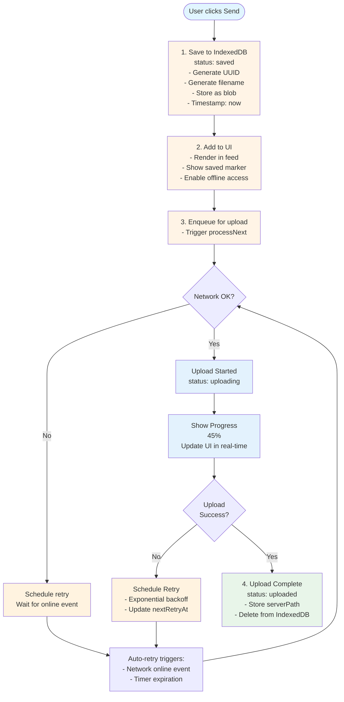

## Design Principles

1. **Personal use**: Single user, optimize for common cases
2. **Robust**: Handle network failures, app restarts, and server downtime gracefully with auto-recovery
3. **Performance-first**: Avoid complex coordination unless critical
4. **Pragmatic**: Accept rare edge cases if cost is high
5. **Never lose data**: As soon as user hits "Send", content is saved and will eventually reach server

## Mental Model

1. **Send = Saved** - Hitting "Send" immediately saves content locally
2. **Visible Immediately** - Item appears in inbox feed with sync status
3. **Background Sync** - Upload happens in background with auto-retry
4. **Always Recoverable** - Network failures, app restarts, server downtime don't lose data

## Data Model

### IndexedDB Schema

Database: `mylife-inbox-queue`
Store: `pending-items`

```typescript
interface PendingInboxItem {
  // Identity
  id: string;                    // UUID (client-generated, also idempotency key)
  createdAt: string;            // ISO timestamp, used for ordering

  // Content - each item is ONE file (text or binary)
  filename: string;             // Generated name (text) or original name (file)
  blob: Blob;                   // File data (text saved as .md blob)
  type: string;                 // MIME type ('text/markdown' for text, original for files)
  size: number;                 // File size in bytes

  // Sync state
  status: 'saved' | 'uploading' | 'uploaded';
  uploadProgress: number;       // 0-100
  errorMessage?: string;        // Last error (for display, cleared on retry)

  // Retry metadata
  retryCount: number;
  nextRetryAt?: string;         // ISO timestamp for next retry
  lastAttemptAt?: string;

  // Multi-tab lock (heartbeat-based)
  uploadingBy?: string;         // Tab ID currently uploading
  uploadingAt?: string;         // Lock timestamp (updated every 1min by uploading tab)

  // TUS resumable upload tracking
  tusUploadUrl?: string;        // TUS upload URL for resume
  tusUploadOffset?: number;     // Bytes successfully uploaded

  // Server reference (once uploaded)
  serverPath?: string;          // e.g., 'inbox/photo.jpg' or 'inbox/hello-world.md'
  uploadedAt?: string;
}
```

### Upload Queue Manager

```typescript
class UploadQueueManager {
  private activeUploads = new Map<string, AbortController>();
  private tabId: string;        // Generated on init

  async init(): Promise<void>;          // Start processing (no bulk load)
  async enqueue(item: PendingInboxItem): Promise<void>;
  async processNext(): Promise<void>;   // Query and process one item
  private async uploadItem(item: PendingInboxItem): Promise<void>;
  private async scheduleRetry(item: PendingInboxItem): Promise<void>;
  async cancelUpload(id: string): Promise<void>;  // Abort + delete from IndexedDB
  async deleteItem(id: string): Promise<void>;    // Same as cancel
}
```

## State Flow



## Upload States & UI

### Status Markers

| Condition | Marker | Description |
|-----------|--------|-------------|
| Server file | (none) | Already synced to server |
| Pending, < 3s old | (none) | Just saved, no indicator needed |
| Pending, >= 3s old, file < 1MB | Spinner | Uploading in progress |
| Pending, >= 3s old, file >= 1MB | Spinner + progress% | Large file upload with progress |
| Failed, retry countdown > 0 | CircleAlert + "retry in Xs/Xm/Xh" | Failed, waiting to retry |
| Failed, retry countdown = 0 | Spinner | Retry in progress |

**Marker position:** After timestamp (e.g., "2 min ago" or "2 min ago [spinner]")

### Design Rationale

- **No marker for first 3s**: Uploads typically complete quickly, avoid visual noise
- **Spinner only for small files**: Progress percentage not meaningful for fast uploads
- **Progress for large files (>=1MB)**: Users expect feedback for longer uploads
- **Retry countdown updates every 1s**: Live feedback on when retry will happen
- **Spinner when retry reaches 0**: Indicates retry is actively happening

## Send Button Behavior

**Before Click:**
- Enabled if text OR files present
- Text: "Send"

**After Click:**

1. **Immediate** (< 50ms):
   - For text: Generate filename using `generateTextFilename()` logic, deduplicate
   - For each file: Use original filename, deduplicate within batch
   - Save each as separate PendingInboxItem to IndexedDB
   - Add to inbox feed UI
   - Clear input fields

2. **Background** (async):
   - Trigger `processNext()` for each saved item

**User Experience:**
- Button never blocks
- Input clears immediately
- Items appear in feed instantly
- All files (any size) use same queue + TUS flow
- No warnings, no confirmations - it just works

## Filename Generation

**Text items:**
- Use same logic as server's `generateTextFilename()`
- Extract first non-empty line, process URLs/headings, extract words
- Format: `hello-world.md` (lowercase, hyphenated, max 5 words)
- Fallback: `{uuid}.md` if no valid filename generated

**File items:**
- Use original filename

**Deduplication (within same send batch):**
- Track filenames already used in current batch
- If duplicate: `photo.jpg` → `photo 2.jpg` → `photo 3.jpg`
- Uses macOS-style naming (space + number before extension)

**Note:** Server-side deduplication handles conflicts with existing files.

## Upload Queue Processing

**Processing Model:**
- No bulk loading - query IndexedDB for next item to process
- Process one item at a time per query
- Query: `status = 'saved' OR (status = 'uploading' AND nextRetryAt <= now)`
- Order by: `nextRetryAt ASC, createdAt ASC`

**Concurrency:**
- Max 2 concurrent uploads
- Each upload independent (one failure doesn't block others)

**Retry Strategy:**
- Exponential backoff: 5s, 10s, 20s, 40s, 1min, 2min, 5min, 10min, 30min, 1hr, 1day (max)
- Jitter: +/-10% to prevent thundering herd
- **No maximum retries** - retry forever until success or user cancels
- Immediate retry on network `online` event

**Retry Triggers:**
1. Timer-based (persisted in IndexedDB as `nextRetryAt`)
2. Network change (`online` event) - immediate retry, bypass backoff

## Edge Cases

| Category | Scenario | Behavior | Priority |
|----------|----------|----------|----------|
| **Network** | Offline when sending | Save locally, auto-retry when online | Critical |
| | Server returns 500 | Retry with exponential backoff (up to 1 day) | Critical |
| | Upload timeout (3min) | Abort, retry with backoff | Critical |
| | Network switches | Resume from checkpoint (TUS) | High |
| | Network comes online | Immediate retry for all pending items | Critical |
| **App Lifecycle** | Page refresh during upload | Resume from IndexedDB on reload | Critical |
| | App closed during upload | Resume when app reopens | Critical |
| | Browser crash | Item safe in IndexedDB, resumes on restart | Critical |
| | Reopened after days offline | All saved items resume automatically | Critical |
| **Upload Integrity** | Upload succeeds but client doesn't know | Idempotency key prevents duplicates | Critical |
| | Upload succeeds but finalize fails | Retry finalize only, reuse TUS upload | High |
| **Storage** | Very large file (>500MB) | Same flow, may hit IndexedDB quota | Low |
| | Disk quota exceeded | Yield error, cannot save to cache | High |
| | IndexedDB unavailable | Block send, show error | High |
| **User Actions** | Double-click send | Debounce submit, prevent duplicates | High |
| | Cancel/delete while uploading | Abort upload, delete TUS (optional), remove from IndexedDB | High |
| **Server Behavior** | Server rejects (400) | Show error, allow cancel | High |
| **Multi-Tab** | Multiple tabs open | Heartbeat lock via IndexedDB | High |
| | Tab crashes mid-upload | Other tabs detect stale lock (1hr), take over | High |
| **Security** | Sensitive data in IndexedDB | Accept risk (personal device, disk encryption) | Low |

## TUS Resumable Upload Protocol

**Why TUS:**
- Robust network failure recovery (aligns with "Robust" design principle)
- Resume uploads after network switches, app restarts, tab crashes
- Efficient bandwidth usage (don't re-upload already transmitted bytes)

**Server Endpoints:**
```
POST   /api/upload/tus            # Create TUS upload
PATCH  /api/upload/tus/:id        # Resume/continue upload
HEAD   /api/upload/tus/:id        # Check upload status
DELETE /api/upload/tus/:id        # Delete upload (on cancel)
```

**Supported TUS Extensions:**
- `creation` - Create uploads via POST
- `termination` - Delete abandoned uploads

**Upload Storage:**
- Temporary storage: `data/.my-life-db/uploads/{uploadId}`
- Cleanup: TUS files deleted after successful finalization
- **No automatic expiration** - uploads persist until finalized or deleted
- Client responsible for cleanup via DELETE on cancel

**Upload Flow:**

**Initial Upload (first attempt):**
1. Client: `POST /api/upload/tus`
   - Headers: `Upload-Length: {fileSize}`, `Upload-Metadata: filename {base64Name}`, `Idempotency-Key: {itemId}`
   - Body: empty
2. Server: `201 Created`
   - Headers: `Location: /api/upload/tus/{uploadId}`, `Tus-Resumable: 1.0.0`
3. Client: Store `tusUploadUrl` in IndexedDB
4. Client: `PATCH /api/upload/tus/{uploadId}`
   - Headers: `Upload-Offset: 0`, `Content-Type: application/offset+octet-stream`
   - Body: file chunks
5. Server: Progress responses with `Upload-Offset: {bytesReceived}`
6. Client: Update `tusUploadOffset` in IndexedDB on each progress event
7. On completion: Server automatically moves file to inbox

**Resume Upload (after interruption):**
1. Client loads item from IndexedDB, finds `tusUploadUrl` and `tusUploadOffset`
2. Client: `HEAD {tusUploadUrl}`
   - Verify server still has upload
3. Server: `200 OK`
   - Headers: `Upload-Offset: {serverOffset}`, `Upload-Length: {totalSize}`
4. Client: Resume from `serverOffset` using `PATCH` (skip already uploaded bytes)

**Fallback (TUS upload lost):**
1. If `HEAD` returns 404/410: Clear `tusUploadUrl`, start fresh TUS upload

**Progress Tracking:**
```typescript
// Update IndexedDB on every PATCH progress event
await db.put('pending-items', {
  ...item,
  tusUploadOffset: bytesUploaded,
  uploadProgress: Math.floor((bytesUploaded / totalSize) * 100)
});
```

**Multiple Files from User:**
- User selects 3 files → creates 3 separate `PendingInboxItem` entries
- Each file is independent (separate UUID, separate upload, separate retry)
- No coordination needed between files
- If one fails, others continue uploading

**TUS Completion:**
When TUS upload completes (all bytes received):
1. Server moves file from `uploads/{uploadId}` to `inbox/{filename}`
2. Server handles filename deduplication if conflict exists
3. Server deletes TUS temporary file
4. Server returns final path in response header
5. Server triggers digest processing for created path

**Idempotency:**
- MUST support `Idempotency-Key` header (same UUID as item.id)
- If key seen + original succeeded: return `200` with cached response (original path)
- If key seen + original still processing: return `409 Conflict`
- Prevents duplicates on network retry

## Multi-Tab Lock Mechanism

**Tab ID:** Generated on page load (`tab_{timestamp}_{random}`)

**Heartbeat-based locking:**
- Uploading tab updates `uploadingAt` every 1 minute
- Lock considered stale if `uploadingAt` > 1 hour old
- Long uploads (>1hr) still work because heartbeat keeps lock fresh

**Lock acquisition:**
1. Reload item from IndexedDB (get latest state)
2. Check if locked by another tab (`uploadingBy` set)
3. If locked, check staleness (`uploadingAt` > 1 hour ago)
4. If stale or unlocked, acquire lock (set `uploadingBy` and `uploadingAt`)
5. Verify we got it via re-read (handle race conditions)

**Heartbeat maintenance:**
```typescript
// During upload, update lock every 1 minute
const heartbeatInterval = setInterval(async () => {
  await db.put('pending-items', {
    ...item,
    uploadingAt: new Date().toISOString()
  });
}, 60000);
```

**Benefits:**
- Normal case: First tab wins, others skip
- Tab crash: Auto-recovery after 1 hour
- Long uploads: Heartbeat prevents false stale detection
- Race conditions: IndexedDB transactions prevent duplicates
- No complexity: No leader election, no messaging
- Fallback: Server idempotency catches edge cases

**Performance:** One extra IndexedDB read per upload (~1-5ms), heartbeat write every 1min

## App Initialization

On every page load:
1. Register `online` event listener for immediate retry trigger
2. Start processing loop (calls `processNext()`)
3. Each `processNext()` queries IndexedDB for ONE item to process:
   - Filter: `status = 'saved'` OR `(status = 'uploading' AND nextRetryAt <= now AND lock is stale)`
   - Order: `nextRetryAt ASC NULLS FIRST, createdAt ASC`
   - Limit: 1
4. Process that item, then call `processNext()` again
5. If no items found, wait for enqueue event or retry timer

**Benefits:**
- No bulk loading - low memory footprint
- One stuck item doesn't block queue inspection
- Graceful handling of failures
- Items processed in priority order

## Inbox Feed Integration

**Hybrid data source:**
```typescript
// Merge server items + local saved items
const localItems = await db.getAll('pending-items');
const allItems = [
  ...serverItems,
  ...localItems.map(toInboxItem)
].sort((a, b) => createdAt comparison);

// Deduplicate: if serverPath exists in both, prefer server item
```

**Scroll behavior:**
- New saved items appear at expected position (sorted by createdAt)
- Upload complete: Item removed from local, server version takes over seamlessly

## IndexedDB Cleanup

**Strategy:**
- Uploaded items: Delete immediately after upload success
- Saved/uploading items: Keep until uploaded or user cancels

**Quota Handling:**
- Request persistent storage on first use (prevents browser eviction)
- If save fails due to quota: Show error "Cannot save - storage quota exceeded"
- User must manually cancel items to free space

## Cancel/Delete Behavior

### Pending Items (in IndexedDB)

User can cancel/delete any pending item at any time:

1. **If status = 'saved':** Remove from IndexedDB immediately
2. **If status = 'uploading':**
   - Abort ongoing fetch/XHR via AbortController
   - Optionally send `DELETE` to TUS endpoint (best-effort cleanup)
   - Remove from IndexedDB
3. **UI:** Item disappears from feed immediately

### Server Items (Optimistic Delete)

**Design:** Optimistic UI with restore on error. No delete queue needed.

**Flow:**
1. User clicks delete → Remove from UI immediately
2. Fire server `DELETE` request (no loading indicator)
3. **Success** → Done
4. **Error** → Restore item to UI + show error toast

**Why no delete queue:**
- If app closes mid-delete, item remains on server - user can delete again later
- No persistence requirement - deletion is not critical like "never lose data"
- Simple mental model: delete either works or shows error
- Aligns with design principle #4 (Pragmatic)

**Implementation:**
```typescript
async function deleteServerItem(path: string, item: InboxItem) {
  // 1. Optimistically remove from UI
  removeFromFeed(path);

  try {
    // 2. Server request
    await fetch(`/api/files/${encodeURIComponent(path)}`, { method: 'DELETE' });
  } catch (error) {
    // 3. Restore on failure
    restoreToFeed(item);
    toast.error('Failed to delete. Please try again.');
  }
}
```

**Edge Cases:**

| Scenario | Behavior |
|----------|----------|
| Offline | Request fails, item restored, error shown |
| Server 500 | Item restored, error shown |
| Network timeout | Item restored, error shown |
| App closes during request | Item remains on server (safe) |
| Delete succeeds but response lost | Item gone from server, UI correct |
