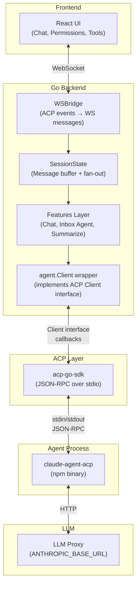
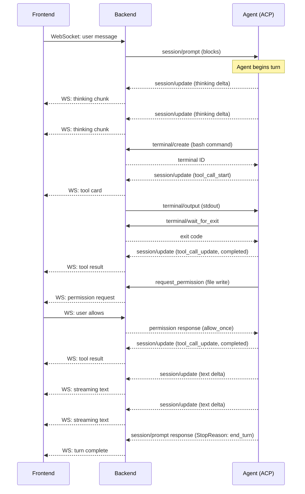
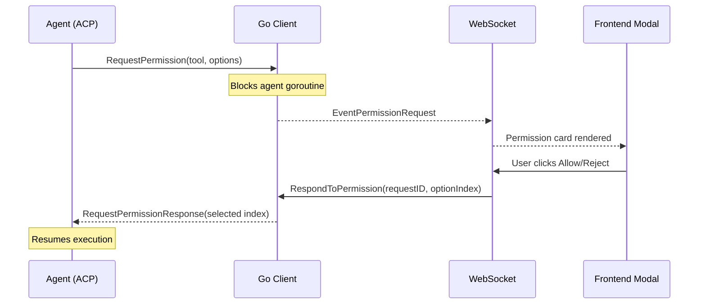

> Last edit: 2026-03-20

## Overview

[ACP (Agent Client Protocol)](https://agentclientprotocol.com) is an open protocol for communication between applications and AI agents. It is analogous to LSP (Language Server Protocol) but for AI agents instead of language tooling: where LSP standardizes how editors talk to language servers, ACP standardizes how applications talk to AI agent processes.

**Why ACP matters:** Without a protocol, integrating N applications with M agents requires N x M custom adapters. ACP reduces this to N + M -- each application implements the client side of the protocol once, each agent implements the server side once, and any client can talk to any agent.

MyLifeDB uses the [coder/acp-go-sdk](https://github.com/coder/acp-go-sdk) Go SDK to connect to [claude-agent-acp](https://github.com/zed-industries/claude-agent-acp), a bridge that exposes the Claude CLI as an ACP-compatible agent.

## Architecture

ACP serves as the agent communication layer in MyLifeDB. The system has three layers between user-facing features and the underlying LLM:



**Data flow for a prompt:**

1. User types a message in the frontend
2. WebSocket delivers it to WSBridge, which calls `session.Send(prompt)`
3. The Go backend calls `conn.Prompt()` on the ACP connection (blocking)
4. During the blocking call, the agent streams updates back via `SessionUpdate` callbacks
5. Each callback translates the ACP event into the frontend's message format and broadcasts via WebSocket
6. When `Prompt()` returns, a completion event is sent to the frontend

## Protocol Summary

ACP uses **JSON-RPC 2.0 over stdio** (newline-delimited JSON). The client spawns the agent as a subprocess and communicates via stdin/stdout. Stderr is reserved for agent logs.

### Client-to-Agent Methods

| Method | Purpose |
|--------|---------|
| `initialize` | Handshake -- negotiate protocol version and capabilities |
| `authenticate` | Send credentials to the agent |
| `session/new` | Create a new session (with CWD, MCP servers) |
| `session/load` | Resume an existing session (replays history as notifications) |
| `session/prompt` | Send a user message (**blocks** until the full turn completes) |
| `session/cancel` | Interrupt the current turn (notification -- no response) |
| `session/set_mode` | Change agent mode (e.g., plan, bypassPermissions) |
| `session/set_config_option` | Change a config option at runtime |
| `session/set_model` | Change the model (unstable) |
| `session/list`, `session/resume`, `session/fork` | Session management (unstable) |

### Agent-to-Client Callbacks

| Method | Purpose |
|--------|---------|
| `session/update` | Streaming updates (notification -- no response expected) |
| `session/request_permission` | Ask user for tool approval (blocks agent until answered) |
| `fs/read_text_file` | Request file read access |
| `fs/write_text_file` | Request file write access |
| `terminal/create` | Request terminal for command execution |
| `terminal/output` | Deliver terminal stdout |
| `terminal/kill` | Kill a running terminal command |
| `terminal/release` | Release terminal resources |
| `terminal/wait_for_exit` | Block until a terminal command completes |

### Message Flow: Typical Prompt-Response Cycle



## ACP Behavioral Findings

The following behaviors are verified ground truth from our test suite, tested against `@zed-industries/claude-agent-acp` with `coder/acp-go-sdk`.

### Initialization

| Property | Value |
|----------|-------|
| Protocol version | 1 |
| Agent identifier | `@zed-industries/claude-agent-acp` (current version) |
| Available modes | `default`, `acceptEdits`, `plan`, `dontAsk`, `bypassPermissions` |
| Available models | `default` (recommended), `sonnet`, `haiku` |

### Prompt and Response

- **`Prompt()` blocks** until the agent finishes the entire turn. It does not return incrementally.
- **Streaming happens via `SessionUpdate` callbacks** on a separate goroutine during the blocking `Prompt()` call.
- **StopReason values:** `"end_turn"` (normal completion), `"cancelled"` (interrupted).
- **Event order:** `commands_update` -> thinking deltas -> tool calls -> text deltas -> completion. The first chunk is always an empty string `""` acting as a turn-start marker.

### Permissions

- **`RequestPermission` IS called** for file write/edit operations.
- **Permission options** (always 3, not 4):

| Index | Kind | Name | Option ID |
|-------|------|------|-----------|
| 0 | `allow_always` | Always Allow | `allow_always` |
| 1 | `allow_once` | Allow | `allow` |
| 2 | `reject_once` | Reject | `reject` |

- Options have both `kind` and `id` fields.
- **Permission IS NOT called for bash commands** in default mode (agent auto-approves safe commands).
- **Permission IS NOT called for file reads** -- the agent reads files internally via its own tools.

### File I/O

- **`ReadTextFile` callback is NOT called.** The agent reads files internally using its own tools. The callback exists in the Client interface but is dead code.
- **`WriteTextFile` callback is NOT called.** The agent writes files directly after receiving permission. Same as reads -- the callback is dead code.
- **File paths in tool calls are absolute.**
- **Diff content for file writes:** Completed write tool call updates include `ToolCallContent.Diff` with `path`, `newText`, and optionally `oldText`.

### Terminal

- **`CreateTerminal` IS called** for bash commands. This is the primary callback that gets exercised.
- **Terminal provides stdout output** via `TerminalOutput`.
- **`WaitForTerminalExit` blocks** until the command completes and returns the exit code.
- **Full lifecycle:** `CreateTerminal` -> `TerminalOutput` (results) -> `WaitForTerminalExit` -> `ReleaseTerminal`.

### Cancellation

- **`Cancel` is a notification** (no response from the agent).
- **`Prompt()` returns with `StopReason="cancelled"`** after cancellation.
- **In-progress operations are interrupted.**
- Cancel via context cancellation returns a JSON-RPC error (`code: -32603`, `"context canceled"`), not a clean `StopReason`. Error handling must check for context cancellation and treat it as "cancelled" rather than an agent crash.

### Multi-Turn

- **Sessions maintain conversation history** across `Prompt()` calls.
- Each `Prompt()` call builds on the previous context. The agent correctly recalls information from earlier turns in the same session.

### Session Resume

- **`LoadSession` works within the same agent process.** Switching away to a new session and loading the original back succeeds. History replays as `SessionUpdate` notifications (user messages + agent messages + tool calls).
- **Context is retained after `LoadSession`.** After loading a session, the agent can recall facts from prior turns — the replayed history restores conversational context.
- **Multi-turn history is fully replayed.** A 3-turn conversation replays all 3 turns (user messages + agent responses), not just the last.
- **`LoadSession` fails across process restarts.** Session IDs are scoped to the agent process lifetime. Spawning a new agent process and calling `LoadSession` with a previous session ID returns error code `-32002` ("Resource not found").
- **The ACP Go SDK v0.6.3 does NOT expose `session/resume`, `session/list`, or `session/fork`.** These "unstable" methods mentioned in the ACP protocol spec are not yet implemented in the SDK. Only `session/load` is available.

### AskUserQuestion

- **`AskUserQuestion` is NOT available through ACP.** The `claude-agent-acp` binary does not expose this tool. When prompted to use it, the agent searches for it via `ToolSearch`, confirms it doesn't exist, and falls back to asking questions as plain text in its response.
- **The ACP protocol has no dedicated "ask user" method.** The only user-interaction callback is `RequestPermission`, which is approve/deny only — no input collection.
- **Practical impact is low.** The agent naturally asks clarifying questions in its text response. The structured question-card UX from the old Claude Code SDK is lost, but the conversational flow still works.

## Our Integration

### WSBridge

The WSBridge translates ACP events into the frontend's existing WebSocket message format. Each `SessionUpdate` callback maps ACP notification types to our event types:

| ACP Notification | Our Event | Frontend Rendering |
|-----------------|-----------|-------------------|
| `AgentMessageChunk` (partial) | `EventDelta` | Streaming typewriter text |
| `AgentMessageChunk` (complete) | `EventMessage` | Full message block |
| `AgentThoughtChunk` | `EventThinkingDelta` | Thinking indicator |
| `ToolCallStart` | `EventMessage` (BlockToolUse) | Tool call card |
| `ToolCallUpdate` | `EventMessage` (BlockToolResult) | Tool output |
| `UserMessageChunk` (echo) | Skipped | Agent echoes user messages; we skip to avoid duplicates |

### SessionState

SessionState is a lightweight message buffer with multi-client fan-out:

- One ACP event channel per active session
- Multiple WebSocket connections can subscribe to the same session
- Page model (500 msgs / 500KB seal thresholds) applies on top -- this is our concern, not ACP's
- Unread tracking counts `EventComplete` events against `last_read_count`

### Permission Flow



The `RequestPermission` callback blocks the agent until the user responds. The Go client emits an `EventPermissionRequest` over WebSocket, the frontend renders a permission modal, and the user's choice flows back through `RespondToPermission` which unblocks the callback.

### LLM Proxy Integration

The agent process connects to our LLM proxy instead of the Anthropic API directly. This is configured via environment variables injected at spawn time:

| Variable | Purpose |
|----------|---------|
| `ANTHROPIC_API_KEY` | API key (or dummy value when using proxy auth) |
| `ANTHROPIC_BASE_URL` | Points to our LLM proxy endpoint |
| `MLD_PROXY_TOKEN` | Ephemeral token for proxy authentication |

## Adding a New Agent

Adding a new ACP-compatible agent requires no Go adapter code:

1. **Install the ACP binary.** For example: `npm install -g @zed-industries/claude-agent-acp`

2. **Register an `AgentConfig` in `server.go`.** Specify the binary path, arguments, and any environment variables:

```go
agentConfigs := map[string]AgentConfig{
    "claude": {
        Command: "claude-agent-acp",
        Args:    []string{},
        Env: []string{
            "ANTHROPIC_BASE_URL=" + proxyURL,
        },
    },
    // Add new agents here -- same structure, different binary
}
```

3. **No Go adapter code needed.** The ACP protocol handles all communication. Any agent that implements the ACP server side works automatically with our existing Client implementation, WSBridge, SessionState, and permission flow.

## Known Limitations and Gotchas

### Protocol Limits

| Limit | Value | Consequence |
|-------|-------|-------------|
| Notification queue | 1024 max queued | Overflow kills the connection. Callbacks must process notifications promptly and never block. |
| Max message size | 10 MB | Scanner buffer limit. Large file contents or tool outputs that exceed this will fail. |

### Transport

- **stdio only.** ACP currently supports only stdin/stdout communication with a spawned subprocess. There is no HTTP or WebSocket transport. The agent must run as a local process.

### Unstable Methods

The ACP protocol spec mentions several unstable methods (`session/resume`, `session/list`, `session/fork`). As of **Go SDK v0.6.3, none of these are implemented**. The SDK only exposes: `session/new`, `session/load`, `session/cancel`, `session/prompt`, `session/set_mode`, `session/set_model`.

`SetSessionModel` is the only "unstable" method that exists in the SDK, accessible as a regular method on `ClientSideConnection`.

### Session Resume Across Restarts

`LoadSession` only works within the same agent process. If the process exits and a new one is spawned, session IDs from the old process are invalid. Options:

1. Keep agent processes alive between prompts (don't kill after idle)
2. Use `NewSession` and re-inject conversation context via the system prompt

### No Cost/Usage Data

ACP does not provide token usage or cost information in `PromptResponse`. Token cost tracking is not available through the protocol.

### No AskUserQuestion

The `claude-agent-acp` binary does not expose `AskUserQuestion` as a tool. The ACP protocol has no equivalent — `RequestPermission` is the only user-interaction callback, and it only supports approve/deny (no input collection). The agent asks clarifying questions as plain conversation text instead.

### Agent File I/O Callbacks Are Dead Code

The `ReadTextFile` and `WriteTextFile` callbacks in the Client interface are never called by `claude-agent-acp`. The agent handles all file I/O internally. These methods must still be implemented (the interface requires them) but will not be invoked.
