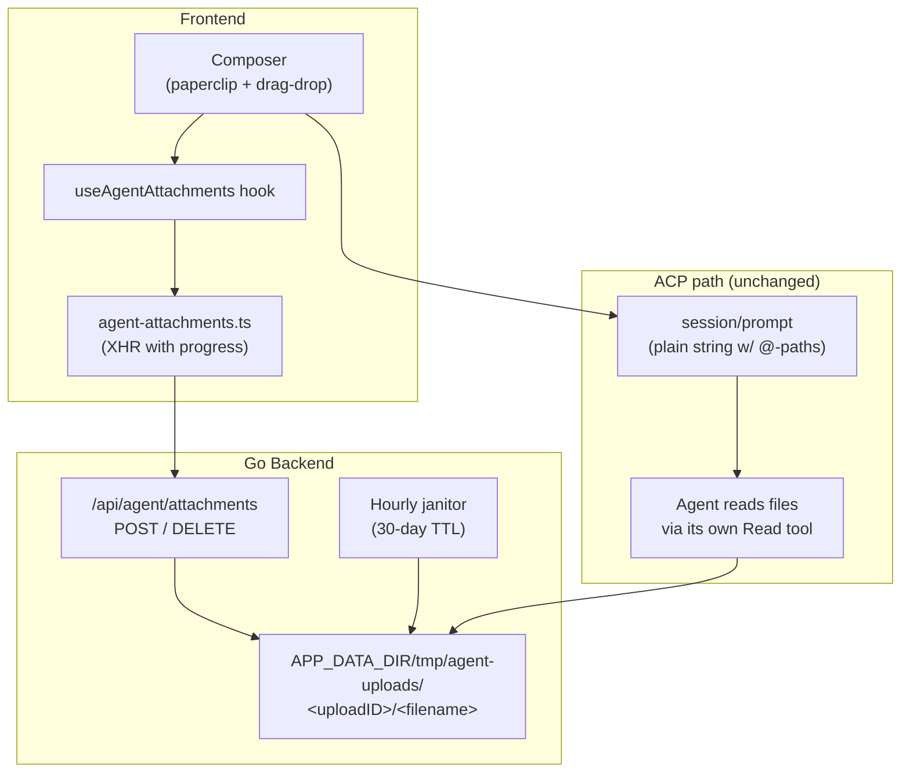

> Last edit: 2026-04-22

## Overview

The agent composer accepts file attachments of any type, up to **1 GiB each**, multiple per message. Attachments are not passed through the ACP protocol — they are staged server-side and referenced in the outgoing prompt text via the existing `@<absolutePath>` file-tag convention. The agent then reads them with its own tools (just like any other file on disk).

This design keeps the ACP transport unchanged and piggybacks on the agent's built-in file-access path, which already has its own permission handling.

## User-Facing Flow

1. User clicks the paperclip, picks files, or drags files onto the composer.
2. Each file uploads in the background. A chip in the composer shows the filename, size (or upload progress), and an X-to-remove.
3. The Send button is disabled while any upload is pending.
4. On send, the composer appends one `@<absolutePath>` token per ready attachment to the prompt text (separated by a newline), then clears the chips.
5. The agent receives the enriched prompt and reads the files as if the user had typed the paths manually.

## Architecture



## API

### `POST /api/agent/attachments`

Multipart upload. One file per request (field name: `file`). Requires an authenticated session if auth is enabled.

**Limits:** Body capped at **1 GiB** via `http.MaxBytesReader`. Oversized bodies are rejected early with `413 Request Entity Too Large`, not a generic 400.

**Response (200):**

```json
{
  "uploadID":     "b8b6d2c3-4194-4e4d-be70-bedf6da003f1",
  "absolutePath": "/var/lib/mld/tmp/agent-uploads/b8b6d.../report.pdf",
  "filename":     "report.pdf",
  "size":         12345,
  "contentType":  "application/pdf"
}
```

**Error responses:**

| Status | Condition |
|--------|-----------|
| `400`  | Missing/invalid `file` field |
| `413`  | Body exceeds 1 GiB |
| `500`  | Disk/mkdir failure |

### `DELETE /api/agent/attachments/:uploadID`

Removes the staged directory. **Idempotent** — returns `204 No Content` whether or not the directory existed. Rejects `uploadID` values containing path separators or `..`.

## Staging Layout

Files are stored under:

```
$APP_DATA_DIR/tmp/agent-uploads/<uploadID>/<sanitized-filename>
```

- `uploadID` is a fresh UUIDv4 per upload, so concurrent uploads of the same filename don't collide.
- `filename` is run through `filepath.Base` to strip any client-supplied path components (defense against `../etc/passwd` style names).
- One directory per upload makes cleanup atomic (`os.RemoveAll(dir)`).

## Frontend State Machine

Each chip in the composer strip moves through a small state machine owned by `useAgentAttachments`:

```
            addFiles()
               │
               ▼
          ┌──────────┐   success   ┌───────┐
  files ─▶│uploading │────────────▶│ ready │
          └──────────┘             └───────┘
               │ error                 │
               ▼                       │
          ┌───────┐                    │
          │ error │                    │
          └───────┘                    │
                                       │
                remove()/clear()       │
                       ◀───────────────┘
```

**Lifecycle rules:**

- `remove()` on an `uploading` chip aborts the XHR via `AbortController`, then DELETEs the staged directory.
- `remove()` on a `ready` chip only issues the DELETE.
- `clear()` (called on successful send) **does not** DELETE — the files were just handed off to the agent and may still be needed; the 30-day janitor takes care of them.
- On component unmount with chips still in the strip, all XHRs are aborted and all `ready` uploads are best-effort DELETEd. If the DELETE is lost (page closed, network failure), the janitor is the fallback.

## Janitor

A goroutine in `server.Server` runs `SweepAgentAttachments` once at startup and then every hour. It removes entries in `APP_DATA_DIR/tmp/agent-uploads/` whose directory mtime is older than **30 days**. Only top-level entries are inspected; directory recursion is handled by `os.RemoveAll`.

The sweeper lives in the `server` package (not `api`) because `api` imports `server`; placing it alongside the call site avoids an import cycle.

## @-Path Convention

The frontend reuses the existing `@<absolutePath>` tag the composer already supports (same path used by the `FileTagPopover` for manual file references). On send, the composer builds the final prompt as:

```
<user text>

@/path/to/upload-1/file1.pdf @/path/to/upload-2/file2.png
```

All attachment tokens go on a trailing line so they don't interrupt the user's prose. The agent's own Read tool handles the paths.

## Caveats

- **Agent permission modes still apply.** The agent may ask for permission to read the attached paths depending on its mode (e.g. `default` vs `bypassPermissions`). The paths are under `APP_DATA_DIR/tmp/...`, so any agent running with the default working directory under `USER_DATA_DIR` will see them as outside-workspace reads.
- **Orphaned files on send failure.** If the WebSocket/ACP send fails after the frontend clears the strip, the staged files remain on disk until the janitor sweeps them. This is by design — the alternative (DELETE on every send) races with the agent's first read.
- **No auth between frontend and staged files.** The `absolutePath` is handed to the agent as an opaque path; it isn't served through the HTTP layer. The `/api/agent/attachments` endpoints are the only HTTP surface for staged files.
